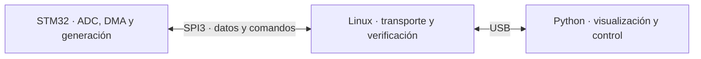

# Continuar desde donde quedaste

> segui x donde andabas

<details><summary>1 previous message</summary>

> Voy a revisar el estado del proyecto y las notas disponibles para retomar donde quedó.
</details>

Encontré pendiente un cambio en V7 para desactivar el antialiasing, pero las curvas todavía lo fuerzan con `antialias=True`.

No tengo el tramo anterior de la conversación. ¿Estábamos mejorando la fluidez del gráfico o trabajando en otra cosa?

> por que s eborro mi conversacion? si estabamos tratando de mejorar el fps sin romper las cosas. y ademas que las lineas del grafico al pasar tan rapido se pierden un poco, pero no se si se puede hacer algo,

<details><summary>7 previous messages</summary>

> No puedo saber por qué dejó de aparecer tu conversación; en este turno no me llegó el historial anterior. Sí pude recuperar los cambios del proyecto. Retomo con lo que aclaraste: mejorar los FPS conservando el comportamiento y revisar cómo hacer más visibles las trazas cuando se desplazan rápido.
>
> Voy a comprobar el renderizado y las pruebas existentes antes de tocarlo. También consultaré la guía de Codex para responder sobre el historial sin inventar una causa.
>
> <details><summary>Searched the web</summary>
>
> Searched the web for `site.developers.openai.com codex app conversation history archive`
>
> Searched the web for `https://developers.openai.com/codex/app/features`
>
> </details>
>
> Encontré que el cambio pendiente no se aplicaba a las curvas: seguían dibujándose con antialiasing y un grosor de 1 píxel. Voy a comparar ese dibujo con uno de 2 píxeles sin antialiasing, para comprobar si mejora el contraste sin encarecer cada cuadro. La pérdida de nitidez al desplazarse rápido también puede depender del movimiento en pantalla; subir los FPS por sí solo no garantiza resolverla.
>
> <details><summary>Created a file</summary>
>
> - Wrote `/private/tmp/benchmark_serialmonitor_render.py` (+42 -0)
>
> </details>
>
> La comparación está preparada, pero faltan las dependencias gráficas en el entorno disponible y su instalación todavía no termina. Mantengo el ajuste acotado a V7; voy a medir el costo del dibujo antes de dar por conseguida una mejora de FPS.
>
> La medición mostró un intercambio claro: con 50.000 muestras, quitar el antialiasing bajó el costo del dibujo de 8,9 a 7,8 ms; engrosar la línea a 2 píxeles lo subió a 13 ms. Son datos sintéticos, no FPS medidos con la placa.
>
> Voy a dejar el trazo rápido como predeterminado y un selector para elegir “Intenso” si necesitás más visibilidad, o “Suave” para volver al aspecto anterior.
>
> <details><summary>Edited 2 files</summary>
>
> - Wrote `./monitor/historico/v7/app.py` (+24 -2)
> - Wrote `./monitor/README.md` (+6 -0)
> - Wrote `./monitor/historico/v7/app.py` (+5 -1)
>
> </details>
</details>

Sobre la conversación: **no puedo confirmar que se haya borrado**; el historial anterior no me llegó y no tengo evidencia de la causa.

Ya retomé V7 y agregué un selector junto a **TRAZO**:

- **Rápido:** menor costo de dibujo, predeterminado.
- **Intenso:** líneas más gruesas para mejorar la visibilidad; puede bajar los FPS.
- **Suave:** aspecto anterior.

En una prueba sintética con 50.000 muestras, el dibujo rápido bajó de **8,9 a 7,8 ms**. Pasaron las 24 pruebas y comprobé que cambiar el estilo conserva la captura en STOP y los cortes del trazo.

Falta comprobar con la placa cuánto mejora la fluidez y si “Intenso” resuelve lo que notás al desplazarse.

> todo perfecto. subamos a 30khz se podra? hay que adaptar los tres codigos quizas... fijate.

<details><summary>19 previous messages</summary>

> Voy a revisar el firmware del UNO Q, el puente R4 y el monitor V7 para ver qué limita los 30 kHz por canal y adaptar lo necesario. Primero comprobaré el caudal y los tiempos de adquisición.
>
> <details><summary>Searched the web</summary>
>
> Searched the web for `STM32U585 ADC 14 bit conversion 391.5 sampling cycles 7.5`
>
> </details>
>
> El enlace de 3 Mbps alcanza en teoría: a 30 kHz usaríamos aproximadamente el 80 % de su capacidad. El cambio principal está en el UNO Q: su temporizador actual trabaja en microsegundos enteros y no puede representar bien 33,333 µs.
>
> Voy a usar la resolución completa del temporizador: dará **30.001,875 Hz nominales**, apenas 0,00625 % por encima de 30 kHz. Los timestamps seguirán en microsegundos y alternarán intervalos de 33 y 34 µs. El R4 y V7 ya admiten el caudal y ese formato; revisaré también las pruebas para que esa alternancia no se confunda con pérdidas.
>
> <details><summary>Created a file, edited 4 files</summary>
>
> - Wrote `./arduino/v5/oscilloscope/sketch/scope_config.h` (+15 -8)
> - Wrote `./arduino/v5/oscilloscope/sketch/sketch.ino` (+8 -8)
> - Wrote `./arduino/v5/r4_bridge_v5/r4_bridge_v5.ino` (+5 -1)
> - Wrote `./monitor/historico/v7/app.py` (+3 -1)
> - Wrote `./tests/test_30khz.py` (+73 -0)
>
> </details>
>
> espera si es mejor hacerlo entero hace un khz mas alto que sea multiplo
>
> Sí: **31,25 kHz por canal** encaja exacto, con **32 µs entre muestras**. Es el siguiente valor superior a 30 kHz que permite un período entero en microsegundos.
>
> Cambio el objetivo a 31,25 kHz. Así conservamos la base de tiempo de 1 MHz; el enlace de 3 Mbps quedaría al 83,5 % de capacidad teórica. Todavía no cargué los cambios de 30 kHz en las placas.
>
> La prueba del sistema actual a 25 kHz pasó sin saltos de timestamps ni pérdidas de sincronización. Ya preparé los **31,25 kHz / 32 µs** y las pruebas de compatibilidad.
>
> Estoy respaldando la aplicación instalada antes de ensayar el cambio. En el monitor no hace falta fijar una nueva frecuencia: la obtiene de los timestamps del Q.
>
> Los dos firmwares compilaron y pasaron las 28 pruebas. El respaldo del Q a 25 kHz ya está guardado.
>
> Voy a cargar el cambio en el Q y medir la continuidad a 31,25 kHz. El puente R4 que está funcionando ya usa 3 Mbps, así que sirve para esta prueba sin cambiar su velocidad ni el protocolo.
>
> El Q ya está ejecutando la versión de 31,25 kHz. Ahora estoy midiendo 30 segundos de recepción para detectar pérdidas; después comprobaré V7 dibujando y grabando a la vez, con la ventana máxima de 50.000 muestras.
>
> La prueba detectó un límite real: a 31,25 kHz llegaron unos 30.498 pares/s y aparecieron 385 saltos de timestamp, aunque los paquetes mantuvieron la sincronización. Esta configuración todavía no es válida.
>
> Voy a comprobar dónde se pierde el margen de transmisión y si podemos subir ambos enlaces a 4 Mbps. Eso sí requeriría ajustar Q, R4 y monitor.
>
> <details><summary>Edited a file</summary>
>
> - Wrote `./tests/test_31250hz.py` (+11 -0)
>
> </details>
>
> El R4 ya quedó cargado a 4 Mbps y el Q compiló con esa misma velocidad. A este baudrate, transmitir un nodo pasa de un mínimo de 54,7 a 41,0 ms, frente a 65,5 ms de adquisición.
>
> Estoy completando la carga del Q para repetir la prueba. La frecuencia seguirá siendo 31,25 kHz, con 32 µs enteros.
>
> La variante de 4 Mbps no entregó datos en este conjunto, así que la descarto. Encontré otra vía más acotada: el Q transmite mediante una cola e interrupciones del core, cuyo costo puede consumir el margen que falta.
>
> Voy a volver a 3 Mbps y probar una transmisión directa desde el hilo de envío del Q. La adquisición seguirá temporizada por hardware y DMA; el período se mantiene en 32 µs.
>
> <details><summary>Edited a file</summary>
>
> - Wrote `./tests/test_31250hz.py` (+41 -0)
>
> </details>
>
> La transmisión directa ya compiló y pasó la prueba que compara byte por byte los paquetes DATA. El R4 volvió a 3 Mbps.
>
> Estoy cargando esta variante del Q. Si la prueba física pasa, podremos mantener los 31,25 kHz sin aumentar el baudrate.
>
> Todavía no recibo bytes con la variante directa. Estoy comprobando el arranque del Q y reiniciando el R4 ahora que ambos volvieron a 3 Mbps, para descartar un bloqueo durante el cambio de velocidades. No voy a dejar como válida una configuración que no pase la recepción.
>
> Después de reiniciar el R4, la prueba breve pasó: **31.128 pares/s recibidos, cero saltos de timestamp y cero pérdidas de sincronización**. La transmisión directa a 3 Mbps ya está funcionando a 31,25 kHz.
>
> Ahora falta confirmarlo durante 30 segundos y con V7 dibujando y grabando simultáneamente.
>
> La prueba de 30 segundos pasó: **936.448 pares recibidos, cero saltos de timestamp, cero ADC fuera de rango y cero pérdidas de sincronización**.
>
> V7 está ahora grabando y dibujando con 50.000 muestras en pantalla. Estoy comprobando el CSV para verificar que tampoco haya pérdidas bajo esa carga.
>
> System error
>
> You’ve hit your usage limit. Upgrade to Pro (https://chatgpt.com/explore/pro), visit https://chatgpt.com/codex/settings/usage to purchase more credits or try again at 2:10 PM.
</details>

> ok segui dale

Listo: quedó **cargado y funcionando a 31,25 kHz por canal**, con **32 µs exactos entre muestras**.

- Optimicé la transmisión del Q; R4 y V7 mantienen **3.000.000 baudios**.
- Prueba física de 30 segundos: **cero saltos de timestamp y pérdidas de sincronización**.
- V7 grabó **608.768 muestras**, todas separadas por 32 µs.
- Con 50.000 muestras visibles y grabación simultánea: **unos 29 FPS** en la prueba.
- Pasaron **30 pruebas automáticas**.

El Q quedó funcionando y el puerto libre para abrir V7. Guardé el respaldo anterior y los [resultados de validación](diagnosticos/VALIDACION_V5.md).

> ok armame un readme principal del proyecto explicando: 1) el emisor Q 2) el puente R4 3) el receptor python, tipo el readme original. de alli un link a la historia dle proyecto con todos los detalles que hay ahora en el readme, pero primero lo otro.

<details><summary>2 previous messages</summary>

> Voy a reorganizar el README principal para que explique primero el emisor Q, el puente R4 y el receptor Python. La historia y los detalles de versiones quedarán en un documento enlazado, conservando la información actual.
>
> El README principal ya explica las tres etapas, sus funciones y cómo poner en marcha el conjunto V5/V7. Pasé los detalles de versiones, carpetas, comandos y evolución a `docs/HISTORIA.md`, con enlaces a los documentos originales.
>
> También corregí dos datos desactualizados: la referencia a las placas con V4 y la guía Arduino que todavía indicaba 25 kHz. Estoy verificando los enlaces.
</details>

Listo. El [README principal](README.md) ahora presenta primero:

1. **Emisor UNO Q**: adquisición, DMA y transmisión.
2. **Puente R4**: recepción y enlace al PC.
3. **Receptor Python**: gráficos, controles, mediciones y CSV.

Incluye diagrama y puesta en marcha. La [historia del proyecto](docs/HISTORIA.md) conserva los detalles anteriores, versiones y comandos.

Verifiqué los 30 enlaces locales y corregí las referencias desactualizadas.

> gracias. ahi cargue un archivo de contexto de cosas que hable con vos por chat no codex. vamos a empreder un nuevo viaje fijate bien alli pero basicamente: 1) nueva version que elimine puente R4, para lo cual hay que hacer transmision de la lectura de datos DMA del ADC al MPU, y de ahi a USB, porque usar bridge es muy lento 2) plantearlo bidireccional asi puedo controlar luego, desde el Pytho, cntidad de bits, frecuencia de sampleo, e incluso el geenerador de ondas que ahora es solo cuadrada y fija. Pero vamos a hacer todo paso a paso.

<details><summary>4 previous messages</summary>

> Voy a leer el archivo de contexto y contrastarlo con la arquitectura actual. Con eso definiremos el primer paso de la nueva versión: llevar las muestras del MCU al MPU y luego al PC por USB, dejando previsto el camino de control desde Python.
>
> El contexto pide empezar **solo con análisis** y con una prueba SPI de datos sintéticos antes de conectar el ADC. Voy a seguir ese orden.
>
> Ya encontré una diferencia importante: el documento redondea la base a 32 kpares/s, pero el código y la validación actuales son de **31.250 pares/s, con período de 32 µs**. Tomaré esos valores del repositorio como referencia.
>
> <details><summary>Searched the web</summary>
>
> Searched the web for `https://github.com/philippe86220/uno-q-spi3-app-lab-poc`
>
> Searched the web for `https://api.github.com/repos/philippe86220/uno-q-spi3-app-lab-poc/git/trees/main?recursive=1`
>
> Searched the web for `https://github.com/philippe86220/uno-q-spi3-app-lab-poc`
>
> Searched the web for `https://raw.githubusercontent.com/philippe86220/uno-q-spi3-app-lab-poc/main/sketch/SPIPeripheral.h`
>
> </details>
>
> Confirmé que el core **1.0.0 instalado ya incluye SPI3 en modo periférico**, y Linux expone `/dev/spidev0.0`. Hay dos detalles que condicionan el diseño: SPI usa interrupciones en ese core —no DMA— y Linux limita actualmente las transferencias spidev a **4.096 bytes**.
>
> También encontré ADB y una interfaz USB serial (`ttyGS0`). Falta comprobar si esa interfaz está ocupada; no conviene asumir que está libre para enviar las muestras.
</details>

Leí el contexto completo y revisé el código, el core instalado y la placa. **La ruta SPI3 es una base viable para investigar, pero todavía hay que medir si sostiene el caudal con margen.** El primer paso será un benchmark aislado, tal como pide el documento. No modifiqué archivos ni cargué firmware.

La arquitectura que proponés queda así:



Linux inicia las transacciones SPI. El STM32 conserva el control del muestreo y, más adelante, de la generación temporizada.

**La base actual que vamos a conservar**

El código trabaja a **31.250 pares/s**, no 32.000: toma A0 y A1 en secuencia cada **32 µs**, con resolución de 14 bits. Dos nodos DMA alternan la adquisición; cada nodo contiene 2.048 pares y tarda **65,536 ms** en completarse. El hilo de transmisión empaqueta los datos y los envía por UART al R4.

Estas son las piezas concretas:

| Responsabilidad | Archivo y funciones |
|---|---|
| Frecuencia, buffers y baudrate | [scope_config.h](./arduino/v5/oscilloscope/sketch/scope_config.h) |
| Temporizador y disparo ADC | [sketch.ino](./arduino/v5/oscilloscope/sketch/sketch.ino): `timer_init()`, `adc_init()` |
| DMA y doble buffer | Mismo sketch: `configure_dma_ring()`, `dma_init()`, `both_dma_in_node()` |
| Caché y timestamps existentes | Mismo sketch: `cache_maintain()`, `cache_invalidate()`, `timestamp_timer_init()` |
| Envío actual y salida cuadrada | Mismo sketch: `serial_thread()`, `write_packet()`, `toggle_thread()` |
| Formato binario | [scope_protocol.h](./arduino/v5/oscilloscope/sketch/scope_protocol.h): `Sample`, `Packet` |
| Puente R4 | [r4_bridge_v5.ino](./arduino/v5/r4_bridge_v5/r4_bridge_v5.ino): `fast_receive()`, `loop()` |
| Recepción, decodificación y gráfico | [app.py](monitor/historico/v7/app.py): `SerialWorker.run()`, `handle_batch()`, `render_frame()` |

Cada par ocupa **8 bytes**: timestamp de 32 bits y dos ADC de 16 bits. Con cabecera, cada paquete de 512 pares ocupa **4.103 bytes**.

| Concepto | Caudal actual |
|---|---:|
| Muestras y timestamps | 250.000 bytes/s |
| Incluyendo cabeceras DATA | 250.427,25 bytes/s |
| UART con bits de inicio/parada | 2.504.272,46 bits/s |

El protocolo actual no tiene secuencia de paquetes ni CRC. Para la nueva ruta conviene incorporarlos desde el benchmark.

**Lo que confirmé sobre SPI3 y USB**

El proyecto fija **ArduinoCore-Zephyr 1.0.0**. Comparé la configuración local con la utilizada en el Q: sus hashes coinciden.

Ese core incluye:

- SPI3 habilitado como periférico, con inicialización diferida.
- `CONFIG_SPI_SLAVE=y` y `CONFIG_SPI_ASYNC=y`.
- Driver SPI por interrupciones; **`CONFIG_SPI_STM32_DMA` está deshabilitado**.
- APIs reales: `device_init()`, `spi_transceive()`, `spi_transceive_cb()` y estructuras `spi_config`/`spi_buf_set`.

Por lo tanto, **ADC con DMA no implica que el envío SPI también tenga DMA**. Primero mediría el driver disponible. La API síncrona puede esperar al maestro; no debe bloquear la tarea de adquisición cuando integremos ambas partes. El ejemplo oficial de incorporación de SPI periférico usa estas mismas APIs. [Referencia Arduino, PR #383](https://github.com/arduino/ArduinoCore-zephyr/pull/383).

En Linux encontré:

- `/dev/spidev0.0`, identificado como `arduino,unoq-mcu`.
- Límite spidev actual de **4.096 bytes**.
- Acceso al dispositivo restringido a `root`; el usuario actual no puede abrirlo.
- Python del sistema sin módulo `spidev`.
- USB configurado con **ADB y CDC ACM**, con `/dev/ttyGS0`.

El paquete DATA actual, de 4.103 bytes, supera ese límite spidev. Diseñaremos bloques SPI propios; no trasladaremos ese paquete directamente a una única transferencia.

Para llegar al PC, empezaría posteriormente con **un socket reenviado por ADB sobre USB**. CDC ACM existe, pero todavía falta confirmar su disponibilidad completa. No hace falta cambiar ahora la configuración USB.

**Qué aprovechar del prototipo público**

Revisé sus fuentes, además del README. Sirven como referencia para seleccionar SPI3, inicializarlo y acceder mediante spidev.

Su implementación usa HTTP/JSON, esperas de 50 ms y carece de secuencia y CRC. También declara buffers MCU de 1.024 bytes mientras Linux realiza operaciones de 16 y 66 bytes: esa coordinación necesita revisión antes de reutilizarla. Tomaría la inicialización como referencia y escribiría un benchmark específico. [Prototipo SPI3](https://github.com/philippe86220/uno-q-spi3-app-lab-poc).

**Primer paso propuesto**

Una aplicación experimental independiente, **V6 SPI**, que genere datos sintéticos:

1. STM32 prepara bloques de longitud fija, inicialmente 512 bytes.
2. Cada bloque lleva identificación, versión, tipo, secuencia, longitud, contenido determinista y CRC32.
3. Linux realiza transferencias completas y verifica todos los bytes.
4. El informe cuenta bloques faltantes, duplicados, fuera de orden, cabeceras inválidas, errores de contenido, CRC y errores SPI.
5. Probamos tamaños y relojes progresivamente, midiendo también las pausas necesarias entre transacciones.

Usaría little-endian y CRC32 IEEE, con parámetros y cobertura definidos explícitamente. El patrón dependería de la secuencia y de la posición del byte, para detectar datos repetidos o desplazados.

Como **objetivo inicial propuesto**, buscaría al menos **750 kB/s de payload verificado**, aproximadamente tres veces lo requerido, durante diez minutos sin errores. Es un criterio de aceptación, todavía no una capacidad demostrada.

El punto delicado será sincronizar el comienzo y el rearme de cada transferencia. Primero mediremos el comportamiento de la interfaz existente; no asumiré una señal adicional de “listo”.

**Bidireccional desde el diseño**

Reservaría tipos de mensaje para datos, comandos, respuestas y estado. Cada comando tendrá un identificador; el STM32 devolverá confirmación o error y el valor realmente aplicado. En SPI, la respuesta a un comando normalmente llegará en una transacción posterior.

Hay una diferencia importante con V7: **su selector de bits actualmente cambia la interpretación y escala en Python; no configura el ADC de la placa**. La nueva versión necesitará comandos reales como `SET_ADC_BITS` y `SET_SAMPLE_RATE`, junto con confirmaciones. El generador se incorporará después; hoy la salida cuadrada usa un hilo con espera de 200 ms.

**Archivos previstos para esta primera etapa**

```text
arduino/v6/spi_benchmark/app.yaml
arduino/v6/spi_benchmark/sketch/sketch.yaml
arduino/v6/spi_benchmark/sketch/sketch.ino
arduino/v6/spi_benchmark/sketch/benchmark_protocol.h
arduino/v6/spi_benchmark/python/main.py
arduino/v6/unoq.json
arduino/v6/README.md
diagnosticos/verificar_spi.py
tests/test_spi_protocol.py
```

Adaptaríamos `tools/unoq.py` para reconocer ese destino independiente. El receptor V8 vendría cuando probemos el tramo USB.

Quedan por resolver con pruebas: permisos de acceso, sincronización entre transacciones, caudal del driver SPI por interrupciones y su comportamiento al convivir con el ADC. Al integrar la adquisición habrá que establecer propiedad explícita de los buffers y contabilizar desbordes.

**Por ahora queda terminado el análisis, como pide el contexto. El siguiente paso concreto es construir el benchmark sintético MCU → SPI3 → Linux; después conectaremos el ADC y finalmente el receptor del PC.**

> dale va

<details><summary>2 previous messages</summary>

> Voy a implementar la prueba SPI con datos sintéticos en una versión separada. Primero validaré el protocolo y la compilación; después mediré el enlace MCU–Linux en la placa, conservando V5 para volver al osciloscopio.
>
> System error
>
> You’ve hit your usage limit. Upgrade to Pro (https://chatgpt.com/explore/pro), visit https://chatgpt.com/codex/settings/usage to purchase more credits or try again at Oct 3rd, 2026 8:15 PM.
</details>

> dale va

<details><summary>21 previous messages</summary>

> Sigo con esa primera etapa. La prueba usará bloques de tamaño fijo, secuencia y CRC, y medirá únicamente SPI3 entre el MCU y Linux. El acceso al dispositivo se limitará al proceso de prueba.
>
> <details><summary>Created 6 files, edited a file, explored 2 files, 2 searches, ran a command</summary>
>
> <details><summary>Explored 2 files, 2 searches</summary>
>
> - Searched for `__device_dts_ord_88|z_impl_device_init|z_spi` in `syms-dynamic.ld`
> - Searched for `SPI_STATS|SPI_SLAVE|CONFIG_POLL` in `zephyr-arduino_uno_q_stm32u585xx.config`
> - Read `./tests/test_31250hz.py`
> - Read `./.gitignore`
>
> </details>
>
> - Ran `python3 - <<'PY'
> from pathlib import Path
> import json
> from tools.unoq import Board
> b=Board(json.loads(Path('arduino/v5/unoq.json').read_text()))
> for args in [('docker','ps','--format','{{.Names}} {{.Image}}'),('docker','image','ls','--format','{{.Repository}}:{{.Tag}}'),('arduino-cli','core','list')]:
>  print('QUERY',args,flush=True)
>  b.shell(*args)
> PY`
>
> - Wrote `./arduino/v6/spi_benchmark/app.yaml` (+4 -0)
> - Wrote `./arduino/v6/spi_benchmark/python/main.py` (+12 -0)
> - Wrote `./arduino/v6/spi_benchmark/sketch/benchmark_protocol.h` (+72 -0)
> - Wrote `./arduino/v6/spi_benchmark/sketch/sketch.ino` (+44 -0)
> - Wrote `./arduino/v6/spi_benchmark/sketch/sketch.yaml` (+6 -0)
> - Wrote `./arduino/v6/unoq.json` (+7 -0)
> - Wrote `./tools/unoq.py` (+2 -1)
>
> </details>
>
> El UNO Q dejó de aparecer por USB (ADB no encuentra la placa 1060031107). ¿Podés conectarlo para la prueba física? Mientras tanto sigo con la implementación y las pruebas locales.
> - Lo conecto ahora
> - Seguí sin la placa por ahora
>
> <details><summary>Created a file</summary>
>
> - Wrote `./diagnosticos/verificar_spi.py` (+207 -0)
>
> </details>
>
> **El UNO Q dejó de aparecer por USB (ADB no encuentra la placa 1060031107). ¿Podés conectarlo para la prueba física? Mientras tanto sigo con la implementación y las pruebas locales.**
>
> Lo conecto ahora
>
> La placa volvió a responder y la compilación de V6 está en marcha. El protocolo ya incluye un PING de Linux cuyo identificador devuelve el MCU en el bloque siguiente; así podremos comprobar ambos sentidos del enlace desde esta primera prueba.
>
> <details><summary>Created a file, edited 3 files, ran 7 commands</summary>
>
> - Ran `python3 tools/unoq.py compile --version v6`
> - Ran `python3 - <<'PY'
> from pathlib import Path
> import json
> from tools.unoq import Board
> b=Board(json.loads(Path('arduino/v5/unoq.json').read_text()))
> for args in [('docker','ps','--format','{{.Names}} {{.Image}}'),('docker','image','ls','--format','{{.Repository}}:{{.Tag}}'),('arduino-app-cli','app','list','--format','json')]:
>  print('QUERY',args,flush=True)
>  b.shell(*args)
> PY`
> - Ran `rg -n -A25 -B10 'loop\(' /Users/fmgarciadiaz/Library/Arduino15/packages/arduino/hardware/zephyr/1.0.0/cores/arduino/main.cpp; git status --short`
> - Ran `cp arduino/v5/oscilloscope/sketch/sketch.yaml arduino/v6/spi_benchmark/sketch/sketch.yaml`
> - Wrote `./arduino/v6/spi_benchmark/sketch/sketch.ino` (+1 -0)
> - Wrote `./diagnosticos/verificar_spi.py` (+3 -1)
> - Wrote `./tests/test_spi_protocol.py` (+90 -0)
> - Wrote `./tests/test_unoq_tools.py` (+9 -0)
> - Ran `PYTHONPATH=/private/tmp/serialmonitor-render-deps python3 -m unittest discover -s tests`
> - Ran `rg -n '__loopHook' /Users/fmgarciadiaz/Library/Arduino15/packages/arduino/hardware/zephyr/1.0.0/cores/arduino /Users/fmgarciadiaz/Library/Arduino15/packages/arduino/hardware/zephyr/1.0.0/variants/arduino_uno_q_stm32u585xx --glob '!llext-edk/**' --glob '*.cpp' --glob '*.h' | head -15; git diff --check`
> - Ran `python3 tools/unoq.py compile --version v6`
>
> </details>
>
> Context compaction
>
> Source: automatic
> Status: completed
>
> <details><summary>Ran a command</summary>
>
> - Ran `git status --short`
>
> </details>
>
> La V6 ya compiló correctamente. Ahora voy a respaldar la V5 y probar el enlace SPI con datos sintéticos, verificando pérdidas y errores antes de conectar la adquisición real.
>
> <details><summary>Explored 2 files, a list, ran 7 commands</summary>
>
> <details><summary>Explored a list</summary>
>
> - Listed files
>
> </details>
>
> - Ran `python3 tools/unoq.py --help`
>
> <details><summary>Explored a file</summary>
>
> - Read `./tools/unoq.py`
>
> </details>
>
> - Ran `python3 tools/unoq.py backup --version v5`
>
> - Ran `python3 tools/unoq.py backup --version v5`
>
> - Ran `python3 tools/unoq.py create --version v6`
>
> <details><summary>Explored a file</summary>
>
> - Read `./diagnosticos/verificar_spi.py`
>
> </details>
>
> - Ran `ls -d /private/tmp/*deps* .venv /Users/fmgarciadiaz/miniconda3/bin/python /Users/fmgarciadiaz/anaconda3/bin/python 2>/dev/null`
>
> - Ran `python3 - <<'PY'
> from pathlib import Path
> for root in (Path('/private/tmp'),Path.home()):
>  print([str(p) for p in root.glob('*') if any(s in p.name.lower() for s in ('conda','venv','deps'))])
> PY`
>
> - Ran `python3 - <<'PY'
> import json
> from tools.unoq import Board, ROOT
> b=Board(json.loads((ROOT/'arduino/v6/unoq.json').read_text()))
> b.run('push',str(ROOT/'diagnosticos/verificar_spi.py'),'/tmp/verificar_spi_v6.py')
> PY`
>
> </details>
>
> La V5 quedó respaldada y la V6 se instaló como aplicación separada. La primera medición será a 1 MHz; si el enlace responde bien, subiré el reloj. El control de integridad también verifica comandos de ida y su confirmación de vuelta.
>
> <details><summary>Explored a file, ran 5 commands</summary>
>
> - Ran `cat .conda/environments.txt /Users/fmgarciadiaz/.conda/environments.txt 2>/dev/null`
>
> <details><summary>Explored a file</summary>
>
> - Read `./arduino/v6/spi_benchmark/sketch/sketch.ino`
>
> </details>
>
> - Ran `/Users/fmgarciadiaz/opt/anaconda3/bin/python -m unittest discover -s tests`
>
> - Ran `python3 - <<'PY'
> import json
> from tools.unoq import Board,ROOT
> b=Board(json.loads((ROOT/'arduino/v6/unoq.json').read_text()))
> b.shell('docker','run','--rm','--network','none','--read-only','--cap-drop','ALL','--security-opt','no-new-privileges','--user','0:0','--device','/dev/spidev0.0:/dev/spidev0.0:rw','--mount','type=bind,src=/tmp/verificar_spi_v6.py,dst=/work/verificar_spi.py,readonly','--entrypoint','python3','ghcr.io/arduino/app-bricks/python-apps-base:0.12.0','/work/verificar_spi.py','--hz','1000000','--seconds','5','--gap-us','1000')
> PY`
>
> - Ran `python3 tools/unoq.py start --version v6`
>
> - Ran `python3 tools/unoq.py logs --version v6`
>
> </details>
>
> Las 37 pruebas locales pasaron. El arranque de la aplicación demoró más que la compilación; la primera lectura se hizo durante esa transición y no recibió tramas válidas. Ya confirmé el arranque y voy a repetir la medición.
>
> <details><summary>Created a file, explored a search, ran 4 commands</summary>
>
> - Ran `python3 - <<'PY'
> from pathlib import Path
> p=Path('/Users/fmgarciadiaz/Library/Arduino15/packages/arduino/hardware/zephyr/1.0.0/cores/arduino/main.cpp')
> print(p.read_text()[:3000])
> PY`
>
> - Wrote `./tools/spi_benchmark.py` (+53 -0)
>
> - Ran `python3 tools/spi_benchmark.py --hz 1000000 --seconds 5 --gap-us 1000`
>
> <details><summary>Explored a search</summary>
>
> - Searched for `SPI|750|DMA|etapa|fase` in `CONTEXT_UNO_Q_SCOPE_CODEX.md`
>
> </details>
>
> - Ran `python3 tools/spi_benchmark.py --hz 4000000 --seconds 5 --gap-us 100`
>
> - Ran `sed -n '233,290p' CONTEXT_UNO_Q_SCOPE_CODEX.md
> rg -n '__loopHook|sleep' /Users/fmgarciadiaz/Library/Arduino15/libraries/Arduino_RouterBridge*`
>
> </details>
>
> A 1 MHz llegaron 493 bloques sin errores, incluyendo las confirmaciones de los comandos. A 4 MHz aparecieron errores de CRC. Voy a separar el efecto del reloj y la pausa entre bloques para encontrar el límite fiable; todavía no alcanza para reemplazar el R4.
>
> <details><summary>Edited a file, explored 2 searches, a list, ran 3 commands</summary>
>
> - Ran `python3 tools/spi_benchmark.py --hz 2000000 --seconds 5 --gap-us 1000`
>
> <details><summary>Explored a search, a list</summary>
>
> - Listed files in `Arduino15`
> - Searched for `(spi_ll_stm32|RouterBridge.cpp|spidev.h|spi_stm32)`
>
> </details>
>
> - Ran `python3 tools/spi_benchmark.py --hz 4000000 --seconds 5 --gap-us 1000`
>
> <details><summary>Explored a search</summary>
>
> - Searched for `readme|V5|v5|Experimental|experimental` in `README.md`
>
> </details>
>
> - Ran `python3 tools/spi_benchmark.py --hz 2000000 --seconds 10 --gap-us 0`
>
> - Wrote `./tools/spi_benchmark.py` (+6 -0)
>
> </details>
>
> El enlace funciona en ambos sentidos a 2 MHz, sin errores y sin pausas añadidas, pero entrega unos 82 kB/s verificados. Es menos que los aproximadamente 250 kB/s de la adquisición actual. A 4 MHz falla incluso con pausas amplias; estoy comprobando el escalón intermedio antes de cerrar el diagnóstico.
>
> <details><summary>Created a file, edited 2 files, explored 3 files, ran 2 commands</summary>
>
> <details><summary>Explored 3 files</summary>
>
> - Read `./tests/test_spi_protocol.py`
> - Read `./arduino/README.md`
> - Read `./README.md`
>
> </details>
>
> - Ran `python3 tools/spi_benchmark.py --hz 3000000 --seconds 10 --gap-us 0`
>
> - Ran `python3 tools/spi_benchmark.py --hz 3000000 --seconds 60 --gap-us 0`
>
> - Wrote `./README.md` (+5 -0)
> - Wrote `./arduino/README.md` (+2 -1)
> - Wrote `./arduino/v6/README.md` (+112 -0)
>
> </details>
>
> A 3 MHz completó un minuto con 12.614 bloques y cero errores, pero el caudal quedó en unos 99 kB/s. El primer paso confirma que SPI y los comandos funcionan; esta implementación todavía es demasiado lenta para el ADC actual. Voy a dejar los resultados documentados y volver a cargar la V5 para recuperar el osciloscopio.
>
> <details><summary>Created a file, edited a file, explored a file, ran 7 commands</summary>
>
> - Ran `python3 tools/unoq.py stop --version v6`
>
> - Ran `git diff --check
> /Users/fmgarciadiaz/opt/anaconda3/bin/python -m unittest discover -s tests`
>
> - Ran `git status --short --untracked-files=all
> cat .gitignore`
>
> <details><summary>Explored a file</summary>
>
> - Read `./diagnosticos/verificar_enlace.py`
>
> </details>
>
> - Ran `python3 tools/unoq.py start --version v5`
>
> - Wrote `./diagnosticos/VALIDACION_V6.md` (+91 -0)
>
> - Ran `/Users/fmgarciadiaz/opt/anaconda3/bin/python -m serial.tools.list_ports
>  git diff --check`
>
> - Ran `.conda/bin/python -m serial.tools.list_ports`
>
> - Wrote `./diagnosticos/VALIDACION_V6.md` (+3 -0)
>
> - Ran `python3 -m py_compile tools/spi_benchmark.py diagnosticos/verificar_spi.py`
>
> </details>
</details>

Probé la V6 en la placa:

- **SPI bidireccional funciona:** 12.614 bloques en 60 segundos, sin errores a 3 MHz.
- **Todavía falta velocidad:** unos 99 kB/s frente a los 250 kB/s actuales. A 4 MHz aparecen errores.
- Pasaron las **37 pruebas locales**.
- Volví a cargar e iniciar la **V5**.

Dejé el [informe completo](diagnosticos/VALIDACION_V6.md). El siguiente paso es localizar el cuello de botella y evaluar DMA para SPI, antes de integrar el ADC.

> que podemos hacer para mejorar, se supone que spi le debiera sobrar

<details><summary>2 previous messages</summary>

> Sí: SPI debería tener margen a un reloj suficientemente alto. Voy a revisar dónde estamos gastando tiempo y qué limita el driver actual; los 99 kB/s medidos no representan el límite del hardware.
>
> <details><summary>Explored 2 files, a search, searched the web</summary>
>
> <details><summary>Explored 2 files, a search</summary>
>
> - Read `./diagnosticos/verificar_spi.py`
> - Read `./arduino/v6/spi_benchmark/sketch/sketch.ino`
> - Searched for `CONFIG_SPI_STM32|CONFIG_SPI_SLAVE|CONFIG_SPI_ASYNC|CONFIG_SYS_CLOCK_TICKS_PER_SEC` in `arduino_uno_q_stm32u585xx`
>
> </details>
>
> Searched the web for `https://docs.kernel.org/spi/spidev.html`
>
> </details>
</details>

Sí, **SPI debería darnos margen**, pero necesitamos aprovecharlo mejor. La prueba actual usa un camino sencillo, con SPI por interrupciones y transferencias bloqueantes.

Para ponerlo en números:

| Reloj SPI | Máximo teórico por sentido |
|---|---:|
| 3 MHz | 375 kB/s |
| 8 MHz | 1 MB/s |
| 16 MHz | 2 MB/s |

Son valores antes de cabeceras y pausas, y todavía debemos comprobar qué reloj sostiene esta implementación.

Tenemos **dos problemas distintos**:

1. **Tiempo perdido a 3 MHz.** Un bloque de 512 bytes debería ocupar unos **1,37 ms** de transmisión continua; estamos promediando **4,76 ms por bloque**. Hay tiempo adicional en generación/verificación, llamadas al sistema, preparación del MCU o esperas. Falta medir cuánto corresponde a cada parte.

2. **Corrupción a 4 MHz.** El SPI del STM32 está trabajando **sin DMA**. Que las interrupciones no alcancen a atenderlo es una hipótesis razonable, pero necesitamos registrar el error concreto antes de afirmarlo.

Yo avanzaría así:

- **Instrumentar el benchmark:** separar tiempos de preparación, transferencia y verificación; conservar los códigos de error del MCU.
- **Comparar con un receptor pequeño en C en el Linux del Q**, manteniendo CRC y secuencia. Esto permitirá saber cuánto pesa Python. `spidev` seguirá siendo síncrono; cambiar de lenguaje por sí solo no elimina esa limitación. [Documentación de Linux](https://docs.kernel.org/spi/spidev.html).
- **Evaluar DMA para SPI y doble buffer:** transmitir un bloque mientras se prepara el siguiente, reservando recursos compatibles con el DMA del ADC.
- Después, probar bloques mayores y subir el reloj progresivamente.

**Mi prioridad sería medir primero y encarar DMA según ese resultado.** Hay motivos para seguir con SPI; todavía no hemos probado una implementación preparada para alto caudal.

> ok dale

<details><summary>16 previous messages</summary>

> Voy a agregar mediciones de tiempo y comparar el verificador Python con uno en C, manteniendo CRC, secuencia y confirmación de comandos. Eso nos permitirá separar el costo del programa del tiempo que consume el enlace SPI.
>
> <details><summary>Edited 4 files, explored 6 files, 2 searches, a list, ran 2 commands</summary>
>
> - Ran `pwd
> rg --files -g AGENTS.md -g '*spi*' -g '*protocol*'
> git status --short`
>
> <details><summary>Explored 6 files, 2 searches, a list</summary>
>
> - Read `./tools/spi_benchmark.py`
> - Read `./arduino/v6/spi_benchmark/sketch/benchmark_protocol.h`
> - Read `./tests/test_spi_protocol.py`
> - Read `./diagnosticos/verificar_spi.py`
> - Read `./tools/unoq.py`
> - Read `./arduino/v6/unoq.json`
> - Searched for `k_cyc_to_us_floor32|k_cycle_get_32` in `time_units.h`
> - Listed files in `1.0.0`
> - Searched for `/time_units.h$|/kernel.h$`
>
> </details>
>
> - Ran `python3 tools/unoq.py status --version v5`
>
> - Wrote `./arduino/v6/spi_benchmark/sketch/benchmark_protocol.h` (+6 -3)
> - Wrote `./arduino/v6/spi_benchmark/sketch/sketch.ino` (+9 -2)
> - Wrote `./diagnosticos/verificar_spi.py` (+47 -9)
> - Wrote `./tests/test_spi_protocol.py` (+3 -3)
>
> </details>
>
> La placa está conectada y la V5 sigue funcionando. Estoy ampliando el diagnóstico para que el MCU conserve el último error SPI y mida cuánto tarda en preparar y verificar cada bloque. Así podremos recuperar el error incluso si la trama que lo siguió llegó corrupta.
>
> <details><summary>Created a file, ran 2 commands</summary>
>
> - Wrote `./diagnosticos/verificar_spi.c` (+229 -0)
> - Ran `python3 - <<'PY'
> import json
> from tools.unoq import Board,ROOT
> b=Board(json.loads((ROOT/'arduino/v6/unoq.json').read_text()))
> b.shell('sh','-c','command -v cc; command -v gcc; command -v clang; uname -m')
> PY`
> - Ran `cc -O2 -std=c11 -Wall -Wextra -Werror diagnosticos/verificar_spi.c -o /private/tmp/verificar_spi_c
> /Users/fmgarciadiaz/opt/anaconda3/bin/python -m unittest discover -s tests -p test_spi_protocol.py`
>
> </details>
>
> Ya están implementadas las mediciones y el verificador en C. Ambos comprobarán exactamente las mismas tramas; también estoy agregando pruebas con errores intencionales para asegurar que una mejora de velocidad no oculte pérdidas o corrupción.
>
> <details><summary>Created a file, edited a file, ran 5 commands</summary>
>
> - Ran `python3 - <<'PY'
> import json
> from tools.unoq import Board,ROOT
> b=Board(json.loads((ROOT/'arduino/v6/unoq.json').read_text()))
> b.shell('docker','run','--rm','--network','none','--entrypoint','sh','ghcr.io/arduino/app-bricks/python-apps-base:0.12.0','-c','command -v cc; command -v gcc; cat /etc/os-release')
> PY`
> - Wrote `./tools/spi_benchmark.py` (+44 -5)
> - Ran `python3 tools/spi_benchmark.py --build-native`
> - Wrote `./tools/spi_benchmark.py` (+1 -1)
> - Ran `python3 tools/spi_benchmark.py --build-native`
> - Ran `python3 tools/unoq.py compile --version v6`
> - Wrote `./tests/test_spi_native.py` (+88 -0)
> - Ran `/Users/fmgarciadiaz/opt/anaconda3/bin/python -m unittest discover -s tests -p 'test_spi*.py'`
> - Wrote `./tools/spi_benchmark.py` (+2 -1)
>
> </details>
>
> Las pruebas de comparación entre C y Python pasaron, y el firmware instrumentado compiló. Estoy cargándolo para medir ambos receptores con el mismo reloj y tamaño de bloque. La V5 y la versión anterior del benchmark quedaron respaldadas.
>
> <details><summary>Edited 3 files, explored 2 searches, ran 4 commands, searched the web</summary>
>
> - Ran `/Users/fmgarciadiaz/opt/anaconda3/bin/python -m unittest discover -s tests`
>
> <details><summary>Explored 2 searches</summary>
>
> - Searched for `ZEPHYR_VERSION|KERNEL_VERSION|BUILD_VERSION` in `version.h`
> - Searched for `spi3|fifo|dma` in `zephyr.dts`
>
> </details>
>
> - Ran `python3 - <<'PY'
> import json
> from tools.unoq import Board,ROOT
> b5=Board(json.loads((ROOT/'arduino/v5/unoq.json').read_text()))
> b6=Board(json.loads((ROOT/'arduino/v6/unoq.json').read_text()))
> b5.backup()
> b6.backup()
> b5.cli('app','stop',b5.remote)
> try:
>  b6.push_sources(b6.check_sources(),b6.remote)
>  b6.cli('app','start',b6.remote)
> except BaseException:
>  b5.cli('app','start',b5.remote)
>  raise
> PY`
>
> - Ran `python3 tools/spi_benchmark.py --build-native`
>
> - Wrote `./arduino/v6/README.md` (+37 -5)
> - Wrote `./diagnosticos/VALIDACION_V6.md` (+4 -0)
> - Wrote `./tools/spi_benchmark.py` (+1 -1)
>
> Searched the web for `https://raw.githubusercontent.com/zephyrproject-rtos/zephyr/1743741760ee/drivers/spi/spi_ll_stm32.c`
>
> - Ran `python3 tools/spi_benchmark.py --implementation python --hz 3000000 --seconds 10 --gap-us 0`
>
> </details>
>
> Apareció un dato importante: en Python, unos 6,75 de cada 10 segundos se gastan generando y verificando el patrón de prueba. La llamada SPI ocupa unos 3,11 segundos. El propio benchmark está limitando mucho la medición; ahora estoy comparándolo con C.
>
> <details><summary>Explored a search, a list, ran 2 commands, searched the web</summary>
>
> - Ran `python3 tools/spi_benchmark.py --implementation c --hz 3000000 --seconds 10 --gap-us 0`
>
> <details><summary>Explored a search, a list</summary>
>
> - Listed files in `1.0.0`
> - Searched for `(west.yml|zephyr.dts|build_info.yml)$`
>
> </details>
>
> - Ran `python3 tools/spi_benchmark.py --implementation c --hz 3000000 --seconds 10 --gap-us 250`
>
> Searched the web for `https://github.com/arduino/zephyr/blob/1743741760ee/drivers/spi/spi_ll_stm32.c`
>
> </details>
>
> Con C subimos a unos **250 kB/s sin errores**, frente a 95 kB/s con el Python instrumentado. También encontramos una espera necesaria: el MCU tarda unos 203 µs entre bloques; al leer demasiado pronto se pierden transacciones. Con una pausa de 250 µs, esa prueba pasó. Todavía falta margen sobre la adquisición actual.
>
> <details><summary>Edited 2 files, explored a search, ran 4 commands</summary>
>
> - Ran `python3 tools/spi_benchmark.py --implementation c --hz 4000000 --seconds 5 --gap-us 250`
>
> - Wrote `./diagnosticos/verificar_spi.py` (+10 -2)
> - Wrote `./tests/test_spi_protocol.py` (+7 -0)
>
> - Ran `/Users/fmgarciadiaz/opt/anaconda3/bin/python -m unittest discover -s tests -p 'test_spi*.py'`
>
> - Ran `python3 tools/spi_benchmark.py --implementation python --hz 3000000 --seconds 10 --gap-us 250`
>
> - Ran `git diff --stat
> git diff --check`
>
> <details><summary>Explored a search</summary>
>
> - Searched for `zephyr.*github|github.*zephyr|1743741760ee|CONFIG_SPI_STM32_DMA` in `1.0.0`
>
> </details>
>
> </details>
>
> También mejoré el verificador Python: pasó de unos 95 a **206 kB/s**, comprobando los mismos bytes. A 4 MHz, C sigue recibiendo datos corruptos y el MCU conserva un error `-5`. Eso separa dos problemas: el costo del patrón en Python y un límite aún pendiente en el transporte. Estoy validando C durante un minuto.
>
> <details><summary>Created a file, edited 2 files, ran 2 commands</summary>
>
> - Ran `python3 - <<'PY'
> import json
> from pathlib import Path
> for p in sorted(Path('diagnosticos/resultados_spi').glob('*')):
>  s=p.read_text(); i=s.rfind('\n{\n'); start=i+1 if i>=0 else (0 if s.startswith('{\n') else -1)
>  if start<0: continue
>  r=json.loads(s[start:])
>  if r.get('protocol_version')!=2: continue
>  n=r['transfers']; t=r['timing_s']
>  print(p.name, r['implementation'], r['requested_hz'],r['gap_us'], 'valid',r['valid_blocks'],'rate',round(r['verified_pattern_Bps']), 'phase_us', {k:round(v*1e6/n,2) for k,v in t.items() if k!='ioctl_max'})
> PY`
> - Ran `python3 tools/spi_benchmark.py --implementation c --hz 3000000 --seconds 60 --gap-us 250`
> - Wrote `./arduino/v6/README.md` (+2 -0)
> - Wrote `./diagnosticos/PERFIL_SPI_V6.md` (+94 -0)
> - Wrote `./diagnosticos/VALIDACION_V6.md` (+4 -0)
>
> </details>
>
> La prueba de un minuto terminó con **32.689 bloques, cero errores y 250,6 kB/s verificados** usando C. Ya tenemos una mejora medida y dos límites identificados. Voy a dejar el informe y restaurar la V5; para ganar margen de velocidad falta resolver el transporte SPI a mayor reloj y su rearmado.
>
> <details><summary>Edited 4 files, ran 3 commands</summary>
>
> - Ran `python3 - <<'PY'
> import json
> from tools.unoq import Board,ROOT
> b6=Board(json.loads((ROOT/'arduino/v6/unoq.json').read_text()))
> b5=Board(json.loads((ROOT/'arduino/v5/unoq.json').read_text()))
> b6.cli('app','stop',b6.remote)
> b5.cli('app','start',b5.remote)
> PY`
> - Wrote `./arduino/v6/README.md` (+3 -3)
> - Wrote `./diagnosticos/PERFIL_SPI_V6.md` (+7 -0)
> - Ran `/Users/fmgarciadiaz/opt/anaconda3/bin/python -m unittest discover -s tests
> git diff --check`
> - Wrote `./arduino/v6/spi_benchmark/sketch/benchmark_protocol.h` (+2 -1)
> - Wrote `./diagnosticos/PERFIL_SPI_V6.md` (+14 -0)
> - Wrote `./diagnosticos/verificar_spi.c` (+1 -1)
> - Ran `git diff --check`
>
> </details>
</details>

Mejoramos el benchmark y encontramos dos límites concretos:

- **Python original:** 95 kB/s; gastaba mucho tiempo calculando el patrón.
- **Python optimizado:** 206 kB/s, manteniendo todas las comprobaciones.
- **Receptor C:** **250,6 kB/s durante un minuto, sin errores**.

El MCU necesita unos **203 µs entre bloques** para verificar y preparar el siguiente. A 4 MHz sigue fallando incluso con C y una pausa suficiente.

Todavía falta margen para reemplazar el R4. El próximo paso es investigar ese fallo y evaluar **DMA para SPI con doble buffer**.

Pasaron **45 pruebas** y dejé la **V5 nuevamente cargada e iniciada**. [Informe completo](diagnosticos/PERFIL_SPI_V6.md).

> y si probamos bajar un nivel mas? y si usamos 3.8 mhz en lugar de 4 que parece no andar??

<details><summary>3 previous messages</summary>

> Sí, probemos 3,8 MHz. Voy a comparar 3,5, 3,8 y 4 MHz con el receptor C y la misma pausa entre bloques. También revisaré un nivel más abajo qué error devuelve el driver y si Linux aplica realmente el reloj solicitado.
>
> <details><summary>Ran 2 commands</summary>
>
> - Ran `git status --short
> cat tools/spi_benchmark.py`
> - Ran `python3 tools/unoq.py status --version v5`
>
> </details>
>
> System error
>
> You’ve hit your usage limit. Upgrade to Pro (https://chatgpt.com/explore/pro), visit https://chatgpt.com/codex/settings/usage to purchase more credits or try again at 10:56 PM.
</details>

> segui

<details><summary>8 previous messages</summary>

> Sigo con el barrido. Mantendré la pausa de 250 µs para cambiar sólo el reloj y ver si 3,8 MHz mejora el caudal sin introducir errores. Si pasa la prueba corta, la extenderé.
>
> <details><summary>Explored a search, a list, ran 5 commands</summary>
>
> - Ran `python3 - <<'PY'
> import urllib.request
> from pathlib import Path
> for repo in ('arduino/zephyr','zephyrproject-rtos/zephyr'):
>  url=f'https://raw.githubusercontent.com/{repo}/1743741760ee/drivers/spi/spi_ll_stm32.c'
>  try:
>   data=urllib.request.urlopen(url,timeout=20).read()
>   Path('/private/tmp/unoq-spi-driver.c').write_bytes(data)
>   print(url, len(data)); break
>  except Exception as e: print(repo,str(e))
> PY`
>
> - Ran `python3 tools/spi_benchmark.py --build-native`
>
> - Ran `python3 - <<'PY'
> import json
> from tools.unoq import Board,ROOT
> b5=Board(json.loads((ROOT/'arduino/v5/unoq.json').read_text()))
> b6=Board(json.loads((ROOT/'arduino/v6/unoq.json').read_text()))
> b5.cli('app','stop',b5.remote)
> try:
>  b6.cli('app','start',b6.remote)
> except BaseException:
>  b5.cli('app','start',b5.remote)
>  raise
> PY`
>
> <details><summary>Explored a search, a list</summary>
>
> - Listed files in `1.0.0`
> - Searched for `(west|manifest|build.*py|platform.txt|zephyr.elf|spi_stm32.h)`
>
> </details>
>
> - Ran `python3 tools/spi_benchmark.py --implementation c --hz 3800000 --seconds 10 --gap-us 250`
>
> - Ran `python3 - <<'PY'
> import json
> from tools.unoq import Board,ROOT
> b=Board(json.loads((ROOT/'arduino/v6/unoq.json').read_text()))
> b.shell('python3','-c','from pathlib import Path; p=Path("/sys/class/spidev/spidev0.0/device").resolve(); print("device",p); print("driver",(p/"driver").resolve()); print("parent_driver",(p.parent/"driver").resolve()); print("compatible",(p/"of_node/compatible").read_bytes()); print("debug_clk_exists",Path("/sys/kernel/debug/clk").exists())')
> PY`
>
> </details>
>
> **3,8 MHz pasó la primera prueba:** 6.413 bloques sin errores y unos **295 kB/s**, frente a los 251 kB/s de 3 MHz. Ahora comprobaré los puntos vecinos y después haré una prueba más larga a 3,8 MHz.
>
> <details><summary>Ran 5 commands, searched the web</summary>
>
> - Ran `python3 tools/spi_benchmark.py --implementation c --hz 3500000 --seconds 10 --gap-us 250`
>
> - Ran `python3 - <<'PY'
> import json
> from tools.unoq import Board,ROOT
> b=Board(json.loads((ROOT/'arduino/v6/unoq.json').read_text()))
> b.shell('docker','run','--rm','--network','none','--read-only','--cap-drop','ALL','--security-opt','no-new-privileges','--user','0:0','--mount','type=bind,src=/sys/kernel/debug/clk,dst=/clock,readonly','--entrypoint','python3','ghcr.io/arduino/app-bricks/python-apps-base:0.12.0','-c','from pathlib import Path; print("\n".join(s for s in Path("/clock/clk_summary").read_text().splitlines() if "qup" in s.lower() or "clock" in s.lower()))')
> PY`
>
> - Ran `python3 - <<'PY'
> import json
> from tools.unoq import Board,ROOT
> b=Board(json.loads((ROOT/'arduino/v6/unoq.json').read_text()))
> b.shell('docker','run','--rm','--network','none','--read-only','--cap-drop','ALL','--security-opt','no-new-privileges','--user','0:0','--mount','type=bind,src=/sys/kernel/debug/clk,dst=/clock,readonly','--entrypoint','python3','ghcr.io/arduino/app-bricks/python-apps-base:0.12.0','-c','from pathlib import Path; print(*(s for s in Path("/clock/clk_summary").read_text().splitlines() if "qup" in s.lower() or "clock" in s.lower()),sep=chr(10))')
> PY`
>
> Searched the web for `https://raw.githubusercontent.com/torvalds/linux/v7.0/drivers/spi/spi-geni-qcom.c`
>
> - Ran `python3 tools/spi_benchmark.py --implementation c --hz 4000000 --seconds 5 --gap-us 250`
>
> - Ran `python3 - <<'PY'
> import json
> from tools.unoq import Board,ROOT
> b=Board(json.loads((ROOT/'arduino/v6/unoq.json').read_text()))
> b.shell('docker','run','--rm','--network','none','--read-only','--cap-drop','ALL','--user','0:0','--mount','type=bind,src=/sys/kernel/debug/dynamic_debug,dst=/debug,readonly','--entrypoint','python3','ghcr.io/arduino/app-bricks/python-apps-base:0.12.0','-c','from pathlib import Path; print(*(s for s in Path("/debug/control").read_text().splitlines() if "spi-geni-qcom" in s and ("req %" in s or "clk" in s)),sep=chr(10))')
> PY`
>
> </details>
>
> El contraste se repite: **3,5 MHz y 3,8 MHz funcionan; 4 MHz falla**. La prueba de dos minutos a 3,8 MHz sigue en marcha. Linux muestra un reloj fuente de 100 MHz para ese controlador, pero ese dato no es el reloj SCK: falta conocer el divisor aplicado para confirmar la frecuencia efectiva.
>
> <details><summary>Explored a file, 3 searches, 2 lists, ran 3 commands</summary>
>
> <details><summary>Explored 2 files, 2 searches, 2 lists</summary>
>
> - Listed files in `1.0.0`
> - Searched for `\.(elf|map)$`
> - Read `~/Library/Arduino15/packages/arduino/hardware/zephyr/1.0.0/README.md`
> - Listed files in `tools`
> - Searched for `arm-none-eabi-(objdump|nm)$`
> - Read `~/Library/Arduino15/packages/arduino/hardware/zephyr/1.0.0/README.md`
>
> </details>
>
> - Ran `/Users/fmgarciadiaz/Library/Arduino15/packages/arduino/tools/arm-none-eabi-gcc/7-2017q4/bin/arm-none-eabi-nm /Users/fmgarciadiaz/Library/Arduino15/packages/arduino/hardware/zephyr/1.0.0/firmwares/zephyr-arduino_uno_q_stm32u585xx.elf | rg 'spi_stm32|spi_context'`
>
> - Ran `/Users/fmgarciadiaz/Library/Arduino15/packages/arduino/tools/arm-none-eabi-gcc/7-2017q4/bin/arm-none-eabi-objdump -d --start-address=0x0800f6f8 --stop-address=0x0800f744 /Users/fmgarciadiaz/Library/Arduino15/packages/arduino/hardware/zephyr/1.0.0/firmwares/zephyr-arduino_uno_q_stm32u585xx.elf
> /Users/fmgarciadiaz/Library/Arduino15/packages/arduino/tools/arm-none-eabi-gcc/7-2017q4/bin/arm-none-eabi-objdump -d --start-address=0x0800f934 --stop-address=0x0800fa60 /Users/fmgarciadiaz/Library/Arduino15/packages/arduino/hardware/zephyr/1.0.0/firmwares/zephyr-arduino_uno_q_stm32u585xx.elf`
>
> - Ran `python3 tools/spi_benchmark.py --implementation c --hz 3800000 --seconds 120 --gap-us 250`
>
> <details><summary>Explored a search</summary>
>
> - Searched for `CONFIG_(LOG|UART_CONSOLE|CONSOLE|RTT|RPMSG)` in `autoconf.h`
>
> </details>
>
> </details>
>
> **3,8 MHz completó dos minutos sin errores:** 76.810 bloques y unos **294 kB/s verificados**. La revisión del binario del MCU también confirmó que el `-5` proviene de indicadores de error del periférico SPI. Aún no distingue cuál se activó; no sería correcto atribuirlo a un desbordamiento sin capturar ese indicador.
>
> <details><summary>Created a file, edited 3 files, explored a search, ran 3 commands, searched the web</summary>
>
> Searched the web for `'oversampling ='`
>
> <details><summary>Explored a search</summary>
>
> - Searched for `#define SPI_SR_(UDR|OVR|CRCE|TIFRE|MODF)(_Pos)? ` in `llext-edk`
>
> </details>
>
> - Ran `python3 - <<'PY'
> import json
> from tools.unoq import Board,ROOT
> b6=Board(json.loads((ROOT/'arduino/v6/unoq.json').read_text()))
> b5=Board(json.loads((ROOT/'arduino/v5/unoq.json').read_text()))
> b6.cli('app','stop',b6.remote)
> b5.cli('app','start',b5.remote)
> PY`
>
> - Ran `python3 - <<'PY'
> from pathlib import Path
> import hashlib,subprocess
> base=Path('/Users/fmgarciadiaz/Library/Arduino15/packages/arduino/hardware/zephyr/1.0.0')
> elf=base/'firmwares/zephyr-arduino_uno_q_stm32u585xx.elf'
> objdump='/Users/fmgarciadiaz/Library/Arduino15/packages/arduino/tools/arm-none-eabi-gcc/7-2017q4/bin/arm-none-eabi-objdump'
> result=subprocess.run([objdump,'-d','--start-address=0x0800f6f8','--stop-address=0x0800f744',str(elf)],capture_output=True,text=True,check=True)
> out=Path('diagnosticos/resultados_spi/20260930_driver_get_err.txt')
> out.write_text('Arduino Zephyr 1.0.0 / UNO Q STM32U585\nELF SHA256: '+hashlib.sha256(elf.read_bytes()).hexdigest()+'\n'+result.stdout)
> print(out)
> PY`
>
> - Wrote `./arduino/v6/README.md` (+3 -0)
> - Wrote `./diagnosticos/BARRIDO_SPI_38MHZ.md` (+91 -0)
> - Wrote `./diagnosticos/PERFIL_SPI_V6.md` (+4 -0)
>
> - Ran `git diff --check
> python3 - <<'PY'
> from pathlib import Path
> import re
> for name in ('diagnosticos/BARRIDO_SPI_38MHZ.md','diagnosticos/PERFIL_SPI_V6.md','arduino/v6/README.md'):
>  p=Path(name)
>  for link in re.findall(r'\]\(([^)]+)\)',p.read_text()):
>   if '://' not in link and not (p.parent/link.split('#')[0]).exists():
>    raise SystemExit(f'Enlace roto: {name}: {link}')
> print('Enlaces locales OK')
> PY`
>
> - Wrote `./diagnosticos/BARRIDO_SPI_38MHZ.md` (+6 -3)
>
> </details>
</details>

**Sí: a 3,8 MHz funcionó.**

| Reloj solicitado | Resultado |
|---|---|
| 3,5 MHz | 277 kB/s, sin errores en 10 s |
| **3,8 MHz** | **294 kB/s, sin errores en 2 minutos** |
| 4 MHz | Tramas corruptas |

A 3,8 MHz verificamos **76.810 bloques**, con una mejora del **17,5 %** respecto de 3 MHz.

Revisé también el driver a nivel binario: falta capturar el indicador exacto del fallo para distinguir su causa. Todavía necesitamos más margen antes de integrar el ADC.

Dejé la **V5 restaurada** y el [informe del barrido](diagnosticos/BARRIDO_SPI_38MHZ.md).

> un problema es que isas esa funcion onda spi.write que lei que es blocking, no se puede usar mas bajo nivel como hacemos con el envio de datos al tx, directamente al registro?

<details><summary>2 previous messages</summary>

> Sí, se puede bajar al acceso directo a registros. Voy a revisar cómo está implementada nuestra llamada SPI y compararla con el envío UART de la V5: que una función sea bloqueante no significa necesariamente que la CPU esté moviendo cada byte, y esa diferencia importa para elegir la mejora.
>
> <details><summary>Explored 2 files, 3 searches, searched the web</summary>
>
> <details><summary>Explored a file, 2 searches</summary>
>
> - Read `./arduino/v6/spi_benchmark/sketch/sketch.ino`
> - Searched for `uart_poll_out|UART|TXE|TDR|poll_out` in `sketch`
> - Searched for `CONFIG_SPI_STM32|CONFIG_SPI_ASYNC|CONFIG_SPI_SLAVE` in `autoconf.h`
>
> </details>
>
> Searched the web for `https://docs.zephyrproject.org/latest/hardware/peripherals/spi.html`
>
> <details><summary>Explored a file, a search</summary>
>
> - Read `./arduino/v5/oscilloscope/sketch/sketch.ino`
> - Searched for `SPI_TXDR_TXDR|SPI_RXDR_RXDR|SPI_SR_TXP|SPI_SR_RXP` in `stm32u585xx.h`
>
> </details>
>
> </details>
</details>

**Sí, podemos probar SPI directamente por registros, y tiene sentido como siguiente experimento.**

Revisé el código: usamos `spi_transceive()`, que espera a que termine el bloque. El driver instalado mueve los datos mediante **interrupciones, sin DMA SPI**. La espera de la función y el mecanismo que mueve los bytes son cosas distintas. [Documentación de Zephyr](https://docs.zephyrproject.org/latest/doxygen/html/group__spi__interface.html).

En la V5, `uart_poll_out()` **también es bloqueante**: mejoró el rendimiento porque evitamos la cola y las interrupciones de transmisión.

Podemos hacer una comparación equivalente en SPI:

- Atender directamente los registros `TXDR` y `RXDR`, consultando las banderas del periférico.
- Capturar el registro de error antes de limpiarlo.
- Repetir el mismo benchmark a 3,8 y 4 MHz, conservando CRC y comandos.

Hay una diferencia importante: **en SPI el reloj lo impone Linux**. El MCU debe atender transmisión y recepción a tiempo; no puede demorar el siguiente byte como en UART. El polling podría mejorar el resultado, pero ocuparía CPU y seguiría siendo sensible a otras interrupciones.

**Probaría primero ese camino directo, aislado del ADC.** Si supera el límite actual, tendremos evidencia de cuánto cuesta el driver. Para la versión con adquisición simultánea, DMA seguiría siendo la opción a evaluar después.

> ok

<details><summary>15 previous messages</summary>

> Voy a preparar una variante aislada que atienda SPI3 por registros, manteniendo el mismo protocolo y verificador. Primero la compilaré y después compararé 3,8 y 4 MHz; al terminar volveré a cargar la V5.
>
> <details><summary>Explored 2 files, 3 searches, a list, ran a command, searched the web</summary>
>
> - Ran `rg --files -g AGENTS.md
> cat arduino/v6/spi_benchmark/sketch/sketch.ino
> cat arduino/v6/spi_benchmark/sketch/benchmark_protocol.h
> cat arduino/v6/unoq.json
> cat arduino/v6/spi_benchmark/sketch/sketch.yaml
> git status --short`
>
> <details><summary>Explored 2 files, 3 searches, a list</summary>
>
> - Searched for `irq_disable|irq_lock|k_cycle_get_32` in `sketch.ino`
> - Listed files in `arduino_uno_q_stm32u585xx`
> - Searched for `(spi_stm32.h|stm32u5xx_ll_spi.h|devicetree_generated.h)$`
> - Read `./arduino/v5/oscilloscope/sketch/sketch.ino`
> - Read `~/Library/Arduino15/packages/arduino/hardware/zephyr/1.0.0/variants/arduino_uno_q_stm32u585xx/llext-edk/include/zephyr/drivers/spi/spi_stm32.h`
> - Searched for `SetTransferSize|Enable\(|Disable\(|SetNSSMode|UDR|SetFIFOThreshold|SetMode|CFG2|SSM|SSIOP|SSOE|IOSWP|AFCNTR` in `stm32u5xx_ll_spi.h`
>
> </details>
>
> Searched the web for `STM32U5 SPI slave polling TXDR RXDR TSIZE EOT SPE FIFO prefill`
>
> </details>
>
> La variante usará el core sólo para inicializar los pines y el reloj de SPI3. Después desactivará únicamente la interrupción de ese periférico y atenderá transmisión y recepción por registros. Las demás interrupciones quedarán habilitadas, para que la comparación refleje una condición útil para el proyecto.
>
> <details><summary>Created a file, edited 4 files, explored 2 files, 3 searches, ran 2 commands, searched the web</summary>
>
> <details><summary>Explored 2 files, 3 searches</summary>
>
> - Read `./tests/test_unoq_tools.py`
> - Searched for `#define SPI_IFCR_|#define SPI3_IRQn|SPI3_IRQn|SPI3_BASE|SPI3_NS` in `stm32u585xx.h`
> - Searched for `spi_40003c00.*(interrupts|reg|soft_nss|pinctrl)` in `devicetree_generated.h`
> - Searched for `DT_N_NODELABEL_spi3|soft_nss|spi_46002000.*(interrupts|reg)` in `devicetree_generated.h`
> - Read `~/Library/Arduino15/packages/arduino/hardware/zephyr/1.0.0/variants/arduino_uno_q_stm32u585xx/llext-edk/include/modules/hal/stm32/stm32cube/stm32u5xx/drivers/include/stm32u5xx_ll_spi.h`
>
> </details>
>
> Searched the web for `https://raw.githubusercontent.com/STMicroelectronics/stm32u5xx-hal-driver/main/Src/stm32u5xx_hal_spi.c`
>
> - Ran `python3 - <<'PY'
> from pathlib import Path
> import json,shutil
> src=Path('arduino/v6/spi_benchmark'); dst=Path('arduino/v6_polling/spi_benchmark')
> for rel in ('sketch/benchmark_protocol.h','sketch/sketch.yaml','python/main.py'):
>  (dst/rel).parent.mkdir(parents=True,exist_ok=True); shutil.copyfile(src/rel,dst/rel)
> (dst/'app.yaml').write_text('name: Scope SPI Polling V6\ndescription: Benchmark SPI3 por registros TXDR/RXDR, sin ADC ni DMA SPI.\nports: []\nbricks: []\n')
> config=json.loads(Path('arduino/v6/unoq.json').read_text()); config.update(name='Scope SPI Polling V6',remote_app='/home/arduino/ArduinoApps/scope-spi-polling-v6',local_app='arduino/v6_polling/spi_benchmark')
> Path('arduino/v6_polling/unoq.json').write_text(json.dumps(config,indent=2)+'\n')
> PY`
>
> - Wrote `./arduino/v6_polling/spi_benchmark/sketch/sketch.ino` (+128 -0)
> - Wrote `./tools/spi_benchmark.py` (+4 -2)
> - Wrote `./tools/unoq.py` (+2 -2)
>
> - Wrote `./tests/test_spi_protocol.py` (+4 -0)
> - Wrote `./tests/test_unoq_tools.py` (+9 -0)
>
> - Ran `/Users/fmgarciadiaz/opt/anaconda3/bin/python -m unittest discover -s tests`
>
> </details>
>
> El código ya está preparado y está compilando. Conserva los bloques de 512 bytes, CRC y comandos del ensayo anterior. Además, guardará las banderas de error de SPI antes de limpiarlas, para poder distinguir falta de datos al transmitir de exceso de datos recibidos.
>
> <details><summary>Created a file, edited 2 files, explored 2 files, ran 2 commands</summary>
>
> - Ran `python3 tools/unoq.py status --version v5`
>
> <details><summary>Explored 2 files</summary>
>
> - Read `./arduino/v6_polling/spi_benchmark/python/main.py`
> - Read `./arduino/README.md`
>
> </details>
>
> - Ran `python3 tools/unoq.py compile --version v6_polling`
>
> - Wrote `./arduino/README.md` (+1 -0)
> - Wrote `./arduino/v6_polling/README.md` (+71 -0)
> - Wrote `./arduino/v6_polling/spi_benchmark/python/main.py` (+1 -1)
>
> </details>
>
> La variante compiló y pasaron las 47 pruebas locales. Está cargándose como una aplicación separada, así que podremos comparar el mismo receptor C contra el driver anterior sin perder ninguna de las dos versiones.
>
> <details><summary>Edited a file, explored a search, ran a command</summary>
>
> - Wrote `./tools/spi_benchmark.py` (+1 -1)
>
> - Ran `git diff --check
> python3 - <<'PY'
> import ast
> from pathlib import Path
> for p in (Path('tools/spi_benchmark.py'),Path('tools/unoq.py'),Path('arduino/v6_polling/spi_benchmark/python/main.py')):
>  ast.parse(p.read_text())
> print('Sintaxis y diff OK')
> PY`
>
> <details><summary>Explored a search</summary>
>
> - Searched for `CONFIG_MAIN_THREAD_PRIORITY|CONFIG_TIMESLICING|CONFIG_SYS_CLOCK_HW_CYCLES_PER_SEC` in `autoconf.h`
>
> </details>
>
> </details>
>
> La carga sigue compilando en la placa. El código limita explícitamente el llenado de la FIFO a sus 8 bytes y pone un timeout a las transferencias incompletas; eso permitirá detectar fallos del ensayo sin quedar esperando indefinidamente una transacción cortada.
>
> <details><summary>Ran 4 commands</summary>
>
> - Ran `python3 - <<'PY'
> import json
> from tools.unoq import Board,ROOT
> b=Board(json.loads((ROOT/'arduino/v6_polling/unoq.json').read_text()))
> b.shell('python3','-c','import subprocess; s=subprocess.check_output(["ps","-eo","pid,etime,comm"],text=True); print(*(l for l in s.splitlines() if any(x in l for x in ("cc1plus","arduino-cli","openocd","collect2","ld.bfd"))),sep=chr(10))')
> PY`
> - Ran `python3 - <<'PY'
> import json
> from tools.unoq import Board,ROOT
> b5=Board(json.loads((ROOT/'arduino/v5/unoq.json').read_text()))
> bp=Board(json.loads((ROOT/'arduino/v6_polling/unoq.json').read_text()))
> b5.backup()
> bp.create()
> b5.cli('app','stop',b5.remote)
> try:
>  bp.cli('app','start',bp.remote)
> except BaseException:
>  b5.cli('app','start',b5.remote)
>  raise
> PY`
> - Ran `python3 tools/spi_benchmark.py --firmware v6_polling --implementation c --hz 1000000 --seconds 5 --gap-us 1000`
> - Ran `git status --short --untracked-files=all`
>
> </details>
>
> La primera prueba ya transmite tramas válidas por registros, pero detectó cinco recepciones incompletas en los comandos. Estoy revisando el cierre de cada bloque: no voy a subir el reloj hasta que también funcione correctamente el sentido Linux → MCU.
>
> <details><summary>Edited a file, ran a command</summary>
>
> - Wrote `./arduino/v6_polling/spi_benchmark/sketch/sketch.ino` (+6 -2)
> - Ran `git diff --check`
>
> </details>
>
> Ajusté el cierre para drenar también los bytes residuales de la FIFO, aunque la bandera principal de recepción ya no esté activa. La corrección está recompilándose; repetiré primero la prueba lenta para comprobar que desaparecen esas recepciones incompletas.
>
> <details><summary>Ran 4 commands</summary>
>
> - Ran ``python3 - <<'PY'
> from pathlib import Path
> p=Path('arduino/v6_polling/README.md')
> s=p.read_text().replace('y los indicadores de error en `SR`.','y los indicadores de error en `SR`. Para drenar el final del bloque también\nse consultan `RXWNE` y `RXPLVL`; EOT por sí solo no autoriza a descartar\nlos bytes todavía pendientes de recepción.')
> p.write_text(s)
> PY``
> - Ran `python3 tools/unoq.py deploy --version v6_polling`
> - Ran `python3 - <<'PY'
> import hashlib
> from pathlib import Path
> for name in ('arduino/v6_polling/spi_benchmark/sketch/sketch.ino','arduino/v6_polling/spi_benchmark/sketch/benchmark_protocol.h'):
>  p=Path(name); print(name,hashlib.sha256(p.read_bytes()).hexdigest())
> PY`
> - Ran `python3 tools/spi_benchmark.py --firmware v6_polling --implementation c --hz 1000000 --seconds 10 --gap-us 1000`
>
> </details>
>
> System error
>
> You’ve hit your usage limit. Upgrade to Pro (https://chatgpt.com/explore/pro), visit https://chatgpt.com/codex/settings/usage to purchase more credits or try again at 4:47 AM.
</details>

> segui

<details><summary>16 previous messages</summary>

> La corrección pasó: a 1 MHz llegaron 1.872 bloques y todas las confirmaciones de comandos, sin errores. Sigo ahora con 3,8 MHz y después con 4 MHz.
>
> <details><summary>Ran a command</summary>
>
> - Ran `python3 tools/spi_benchmark.py --firmware v6_polling --implementation c --hz 3800000 --seconds 10 --gap-us 250`
>
> </details>
>
> El UNO Q dejó de aparecer por USB: ADB no encuentra la placa 1060031107. ¿Podés comprobar que siga conectada y alimentada? Quedó cargada la variante de prueba por registros; falta medir 3,8/4 MHz y restaurar V5.
>
> <details><summary>Ran a command</summary>
>
> - Ran `/Users/fmgarciadiaz/Library/Arduino15/packages/arduino/tools/adb/32.0.0/adb devices -l`
>
> </details>
>
> La placa volvió a aparecer en ADB. Retomo la medición; no hace falta tocar la conexión si ya quedó estable.
>
> <details><summary>Ran 2 commands</summary>
>
> - Ran `python3 tools/spi_benchmark.py --firmware v6_polling --implementation c --hz 3800000 --seconds 10 --gap-us 250`
> - Ran `python3 - <<'PY'
> import hashlib,json
> from tools.unoq import Board,ROOT
> b=Board(json.loads((ROOT/'arduino/v6_polling/unoq.json').read_text()))
> apps=json.loads(b.cli('app','list','--format','json',capture=True).stdout)
> print(json.dumps([a for a in apps['apps'] if a.get('status')=='running'],ensure_ascii=False))
> h=hashlib.sha256((ROOT/'diagnosticos/verificar_spi.c').read_bytes()).hexdigest()[:20]
> b.shell('python3','-c','from pathlib import Path; import sys; print("uptime",Path("/proc/uptime").read_text()); print("verificador_c",Path(sys.argv[1]).is_file())','/tmp/scope-spi-native-'+h+'/verificar_spi')
> PY`
>
> </details>
>
> Detecté que Linux del UNO Q se reinició: la aplicación quedó detenida y se borró el verificador temporal de `/tmp`. Voy a reconstruirlo y arrancar nuevamente el ensayo por registros.
>
> **El UNO Q dejó de aparecer por USB: ADB no encuentra la placa 1060031107. ¿Podés comprobar que siga conectada y alimentada? Quedó cargada la variante de prueba por registros; falta medir 3,8/4 MHz y restaurar V5.**
>
> ok dale
>
> <details><summary>Ran 4 commands</summary>
>
> - Ran `python3 tools/spi_benchmark.py --build-native`
> - Ran `python3 tools/unoq.py start --version v6_polling`
> - Ran `git diff --check`
> - Ran `python3 tools/spi_benchmark.py --firmware v6_polling --implementation c --hz 3800000 --seconds 10 --gap-us 250`
>
> </details>
>
> Por registros, 3,8 MHz también pasó sin errores y dio unos 295 kB/s, prácticamente igual que antes. La prueba decisiva está corriendo ahora a 4 MHz: ahí podremos ver si evitar la ISR del driver resuelve el límite anterior.
>
> <details><summary>Ran 2 commands</summary>
>
> - Ran `python3 tools/spi_benchmark.py --firmware v6_polling --implementation c --hz 4000000 --seconds 10 --gap-us 250`
> - Ran `python3 tools/spi_benchmark.py --firmware v6_polling --implementation c --hz 8000000 --seconds 10 --gap-us 250`
>
> </details>
>
> **A 4 MHz pasó: 6.700 bloques sin errores.** El acceso directo a registros supera el fallo que teníamos con el driver anterior. Estoy probando 8 MHz para medir cuánto margen ganamos; después validaré durante más tiempo una configuración que resulte íntegra.
>
> <details><summary>Ran 3 commands</summary>
>
> - Ran `python3 - <<'PY'
> code=-122919
> sr=(-code)&0xffff
> print('SPI_SR:',hex(sr),'error_flags:',hex(sr&0x3e0),'UDR:',bool(sr&0x20),'OVR:',bool(sr&0x40))
> PY`
> - Ran `python3 tools/spi_benchmark.py --firmware v6_polling --implementation c --hz 6000000 --seconds 10 --gap-us 250`
> - Ran `python3 tools/spi_benchmark.py --firmware v6_polling --implementation c --hz 6000000 --seconds 120 --gap-us 250`
>
> </details>
>
> Context compaction
>
> Source: automatic
> Status: completed
>
> La prueba de 6 MHz terminó: 104.852 bloques en dos minutos, sin errores, a unos 402 kB/s útiles. A 8 MHz aparecieron tres fallos y el registro confirmó que faltaron datos en la FIFO de transmisión. Voy a dejar los resultados documentados y restaurar V5; todavía no alcanzamos los 750 kB/s buscados y esta variante ocupa la CPU haciendo polling.
>
> <details><summary>Created a file, edited 3 files, ran 5 commands</summary>
>
> - Ran `pwd; rg --files -g AGENTS.md -g '*POLLING*' -g '*README*' -g unoq.json; sed -n '1,180p' arduino/v6_polling/README.md; sed -n '1,100p' tools/unoq.py; cat arduino/v5/unoq.json; cat arduino/v6_polling/unoq.json`
> - Ran `git diff --check; rg --files -g AGENTS.md /Users/fmgarciadiaz/Documents/Development/Electronica/0Fergd 2>/dev/null; tail -25 arduino/v6/README.md`
> - Ran `/Users/fmgarciadiaz/opt/anaconda3/bin/python -m unittest discover -s tests`
> - Ran `python3 - <<'PY'
> import json
> from tools.unoq import Board, ROOT
> polling = Board(json.loads((ROOT / 'arduino/v6_polling/unoq.json').read_text()))
> v5 = Board(json.loads((ROOT / 'arduino/v5/unoq.json').read_text()))
> polling.cli('app', 'stop', polling.remote)
> v5.cli('app', 'start', v5.remote)
> PY`
> - Wrote `./arduino/v6/README.md` (+4 -0)
> - Wrote `./arduino/v6_polling/README.md` (+4 -0)
> - Wrote `./diagnosticos/POLLING_SPI_V6.md` (+82 -0)
> - Wrote `./diagnosticos/POLLING_SPI_V6.md` (+7 -0)
> - Ran `git diff --check; python3 - <<'PY'
> from pathlib import Path
> import re, hashlib
> p = Path('diagnosticos/POLLING_SPI_V6.md')
> for target in re.findall(r'\]\(([^)]+)\)', p.read_text()):
>     if not target.startswith('https:'):
>         assert (p.parent / target).is_file(), target
> s=Path('arduino/v6_polling/spi_benchmark/sketch/sketch.ino')
> print('SHA256:',hashlib.sha256(s.read_bytes()).hexdigest())
> print('Enlaces locales verificados')
> PY`
>
> </details>
</details>

Sí, **usar los registros directamente mejoró el resultado**:

- **4 MHz:** 6.700 bloques sin errores.
- **6 MHz:** 104.852 bloques en dos minutos sin errores, unos **402 kB/s útiles**.
- **8 MHz:** tres fallos; el registro confirmó que la FIFO se quedó sin datos para transmitir (*underrun*).

Todavía no alcanzamos los 750 kB/s buscados y el polling ocupa CPU. El próximo paso es **DMA para SPI**, manteniendo primero esta prueba aislada antes de incorporar el ADC.

**V5 quedó cargada e iniciada nuevamente.** Pasaron las 47 pruebas locales. Dejé los detalles en el [informe](diagnosticos/POLLING_SPI_V6.md).

> ok dale hace la prueba

<details><summary>17 previous messages</summary>

> Voy a preparar la variante con DMA para SPI y probarla con los mismos bloques y controles de integridad. Al terminar vuelvo a dejar V5 cargada.
>
> <details><summary>Explored a file, 4 searches, 2 lists, ran a command, searched the web</summary>
>
> <details><summary>Explored a file, 4 searches, 2 lists</summary>
>
> - Listed files
> - Read `./arduino/v6_polling/spi_benchmark/sketch/sketch.ino`
> - Searched for `GPDMA|DMA_REQUEST_SPI3|SPI3_TX|SPI3_RX` in `1.0.0`
> - Searched for `DMA|GPDMA|CTR1|CTR2` in `sketch.ino`
> - Searched for `v6_polling|choices` in `unoq.py`
> - Listed files in `arduino_uno_q_stm32u585xx`
> - Searched for `(zephyr.dts|autoconf.h|ll_dma.h|stm32u585xx.h)$`
>
> </details>
>
> Searched the web for `site.st.com STM32U5 GPDMA SPI TX RX DMA CTR2 DREQ`
>
> - Ran `sed -n '1,90p' arduino/v5/oscilloscope/sketch/sketch.ino; sed -n '208,282p' arduino/v5/oscilloscope/sketch/sketch.ino; python3 - <<'PY'
> from pathlib import Path
> base=Path('/Users/fmgarciadiaz/Library/Arduino15/packages/arduino/hardware/zephyr/1.0.0/variants/arduino_uno_q_stm32u585xx/llext-edk/include')
> for rel,terms in [('modules/hal/stm32/stm32cube/stm32u5xx/drivers/include/stm32u5xx_ll_dma.h',['#define LL_GPDMA1_REQUEST_SPI3','#define LL_DMA_DIRECTION_', '#define LL_DMA_HIGH_PRIORITY']),('zephyr/include/generated/zephyr/autoconf.h',['CONFIG_DMA','CONFIG_DCACHE']),('zephyr/include/generated/zephyr/devicetree_generated.h',['_P_dmas_IDX_', 'dma_channel_mask'])]:
>  p=base/rel
>  print(rel)
>  for line in p.read_text().splitlines():
>   if any(t in line for t in terms): print(line)
> PY`
>
> </details>
>
> no hace falta que cargues v5 cada vez
>
> Perfecto, dejo cargada la variante DMA al terminar y te indico cuál quedó activa. Estoy revisando los canales DMA y la caché para que la prueba no interfiera con recursos del sistema.
>
> <details><summary>Edited 4 files, explored 4 files, ran 2 commands</summary>
>
> - Ran `sed -n '80,120p' arduino/v5/oscilloscope/sketch/sketch.ino; sed -n '130,195p' tools/unoq.py; sed -n '1,115p' tools/spi_benchmark.py; python3 - <<'PY'
> from pathlib import Path
> p=Path('/Users/fmgarciadiaz/Library/Arduino15/packages/arduino/hardware/zephyr/1.0.0/variants/arduino_uno_q_stm32u585xx/llext-edk/include/modules/hal/stm32/stm32cube/stm32u5xx/soc/stm32u585xx.h')
> for l in p.read_text().splitlines():
>  if l.startswith('#define DMA_') and any(x in l for x in ['CCR_RESET ', 'CCR_SUSP ', 'CSR_', 'CFCR_', 'CTR1_SINC ', 'CTR1_DINC ', 'CTR1_SAP ', 'CTR1_DAP ']):print(l)
> PY`
>
> - Ran `python3 - <<'PY'
> from pathlib import Path
> import shutil,json
> src=Path('arduino/v6_polling'); dst=Path('arduino/v6_dma')
> shutil.copytree(src/'spi_benchmark',dst/'spi_benchmark',ignore=shutil.ignore_patterns('__pycache__'))
> cfg=json.loads((src/'unoq.json').read_text());cfg.update(name='Scope SPI DMA V6',remote_app='/home/arduino/ArduinoApps/scope-spi-dma-v6',local_app='arduino/v6_dma/spi_benchmark')
> (dst/'unoq.json').write_text(json.dumps(cfg,indent=2)+'\n')
> for rel in ['spi_benchmark/app.yaml','spi_benchmark/python/main.py']:
>  p=dst/rel;p.write_text(p.read_text().replace('Polling','DMA').replace('polling','DMA').replace('v6_DMA','v6_dma'))
> for file in ['tools/unoq.py','tools/spi_benchmark.py']:
>  p=Path(file);p.write_text(p.read_text().replace("'v6_polling')","'v6_polling', 'v6_dma')"))
> p=dst/'spi_benchmark/sketch/sketch.ino'
> s=p.read_text().replace('#include <stm32u5xx.h>','#include <stm32u5xx.h>\n#include <stm32u5xx_ll_dma.h>\n#include <stm32u5xx_ll_dcache.h>')
> s=s.replace('static uint8_t tx[BLOCK_BYTES], rx[BLOCK_BYTES];','static_assert(BLOCK_BYTES % CONFIG_DCACHE_LINE_SIZE == 0, "DMA cache alignment");\nstatic uint8_t tx[BLOCK_BYTES] __attribute__((aligned(CONFIG_DCACHE_LINE_SIZE)));\nstatic uint8_t rx[BLOCK_BYTES] __attribute__((aligned(CONFIG_DCACHE_LINE_SIZE)));\nstatic DMA_Channel_TypeDef *const tx_dma = GPDMA1_Channel2;\nstatic DMA_Channel_TypeDef *const rx_dma = GPDMA1_Channel3;\nstatic constexpr uint32_t DMA_ERRORS = DMA_CSR_DTEF | DMA_CSR_ULEF | DMA_CSR_USEF | DMA_CSR_TOF;\nstatic uint32_t fault_dma = 0;')
> a=s.index('// Una sola CPU');b=s.index('\nvoid setup()',a)
> cache=Path('arduino/v5/oscilloscope/sketch/sketch.ino').read_text();cache=cache[cache.index('static void cache_maintain'):cache.index('// ------------------------------------------------------------\n// ADC1')]
> s=s[:a]+cache+'''// Canales 2/3 dedicados al ensayo; 0/1 quedan libres para futura adquisición.
> // DMA mueve cada byte. Esta primera etapa todavía consulta fin/error por polling.
> static bool reset_dma(DMA_Channel_TypeDef *channel) {
>     if (channel->CCR & DMA_CCR_EN) {
>         channel->CCR |= DMA_CCR_SUSP;
>         const uint32_t started = k_cycle_get_32();
>         while (!(channel->CSR & (DMA_CSR_SUSPF | DMA_CSR_IDLEF))) {
>             if (elapsed_us(started) >= ACTIVE_TIMEOUT_US) return false;
>         }
>     }
>     channel->CCR = DMA_CCR_RESET;
>     __DSB();
>     const uint32_t started = k_cycle_get_32();
>     while (channel->CCR & (DMA_CCR_RESET | DMA_CCR_EN)) {
>         if (elapsed_us(started) >= ACTIVE_TIMEOUT_US) return false;
>     }
>     channel->CFCR = DMA_CFCR_TCF | DMA_CFCR_HTF | DMA_CFCR_DTEF |
>         DMA_CFCR_ULEF | DMA_CFCR_USEF | DMA_CFCR_SUSPF | DMA_CFCR_TOF;
>     return true;
> }
>
> static void configure_dma(DMA_Channel_TypeDef *channel, bool transmit) {
>     channel->CCR = LL_DMA_HIGH_PRIORITY; // Sin IRQ DMA en esta etapa.
>     // Accesos de un byte, bursts de uno. RAM por puerto 1, SPI por puerto 0.
>     channel->CTR1 = transmit ? (DMA_CTR1_SINC | DMA_CTR1_SAP)
>                              : (DMA_CTR1_DINC | DMA_CTR1_DAP);
>     channel->CTR2 = transmit ? (DMA_CTR2_DREQ | LL_GPDMA1_REQUEST_SPI3_TX)
>                              : LL_GPDMA1_REQUEST_SPI3_RX;
>     channel->CBR1 = BLOCK_BYTES;
>     channel->CSAR = transmit ? reinterpret_cast<uint32_t>(tx)
>                              : reinterpret_cast<uint32_t>(&SPI3->RXDR);
>     channel->CDAR = transmit ? reinterpret_cast<uint32_t>(&SPI3->TXDR)
>                              : reinterpret_cast<uint32_t>(rx);
>     channel->CLLR = 0;
> }
>
> static int exchange() {
>     fault_sr = fault_dma = 0;
>     uint32_t started = k_cycle_get_32();
>     while (selected()) {
>         if (elapsed_us(started) >= ACTIVE_TIMEOUT_US) return -EBUSY;
>     }
>     if (!reset_dma(tx_dma) || !reset_dma(rx_dma)) {
>         ready = false; // No reutilizar RAM mientras un DMA no se detuvo.
>         return -ETIMEDOUT;
>     }
>     cache_flush_invalidate(tx, sizeof(tx));
>     cache_flush_invalidate(rx, sizeof(rx));
>     configure_dma(rx_dma, false);
>     configure_dma(tx_dma, true);
>     SPI3->CR2 = BLOCK_BYTES;
>     SPI3->IFCR = CLEAR_FLAGS;
>     SPI3->CFG1 = 7U | SPI_CFG1_RXDMAEN | SPI_CFG1_TXDMAEN;
>     __DSB();
>     rx_dma->CCR |= DMA_CCR_EN;
>     tx_dma->CCR |= DMA_CCR_EN;
>     SPI3->CR1 = SPI_CR1_SPE;
>     __DSB();
>     bool active = false;
>     unsigned polls = 0;
>     int result = -EIO;
>     for (;;) {
>         const uint32_t status = SPI3->SR;
>         const uint32_t tx_status = tx_dma->CSR, rx_status = rx_dma->CSR;
>         if (status & ERROR_FLAGS) { fault_sr = status; break; }
>         if ((tx_status | rx_status) & DMA_ERRORS) {
>             fault_dma = ((tx_status & DMA_ERRORS) >> 8) |
>                         ((rx_status & DMA_ERRORS) << 8);
>             break;
>         }
>         if ((status & SPI_SR_EOT) && (tx_status & DMA_CSR_TCF) &&
>             (rx_status & DMA_CSR_TCF)) { result = BLOCK_BYTES; break; }
>         if (!active && (selected() || rx_dma->CBR1 != BLOCK_BYTES)) {
>             active = true;
>             started = k_cycle_get_32();
>         }
>         if (active && (++polls & 255U) == 0 && elapsed_us(started) >= ACTIVE_TIMEOUT_US) {
>             result = -ETIMEDOUT;
>             break;
>         }
>     }
>     stop_spi();
>     SPI3->CFG1 &= ~(SPI_CFG1_RXDMAEN | SPI_CFG1_TXDMAEN);
>     // Detener ambos canales antes de leer o volver a escribir los buffers.
>     const bool tx_stopped = reset_dma(tx_dma);
>     const bool rx_stopped = reset_dma(rx_dma);
>     if (!tx_stopped || !rx_stopped) { ready = false; return -ETIMEDOUT; }
>     cache_invalidate(rx, sizeof(rx));
>     return result;
> }
> ''' + s[b:]
> s=s.replace('    SPI3->UDRDR = 0;','''    SPI3->UDRDR = 0;
>     RCC->AHB1ENR |= RCC_AHB1ENR_GPDMA1EN;
>     (void)RCC->AHB1ENR;
>     // No apropiarse de un canal que el core ya esté utilizando.
>     if ((tx_dma->CCR | rx_dma->CCR) & DMA_CCR_EN) { ready = false; return; }
>     irq_disable(GPDMA1_Channel2_IRQn);
>     irq_disable(GPDMA1_Channel3_IRQn);''')
> s=s.replace('last_error = fault_sr ? -int32_t(0x10000U | (fault_sr & 0xffffU)) : last_result;','last_error = fault_dma ? -int32_t(0x2000000U | fault_dma) :\n            (fault_sr ? -int32_t(0x10000U | (fault_sr & 0xffffU)) : last_result);')
> p.write_text(s)
> PY
> python3 tools/unoq.py compile --version v6_dma`
>
> <details><summary>Explored 4 files</summary>
>
> - Read `./arduino/v6_dma/spi_benchmark/app.yaml`
> - Read `./arduino/v6_dma/spi_benchmark/python/main.py`
> - Read `./tests/test_spi_protocol.py`
> - Read `./tests/test_unoq_tools.py`
>
> </details>
>
> - Wrote `./arduino/v6_dma/spi_benchmark/app.yaml` (+1 -1)
> - Wrote `./tests/test_spi_protocol.py` (+4 -0)
> - Wrote `./tests/test_unoq_tools.py` (+9 -0)
> - Wrote `./tools/unoq.py` (+1 -1)
>
> </details>
>
> La variante ya está escrita: un canal DMA transmite y otro recibe, con buffers alineados y mantenimiento de caché. En esta primera prueba el procesador todavía espera el fin del bloque, pero ya no mueve cada byte; eso permite comprobar si desaparece el faltante de datos que vimos a 8 MHz.
>
> <details><summary>Explored 2 files, ran 3 commands</summary>
>
> - Ran `/Users/fmgarciadiaz/opt/anaconda3/bin/python -m unittest discover -s tests`
>
> <details><summary>Explored 2 files</summary>
>
> - Read `./tools/unoq.py`
> - Read `./arduino/README.md`
>
> </details>
>
> - Ran `python3 tools/unoq.py compile --version v6_dma`
>
> - Ran ````python3 - <<'PY'
> from pathlib import Path
> p=Path('arduino/v6_dma/README.md')
> p.write_text('''# V6 DMA: SPI3 con GPDMA TX/RX
>
> Ensayo sintético independiente, sin ADC ni transporte USB al monitor.
> Conserva SCP1/v2: 512 bytes por bloque, 460 bytes de patrón útil, CRC32,
> secuencia y confirmación PING en la trama siguiente.
>
> GPDMA1 canal 2 transmite RAM → SPI3 TXDR (request 11); canal 3 recibe
> SPI3 RXDR → RAM (request 10). Cada acceso es de un byte, con direcciones
> incrementales sólo en RAM y sin listas enlazadas. Los canales 0/1 quedan
> libres para la futura adquisición; no se reinicia el controlador DMA completo.
> Se comprueba que 2/3 estén deshabilitados antes de usarlos. Esta asignación
> corresponde al core 1.0.0; debe revisarse si cambia el core o se agregan periféricos.
>
> Los buffers están alineados a la línea de caché y su longitud es múltiplo
> de ella. Se limpia/invalida antes de armar y se invalida RX después de
> confirmar que DMA terminó. La configuración usa registros y constantes
> LL del core instalado, sin modificar Zephyr ni activar CONFIG_SPI_STM32_DMA.
>
> **Esta etapa mueve los bytes con DMA, pero todavía espera el fin/error por
> polling.** No demuestra aún una API asíncrona ni reducción medida de uso de CPU.
> Las interrupciones ajenas a SPI3 y los dos canales dedicados siguen activas,
> salvo la sección crítica breve de mantenimiento de caché. Una transacción
> activa tiene timeout de 50 ms; esperar al maestro no consume secuencias.
> Ante un fallo se detienen ambos DMA antes de reutilizar RAM; si no se logra,
> el ensayo queda detenido hasta reiniciarlo.
>
> ## Ejecutar
>
> ```sh
> python3 tools/unoq.py compile --version v6_dma
> python3 tools/unoq.py create --version v6_dma  # una vez
> python3 tools/unoq.py stop --version v5      # o la variante que esté activa
> python3 tools/unoq.py start --version v6_dma
> python3 tools/spi_benchmark.py --firmware v6_dma --implementation c --hz 1000000 --seconds 5 --gap-us 1000
> python3 tools/spi_benchmark.py --firmware v6_dma --implementation c --hz 8000000 --seconds 10 --gap-us 250
> ```
>
> Esperar que `start` termine antes de medir. Si falta el verificador nativo,
> compilarlo con `python3 tools/spi_benchmark.py --build-native`.
> No ejecutar simultáneamente otra aplicación MCU. El umbral se mantiene en
> 750.000 B/s de patrón verificado; integridad correcta con caudal inferior
> igualmente devuelve código 1.
>
> ## Diagnóstico
>
> El campo retenido `last_driver_error` codifica los errores SPI como en
> [V6 polling](../v6_polling/README.md). Para DMA se usa un rango independiente:
> `-(0x02000000 | ((TX_CSR & DMA_ERRORS) >> 8) | ((RX_CSR & DMA_ERRORS) << 8))`.
> `DMA_ERRORS` contiene DTEF/ULEF/USEF/TOF. Primero distinguir este rango
> antes de interpretar un valor como SR de SPI. La diferencia de contadores
> indica errores nuevos; el último error puede provenir de un ensayo anterior.
>
> La variante queda cargada al finalizar las pruebas, según lo pedido.
> Para volver manualmente a adquisición: detener `v6_dma` e iniciar `v5`.
> ''')
> p=Path('arduino/README.md');s=p.read_text();line='| [V6 DMA](v6_dma/README.md) | `v6_dma/spi_benchmark/` | No usa R4 | Mismo verificador | DMA TX/RX, ensayo sintético sin ADC |\n';s=s.replace('\nCada versión', '\n'+line+'\nCada versión');s=s.replace('sin ADC |\n\n| [V6 DMA]', 'sin ADC |\n| [V6 DMA]');p.write_text(s)
> PY````
>
> </details>
>
> La compilación pasó y las 49 pruebas locales también. Estoy cargando la aplicación independiente de DMA; empezaré a 1 MHz y después probaré 8 MHz, donde fallaba el envío por polling.
>
> <details><summary>Ran 2 commands</summary>
>
> - Ran `git diff --check; sed -n '1,130p' arduino/v6_dma/spi_benchmark/sketch/benchmark_protocol.h`
> - Ran `git status --short; rg -n 'v6_dma' tools/unoq.py tools/spi_benchmark.py arduino/README.md`
>
> </details>
>
> La carga sigue en la etapa de compilación de App Lab. Dejé preparados los controles para verificar ambos sentidos: datos recibidos, CRC, secuencias y confirmaciones de los comandos. Así podremos distinguir una mejora de velocidad de una transferencia realmente íntegra.
>
> <details><summary>Ran 3 commands</summary>
>
> - Ran `python3 - <<'PY'
> import json
> from tools.unoq import Board, ROOT
> v5=Board(json.loads((ROOT/'arduino/v5/unoq.json').read_text()))
> dma=Board(json.loads((ROOT/'arduino/v6_dma/unoq.json').read_text()))
> dma.create()
> v5.cli('app','stop',v5.remote)
> dma.cli('app','start',dma.remote)
> PY`
> - Ran `python3 tools/spi_benchmark.py --firmware v6_dma --implementation c --hz 1000000 --seconds 5 --gap-us 1000`
> - Ran `python3 tools/spi_benchmark.py --firmware v6_dma --implementation c --hz 8000000 --seconds 10 --gap-us 250`
>
> </details>
>
> DMA pasó la primera prueba a 8 MHz: 10.241 bloques sin errores ni faltantes en la FIFO, a unos 471 kB/s útiles. Ahora estoy probando 16 MHz para ver cuánto margen ganamos antes de hacer la prueba prolongada.
>
> <details><summary>Ran 3 commands, searched the web</summary>
>
> - Ran `python3 tools/spi_benchmark.py --firmware v6_dma --implementation c --hz 16000000 --seconds 10 --gap-us 250`
>
> Searched the web for `site.st.com stm32u585 datasheet SPI3 slave frequency 25 MHz`
>
> - Ran `python3 tools/spi_benchmark.py --firmware v6_dma --implementation c --hz 20000000 --seconds 10 --gap-us 200`
>
> - Ran `python3 tools/spi_benchmark.py --firmware v6_dma --implementation c --hz 20000000 --seconds 10 --gap-us 150`
>
> </details>
>
> Con DMA llegamos a 20 MHz y unos 812 kB/s útiles, sin errores en la prueba corta: ya supera el objetivo de 750 kB/s. Lo voy a sostener dos minutos con la misma pausa entre bloques para comprobar la estabilidad.
>
> <details><summary>Created a file, edited a file, explored a file, a search, ran a command</summary>
>
> - Ran `python3 - <<'PY'
> from pathlib import Path
> import hashlib,json
> p=Path('arduino/v6_dma/spi_benchmark/sketch/sketch.ino')
> print('Sketch SHA256',hashlib.sha256(p.read_bytes()).hexdigest())
> for p in sorted(Path('diagnosticos/resultados_spi').glob('20261001_090*.log')):
>  s=p.read_text(); pos=s.find('\n{\n')
>  if pos>=0:
>   d=json.loads(s[pos+1:]);print(p.name,d['requested_hz'],d['gap_us'],d['valid_blocks'],d['verified_pattern_Bps'],d['integrity_pass'])
> PY`
>
> <details><summary>Explored a file, a search</summary>
>
> - Searched for `V6|SPI|nuevo|Nueva` in `README.md`
> - Read `./arduino/v6_dma/spi_benchmark/sketch/sketch.ino`
>
> </details>
>
> - Wrote `./arduino/v6_dma/README.md` (+2 -0)
> - Wrote `./diagnosticos/DMA_SPI_V6.md` (+70 -0)
>
> </details>
>
> Ya lleva más de 140.000 bloques verificados en la prueba prolongada, sin errores. Hay un detalle para la futura integración: Linux alarga la pausa solicitada entre bloques, así que habrá que coordinar el rearmado del MCU antes de intentar un flujo continuo con el ADC.
>
> <details><summary>Edited 4 files, ran 3 commands</summary>
>
> - Ran `sed -n '118,128p' README.md; python3 - <<'PY'
> from pathlib import Path
> import re
> for name in ['arduino/v6_dma/README.md','diagnosticos/DMA_SPI_V6.md']:
>  p=Path(name)
>  for target in re.findall(r'\]\(([^)]+)\)',p.read_text()):
>   if not target.startswith('https:'): assert (p.parent/target).is_file(), target
> print('Enlaces locales verificados')
> PY`
> - Ran `python3 tools/spi_benchmark.py --firmware v6_dma --implementation c --hz 20000000 --seconds 120 --gap-us 150`
> - Wrote `./README.md` (+2 -0)
> - Wrote `./arduino/v6/README.md` (+4 -0)
> - Wrote `./arduino/v6_dma/README.md` (+3 -1)
> - Wrote `./diagnosticos/DMA_SPI_V6.md` (+13 -2)
> - Ran `git diff --check; python3 - <<'PY'
> from pathlib import Path
> import re,json,hashlib
> for name in ['arduino/v6_dma/README.md','diagnosticos/DMA_SPI_V6.md']:
>  p=Path(name)
>  for target in re.findall(r'\]\(([^)]+)\)',p.read_text()):
>   if not target.startswith('https:'):assert (p.parent/target).is_file(),target
> p=Path('diagnosticos/resultados_spi/20261001_090506_895003.log')
> meta=json.loads(p.read_text().splitlines()[0])
> assert meta['sketch_sha256']==hashlib.sha256(Path('arduino/v6_dma/spi_benchmark/sketch/sketch.ino').read_bytes()).hexdigest()
> print('Enlaces y hash del firmware coinciden con el ensayo final.')
> PY`
>
> </details>
</details>

**La prueba con DMA pasó.**

- **20 MHz:** 212.221 bloques en dos minutos, sin errores.
- **814 kB/s útiles:** supera el objetivo de 750 kB/s y duplica el resultado anterior.

Quedó cargada **V6 DMA**, como pediste. Todavía espera el fin del bloque por polling; falta integrar el ADC y el envío USB.

Dejé los resultados en el [informe](diagnosticos/DMA_SPI_V6.md).

> ok como seguimos

Ahora seguiría con **ADC → DMA → SPI → MPU**, todavía sin conectar el gráfico:

1. **Eliminar la espera activa:** avisar al terminar cada bloque SPI mediante interrupción, para liberar la CPU.
2. **Incorporar la adquisición actual:** conservar los 31,25 kHz, ambos canales y timestamps. Usar buffers alternados: mientras uno se transmite, el ADC llena el otro.
3. **Verificar en Linux:** comprobar secuencias, CRC, timestamps y desbordamientos durante una prueba prolongada. Si falta espacio, registrar la pérdida explícitamente.
4. **Después llevar los datos por USB al receptor Python**, eliminando el R4.
5. Finalmente, agregar comandos para frecuencia, resolución y generador.

Antes de conectar el ADC también hay que resolver cómo sabe Linux que el siguiente bloque está listo: hoy dependemos de una pausa fija.

**El próximo paso concreto sería SPI con interrupción de fin y coordinación de bloques listos**, manteniendo datos sintéticos para comprobar ese cambio por separado.

> ok dale. y sumado a eso no se puede deshabilitar irqs para elminiar esa pausa? o como vas a lidear con esa pausa

<details><summary>7 previous messages</summary>

> Deshabilitar todas las IRQ no eliminaría la pausa: hoy también hace falta tiempo para comprobar el bloque recibido, preparar el siguiente y rearmar DMA. Además, bloquearía tareas del sistema.
>
> Voy a probar la interrupción de fin de transferencia y revisar cómo avisarle a Linux que el siguiente bloque está listo. La idea es reemplazar la pausa fija por coordinación entre ambos lados, manteniendo las IRQ habilitadas.
>
> <details><summary>Explored 5 files, a list, ran 3 commands, searched the web</summary>
>
> <details><summary>Explored 3 files, a list</summary>
>
> - Listed files
> - Read `./arduino/v6_dma/spi_benchmark/sketch/sketch.ino`
> - Read `./arduino/v6_dma/unoq.json`
> - Read `./diagnosticos/verificar_spi.c`
>
> </details>
>
> - Ran `rg -n 'ready|handshake|GPIO|gpio|IRQ|irq_connect' CONTEXT_UNO_Q_SCOPE_CODEX.md diagnosticos/*.md; python3 - <<'PY'
> from pathlib import Path
> b=Path('/Users/fmgarciadiaz/Library/Arduino15/packages/arduino/hardware/zephyr/1.0.0/variants/arduino_uno_q_stm32u585xx')
> for p in b.rglob('syms-dynamic.ld'):
>  print(p)
>  for l in p.read_text().splitlines():
>   if any(t in l for t in ['irq','k_sem','gpio','k_poll']):print(l)
> p=b/'llext-edk/include/zephyr/include/generated/zephyr/autoconf.h'
> for l in p.read_text().splitlines():
>  if any(t in l for t in ['DYNAMIC_INTERRUPTS','DYNAMIC_DIRECT','GEN_ISR','NUM_IRQ','TICK','ZERO_LATENCY']):print(l)
> PY`
>
> Searched the web for `Arduino UNO Q schematic SPI ready MPU MCU interrupt GPIO SPI3`
>
> Searched the web for `https://docs.arduino.cc/resources/schematics/ABX00162-schematics.pdf`
>
> <details><summary>Explored 3 files</summary>
>
> - Read `./CONTEXT_UNO_Q_SCOPE_CODEX.md`
> - Read `./diagnosticos/verificar_spi.c`
> - Read `./tests/test_spi_native.py`
>
> </details>
>
> Searched the web for `'RDY'`
>
> - Ran `python3 - <<'PY'
> import json
> from tools.unoq import Board,ROOT
> b=Board(json.loads((ROOT/'arduino/v6_dma/unoq.json').read_text()))
> b.shell('sh','-c','command -v gpioinfo; gpioinfo 2>/dev/null | head -85; ls -l /dev/gpiochip*; cat /sys/kernel/debug/pinctrl/*/pinmux-pins 2>/dev/null | grep -E "pin 70 |gpio70"')
> PY`
>
> Searched the web for `'SPI3_RDY'`
>
> - Ran `python3 - <<'PY'
> import json
> from tools.unoq import Board,ROOT
> b=Board(json.loads((ROOT/'arduino/v6_dma/unoq.json').read_text()))
> b.shell('sh','-c','gpiodetect; gpioinfo -c gpiochip1 70; cat /sys/bus/gpio/devices/gpiochip1/label; sudo -n cat /sys/kernel/debug/pinctrl/500000.pinctrl/pinmux-pins | grep -E "pin 70 |gpio70"')
> PY`
>
> </details>
>
> El esquema del UNO Q muestra una señal interna de READY entre el MCU y Linux, así que no haría falta agregar un cable. Estoy verificando su asignación antes de usarla: Linux esperaría ese aviso en lugar de dormir un tiempo fijo, y el MCU dormiría hasta la interrupción de fin de bloque.
>
> <details><summary>Ran 3 commands, searched the web</summary>
>
> - Ran `python3 - <<'PY'
> import json
> from tools.unoq import Board,ROOT
> b=Board(json.loads((ROOT/'arduino/v6_dma/unoq.json').read_text()))
> b.shell('gpioget','-c','gpiochip1','70')
> b.shell('gpioinfo','-c','gpiochip1','70')
> PY`
>
> Searched the web for `https://raw.githubusercontent.com/arduino/docs-content/main/content/hardware/02.uno/boards/uno-q/tutorials/01.user-manual/content.md`
>
> - Ran `python3 - <<'PY'
> from pathlib import Path
> import shutil,json
> src=Path('arduino/v6_dma');dst=Path('arduino/v6_irq')
> shutil.copytree(src/'spi_benchmark',dst/'spi_benchmark',ignore=shutil.ignore_patterns('__pycache__'))
> cfg=json.loads((src/'unoq.json').read_text());cfg.update(name='Scope SPI IRQ READY V6',remote_app='/home/arduino/ArduinoApps/scope-spi-irq-ready-v6',local_app='arduino/v6_irq/spi_benchmark');(dst/'unoq.json').write_text(json.dumps(cfg,indent=2)+'\n')
> p=dst/'spi_benchmark/app.yaml';p.write_text('name: Scope SPI IRQ READY V6\ndescription: SPI DMA con fin por IRQ y READY interno, sin ADC.\nports: []\nbricks: []\n')
> p=dst/'spi_benchmark/python/main.py';p.write_text(p.read_text().replace('SPI DMA V6','SPI IRQ READY V6').replace('v6_dma','v6_irq'))
> p=dst/'spi_benchmark/sketch/sketch.ino';s=p.read_text().replace('static bool ready = false;','''static bool ready = false;
> static struct k_sem transfer_done;
> static volatile bool completed = false;
> static constexpr uint32_t DMA_IRQS = DMA_CCR_TCIE | DMA_CCR_DTEIE |
>     DMA_CCR_ULEIE | DMA_CCR_USEIE | DMA_CCR_TOIE;
> static constexpr uint32_t SPI_IRQS = SPI_IER_EOTIE | SPI_IER_UDRIE |
>     SPI_IER_OVRIE | SPI_IER_CRCEIE | SPI_IER_TIFREIE | SPI_IER_MODFIE;
> static inline void publish_ready(bool value) {
>     GPIOG->BSRR = value ? (1U << 13) : (1U << (13 + 16));
>     __DSB();
> }
> // Las tres IRQ tienen la misma prioridad: no se anidan entre sí.
> static void transfer_isr(const void *) {
>     const uint32_t sr = SPI3->SR, ts = tx_dma->CSR, rs = rx_dma->CSR;
>     if (sr & ERROR_FLAGS) fault_sr = sr;
>     if ((ts | rs) & DMA_ERRORS)
>         fault_dma = ((ts & DMA_ERRORS) >> 8) | ((rs & DMA_ERRORS) << 8);
>     // Se retiran las fuentes atendidas; las banderas quedan hasta que el hilo
>     // cierre la transacción, permitiendo comprobar EOT + ambos TC sin carreras.
>     if (sr & (SPI_SR_EOT | ERROR_FLAGS)) SPI3->IER = 0;
>     if (ts & (DMA_CSR_TCF | DMA_ERRORS)) tx_dma->CCR &= ~DMA_IRQS;
>     if (rs & (DMA_CSR_TCF | DMA_ERRORS)) rx_dma->CCR &= ~DMA_IRQS;
>     publish_ready(false);
>     if (!completed && (fault_sr || fault_dma ||
>         ((sr & SPI_SR_EOT) && (ts & DMA_CSR_TCF) && (rs & DMA_CSR_TCF)))) {
>         SPI3->IER = 0;
>         tx_dma->CCR &= ~DMA_IRQS;
>         rx_dma->CCR &= ~DMA_IRQS;
>         completed = true;
>         k_sem_give(&transfer_done);
>     }
> }''')
> s=s.replace('static uint32_t fault_dma = 0;','static volatile uint32_t fault_dma = 0;').replace('static uint32_t prepare_us = 0, check_us = 0, fault_sr = 0;','static uint32_t prepare_us = 0, check_us = 0;\nstatic volatile uint32_t fault_sr = 0;')
> s=s.replace('// DMA mueve cada byte. Esta primera etapa todavía consulta fin/error por polling.','// DMA mueve los bytes; IRQ de fin/error despierta al hilo mediante semáforo.')
> s=s.replace('channel->CCR = LL_DMA_HIGH_PRIORITY; // Sin IRQ DMA en esta etapa.','channel->CCR = LL_DMA_HIGH_PRIORITY | DMA_IRQS;')
> s=s.replace('    fault_sr = fault_dma = 0;','    publish_ready(false);\n    fault_sr = fault_dma = 0;\n    completed = false;\n    k_sem_reset(&transfer_done);')
> s=s.replace('    SPI3->CR1 = SPI_CR1_SPE;\n    __DSB();\n    bool active = false;', '    SPI3->IER = SPI_IRQS;\n    SPI3->CR1 = SPI_CR1_SPE;\n    __DSB();\n    publish_ready(true);\n    bool active = false;')
> a=s.index('    bool active = false;');b=s.index('    stop_spi();',a)
> s=s[:a]+'''    int result = -EIO;
>     // Idle ilimitado sin consumir CPU. La espera temporizada detecta bloques
>     // truncados sin necesitar EXTI en NSS; el margen de detección es 50–100 ms.
>     bool partial = false;
>     for (;;) {
>         if (k_sem_take(&transfer_done, K_MSEC(50)) == 0) {
>             result = (fault_sr || fault_dma) ? -EIO : int(BLOCK_BYTES);
>             break;
>         }
>         if (partial) { result = -ETIMEDOUT; break; }
>         partial = selected() || rx_dma->CBR1 != BLOCK_BYTES;
>     }
>     publish_ready(false);
>     SPI3->IER = 0;
>     tx_dma->CCR &= ~DMA_IRQS;
>     rx_dma->CCR &= ~DMA_IRQS;
> ''' + s[b:]
> s=s.replace('    irq_disable(GPDMA1_Channel3_IRQn);','''    irq_disable(GPDMA1_Channel3_IRQn);
>     k_sem_init(&transfer_done, 0, 1);
>     irq_connect_dynamic(DT_IRQN(SPI_NODE), 5, transfer_isr, nullptr, 0);
>     irq_connect_dynamic(GPDMA1_Channel2_IRQn, 5, transfer_isr, nullptr, 0);
>     irq_connect_dynamic(GPDMA1_Channel3_IRQn, 5, transfer_isr, nullptr, 0);
>     NVIC_ClearPendingIRQ(SPI3_IRQn);
>     NVIC_ClearPendingIRQ(GPDMA1_Channel2_IRQn);
>     NVIC_ClearPendingIRQ(GPDMA1_Channel3_IRQn);
>     // READY interno PG13 -> GPIO70 del MPU. Preparar MPU como entrada antes.
>     publish_ready(false);
>     GPIOG->OTYPER &= ~(1U << 13);
>     GPIOG->PUPDR &= ~(3U << 26);
>     GPIOG->OSPEEDR = (GPIOG->OSPEEDR & ~(3U << 26)) | (2U << 26);
>     GPIOG->MODER = (GPIOG->MODER & ~(3U << 26)) | (1U << 26);
>     irq_enable(DT_IRQN(SPI_NODE));
>     irq_enable(GPDMA1_Channel2_IRQn);
>     irq_enable(GPDMA1_Channel3_IRQn);''')
> s=s.replace('// <= -65536 codifica SR[15:0]; los demás valores son errno negativos.','// DMA usa 0x02000000; SPI usa 0x10000 + SR[15:0]; resto errno.')
> p.write_text(s)
> p=Path('tools/unoq.py');p.write_text(p.read_text().replace("'v6_dma')","'v6_dma', 'v6_irq')").replace('v6_dma DMA\'','v6_dma DMA, v6_irq IRQ+READY\''))
> PY
> python3 tools/unoq.py compile --version v6_irq`
>
> - Ran `python3 - <<'PY'
> from pathlib import Path
> p=Path('diagnosticos/verificar_spi.c');s=p.read_text().replace('#include <linux/spi/spidev.h>','#include <linux/spi/spidev.h>\n#include <linux/gpio.h>\n#include <poll.h>')
> pos=s.index('typedef struct { double prepare, exchange')
> s=s[:pos]+'''/* READY GPIO v2: initial high is one credit; each subsequent rising edge
>  * grants exactly one transfer. Never reuse an old high after an SPI ioctl.
>  * Events are queued before checking the initial level, avoiding missed edges.
>  */
> #ifdef __linux__
> typedef struct { int fd; uint32_t sequence; } Ready;
> static int ready_open(Ready *r, const char *chip, uint32_t offset) {
>     int fd=open(chip,O_RDONLY|O_CLOEXEC);
>     if (fd<0) return -1;
>     struct gpio_v2_line_request request={0};
>     request.offsets[0]=offset; request.num_lines=1; request.event_buffer_size=16;
>     request.config.flags=GPIO_V2_LINE_FLAG_INPUT | GPIO_V2_LINE_FLAG_EDGE_RISING;
>     snprintf(request.consumer,sizeof request.consumer,"scope-spi-ready");
>     int result=ioctl(fd,GPIO_V2_GET_LINE_IOCTL,&request), saved=errno;
>     close(fd); errno=saved;
>     if (result<0) return -1;
>     r->fd=request.fd; r->sequence=0;
>     if (fcntl(r->fd,F_SETFL,O_NONBLOCK)<0) { saved=errno; close(r->fd); errno=saved; return -1; }
>     return 0;
> }
> static int ready_event(Ready *r, double deadline) {
>     for (;;) {
>         double left=deadline-now();
>         if (left<=0) { errno=ETIMEDOUT; return -1; }
>         struct pollfd p={r->fd,POLLIN,0};
>         int result=poll(&p,1,(int)ceil(left*1000));
>         if (result<0 && errno==EINTR) continue;
>         if (result<=0) { if (!result) errno=ETIMEDOUT; return -1; }
>         if (!(p.revents&POLLIN)) { errno=EIO; return -1; }
>         struct gpio_v2_line_event event;
>         ssize_t n=read(r->fd,&event,sizeof event);
>         if (n<0 && (errno==EAGAIN || errno==EINTR)) continue;
>         if (n!=sizeof event) { if (n>=0) errno=EIO; return -1; }
>         if (event.id!=GPIO_V2_LINE_EVENT_RISING_EDGE || event.line_seqno!=r->sequence+1) {
>             errno=EOVERFLOW; return -1;
>         }
>         r->sequence=event.line_seqno;
>         return 0;
>     }
> }
> static int ready_initial(Ready *r, double deadline) {
>     struct gpio_v2_line_values values={.mask=1};
>     if (ioctl(r->fd,GPIO_V2_LINE_GET_VALUES_IOCTL,&values)<0) return -1;
>     if (!(values.bits&1) && ready_event(r,deadline)<0) return -1;
>     // MCU keeps READY high until a transfer: drain only the initial edge
>     // BEFORE the first SPI ioctl, so it cannot become a second credit.
>     for (;;) {
>         struct gpio_v2_line_event event;
>         ssize_t n=read(r->fd,&event,sizeof event);
>         if (n<0 && errno==EINTR) continue;
>         if (n<0 && errno==EAGAIN) return 0;
>         if (n!=sizeof event) { if (n>=0) errno=EIO; return -1; }
>         if (event.id!=GPIO_V2_LINE_EVENT_RISING_EDGE || event.line_seqno!=r->sequence+1) {
>             errno=EOVERFLOW; return -1;
>         }
>         r->sequence=event.line_seqno;
>     }
> }
> #endif
> ''' + s[pos:]
> s=s.replace('double prepare, exchange, check, gap, ioctl_s, ioctl_max;', 'double prepare, exchange, check, gap, ioctl_s, ioctl_max, ready_wait, ready_max;')
> s=s.replace('uint32_t configured, double gap, double minimum, int error)', 'uint32_t configured, double gap, double minimum, int error, const char *ready_chip)')
> s=s.replace('    printf("  \\"timing_s', '    printf("  \\"timing_s') if False else s
> needle='    printf("  \\"integrity_pass' # use actual insertion by location
> idx=s.index('    printf("  \\"integrity_pass') if '    printf("  \\"integrity_pass' in s else s.index('    printf("  \\"integrity') if False else s.index('    printf("  \\"') if False else -1
> # Insert before final integrity report using a stable line.
> needle='    printf("  \\"integrity_pass'  # escaped below via direct text
> lines=s.splitlines(True)
> for i,l in enumerate(lines):
>  if 'integrity_pass' in l and 'printf' in l:
>   lines.insert(i,'    printf("  \\\"ready_enabled\\\": %s, \\\"ready_wait_s\\\": %.9f, \\\"ready_wait_max_s\\\": %.9f,\\n",\n           ready_chip?"true":"false",t->ready_wait,t->ready_max);\n');break
> s=''.join(lines)
> s=s.replace('    const char *device="/dev/spidev0.0";', '    const char *device="/dev/spidev0.0", *ready_chip=NULL;\n    uint32_t ready_line=70;')
> s=s.replace('        else if (!strcmp(option,"--hz")) {','''        else if (!strcmp(option,"--ready-chip")) ready_chip=value;
>         else if (!strcmp(option,"--ready-line")) {
>             double v=number(value);
>             if (v<0 || v>UINT32_MAX || v!=(uint32_t)v) return 2;
>             ready_line=(uint32_t)v;
>         }
>         else if (!strcmp(option,"--hz")) {''')
> s=s.replace('    if (seconds<=0 || gap<0 || gap>1e9 || minimum<=0) return 2;','    if (seconds<=0 || gap<0 || gap>1e9 || minimum<=0 || (ready_chip && (gap!=0 || replay))) return 2;')
> s=s.replace('        struct spi_ioc_transfer transfer={0};','''        Ready ready={.fd=-1};
>         if (ready_chip && ready_open(&ready,ready_chip,ready_line)<0) {
>             perror("request READY input"); close(fd); return 2;
>         }
>         struct spi_ioc_transfer transfer={0};''')
> s=s.replace('            double io_start=now();','''            if (ready_chip) {
>                 double waiting=now();
>                 int ok=expect_ack ? ready_event(&ready,waiting+1.0) : ready_initial(&ready,waiting+1.0);
>                 double waited=now()-waiting;
>                 timing.ready_wait+=waited;
>                 if (waited>timing.ready_max) timing.ready_max=waited;
>                 if (ok<0) { error=errno; break; }
>             }
>             double io_start=now();''')
> s=s.replace('        close(fd);\n#else','        if (ready.fd>=0) close(ready.fd);\n        close(fd);\n#else').replace('(void)device; (void)tx; (void)ping;', '(void)device; (void)tx; (void)ping; (void)ready_line;')
> s=s.replace('configured,gap,minimum,error);','configured,gap,minimum,error,ready_chip);')
> p.write_text(s)
> p=Path('tools/spi_benchmark.py');s=p.read_text().replace("default=1000)","default=None)").replace("'v6_dma')","'v6_dma', 'v6_irq')")
> s=s.replace('    args = parser.parse_args()','''    args = parser.parse_args()
>     if args.gap_us is None:
>         args.gap_us = 0 if args.firmware == 'v6_irq' else 1000
>     if args.firmware == 'v6_irq' and not args.build_native and (args.implementation != 'c' or args.gap_us != 0):
>         parser.error('v6_irq requiere --implementation c y --gap-us 0: sincroniza por READY.')''')
> s=s.replace("        command = ['docker'", "        ready_options = ['--ready-chip', '/dev/gpiochip1', '--ready-line', '70'] if args.firmware == 'v6_irq' else []\n        gpio_device = ['--device', '/dev/gpiochip1:/dev/gpiochip1:rw'] if ready_options else []\n        command = ['docker'")
> s=s.replace("                   '--mount', mount,", "                   *gpio_device, '--mount', mount,")
> s=s.replace("'--seconds', str(args.seconds), '--gap-us', str(args.gap_us)]", "'--seconds', str(args.seconds), '--gap-us', str(args.gap_us), *ready_options]")
> p.write_text(s)
> PY
> /Users/fmgarciadiaz/opt/anaconda3/bin/python -m unittest discover -s tests`
>
> </details>
>
> La variante con interrupciones ya compiló. Estoy terminando el receptor Linux para que cada aviso de READY autorice exactamente un bloque: eso evita arrancar otra transferencia por leer un “listo” viejo. La prueba será con pausa configurada en cero, aunque seguirá existiendo el tiempo real de preparación de cada bloque.
>
> <details><summary>Ran 3 commands</summary>
>
> - Ran `rg -n 'ready_|gap_us|gpio_device|v6_irq' tools/spi_benchmark.py diagnosticos/verificar_spi.c; git diff --check`
> - Ran `python3 - <<'PY'
> from pathlib import Path
> p=Path('diagnosticos/verificar_spi.c');s=p.read_text().replace('static int ready_event(Ready *r, double deadline)', 'static int ready_event(Ready *r, double deadline, double after)')
> s=s.replace('        r->sequence=event.line_seqno;\n        return 0;','        r->sequence=event.line_seqno;\n        if (event.timestamp_ns/1e9 < after) continue; // Delayed initial edge is not a new credit.\n        return 0;')
> s=s.replace('ready_event(r,deadline)<0','ready_event(r,deadline,0)<0')
> s=s.replace('started=now(); double progress=started; bool draining=false;', 'started=now(); double progress=started, previous_io_start=0; bool draining=false;')
> s=s.replace('            if (ready_chip) {\n                double waiting', '            double waited=0;\n            if (ready_chip) {\n                double waiting')
> s=s.replace('ready_event(&ready,waiting+1.0)', 'ready_event(&ready,waiting+1.0,previous_io_start)').replace('                double waited=now()-waiting;','                waited=now()-waiting;')
> s=s.replace('            double io_start=now();','            double io_start=now(); previous_io_start=io_start;').replace('timing.exchange+=exchanged-prepared;', 'timing.exchange+=exchanged-prepared-waited;')
> p.write_text(s)
> PY
> python3 tools/spi_benchmark.py --build-native`
> - Ran `python3 - <<'PY'
> import json
> from tools.unoq import Board,ROOT
> old=Board(json.loads((ROOT/'arduino/v6_dma/unoq.json').read_text()))
> new=Board(json.loads((ROOT/'arduino/v6_irq/unoq.json').read_text()))
> new.create()
> new.shell('gpioget','-c','gpiochip1','70')
> old.cli('app','stop',old.remote)
> new.cli('app','start',new.remote)
> PY`
>
> </details>
>
> System error
>
> You’ve hit your usage limit. Upgrade to Pro (https://chatgpt.com/explore/pro), visit https://chatgpt.com/codex/settings/usage to purchase more credits or try again at 1:41 PM.
</details>

> sigamod

<details><summary>19 previous messages</summary>

> Sigo con la carga y la prueba física. El MCU ya tiene la espera por semáforo y el receptor Linux espera eventos de READY con timeout; si falta el aviso, se detiene en vez de enviar otro bloque a ciegas.
>
> <details><summary>Edited 3 files, ran a command</summary>
>
> - Wrote `./tests/test_spi_native.py` (+11 -0)
> - Wrote `./tests/test_spi_protocol.py` (+4 -0)
> - Wrote `./tests/test_unoq_tools.py` (+9 -0)
> - Ran `python3 tools/spi_benchmark.py --firmware v6_irq --implementation c --hz 1000000 --seconds 5 --gap-us 0`
>
> </details>
>
> La variante IRQ + READY terminó de cargarse, pero ahora ADB no encuentra el UNO Q. ¿Podés comprobar que siga conectado y alimentado? Mientras tanto termino las verificaciones locales.
>
> <details><summary>Ran 3 commands</summary>
>
> - Ran `python3 - <<'PY'
> from pathlib import Path
> import json
> from tools.unoq import Board,ROOT
> b=Board(json.loads((ROOT/'arduino/v6_irq/unoq.json').read_text()))
> b.run('get-state')
> PY`
> - Ran `/Users/fmgarciadiaz/opt/anaconda3/bin/python -m unittest discover -s tests`
> - Ran `python3 tools/spi_benchmark.py --firmware v6_irq --implementation c --hz 1000000 --seconds 5 --gap-us 0`
>
> </details>
>
> El Q volvió a aparecer, pero la aplicación quedó detenida. Voy a revisar si hubo un reinicio y volver a iniciar la prueba; todavía no hay una medición física válida de IRQ + READY.
>
> <details><summary>Ran 10 commands</summary>
>
> - Ran `python3 - <<'PY'
> import json
> from tools.unoq import Board,ROOT
> b=Board(json.loads((ROOT/'arduino/v6_irq/unoq.json').read_text()))
> b.shell('cat','/proc/uptime')
> b.shell('gpioinfo','-c','gpiochip1','70')
> b.shell('sh','-c','ls /tmp/scope-spi-native-*/verificar_spi 2>/dev/null')
> b.cli('app','logs',b.remote,'--tail','30')
> PY`
> - Ran `curl -L --fail --max-time 30 https://docs.arduino.cc/resources/schematics/ABX00162-schematics.pdf -o /tmp/unoq-schematic.pdf`
> - Ran `curl -L --fail --max-time 30 https://docs.arduino.cc/resources/schematics/ABX00162-schematics.pdf -o /tmp/unoq-schematic.pdf`
> - Ran `/Users/fmgarciadiaz/opt/anaconda3/bin/python - <<'PY'
> import fitz
> p=fitz.open('/tmp/unoq-schematic.pdf')
> for n in [8,18]:
>  page=p[n]
>  for needle in ['PG13','GPIO_70','RDY']:
>   print(n,needle,page.search_for(needle))
>  page.get_pixmap(matrix=fitz.Matrix(1.6,1.6)).save('/tmp/unoq-sheet-'+str(n)+'.png')
> PY`
> - Ran `python3 - <<'PY'
> import json
> from tools.unoq import Board,ROOT
> b=Board(json.loads((ROOT/'arduino/v6_irq/unoq.json').read_text()))
> b.cli('app','logs',b.remote,'--tail','30')
> b.shell('gpioget','-c','gpiochip1','70')
> b.cli('app','start',b.remote)
> PY`
> - Ran `python3 - <<'PY'
> from pathlib import Path
> p=Path('tools/spi_benchmark.py');s=p.read_text().replace("folder = '/tmp/scope-spi-native-' + digest[:20]","# El ejecutable sobrevive a reinicios; sólo el contenedor de compilación es efímero.\n    folder = '/home/arduino/.cache/serialmonitor/spi-native-' + digest[:20]")
> p.write_text(s)
> PY
> python3 tools/spi_benchmark.py --build-native`
> - Ran `command -v pdftoppm; python3 - <<'PY'
> import importlib.util
> for x in ['fitz','pypdfium2','Quartz']:
>  print(x, bool(importlib.util.find_spec(x)))
> PY`
> - Ran `python3 tools/spi_benchmark.py --firmware v6_irq --implementation c --hz 1000000 --seconds 5 --gap-us 0`
> - Ran `swift -module-cache-path /tmp/unoq-swift-cache -e 'import PDFKit; import AppKit; let doc = PDFDocument(url: URL(fileURLWithPath: "/tmp/unoq-schematic.pdf"))!; for n in [8,18] { let page = doc.page(at:n)!; let img = page.thumbnail(of:NSSize(width:2400,height:1700),for:.mediaBox); let rep = NSBitmapImageRep(data:img.tiffRepresentation!)!; try! rep.representation(using:.png,properties:[:])!.write(to:URL(fileURLWithPath:"/tmp/unoq-sheet-\(n).png")) }'`
> - Ran `python3 - <<'PY'
> import json
> from tools.unoq import Board,ROOT
> b=Board(json.loads((ROOT/'arduino/v6_irq/unoq.json').read_text()))
> b.cli('app','logs',b.remote,'--tail','50')
> b.shell('gpioget','-c','gpiochip1','70')
> PY`
>
> </details>
>
> Viewed 2 images
>
> <details><summary>Ran a command</summary>
>
> - Ran `python3 - <<'PY'
> import hashlib,json
> from tools.unoq import Board,ROOT
> b=Board(json.loads((ROOT/'arduino/v6_irq/unoq.json').read_text()))
> h=hashlib.sha256((ROOT/'diagnosticos/verificar_spi.c').read_bytes()).hexdigest()[:20]
> b.shell('docker','run','--rm','--network','none','--read-only','--cap-drop','ALL','--security-opt','no-new-privileges','--user','0:0','--device','/dev/spidev0.0:/dev/spidev0.0:rw','--mount',f'type=bind,src=/home/arduino/.cache/serialmonitor/spi-native-{h}/verificar_spi,dst=/work/check,readonly','--entrypoint','/work/check','ghcr.io/arduino/app-bricks/python-apps-base:0.12.0','--hz','1000000','--seconds','1','--gap-us','1000000')
> PY`
>
> </details>
>
> La primera prueba se detuvo por timeout: READY no llegó a activarse y tampoco hubo una trama SPI válida en el diagnóstico lento. Confirmé en el esquema que PG13 y GPIO70 son la conexión correcta; ahora estoy localizando en qué parte de la inicialización se detiene el MCU.
>
> <details><summary>Explored a file, 7 searches, 2 lists, ran 5 commands, searched the web</summary>
>
> - Ran `python3 - <<'PY'
> import json
> from tools.unoq import Board,ROOT
> b=Board(json.loads((ROOT/'arduino/v6_irq/unoq.json').read_text()))
> b.shell('sh','-c','ls -l /tmp/remoteocd; ps -eo pid,args | grep -E "openocd|arduino-router|mcu"; ls /dev/tty* | head -25; cat /home/arduino/.arduino15/packages/arduino/hardware/zephyr/1.0.0/platform.txt 2>/dev/null | grep -E "upload|openocd"')
> PY`
>
> <details><summary>Explored 3 searches</summary>
>
> - Searched for `printk|uart_poll_out|console` in `syms-dynamic.ld`
> - Searched for `upload|openocd` in `platform.txt`
> - Searched for `PG13|GPIO_PIN_13|ready|READY|wait_for` in `arduino`
>
> </details>
>
> - Ran `python3 - <<'PY'
> import json
> from tools.unoq import Board,ROOT
> b=Board(json.loads((ROOT/'arduino/v6_irq/unoq.json').read_text()))
> b.shell('sh','-c','cat /tmp/remoteocd/flash_sketch.cfg; systemctl cat arduino-router.service; gpioset --help | head -50')
> PY`
>
> <details><summary>Explored a file, a search</summary>
>
> - Read `~/Library/Arduino15/packages/arduino/hardware/zephyr/1.0.0/cores/arduino/main.cpp`
> - Searched for `router|ready|PG13|pg13|boot` in `devicetree_generated.h`
>
> </details>
>
> Searched the web for `site:github.com/arduino "PG13" "ready" ...`
>
> <details><summary>Explored 3 searches, 2 lists</summary>
>
> - Searched for `kernel|boot|router` in `variant.cpp`
> - Listed files in `1.0.0`
> - Searched for `(^|/)(loader|bootloader|bootanimation|flash).*\.(c|cpp|h)$`
> - Listed files in `arduino`
> - Searched for `(zephyr-arduino_uno_q_stm32u585xx.elf$|bin/.*-(nm|objdump)$)`
>
> </details>
>
> - Ran `/Users/fmgarciadiaz/Library/Arduino15/packages/arduino/tools/arm-none-eabi-gcc/7-2017q4/bin/arm-none-eabi-nm -C /Users/fmgarciadiaz/Library/Arduino15/packages/arduino/hardware/zephyr/1.0.0/firmwares/zephyr-arduino_uno_q_stm32u585xx.elf | rg 'ready|main|boot|sketch|gpio|panic' | head -55`
>
> - Ran `/Users/fmgarciadiaz/Library/Arduino15/packages/arduino/tools/arm-none-eabi-gcc/7-2017q4/bin/arm-none-eabi-nm -C /Users/fmgarciadiaz/Library/Arduino15/packages/arduino/hardware/zephyr/1.0.0/firmwares/zephyr-arduino_uno_q_stm32u585xx.elf | rg ' main$|load_sketch|router|mpu|ready|sketch_start|sketch_thread'; /Users/fmgarciadiaz/Library/Arduino15/packages/arduino/tools/arm-none-eabi-gcc/7-2017q4/bin/arm-none-eabi-objdump -d /Users/fmgarciadiaz/Library/Arduino15/packages/arduino/hardware/zephyr/1.0.0/firmwares/zephyr-arduino_uno_q_stm32u585xx.elf | sed -n '/<main>:/,+135p'`
>
> - Ran `/Users/fmgarciadiaz/Library/Arduino15/packages/arduino/tools/arm-none-eabi-gcc/7-2017q4/bin/arm-none-eabi-objdump -d --start-address=0x0800571c --stop-address=0x08005ac0 /Users/fmgarciadiaz/Library/Arduino15/packages/arduino/hardware/zephyr/1.0.0/firmwares/zephyr-arduino_uno_q_stm32u585xx.elf`
>
> </details>
>
> Encontré la causa del bloqueo: Arduino usa esa misma línea para autorizar el arranque del sketch. Al ponerla como entrada demasiado pronto, el MCU se quedaba esperando antes de ejecutar nuestro código.
>
> Voy a coordinar el cambio de función: primero permitir el arranque normal y después ceder la línea al MCU como READY de SPI. Esto mantiene intacto el arranque del core y evita que ambos lados intenten manejar el pin a la vez.
>
> <details><summary>Edited a file, explored 2 files, ran 6 commands</summary>
>
> <details><summary>Explored 2 files</summary>
>
> - Read `./tests/test_unoq_tools.py`
> - Read `./tools/unoq.py`
>
> </details>
>
> - Wrote `./tests/test_unoq_tools.py` (+36 -1)
>
> - Ran `python3 tools/spi_benchmark.py --build-native`
>
> - Ran ````python3 - <<'PY'
> from pathlib import Path
> p=Path('arduino/v6_irq/README.md')
> p.write_text('''# V6 IRQ + READY: DMA con espera por eventos
>
> Aplicación independiente `Scope SPI IRQ READY V6`, protocolo SCP1/v2 idéntico
> al ensayo DMA. Sin ADC ni transporte USB al monitor.
>
> ## Cómo se reemplaza la pausa fija
>
> 1. El MCU prepara DATA, limpia/invalida caché y arma DMA RX/TX.
> 2. Sube READY (PG13); Linux recibe el evento por GPIO70 y autoriza un bloque.
> 3. DMA mueve los bytes mientras el hilo MCU espera un semáforo.
> 4. Las IRQ de SPI3 y GPDMA1 canales 2/3 bajan READY y despiertan el hilo
>    cuando están EOT y ambos TC, o ante error.
> 5. El hilo comprueba PING y prepara el siguiente bloque; vuelve a subir READY.
>
> Linux usa GPIO character-device v2 y `poll()`, con un segundo de timeout.
> El primer nivel alto permite el primer bloque. Luego exige un nuevo flanco
> ascendente por bloque: no reutiliza el nivel alto de la transferencia anterior.
> Se comprueba la secuencia de eventos y se descartan eventos iniciales tardíos
> anteriores al inicio del intercambio precedente. El descriptor GPIO permanece
> reservado durante toda la medición. No hay `nanosleep` entre bloques: `--gap-us 0`.
>
> Esto elimina la pausa fija, **no el tiempo real necesario para rearmar**.
> Preparación, comprobación y caché todavía ocurren entre bloques. Los buffers
> alternados y la adquisición real serán otra etapa. Tampoco se ha medido aún
> el porcentaje de CPU: el hilo duerme mediante `k_sem_take`, pero hay trabajo
> por bloque e interrupciones. La espera ociosa despierta cada 50 ms para
> comprobar transferencias truncadas; éstas se detectan en aproximadamente
> 50–100 ms. Las IRQ permanecen habilitadas salvo las secciones críticas breves
> de caché heredadas de V5.
>
> ## READY también interviene en el arranque
>
> El [esquema oficial](https://docs.arduino.cc/resources/schematics/ABX00162-schematics.pdf)
> conecta PG13 del MCU con GPIO70 del MPU a 1,8 V. No hace falta un cable.
> Pero Arduino Router también usa GPIO70 como salida de autorización de
> arranque. El loader del core 1.0.0 espera PG13 alto antes de ejecutar el sketch.
> Por eso no se puede cambiar el MPU a entrada antes de arrancar el MCU.
>
> `tools/unoq.py start --version v6_irq` utiliza `ready_boot` de `unoq.json`:
> primero detiene la aplicación, mantiene el MCU en reset (GPIO38 bajo), pone
> GPIO70 alto y libera reset. Luego inicia la app. El sketch mantiene PG13 como
> entrada hasta que el receptor reserva GPIO70 como entrada con pull-down;
> entonces toma PG13 como salida y publica el primer bloque listo.
>
> No iniciar esta variante directamente desde App Lab después de haber usado
> READY como entrada: usar el comando anterior para repetir correctamente el
> arranque. No ejecutar otro consumidor de GPIO70 durante la medición. No se
> modifican los servicios de Arduino Router ni el loader. Si el servicio/router
> o el MCU se reinician, detener la medición y repetir el arranque completo.
>
> ## Comandos
>
> ```sh
> python3 tools/unoq.py compile --version v6_irq
> python3 tools/unoq.py create --version v6_irq  # sólo primera instalación
> python3 tools/unoq.py stop --version v6_dma  # o la aplicación que esté activa
> python3 tools/unoq.py start --version v6_irq
> python3 tools/spi_benchmark.py --build-native
> python3 tools/spi_benchmark.py --firmware v6_irq --implementation c --hz 1000000 --seconds 5 --gap-us 0
> python3 tools/spi_benchmark.py --firmware v6_irq --implementation c --hz 20000000 --seconds 120 --gap-us 0
> ```
>
> El receptor C compilado se conserva por hash en
> `/home/arduino/.cache/serialmonitor/` para sobrevivir a reinicios; los paquetes
> de compilación sólo se instalan dentro del contenedor temporal. En esta
> variante se requieren C y pausa cero; el script agrega el dispositivo GPIO
> además de spidev al contenedor. Los resultados se guardan en
> `diagnosticos/resultados_spi/` y mantienen el umbral de 750.000 B/s.
>
> Los errores SPI/DMA mantienen la codificación de [V6 DMA](../v6_dma/README.md).
> `ready_wait_s` mide la espera Linux por READY, separada de `timing_s.exchange`.
> Un timeout de READY devuelve error y no emite un bloque especulativo.
> ''')
> PY
> /Users/fmgarciadiaz/opt/anaconda3/bin/python -m unittest discover -s tests````
>
> - Ran `python3 - <<'PY'
> from pathlib import Path
> import json
> p=Path('arduino/v6_irq/spi_benchmark/sketch/sketch.ino');s=p.read_text();s=s.replace('    // READY interno PG13 -> GPIO70 del MPU. Preparar MPU como entrada antes.\n    publish_ready(false);','''    // PG13 también habilita el loader: Linux conserva GPIO70 alto al arrancar.
>     // Sólo tomar la salida cuando el receptor solicite INPUT + pull-down.
>     // La espera de arranque cede CPU y no toca el loader ni Arduino Router.
>     GPIOG->MODER &= ~(3U << 26);
>     GPIOG->PUPDR &= ~(3U << 26);
>     while (GPIOG->IDR & (1U << 13)) k_sleep(K_MSEC(1));
>     publish_ready(false);''');p.write_text(s)
> p=Path('arduino/v6_irq/unoq.json');cfg=json.loads(p.read_text());cfg['ready_boot']={'chip':'gpiochip1','ready_line':70,'reset_line':38};p.write_text(json.dumps(cfg,indent=2)+'\n')
> p=Path('diagnosticos/verificar_spi.c');s=p.read_text().replace('GPIO_V2_LINE_FLAG_INPUT | GPIO_V2_LINE_FLAG_EDGE_RISING;', 'GPIO_V2_LINE_FLAG_INPUT | GPIO_V2_LINE_FLAG_EDGE_RISING | GPIO_V2_LINE_FLAG_BIAS_PULL_DOWN;');p.write_text(s)
> p=Path('tools/unoq.py');s=p.read_text();a=s.index('    def deploy(self):');s=s[:a]+'''    def start(self):
>         boot = self.config.get('ready_boot')
>         if boot:
>             # PG13/MPU70 primero habilita el loader y luego pasa a READY SPI.
>             # Mantener MCU en reset al cambiar la dirección del GPIO del MPU.
>             self.cli('app', 'stop', self.remote)
>             self.shell('gpioset', '-c', boot['chip'], '-t0', f"{boot['reset_line']}=0")
>             try:
>                 self.shell('gpioset', '-c', boot['chip'], '-t0', f"{boot['ready_line']}=1")
>             finally:
>                 self.shell('gpioset', '-c', boot['chip'], '-t0', f"{boot['reset_line']}=1")
>         self.cli('app', 'start', self.remote)
>
> ''' + s[a:];s=s.replace("        self.cli('app', 'start', self.remote)\n        print('Código", "        self.start()\n        print('Código")
> s=s.replace("        elif args.command in ('start', 'stop'):\n            board.cli('app', args.command, board.remote)", "        elif args.command == 'stop':\n            board.cli('app', 'stop', board.remote)")
> p.write_text(s)
> PY
> python3 tools/unoq.py deploy --version v6_irq`
>
> - Ran `git diff --check; python3 - <<'PY'
> from pathlib import Path
> import hashlib
> for f in ['arduino/v6_irq/spi_benchmark/sketch/sketch.ino','diagnosticos/verificar_spi.c']:
>  print(f,hashlib.sha256(Path(f).read_bytes()).hexdigest())
> PY`
>
> - Ran `python3 tools/spi_benchmark.py --firmware v6_irq --implementation c --hz 1000000 --seconds 5 --gap-us 0`
>
> - Ran `python3 - <<'PY'
> import json
> from tools.unoq import Board,ROOT
> b=Board(json.loads((ROOT/'arduino/v6_irq/unoq.json').read_text()))
> b.shell('gpioget','-c','gpiochip1','70')
> b.shell('sh','-c','command -v openocd; ls -l /usr/bin/*openocd*; cat /usr/bin/arduino-openocd 2>/dev/null; journalctl -u arduino-router --since "5 minutes ago" --no-pager -n 20')
> PY`
>
> </details>
>
> La corrección de arranque permitió transmitir el primer bloque correctamente. El problema ahora está después de ese bloque: READY baja, pero no vuelve a subir. Estoy revisando la finalización de las interrupciones antes de aumentar la frecuencia; por ahora no considero validada esta variante.
>
> <details><summary>Explored 2 files, 4 searches, ran 8 commands</summary>
>
> - Ran `python3 - <<'PY'
> import json
> from tools.unoq import Board,ROOT
> b=Board(json.loads((ROOT/'arduino/v6_irq/unoq.json').read_text()))
> b.shell('sh','-c','ls /home/arduino/.arduino15/packages/arduino/tools; ls /usr/local/bin; systemctl cat arduino-flash.service 2>/dev/null; ps -eo args | grep -E "board|flasher|remoteocd"')
> PY`
>
> - Ran `python3 - <<'PY'
> from pathlib import Path
> p=Path('/Users/fmgarciadiaz/Library/Arduino15/packages/arduino/hardware/zephyr/1.0.0/variants/arduino_uno_q_stm32u585xx/llext-edk/include/modules/hal/stm32/stm32cube/stm32u5xx/soc/stm32u585xx.h')
> for l in p.read_text().splitlines():
>  if l.startswith('#define SPI_IER_') and not ('_Pos' in l or '_Msk' in l):print(l)
> PY`
>
> - Ran `python3 - <<'PY'
> import json
> from tools.unoq import Board,ROOT
> b=Board(json.loads((ROOT/'arduino/v6_irq/unoq.json').read_text()))
> b.shell('cat','/usr/local/bin/arduino-debug','/usr/local/bin/arduino-flash')
> PY`
>
> - Ran `python3 - <<'PY'
> import json
> from tools.unoq import Board,ROOT
> b=Board(json.loads((ROOT/'arduino/v6_irq/unoq.json').read_text()))
> b.shell('readlink','-f','/usr/local/bin/arduino-debug')
> b.shell('sh','-c','ls -l /usr/local/bin/arduino-debug; find /opt /usr/local/share /usr/share/arduino -name openocd_gpiod.cfg -o -name openocd 2>/dev/null')
> PY`
>
> - Ran `python3 - <<'PY'
> from pathlib import Path
> p=Path('/Users/fmgarciadiaz/Library/Arduino15/packages/arduino/hardware/zephyr/1.0.0/variants/arduino_uno_q_stm32u585xx/llext-edk/include/modules/hal/stm32/stm32cube/stm32u5xx/soc/stm32u585xx.h')
> s=p.read_text();end=s.index('} DMA_Channel_TypeDef;');print(s[s.rfind('typedef struct',0,end):end+23])
> PY`
>
> - Ran `python3 - <<'PY'
> import json
> from tools.unoq import Board,ROOT
> b=Board(json.loads((ROOT/'arduino/v6_irq/unoq.json').read_text()))
> b.shell('/opt/openocd/bin/openocd','-d2','-s','/opt/openocd','-f','openocd_gpiod.cfg','-c','reset_config srst_only srst_push_pull; init; halt; reg pc; reg xpsr; mdw 0x46002000 6; mdw 0x40020150 12; mdw 0x400201d0 12; mdw 0xe000ed28 3; resume; shutdown')
> PY`
>
> - Ran `python3 - <<'PY'
> import json
> from tools.unoq import Board,ROOT
> b=Board(json.loads((ROOT/'arduino/v6_irq/unoq.json').read_text()))
> b.shell('cat','/opt/openocd/openocd_gpiod.cfg')
> b.shell('/opt/openocd/bin/openocd','-d2','-s','/opt/openocd','-f','openocd_gpiod.cfg','-c','reset_config srst_only srst_push_pull; init; halt; wait_halt 2000; echo READ_BEGIN; echo [reg pc]; echo [read_memory 0x46002000 32 6]; echo [read_memory 0x40020150 32 24]; echo [read_memory 0x400201d0 32 24]; echo [read_memory 0xe000ed28 32 3]; resume; shutdown')
> PY`
>
> - Ran `rg -n 'SHARED_INTERRUPT|SHARED_IRQ|DYNAMIC_INTERRUPTS' /Users/fmgarciadiaz/Library/Arduino15/packages/arduino/hardware/zephyr/1.0.0/variants/arduino_uno_q_stm32u585xx/llext-edk/include/zephyr/include/generated/zephyr/autoconf.h; /Users/fmgarciadiaz/Library/Arduino15/packages/arduino/tools/arm-none-eabi-gcc/7-2017q4/bin/arm-none-eabi-objdump -d --start-address=0x08017e50 --stop-address=0x08017f60 /Users/fmgarciadiaz/Library/Arduino15/packages/arduino/hardware/zephyr/1.0.0/firmwares/zephyr-arduino_uno_q_stm32u585xx.elf`
>
> <details><summary>Explored 2 files, 4 searches</summary>
>
> - Searched for `_sw_isr|shared|isr_install|isr_uninstall|dma_stm32|spi_stm32` in `syms-dynamic.ld`
> - Read `~/Library/Arduino15/packages/arduino/hardware/zephyr/1.0.0/variants/arduino_uno_q_stm32u585xx/llext-edk/include/zephyr/include/zephyr/sw_isr_table.h`
> - Searched for `irq_disconnect_dynamic` in `irq.h`
> - Searched for `dma_config\(|dma_callback_t|struct dma_config|struct dma_block_config|dma_slot|source_addr_adj|error_callback` in `dma.h`
> - Searched for `DT_N_NODELABEL_gpdma1|DT_N_NODELABEL_dma1` in `devicetree_generated.h`
> - Read `~/Library/Arduino15/packages/arduino/hardware/zephyr/1.0.0/variants/arduino_uno_q_stm32u585xx/llext-edk/include/zephyr/include/zephyr/drivers/dma.h`
>
> </details>
>
> </details>
>
> La lectura de registros mostró otra particularidad del core: las IRQ son compartidas, y el controlador DMA de Zephyr limpiaba las banderas antes de que nuestra ISR las leyera. Estoy usando su callback de fin de bloque para despertar el hilo. El traslado de bytes sigue haciéndolo DMA; el callback sólo notifica la finalización.
>
> <details><summary>Ran 2 commands</summary>
>
> - Ran ``python3 - <<'PY'
> from pathlib import Path
> p=Path('arduino/v6_irq/README.md');s=p.read_text().replace('Las IRQ de SPI3 y GPDMA1 canales 2/3 bajan READY y despiertan el hilo\n   cuando están EOT y ambos TC, o ante error.','Las IRQ de GPDMA1 canales 2/3 bajan READY y sus callbacks despiertan\n   el hilo cuando terminaron ambos canales, o ante error. El hilo comprueba EOT.')
> s=s.replace('Los errores SPI/DMA mantienen la codificación de [V6 DMA](../v6_dma/README.md).','''SPI mantiene la codificación de [V6 DMA](../v6_dma/README.md).
> En esta variante los errores DMA llegan como errno del callback del core:
> `last_driver_error = -(0x02000000 | abs(errno_TX) | (abs(errno_RX) << 16))`.
> No interpretar ese rango como una captura CSR: el driver limpia sus banderas
> antes de llamar al callback. El último error queda retenido entre ensayos.''')
> s += '''
> ## IRQ compartidas del core
>
> El core 1.0.0 tiene `CONFIG_SHARED_INTERRUPTS=1`: `irq_connect_dynamic()`
> agrega un cliente, no reemplaza automáticamente al driver ya conectado.
> El primer intento con ISR propia observó un bloque válido y luego timeout,
> porque el driver DMA limpiaba TC antes de nuestra lectura. La implementación
> actual configura los callbacks mediante la API DMA del core; mantiene SPI3
> por registros con su IRQ deshabilitada. Hay dos notificaciones por bloque,
> no una interrupción por byte. No se modifica la tabla ISR con direcciones fijas.
> '''
> p.write_text(s)
> PY``
> - Ran `git diff --check; sed -n '104,205p' arduino/v6_irq/spi_benchmark/sketch/sketch.ino`
>
> </details>
>
> La corrección con callbacks ya compiló y se está cargando. También quedó resuelto el procedimiento de arranque de READY, con pruebas locales que verifican que el GPIO sólo cambie de dirección mientras el MCU está en reset.
>
> <details><summary>Edited 3 files, ran 3 commands</summary>
>
> - Ran `python3 - <<'PY'
> from pathlib import Path
> import hashlib
> print(hashlib.sha256(Path('arduino/v6_irq/spi_benchmark/sketch/sketch.ino').read_bytes()).hexdigest())
> PY`
> - Ran `python3 - <<'PY'
> from pathlib import Path
> p=Path('arduino/v6_irq/spi_benchmark/sketch/sketch.ino');s=p.read_text().replace('#include <zephyr/irq.h>','#include <zephyr/irq.h>\n#include <zephyr/drivers/dma.h>')
> s=s.replace('static const device *const spi_device = DEVICE_DT_GET(SPI_NODE);', 'static const device *const spi_device = DEVICE_DT_GET(SPI_NODE);\nstatic const device *const dma_device = DEVICE_DT_GET(DT_NODELABEL(gpdma1));')
> a=s.index('static constexpr uint32_t SPI_IRQS');b=s.index('static inline void publish_ready',a);s=s[:a]+'static volatile uint32_t done_channels = 0;\n'+s[b:]
> a=s.index('// Las tres IRQ');b=s.index('// PG12 es',a)
> s=s[:a]+'''// El core tiene CONFIG_SHARED_INTERRUPTS: registrar otra ISR NO reemplaza
> // el driver DMA, que limpia TC antes de llamarnos. Usar sus callbacks por bloque.
> static void dma_done(const device *, void *, uint32_t channel, int status) {
>     if (status == DMA_STATUS_HALF_COMPLETE) return;
>     publish_ready(false);
>     const uint32_t sr = SPI3->SR;
>     if (sr & ERROR_FLAGS) fault_sr = sr;
>     if (status < 0) fault_dma = (uint32_t(-status) & 0xffffU) << (channel == 2 ? 0 : 16);
>     else done_channels |= channel == 2 ? 1U : 2U;
>     if (!completed && (fault_sr || fault_dma || done_channels == 3U)) {
>         completed = true;
>         k_sem_give(&transfer_done);
>     }
> }
>
> ''' + s[b:]
> a=s.index('static void configure_dma(');b=s.index('\nstatic int exchange()',a)
> s=s[:a]+'''static int configure_dma(DMA_Channel_TypeDef *channel, bool transmit) {
>     struct dma_block_config block = {};
>     block.block_size = BLOCK_BYTES;
>     block.source_address = transmit ? reinterpret_cast<uint32_t>(tx)
>                                     : reinterpret_cast<uint32_t>(&SPI3->RXDR);
>     block.dest_address = transmit ? reinterpret_cast<uint32_t>(&SPI3->TXDR)
>                                   : reinterpret_cast<uint32_t>(rx);
>     block.source_addr_adj = transmit ? DMA_ADDR_ADJ_INCREMENT : DMA_ADDR_ADJ_NO_CHANGE;
>     block.dest_addr_adj = transmit ? DMA_ADDR_ADJ_NO_CHANGE : DMA_ADDR_ADJ_INCREMENT;
>     struct dma_config config = {};
>     config.dma_slot = transmit ? LL_GPDMA1_REQUEST_SPI3_TX : LL_GPDMA1_REQUEST_SPI3_RX;
>     config.channel_direction = transmit ? MEMORY_TO_PERIPHERAL : PERIPHERAL_TO_MEMORY;
>     config.source_data_size = config.dest_data_size = 1;
>     config.source_burst_length = config.dest_burst_length = 1;
>     config.channel_priority = 3;
>     config.block_count = 1;
>     config.head_block = &block;
>     config.dma_callback = dma_done;
>     int result = dma_config(dma_device, transmit ? 2 : 3, &config);
>     if (result < 0) return result;
>     // Mantener los puertos RAM/SPI del ensayo anterior, transferencias de byte.
>     channel->CTR1 = transmit ? (DMA_CTR1_SINC | DMA_CTR1_SAP)
>                              : (DMA_CTR1_DINC | DMA_CTR1_DAP);
>     return 0;
> }
> ''' + s[b:]
> s=s.replace('    completed = false;','    completed = false;\n    done_channels = 0;')
> s=s.replace('    configure_dma(rx_dma, false);\n    configure_dma(tx_dma, true);','''    if (configure_dma(rx_dma, false) < 0 || configure_dma(tx_dma, true) < 0) {
>         ready = false;
>         return -EIO;
>     }''')
> s=s.replace('    rx_dma->CCR |= DMA_CCR_EN;\n    tx_dma->CCR |= DMA_CCR_EN;\n    SPI3->IER = SPI_IRQS;', '''    if (dma_start(dma_device, 3) < 0 || dma_start(dma_device, 2) < 0) {
>         dma_stop(dma_device, 3);
>         dma_stop(dma_device, 2);
>         ready = false;
>         return -EIO;
>     }''')
> s=s.replace('            result = (fault_sr || fault_dma) ? -EIO : int(BLOCK_BYTES);','''            result = (fault_sr || fault_dma) ? -EIO :
>                 ((SPI3->SR & SPI_SR_EOT) && tx_dma->CBR1 == 0 && rx_dma->CBR1 == 0
>                  ? int(BLOCK_BYTES) : -EMSGSIZE);''')
> s=s.replace('    const bool tx_stopped = reset_dma(tx_dma);','    dma_stop(dma_device, 2);\n    dma_stop(dma_device, 3);\n    const bool tx_stopped = reset_dma(tx_dma);')
> s=s.replace('    if (!ready) return;','    ready = ready && device_is_ready(dma_device);\n    if (!ready) return;',1)
> a=s.index('    irq_connect_dynamic(');b=s.index('    // PG13 también',a)
> s=s[:a]+'''    NVIC_ClearPendingIRQ(GPDMA1_Channel2_IRQn);
>     NVIC_ClearPendingIRQ(GPDMA1_Channel3_IRQn);
> ''' +s[b:]
> s=s.replace('    irq_enable(DT_IRQN(SPI_NODE));\n','')
> p.write_text(s)
> PY
> python3 tools/unoq.py deploy --version v6_irq`
> - Wrote `./arduino/v6_irq/README.md` (+4 -0)
> - Wrote `./tests/test_unoq_tools.py` (+9 -0)
> - Wrote `./tools/unoq.py` (+7 -5)
> - Ran `python3 tools/spi_benchmark.py --firmware v6_irq --implementation c --hz 1000000 --seconds 5 --gap-us 0`
>
> </details>
>
> System error
>
> You’ve hit your usage limit. Upgrade to Pro (https://chatgpt.com/explore/pro), visit https://chatgpt.com/codex/settings/usage to purchase more credits or try again at 6:52 PM.
</details>

> segui dale

<details><summary>6 previous messages</summary>

> La prueba a 1 MHz pasó: 1.112 bloques sin errores, usando IRQ y READY con pausa fija en cero. Sigo a 20 MHz; si pasa la prueba corta, la sostengo dos minutos.
>
> <details><summary>Ran 2 commands</summary>
>
> - Ran `python3 tools/spi_benchmark.py --firmware v6_irq --implementation c --hz 20000000 --seconds 10 --gap-us 0`
> - Ran `/Users/fmgarciadiaz/opt/anaconda3/bin/python -m unittest discover -s tests`
>
> </details>
>
> A 20 MHz pasó la prueba corta: 17.893 bloques sin errores, a unos 823 kB/s útiles. Ya está corriendo la prueba de dos minutos.
>
> La mejora principal es que ahora ambos lados esperan eventos. La preparación del siguiente bloque sigue tomando tiempo, pero Linux ya no depende de una pausa fija estimada.
>
> <details><summary>Created a file, edited a file, ran 2 commands</summary>
>
> - Ran ``python3 - <<'PY'
> from pathlib import Path
> p=Path('arduino/README.md');s=p.read_text();s=s.replace('\nCada versión tiene', '\n| [V6 IRQ + READY](v6_irq/README.md) | `v6_irq/spi_benchmark/` | No usa R4 | Verificador C + GPIO interno | DMA con callbacks y handshake, sin ADC |\n\nCada versión tiene').replace('ensayo sintético sin ADC |\n\n| [V6 IRQ','ensayo sintético sin ADC |\n| [V6 IRQ');p.write_text(s)
> p=Path('arduino/v6_irq/README.md');s=p.read_text().replace('Las IRQ permanecen habilitadas salvo las secciones críticas breves','Las IRQ ajenas a SPI3 permanecen habilitadas salvo las secciones críticas breves');p.write_text(s)
> PY
> git diff --check``
> - Wrote `./arduino/v6_irq/README.md` (+2 -0)
> - Wrote `./diagnosticos/IRQ_READY_SPI_V6.md` (+91 -0)
> - Ran `python3 tools/spi_benchmark.py --firmware v6_irq --implementation c --hz 20000000 --seconds 120 --gap-us 0`
>
> </details>
>
> La prueba prolongada ya superó los 179.000 bloques sin errores. El caudal se mantiene por encima del objetivo de 750 kB/s, con pausa fija en cero. Estoy cerrando la medición y dejando documentados los cambios de arranque y sincronización.
>
> <details><summary>Edited 4 files, ran 2 commands</summary>
>
> - Ran `git diff --check; python3 - <<'PY'
> from pathlib import Path
> import re,hashlib,json
> for name in ['diagnosticos/IRQ_READY_SPI_V6.md','arduino/v6_irq/README.md']:
>  p=Path(name)
>  for target in re.findall(r'\]\(([^)]+)\)',p.read_text()):
>   if not target.startswith('https:'):assert (p.parent/target).is_file(),target
> meta=json.loads(Path('diagnosticos/resultados_spi/20261001_203943_304082.log').read_text().splitlines()[0])
> assert meta['sketch_sha256']==hashlib.sha256(Path('arduino/v6_irq/spi_benchmark/sketch/sketch.ino').read_bytes()).hexdigest()
> assert meta['source_sha256']==hashlib.sha256(Path('diagnosticos/verificar_spi.c').read_bytes()).hexdigest()
> print('Enlaces y hashes verificados.')
> PY`
> - Wrote `./README.md` (+2 -0)
> - Wrote `./arduino/v6_dma/README.md` (+3 -0)
> - Wrote `./arduino/v6_irq/README.md` (+2 -0)
> - Wrote `./diagnosticos/IRQ_READY_SPI_V6.md` (+17 -0)
> - Ran `git diff --check; python3 - <<'PY'
> from pathlib import Path
> import json,hashlib
> p=Path('diagnosticos/resultados_spi/20261001_204019_030031.log');s=p.read_text();meta=json.loads(s.splitlines()[0]);result=json.loads(s[s.index('\n{\n')+1:])
> assert result['pass'] and result['gap_us']==0 and result['ready_enabled']
> assert result['valid_blocks']==result['transfers']==215002
> for key,file in [('sketch_sha256','arduino/v6_irq/spi_benchmark/sketch/sketch.ino'),('source_sha256','diagnosticos/verificar_spi.c')]:
>  assert meta[key]==hashlib.sha256(Path(file).read_bytes()).hexdigest()
> print('Validación final y fuentes coinciden.')
> PY`
>
> </details>
</details>

**Pasó: 215.002 bloques en dos minutos, sin errores, a 824 kB/s útiles.**

Ya funciona con **IRQ + READY y pausa fija en cero**: el MCU espera la interrupción de DMA y Linux espera el aviso de bloque listo. No hizo falta deshabilitar globalmente las IRQ.

Sigue existiendo el tiempo de preparación entre bloques; el próximo paso es integrar buffers alternados y el ADC.

Quedó activa **V6 IRQ + READY**. [Informe completo](diagnosticos/IRQ_READY_SPI_V6.md).

> ok dale. vamos por eso. igual tene en cuenta mi plan de trabajo.md y como se integra con los pasos que estamos dando ok? pero sigamos que vamos bien, manteniendo el paso a paso

<details><summary>20 previous messages</summary>

> Voy a revisar tu `plan de trabajo.md` y ubicar esta etapa dentro del plan. Después avanzo con buffers alternados y ADC, manteniendo una prueba aislada antes de incorporar USB y el gráfico.
>
> <details><summary>Explored 4 files, ran a command</summary>
>
> - Ran `pwd; rg --files -g AGENTS.md -g '*.md' | rg -i 'agents|plan|context|historia|irq|dma|validacion'; git status --short`
>
> <details><summary>Explored 4 files</summary>
>
> - Read `./Plan de trabajo.md`
> - Read `./arduino/v5/oscilloscope/sketch/scope_config.h`
> - Read `./arduino/v5/oscilloscope/sketch/scope_protocol.h`
> - Read `./arduino/v5/oscilloscope/sketch/sketch.ino`
>
> </details>
>
> </details>
>
> Tu plan encaja con lo que venimos haciendo: el enlace viable ya está probado y ahora estamos preparando tu **paso uno**, que debe conservar el comportamiento actual pero llegar a Python sin el R4.
>
> En esta etapa voy a conservar los 31,25 kHz, los dos canales y los timestamps. Primero validaré ADC → SPI → Linux, con pérdidas y desbordamientos detectables; después conectaremos esa salida al receptor Python. La selección UART/SPI y los controles quedan para los pasos siguientes de tu plan.
>
> <details><summary>Ran a command</summary>
>
> - Ran `cat arduino/v6_irq/spi_benchmark/sketch/sketch.ino; sed -n '115,325p' arduino/v5/oscilloscope/sketch/sketch.ino; sed -n '1,115p' tools/spi_benchmark.py; cat monitor/historico/v7/protocol.py 2>/dev/null`
>
> </details>
>
> Context compaction
>
> Source: automatic
> Status: completed
>
> <details><summary>Explored 11 files, a search, a list, ran a command</summary>
>
> - Ran `git status --short; rg --files -g 'AGENTS.md' -g '*Plan*' -g '*adc*' -g '*spi*' -g 'unoq.json'`
>
> <details><summary>Explored 11 files, a search, a list</summary>
>
> - Read `./Plan de trabajo.md`
> - Read `./arduino/v6_irq/spi_benchmark/sketch/sketch.ino`
> - Read `./arduino/v5/oscilloscope/sketch/sketch.ino`
> - Read `./arduino/v6_irq/spi_benchmark/sketch/benchmark_protocol.h`
> - Read `./arduino/v6_irq/unoq.json`
> - Read `./arduino/v5/oscilloscope/sketch/scope_protocol.h`
> - Read `./arduino/v5/oscilloscope/sketch/scope_config.h`
> - Read `./tools/spi_benchmark.py`
> - Read `./diagnosticos/verificar_spi.c`
> - Searched for `v6_irq|choices|def create` in `unoq.py`
> - Listed files in `v6_irq`
> - Read `./arduino/v6_irq/spi_benchmark/app.yaml`
> - Read `./arduino/v6_irq/spi_benchmark/python/main.py`
>
> </details>
>
> </details>
>
> Voy a separar la adquisición del envío con una cola de buffers: si Linux se demora, el ADC sigue muestreando. Si la cola se llena, quedará registrado; y si un buffer deja de ser seguro para leer, la prueba se detendrá. Esto prepara también el futuro cambio entre UART y SPI de tu plan.
>
> <details><summary>Explored 2 files, ran 5 commands</summary>
>
> - Ran `cat > /tmp/prepare_adc_stage.py <<'PY'
> from pathlib import Path
> import shutil,json
> root=Path.cwd(); dst=root/'arduino/historico/v6_adc/oscilloscope'
> shutil.copytree(root/'arduino/v6_irq/spi_benchmark',dst,dirs_exist_ok=True)
> v5=(root/'arduino/v5/oscilloscope/sketch/sketch.ino').read_text()
> for f in ('scope_config.h','scope_protocol.h'):
>  shutil.copy(root/'arduino/v5/oscilloscope/sketch'/f,dst/'sketch'/f)
> config=json.loads((root/'arduino/v6_irq/unoq.json').read_text()); config.update(name='Scope ADC SPI V6',remote_app='/home/arduino/ArduinoApps/scope-adc-spi-v6',local_app='arduino/historico/v6_adc/oscilloscope')
> (root/'arduino/historico/v6_adc/unoq.json').write_text(json.dumps(config,indent=2)+'\n')
> (dst/'app.yaml').write_text('name: Scope ADC SPI V6\ndescription: ADC y timestamps DMA hacia SPI DMA IRQ READY; prueba aislada.\nports: []\nbricks: []\n')
> p=dst/'python/main.py'; p.write_text(p.read_text().replace('SPI IRQ READY V6: sin ADC. Usar tools/spi_benchmark.py --firmware v6_irq.','ADC SPI V6: adquisición aislada. Usar tools/spi_benchmark.py --firmware v6_adc --implementation c.'))
> # Reuse the proven V5 hardware setup; keep transport outside acquisition.
> ram=v5[v5.index('static uint16_t dmaBuffer'):v5.index('static struct k_thread toggle_thread_data')]
> hw=v5[v5.index('static void adc_init'):v5.index('// ------------------------------------------------------------\n// Serial consumer')]
> position=v5[v5.index('static bool dma_in_node'):v5.index('static void serial_thread(')]
> header='''#pragma once
> #include "scope_config.h"
> #include "scope_protocol.h"
> #include <stm32u5xx_ll_adc.h>
> #include <stm32u5xx_ll_tim.h>
> #include <stm32u5xx_ll_gpio.h>
> #include <stm32u5xx_ll_pwr.h>
>
> namespace acquisition {
> static struct k_thread toggle_thread_data, producer_thread_data;
> K_THREAD_STACK_DEFINE(toggle_stack, 1024);
> K_THREAD_STACK_DEFINE(producer_stack, 4096);
> '''
> queue='''
> // Four owned slots: a borrowed slot remains immutable until release().
> constexpr unsigned QUEUE_SLOTS = 4;
> struct Node { uint32_t index; Sample samples[DMA_NODE_PAIRS]; };
> static Node queue[QUEUE_SLOTS];
> static k_sem empty_slots, full_slots;
> static unsigned producer_slot = 0, consumer_slot = 0;
> static volatile uint32_t dropped_nodes = 0, fatal_errors = 0;
> static void fail() {
>     LL_TIM_DisableCounter(TIM2); // Stop new triggers; never publish questionable RAM.
>     ++fatal_errors;
> }
> static bool hardware_error() {
>     return ((GPDMA1_Channel0->CSR | GPDMA1_Channel1->CSR) &
>             (DMA_CSR_DTEF | DMA_CSR_ULEF | DMA_CSR_USEF | DMA_CSR_TOF)) ||
>            (ADC1->ISR & ADC_ISR_OVR);
> }
> static void producer(void *, void *, void *) {
>     uint32_t last_poll = k_cycle_get_32(), node_index = 0;
>     unsigned active = 0;
>     bool initialized = false, have_timestamp = false;
>     uint32_t previous_timestamp = 0;
>     for (;;) {
>         // TC flags can coalesce: a scheduling gap of a whole node is ambiguous.
>         const uint32_t current = k_cycle_get_32();
>         if (elapsed_us(last_poll) >= DMA_NODE_PAIRS * SAMPLE_PERIOD_US || hardware_error()) {
>             fail(); return;
>         }
>         last_poll = current;
>         if (!initialized) {
>             if (both_dma_in_node(0)) {
>                 LL_DMA_ClearFlag_TC(GPDMA1, LL_DMA_CHANNEL_0);
>                 LL_DMA_ClearFlag_TC(GPDMA1, LL_DMA_CHANNEL_1);
>                 initialized = true;
>             }
>         } else if (both_dma_in_node(active ^ 1U) &&
>                    LL_DMA_IsActiveFlag_TC(GPDMA1, LL_DMA_CHANNEL_0) &&
>                    LL_DMA_IsActiveFlag_TC(GPDMA1, LL_DMA_CHANNEL_1)) {
>             const uint32_t copying = k_cycle_get_32();
>             LL_DMA_ClearFlag_TC(GPDMA1, LL_DMA_CHANNEL_0);
>             LL_DMA_ClearFlag_TC(GPDMA1, LL_DMA_CHANNEL_1);
>             auto *adc = &dmaBuffer[active * DMA_NODE_RESULTS];
>             auto *timestamps = &timestampBuffer[active * DMA_NODE_PAIRS];
>             cache_invalidate(adc, DMA_NODE_BYTES);
>             cache_invalidate(timestamps, DMA_TIMESTAMP_NODE_BYTES);
>             const bool reserved = k_sem_take(&empty_slots, K_NO_WAIT) == 0;
>             Node &slot = queue[producer_slot];
>             bool valid = true;
>             for (unsigned i = 0; i < DMA_NODE_PAIRS; ++i) {
>                 const uint32_t timestamp = timestamps[i];
>                 if (have_timestamp && uint32_t(timestamp - previous_timestamp) != SAMPLE_PERIOD_US)
>                     valid = false;
>                 previous_timestamp = timestamp;
>                 have_timestamp = true;
>                 if (adc[2*i] > 16383 || adc[2*i+1] > 16383) valid = false;
>                 if (reserved) slot.samples[i] = {timestamp, adc[2*i], adc[2*i+1]};
>             }
>             // Ownership and elapsed checks reject DMA wraparound during the copy.
>             valid = valid && both_dma_in_node(active ^ 1U) && !hardware_error() &&
>                     elapsed_us(copying) < DMA_NODE_PAIRS * SAMPLE_PERIOD_US;
>             if (!valid) {
>                 if (reserved) k_sem_give(&empty_slots);
>                 fail(); return;
>             }
>             if (reserved) {
>                 slot.index = node_index;
>                 producer_slot = (producer_slot + 1) % QUEUE_SLOTS;
>                 k_sem_give(&full_slots);
>             } else ++dropped_nodes;
>             ++node_index;
>             active ^= 1U;
>         }
>         k_sleep(K_MSEC(DMA_POLL_MS));
>     }
> }
> static Node *take() {
>     return k_sem_take(&full_slots, K_MSEC(100)) == 0 ? &queue[consumer_slot] : nullptr;
> }
> static void release() {
>     consumer_slot = (consumer_slot + 1) % QUEUE_SLOTS;
>     k_sem_give(&empty_slots);
> }
> static bool start() {
>     if ((GPDMA1_Channel0->CCR | GPDMA1_Channel1->CCR) & DMA_CCR_EN) return false;
>     pinMode(ADC_IN_PIN, INPUT); pinMode(ADC_OUT_PIN, INPUT);
>     pinMode(WRITE_PIN, OUTPUT); digitalWrite(WRITE_PIN, LOW);
>     timer_init(); timestamp_timer_init(); adc_init(); dma_init();
>     k_sem_init(&empty_slots, QUEUE_SLOTS, QUEUE_SLOTS);
>     k_sem_init(&full_slots, 0, QUEUE_SLOTS);
>     LL_DMA_EnableChannel(GPDMA1, LL_DMA_CHANNEL_0);
>     LL_DMA_EnableChannel(GPDMA1, LL_DMA_CHANNEL_1);
>     LL_ADC_REG_StartConversion(ADC1);
>     LL_TIM_EnableCounter(TIM2);
>     k_thread_create(&producer_thread_data, producer_stack, K_THREAD_STACK_SIZEOF(producer_stack),
>                     producer, nullptr, nullptr, nullptr, PRIORITY_SERIAL, 0, K_NO_WAIT);
>     k_thread_create(&toggle_thread_data, toggle_stack, K_THREAD_STACK_SIZEOF(toggle_stack),
>                     toggle_thread, nullptr, nullptr, nullptr, PRIORITY_TOGGLE, 0, K_NO_WAIT);
>     return true;
> }
> } // namespace acquisition
> '''
> (dst/'sketch/acquisition.h').write_text(header+ram+hw+position+queue)
> p=dst/'sketch/sketch.ino'; s=p.read_text(); s=s.replace('void setup() {','#include "acquisition.h"\n\nvoid setup() {'); s=s.replace('    irq_enable(GPDMA1_Channel3_IRQn);','    irq_enable(GPDMA1_Channel3_IRQn);\n    ready = acquisition::start();')
> s=s.replace('    uint32_t started = k_cycle_get_32();\n    data_frame(tx, sequence', '''    static acquisition::Node *node = nullptr;
>     static unsigned offset = 0;
>     if (!node) { node = acquisition::take(); offset = 0; }
>     if (!node && !acquisition::fatal_errors) return;
>     const unsigned count = node ? min(unsigned(53), unsigned(DMA_NODE_PAIRS - offset)) : 0;
>     uint32_t started = k_cycle_get_32();
>     data_frame(tx, sequence''')
> s=s.replace('    prepare_us = elapsed_us(started);','''    // SCP1/v2 type 3: status32 + metadata32 + up to 53 legacy Sample records.
>     put16(tx + 6, 3);
>     memset(tx + 48, 0, BLOCK_BYTES - 48 - CRC_BYTES);
>     put32(tx + 48, SAMPLE_RATE_HZ);
>     put32(tx + 52, node ? node->index * DMA_NODE_PAIRS + offset : 0);
>     put32(tx + 56, acquisition::dropped_nodes);
>     put32(tx + 60, acquisition::fatal_errors);
>     put16(tx + 64, count); tx[66] = 14; tx[67] = 2;
>     put32(tx + 68, SAMPLE_PERIOD_US);
>     put32(tx + 72, node ? node->index : 0);
>     put32(tx + 76, acquisition::fatal_errors ? 1 : 0);
>     if (count) memcpy(tx + 80, node->samples + offset, count * sizeof(Sample));
>     seal(tx);
>     prepare_us = elapsed_us(started);''')
> s=s.replace('    ++sequence;','''    ++sequence;
>     if (node) {
>         offset += count;
>         if (offset == DMA_NODE_PAIRS) { acquisition::release(); node = nullptr; }
>     }''')
> p.write_text(s)
> p=root/'tools/unoq.py';s=p.read_text().replace("'v6_dma', 'v6_irq')","'v6_dma', 'v6_irq', 'v6_adc')");p.write_text(s)
> PY
> python3 /tmp/prepare_adc_stage.py
> python3 tools/unoq.py compile --version v6_adc`
>
> - Ran `cat > /tmp/extend_adc_checker.py <<'PY'
> from pathlib import Path
> p=Path('diagnosticos/verificar_spi.c');s=p.read_text();s=s.replace('static uint32_t crc_table[256];','static bool adc_mode = false;\nstatic uint32_t crc_table[256];')
> s=s.replace('    bool have_previous, have_counters;','''    bool have_previous, have_counters;
>     uint64_t sample_pairs, sample_gaps, timestamp_errors, adc_errors;
>     uint32_t previous_sample, previous_timestamp, dropped_nodes, acquisition_errors;
>     bool have_sample;''')
> s=s.replace('get16(p+6)==1','get16(p+6)==(adc_mode?3:1)')
> s=s.replace('    for (unsigned i=STATUS; i<PAYLOAD; ++i) {','''    if (adc_mode) {
>         unsigned count=get16(p+64);
>         uint32_t index=get32(p+52);
>         c->dropped_nodes=get32(p+56); c->acquisition_errors=get32(p+60);
>         if (get32(p+48)!=31250 || p[66]!=14 || p[67]!=2 || get32(p+68)!=32 ||
>             count>53 || (!count && !get32(p+76)) || get32(p+76)>1 ||
>             (count && (get32(p+72)!=index/2048 || count>2048-index%2048))) {
>             ++c->bad_payloads; return;
>         }
>         for (unsigned i=80+count*8; i<BLOCK-4; ++i)
>             if (p[i]) { ++c->bad_payloads; return; }
>         if (get32(p+76)) ++c->adc_errors;
>         for (unsigned i=0; i<count; ++i) {
>             const uint8_t *sample=p+80+i*8;
>             uint32_t timestamp=get32(sample), current=index+i;
>             if (get16(sample+4)>16383 || get16(sample+6)>16383) ++c->adc_errors;
>             if (c->have_sample) {
>                 uint32_t delta=current-c->previous_sample;
>                 if (!delta || delta>=UINT32_C(0x80000000)) ++c->adc_errors;
>                 else {
>                     c->sample_gaps+=delta-1;
>                     if (timestamp-c->previous_timestamp!=delta*32U) ++c->timestamp_errors;
>                 }
>             }
>             c->previous_sample=current; c->previous_timestamp=timestamp; c->have_sample=true;
>             ++c->sample_pairs;
>         }
>     } else for (unsigned i=STATUS; i<PAYLOAD; ++i) {''')
> s=s.replace('c->counter_resets || c->mcu_spi_errors','c->sample_gaps || c->timestamp_errors || c->adc_errors || c->dropped_nodes ||\n        c->acquisition_errors || (adc_mode && !c->sample_pairs) ||\n        c->counter_resets || c->mcu_spi_errors')
> s=s.replace('c->valid_blocks*(double)PATTERN','(adc_mode?c->sample_pairs*8.0:c->valid_blocks*(double)PATTERN)')
> s=s.replace('    COUNT(mcu_prepare_us_max);', '    COUNT(sample_pairs); COUNT(sample_gaps); COUNT(timestamp_errors); COUNT(adc_errors);\n    COUNT(dropped_nodes); COUNT(acquisition_errors);\n    COUNT(mcu_prepare_us_max);')
> s=s.replace('    printf("  \\"verified_pattern_bytes', '    printf("  \\"verified_pattern_bytes') if False else s
> needle='    printf("  \\"block_bytes' # use line insertion
> lines=s.splitlines()
> for i,l in enumerate(lines):
>  if 'verified_pattern_bytes' in l:
>   lines[i]='''    printf("  \\"verified_pattern_bytes\\": %" PRIu64 ", \\"verified_pattern_Bps\\": %.3f,\\n",adc_mode?0:c->valid_blocks*PATTERN,adc_mode?0:rate);
>     printf("  \\"adc_mode\\": %s, \\"verified_sample_Bps\\": %.3f, \\"sample_pairs_per_second\\": %.3f,\\n",
>            adc_mode?"true":"false",adc_mode?rate:0, c->sample_pairs/(elapsed>0?elapsed:1e-9));'''.replace('\\"','\\"')
> s='\n'.join(lines)+'\n'
> s=s.replace('        if (!strcmp(argv[i],"--replay"))','        if (!strcmp(argv[i],"--adc")) { adc_mode=true; minimum=240000; continue; }\n        if (!strcmp(argv[i],"--replay"))')
> s=s.replace('checker.valid_blocks*PATTERN/elapsed>=minimum','(adc_mode?checker.sample_pairs*8.0:checker.valid_blocks*(double)PATTERN)/elapsed>=minimum')
> p.write_text(s)
> p=Path('tools/spi_benchmark.py');s=p.read_text().replace("'v6_dma', 'v6_irq')","'v6_dma', 'v6_irq', 'v6_adc')").replace("args.firmware == 'v6_irq'","args.firmware in ('v6_irq', 'v6_adc')").replace("v6_irq requiere", "IRQ/ADC requiere")
> s=s.replace("*ready_options]","*ready_options, *(['--adc'] if args.firmware == 'v6_adc' else [])]")
> s=s.replace("'sketch_sha256':", "'sketch_files_sha256': {str(p.relative_to(board.local)): hashlib.sha256(p.read_bytes()).hexdigest() for p in sorted((board.local/'sketch').glob('*')) if p.is_file()},\n                                 'sketch_sha256':")
> p.write_text(s)
> PY
> python3 /tmp/extend_adc_checker.py
> cc -O2 -std=c11 -Wall -Wextra -Werror diagnosticos/verificar_spi.c -lm -o /tmp/verificar_spi_adc
> /Users/fmgarciadiaz/opt/anaconda3/bin/python -m unittest discover -s tests`
>
> - Ran `python3 tools/unoq.py compile --version v6_adc`
>
> <details><summary>Explored 2 files</summary>
>
> - Read `./tools/unoq.py`
> - Read `./tests/test_spi_native.py`
>
> </details>
>
> - Ran `python3 tools/spi_benchmark.py --firmware v6_adc --build-native`
>
> - Ran `python3 tools/unoq.py create --version v6_adc`
>
> </details>
>
> La variante ADC + SPI ya compila y conserva unos 119 KiB de RAM libres. Mantiene los dos canales a 31,25 kHz y agrega contadores de pérdidas, verificación de timestamps y detección de errores DMA. Ahora voy a probarla en la placa; la conexión con el monitor Python sigue siendo el siguiente subpaso.
>
> <details><summary>Ran 6 commands</summary>
>
> - Ran `python3 tools/unoq.py start --version v6_adc`
> - Ran `cat >> tests/test_spi_native.py <<'PY'
>
>
> def adc_frame(seq=0, index=0, count=53, timestamp=0xfffffff0, dropped=0, fatal=0):
>     data = bytearray(512)
>     HEADER.pack_into(data, 0, b'SCP1', VERSION, 3, seq, PAYLOAD_BYTES)
>     STATUS.pack_into(data, 16, seq-1 if seq else 0xffffffff, 0, 0, 0, 512, 0, 0, 0)
>     struct.pack_into('<IIIIHBBIII', data, 48, 31250, index, dropped, fatal,
>                      count, 14, 2, 32, index//2048, bool(fatal))
>     for i in range(count):
>         struct.pack_into('<IHH', data, 80+i*8, (timestamp+i*32)&0xffffffff, i, 16383-i)
>     data[-4:] = struct.pack('<I', zlib.crc32(data[:-4]))
>     return data
>
>
> class NativeADCSPITests(unittest.TestCase):
>     @classmethod
>     def setUpClass(cls):
>         cls.tmp = tempfile.TemporaryDirectory()
>         cls.addClassCleanup(cls.tmp.cleanup)
>         cls.exe = Path(cls.tmp.name)/'checker'
>         subprocess.run(['cc', '-O2', '-std=c11', '-Wall', '-Wextra', '-Werror',
>                         str(ROOT/'diagnosticos/verificar_spi.c'), '-lm', '-o', str(cls.exe)], check=True)
>
>     def check(self, packets, valid=True):
>         result = subprocess.run([str(self.exe), '--adc', '--replay'],
>                                 input=b''.join(packets), capture_output=True)
>         report = json.loads(result.stdout)
>         self.assertEqual(report['integrity_pass'], valid, report)
>         self.assertEqual(result.returncode, 0 if valid else 1)
>         return report
>
>     def test_timestamps_wrap_and_node_boundary(self):
>         a=adc_frame(index=2014, count=34)
>         b=adc_frame(seq=1, index=2048, timestamp=(0xfffffff0+34*32)&0xffffffff)
>         report=self.check([a,b])
>         self.assertEqual(report['sample_pairs'], 87)
>         self.assertEqual(report['verified_pattern_bytes'], 0)
>
>     def test_sample_gap_is_explicit(self):
>         a=adc_frame(count=1)
>         b=adc_frame(seq=1,index=2048,count=1,timestamp=(0xfffffff0+2048*32)&0xffffffff,dropped=1)
>         report=self.check([a,b],False)
>         self.assertEqual(report['sample_gaps'],2047)
>         self.assertEqual(report['timestamp_errors'],0)
>         self.assertEqual(report['dropped_nodes'],1)
>
>     def test_bad_timestamp_or_adc_range(self):
>         for offset,value,key in ((88,123,'timestamp_errors'),(84,16384,'adc_errors')):
>             frame=adc_frame()
>             struct.pack_into('<I' if offset==88 else '<H',frame,offset,value)
>             frame[-4:]=struct.pack('<I',zlib.crc32(frame[:-4]))
>             self.assertGreater(self.check([frame],False)[key],0)
>
>     def test_fatal_heartbeat_fails(self):
>         self.check([adc_frame(count=0,fatal=1)],False)
>
>     def test_metadata_padding_crc_and_empty_rejected(self):
>         self.check([],False)
>         for offset,value in ((48,1),(64,54),(66,12),(67,1),(68,33),(72,1),(76,2),(507,1)):
>             frame=adc_frame(); frame[offset]=value
>             frame[-4:]=struct.pack('<I',zlib.crc32(frame[:-4]))
>             self.assertGreater(self.check([frame],False)['bad_payloads'],0)
>         frame=adc_frame(); frame[100]^=1
>         self.assertEqual(self.check([frame],False)['crc_errors'],1)
> PY
> /Users/fmgarciadiaz/opt/anaconda3/bin/python -m unittest discover -s tests`
> - Ran `python3 tools/unoq.py stop --version v6_irq`
> - Ran `git diff --check; sed -n '1,100p' README.md; tail -45 arduino/README.md; cat arduino/v6_irq/README.md`
> - Ran ````cat > arduino/historico/v6_adc/README.md <<'EOF'
> # V6 ADC → SPI → Linux
>
> Subpaso del **paso uno** del [Plan de trabajo](../../Plan%20de%20trabajo.md):
> llevar la adquisición al MPU del Q conservando dos canales, 14 bits,
> 31.250 pares/s, timestamps hardware y A2 conmutando cada 200 ms.
> El transporte USB hacia el monitor todavía no está integrado.
>
> La aplicación independiente `Scope ADC SPI V6` reutiliza el ADC/TIM2/TIM5
> por registros de V5 y SPI DMA con callbacks + READY de V6 IRQ.
> GPDMA1 0/1 adquiere timestamps/ADC; 2/3 transmite/recibe SPI.
> No se deshabilitan globalmente las IRQ durante una transferencia.
>
> ## Buffers y errores
>
> Dos nodos DMA de 2.048 pares alternan cada 65,536 ms. Un productor copia
> cada nodo terminado a una cola de cuatro nodos (64 KiB de muestras), con
> semáforos de espacios libres y ocupados. El consumidor conserva la propiedad
> de su nodo hasta transmitir todos sus fragmentos. SPI nunca lee RAM que el
> ADC esté escribiendo. No hay un segundo buffer SPI precargado: por ahora el
> solapamiento es entre adquisición y transporte, usando la cola.
>
> Cuando se llena la cola se descarta el nodo nuevo completo, se incrementa
> `dropped_nodes` y el índice de muestras conserva el salto. No se sobrescribe
> un nodo que Linux todavía está consumiendo. Los cuatro nodos incluyen el
> que tiene prestado el consumidor; el margen disponible depende de la ocupación.
>
> El productor comprueba propiedad DMA antes/después de copiar, período de
> 32 µs, rango ADC, banderas de error y tiempo entre observaciones. Ante una
> lectura ambigua o error hardware detiene TIM2 y comunica un error fatal;
> no intenta reconstruir muestras. El productor sigue sondeando cada 1 ms;
> las IRQ de finalización por bloque corresponden al transporte SPI.
>
> La adquisición empieza cuando Linux toma READY. Si el receptor se cierra,
> el ADC continúa y eventualmente la cola se llena: **reiniciar esta variante
> antes de cada medición limpia**. El verificador rechaza contadores de
> adquisición no nulos, incluso anteriores al comienzo de la medición.
>
> ## Contrato experimental
>
> SCP1/v2 conserva bloques de 512 bytes y PING tipo 2. Los datos ADC usan
> **tipo 3** para distinguirlos de los datos sintéticos tipo 1. CRC-32 cubre
> los primeros 508 bytes; todos los enteros son little-endian.
>
> | Offset absoluto | Contenido |
> |---|---|
> | 0–15 | Cabecera SCP1: versión, tipo, secuencia, payload de 492 bytes |
> | 16–47 | Estado y ACK idénticos a V6 IRQ |
> | 48 | Frecuencia de muestreo, uint32 |
> | 52 | Índice del primer par, uint32 (wrap natural) |
> | 56 | Nodos descartados por cola llena, uint32 |
> | 60 | Errores fatales de adquisición, uint32 |
> | 64 | Cantidad de pares, uint16, máximo 53 |
> | 66–67 | Resolución 14 y cantidad de canales 2, uint8 cada uno |
> | 68 | Período 32 µs, uint32 |
> | 72 | Índice de nodo adquirido, uint32 |
> | 76 | Flags: bit 0 indica adquisición detenida |
> | 80–503 | Hasta 53 registros `uint32 timestamp, uint16 A0, uint16 A1` |
> | Resto hasta 507 | Ceros |
> | 508–511 | CRC-32 |
>
> Cada nodo produce 38 fragmentos de 53 pares y uno de 34. En error fatal
> pueden emitirse bloques de cero pares. Los registros mantienen los mismos
> 8 bytes de V5; la futura salida al PC podrá agruparlos en paquetes DATA.
> Los metadatos describen la configuración fija, no habilitan aún controles.
>
> ## Prueba aislada
>
> ```sh
> python3 tools/unoq.py compile --version v6_adc
> python3 tools/unoq.py create --version v6_adc  # primera instalación
> python3 tools/unoq.py stop --version v6_irq   # si ésta es la activa
> python3 tools/unoq.py start --version v6_adc
> python3 tools/spi_benchmark.py --firmware v6_adc --build-native
> python3 tools/spi_benchmark.py --firmware v6_adc --implementation c --hz 20000000 --seconds 120
> ```
>
> READY conserva el [procedimiento de arranque de V6 IRQ](../v6_irq/README.md).
> El verificador agrega `--adc`: comprueba CRC, secuencias, ACK, índices,
> período y rango, sin exigir el patrón sintético. El umbral de caudal de esta
> prueba es 240.000 bytes/s de muestras (objetivo nominal 250.000); no es una
> nueva medición del techo del enlace de 750.000 bytes/s sintéticos.
>
> [Resultados de esta etapa](../../diagnosticos/ADC_SPI_V6.md).
> EOF
> python3 - <<'PY'
> from pathlib import Path
> p=Path('arduino/README.md');s=p.read_text();needle='Cada versión tiene';s=s.replace(needle,'| [V6 ADC + SPI](v6_adc/README.md) | `v6_adc/oscilloscope/` | No usa R4 | Verificador C + GPIO interno | Adquisición real; integración USB pendiente |\n\n'+needle);p.write_text(s)
> p=Path('tools/unoq.py');s=p.read_text().replace('v6_irq IRQ+READY\'','v6_irq IRQ+READY, v6_adc adquisición SPI\'');p.write_text(s)
> PY````
> - Ran `python3 tools/unoq.py start --version v6_adc`
>
> </details>
>
> Las 62 pruebas locales pasaron, incluidas las nuevas de muestras faltantes, timestamps que desbordan el contador, datos fuera de rango y tramas corruptas. La placa está cargando la variante. También quedó documentado cómo esta prueba encaja en tu paso uno y qué falta antes de avanzar a los controles.
>
> <details><summary>Ran 2 commands</summary>
>
> - Ran `python3 tools/spi_benchmark.py --firmware v6_adc --implementation c --hz 20000000 --seconds 10`
> - Ran `tail -55 README.md; sed -n '44,85p' tests/test_unoq_tools.py`
>
> </details>
>
> La primera prueba física pasó: **311.402 pares de muestras**, sin pérdidas, errores CRC ni saltos de timestamp. El ADC mantiene intervalos de 32 µs mientras SPI entrega los bloques a Linux. Ahora voy a comprobar que una pausa del receptor quede registrada como pérdida y después hacer una prueba continua de dos minutos.
>
> <details><summary>Ran 5 commands</summary>
>
> - Ran `python3 tools/spi_benchmark.py --firmware v6_adc --implementation c --hz 20000000 --seconds 3`
> - Ran `python3 - <<'PY'
> from pathlib import Path
> p=Path('diagnosticos/verificar_spi.c');s=p.read_text().replace('get32(p+72)!=index/2048','get32(p+72)*2048U!=index-index%2048')
> s=s.replace('BLOCK,PATTERN,hz,configured','BLOCK,adc_mode?0:PATTERN,hz,configured')
> s=s.replace('minimum_pattern_Bps','minimum_verified_Bps')
> p.write_text(s)
> p=Path('tests/test_spi_native.py');s=p.read_text();needle='    def test_sample_gap_is_explicit(self):';s=s.replace(needle,'''    def test_sample_index_wrap_with_monotonic_node_index(self):
>         a=adc_frame(index=0xffffffff,count=1)
>         b=adc_frame(seq=1,index=0,count=1,timestamp=16)
>         struct.pack_into('<I',b,72,0x200000)
>         b[-4:]=struct.pack('<I',zlib.crc32(b[:-4]))
>         self.check([a,b])
>
> '''+needle);p.write_text(s)
> p=Path('tests/test_unoq_tools.py');s=p.read_text();needle='    def test_irq_ready_is_a_separate_target(self):';s=s.replace(needle,'''    def test_adc_is_separate_and_preserves_ready_boot(self):
>         with patch('sys.argv', ['unoq.py', 'compile', '--version', 'v6_adc']), patch('tools.unoq.Board') as board:
>             self.assertEqual(main(), 0)
>             config = board.call_args.args[0]
>             self.assertEqual(config['local_app'], 'arduino/historico/v6_adc/oscilloscope')
>             self.assertEqual(config['ready_boot']['ready_line'], 70)
>             board.return_value.compile.assert_called_once()
>             board.return_value.deploy.assert_not_called()
>
> '''+needle);p.write_text(s)
> PY
> /Users/fmgarciadiaz/opt/anaconda3/bin/python -m unittest discover -s tests`
> - Ran `python3 tools/unoq.py start --version v6_adc`
> - Ran ``python3 - <<'PY'
> from pathlib import Path
> p=Path('README.md');s=p.read_text();s=s.replace('útiles durante dos minutos sin errores; aún falta incorporar ADC y transporte USB.','útiles durante dos minutos sin errores en el ensayo sintético.')
> needle='durante dos minutos sin errores, reemplazando la pausa fija por eventos de bloque listo.'
> s=s.replace(needle,needle+'\n\nLa [etapa ADC + SPI](arduino/historico/v6_adc/README.md) incorpora muestras reales y\nbuffers alternados. Corresponde al **paso uno** de tu [Plan de trabajo](Plan%20de%20trabajo.md):\nconservar el osciloscopio y conectar Python directamente al Q. La salida USB\ny su integración con el monitor siguen pendientes. Ver el\n[avance y las pruebas de esta etapa](diagnosticos/ADC_SPI_V6.md).')
> p.write_text(s)
> PY
> cat > diagnosticos/ADC_SPI_V6.md <<'EOF'
> # ADC → SPI → MPU: avance del paso uno
>
> Fecha: 2026-10-01. Aplicación `Scope ADC SPI V6`, carpeta
> [`arduino/v6_adc`](../arduino/historico/v6_adc/README.md), independiente de V5 y de
> los benchmarks sintéticos V6. Última variante experimental dejada en la placa;
> no se restaura V5 después de medir.
>
> ## Relación con el plan
>
> Se conserva el [Plan de trabajo](../Plan%20de%20trabajo.md) del usuario.
> El enlace sintético superó el requisito previo (824.169 B/s verificados,
> dos minutos sin errores, SPI 20 MHz con DMA y READY).
>
> | Etapa del plan | Estado |
> |---|---|
> | Requisito: enlace MCU–MPU suficiente | Validado con datos sintéticos |
> | Paso uno: misma adquisición sin R4 | ADC → SPI → Linux implementado y en validación; USB → Python pendiente |
> | Paso dos: elegir UART/R4 o SPI/Q | Pendiente; adquisición separada del consumidor para permitir ambos |
> | Paso tres: bits y frecuencia configurables | Pendiente; metadatos explícitos, configuración todavía fija |
> | Paso cuatro: generador controlable | Pendiente; se mantiene A2 conmutando cada 200 ms |
> | Paso cinco: FFT/heatmap/transferencia | Pendiente |
> | Paso seis: grabar/reproducir WAV | Pendiente |
>
> No se considera terminado el paso uno hasta integrar el transporte USB,
> conservar las funciones del monitor y validar la ruta completa en el PC.
> PING/ACK comprueba el retorno MPU → MCU, pero todavía no implementa comandos
> de configuración o del generador.
>
> ## Implementación y verificaciones
>
> - Dos canales, 14 bits, 31.250 pares/s, TIM2 a 32 µs y timestamps TIM5 por DMA.
> - Dos nodos ADC/timestamps alternados y cuatro nodos en una cola separada.
> - SPI 20 MHz, DMA TX/RX, callbacks por bloque y READY interno, pausa fija cero.
> - Muestras de 8 bytes como V5, fragmentadas en bloques SCP1 tipo 3 con CRC.
> - Desbordamiento de cola registrado por nodo; índices y timestamps conservan el hueco.
> - Error hardware, incoherencia de timestamps o propiedad DMA ambigua detienen TIM2.
> - Compilación Arduino: 84.820 bytes de programa, 140.412 bytes globales;
>   quedan 121.732 bytes de RAM según el compilador.
> - 64 pruebas locales pasan, incluidas continuidad, wrap de timestamp/índice,
>   CRC, metadatos, rango ADC, huecos y notificación fatal.
>
> ## Ensayo corto
>
> [Log de 10 s](resultados_spi/20261001_210019_429292.log):
> 5.930 bloques válidos, 311.402 pares, 10,0368 s.
> 248.209 B/s de muestras verificados. Cero errores SPI, CRC, ACK, adquisición,
> secuencia, timestamps o rango; cero nodos descartados.
> La pequeña diferencia respecto a 250.000 B/s incluye arranque y entrega por nodos.
>
> ## Pausa deliberada del receptor
>
> Tras cerrar el receptor del ensayo corto, se dejó el ADC adquirir y se
> volvió a abrir el receptor sin reiniciar el MCU.
> [Log de reanudación](resultados_spi/20261001_210059_239091.log):
> 451 nodos descartados, exactamente **923.648 pares faltantes = 451 × 2.048**.
> El verificador devolvió `integrity_pass=false`, como corresponde.
> No hubo CRC corruptos, fallos SPI/ACK, errores de rango ni errores de timestamps:
> el salto temporal coincidió con el salto del índice. La cola no mezcló muestras
> viejas y nuevas ni ocultó la pérdida. La tasa al reanudar incluye vaciado de cola;
> no debe interpretarse como un aumento de la frecuencia del ADC.
>
> ## Límites
>
> La validación comprueba continuidad digital y transporte, no precisión,
> amplitud, ruido, ancho de banda ni desfase analógico entre canales.
> No valida aún USB hacia PC, gráfico, reconexión automática ni mandos del generador.
> El verificador informa caudal de **muestras** en `verified_sample_Bps`; los
> ensayos sintéticos anteriores informan `verified_pattern_Bps`.
>
> El ADC continúa al desconectar el verificador. Reiniciar con
> `python3 tools/unoq.py start --version v6_adc` antes de una nueva prueba limpia.
> No ejecutar dos consumidores SPI/GPIO simultáneos.
> EOF``
> - Ran `python3 tools/spi_benchmark.py --firmware v6_adc --build-native`
>
> </details>
>
> La prueba de pausa también funcionó: detectó **451 nodos perdidos**, equivalentes exactamente a **923.648 pares**. Los datos recibidos conservaron CRC y timestamps coherentes; la pérdida quedó visible. Ya está corriendo la prueba continua de dos minutos desde un arranque limpio.
>
> <details><summary>Ran a command</summary>
>
> - Ran `git diff --check; rg -n 'minimum_pattern_Bps|v6_adc|ready_options' tools/spi_benchmark.py diagnosticos/verificar_spi.c; git diff --stat; git status --short`
>
> </details>
>
> La prueba continua ya superó el primer minuto y todos los bloques recibidos siguen siendo válidos. Los documentos enlazan esta etapa con tu plan: estamos completando la adquisición sin R4; después sigue llevarla por USB al monitor Python, manteniendo sus funciones actuales.
>
> <details><summary>Ran 3 commands</summary>
>
> - Ran `python3 tools/spi_benchmark.py --firmware v6_adc --implementation c --hz 20000000 --seconds 120`
> - Ran `python3 -m py_compile tools/unoq.py tools/spi_benchmark.py`
> - Ran `git diff --check; rg -n 'phase|Plan|Paso uno' diagnosticos/ADC_SPI_V6.md README.md`
>
> </details>
>
> Pasó la prueba de dos minutos: **3.745.898 pares recibidos en 71.333 bloques**, sin pérdidas, desbordamientos ni errores de CRC, SPI o timestamps. Con esto queda validado el subpaso ADC → SPI → Linux. Dejo activa esta variante y registro los resultados; lo próximo es conectar esta salida con el receptor Python por USB.
>
> <details><summary>Ran a command</summary>
>
> - Ran ``python3 - <<'PY'
> from pathlib import Path
> p=Path('diagnosticos/ADC_SPI_V6.md');s=p.read_text().replace('ADC → SPI → Linux implementado y en validación; USB → Python pendiente','ADC → SPI → Linux validado durante 120 s; USB → Python pendiente')
> section='''## Ensayo continuo de dos minutos
>
> [Log completo](resultados_spi/20261001_210306_863904.log), arranque limpio:
>
> | Medida | Resultado |
> |---|---:|
> | Duración | 120,0088 s |
> | Bloques válidos | 71.333 / 71.333 |
> | Pares de muestras recibidos | 3.745.898 |
> | Caudal de muestras verificado | 249.708 B/s |
> | Caudal total SPI | 304.332 B/s |
> | Huecos, duplicados, CRC y ACK incorrectos | 0 |
> | Errores SPI, DMA/adquisición y rango ADC | 0 |
> | Saltos incorrectos de timestamp | 0 |
> | Nodos descartados | 0 |
> | Mayor espera por READY | 68,370 ms |
> | Mayor ioctl SPI | 1,209 ms |
>
> `integrity_pass`, `throughput_pass` y `pass`: **true**.
> El período observado entre pares consecutivos fue siempre 32 µs. El caudal
> medio de entrega incluye el arranque y los nodos aún pendientes al cortar;
> no indica que TIM2 haya cambiado su frecuencia. READY espera ahora también
> la disponibilidad de un nodo ADC, además del rearme SPI.
>
> Esto valida esta configuración y duración. El margen máximo del transporte
> se midió por separado con el benchmark sintético; aquí el caudal lo limita
> la fuente ADC de 250.000 bytes/s.
>
> '''
> s=s.replace('## Límites\n',section+'## Límites\n');p.write_text(s)
> p=Path('arduino/historico/v6_adc/README.md');s=p.read_text().replace('El transporte USB hacia el monitor todavía no está integrado.','El transporte USB hacia el monitor todavía no está integrado.\n\nPrueba física de 120 s: **3.745.898 pares**, 71.333 bloques válidos,\ncero pérdidas o errores. También se verificó la detección de cola llena\nal detener y reanudar el receptor.');p.write_text(s)
> p=Path('README.md');s=p.read_text().replace('buffers alternados. Corresponde','buffers alternados: 3.745.898 pares en dos minutos sin pérdidas ni errores. Corresponde');p.write_text(s)
> PY
>  git diff --check``
>
> </details>
</details>

Avanzamos respetando tu **Plan de trabajo**, dentro del paso uno.

- **ADC → DMA → SPI → Linux validado:** dos canales, 14 bits y 31,25 kHz.
- **Dos minutos:** 3.745.898 pares recibidos, sin pérdidas ni errores.
- La pausa del receptor produjo pérdidas correctamente detectadas.
- **64 pruebas locales pasaron.**

Dejé activa **V6 ADC + SPI** y documenté los [resultados](diagnosticos/ADC_SPI_V6.md).

Siguiente subpaso: **llevar esta salida por USB al monitor Python**, conservando sus funciones actuales.

> ok dale. vamos por eso. igual tene en cuenta mi plan de trabajo.md y como se integra con los pasos que estamos dando ok? pero sigamos que vamos bien, manteniendo el paso a paso

<details><summary>13 previous messages</summary>

> Voy a seguir con el próximo subpaso de tu plan: llevar las muestras del Linux del Q al receptor Python por USB, conservando el formato de datos y las funciones actuales del monitor. Primero revisaré cómo integrar el transporte y después probaré la ruta completa.
>
> <details><summary>Explored 7 files, 2 searches, 2 lists, ran 7 commands</summary>
>
> <details><summary>Explored 9 files, 2 searches, 2 lists</summary>
>
> - Listed files
> - Read `./Plan de trabajo.md`
> - Searched for `serial|Serial|port|read\(|DATA|class .*Thread` in `app.py`
> - Read `./arduino/historico/v6_adc/oscilloscope/python/main.py`
> - Read `./CONTEXT_UNO_Q_SCOPE_CODEX.md`
> - Read `./iniciar_monitor.py`
> - Read `./monitor/historico/v7/app.py`
> - Listed files in `tests`
> - Read `./monitor/historico/v7/app.py`
> - Read `./monitor/historico/v7/app.py`
> - Read `./tests/test_monitor_launcher.py`
> - Read `./arduino/historico/v6_adc/oscilloscope/app.yaml`
> - Searched for `adc.*combo|CAPTURE|capturas|def stop` in `app.py`
>
> </details>
>
> - Ran `'/Users/fmgarciadiaz/Library/Arduino15/packages/arduino/tools/adb/32.0.0/adb' -s 1060031107 shell 'ls /sys/kernel/config/usb_gadget; ls /dev/ttyGS*; ip -brief addr; docker inspect scope-adc-spi-v6-main-1 --format "{{json .HostConfig.Devices}} {{json .HostConfig.NetworkMode}}"'`
>
> - Ran `'/Users/fmgarciadiaz/Library/Arduino15/packages/arduino/tools/adb/32.0.0/adb' -s 1060031107 shell 'ls -l /sys/kernel/config/usb_gadget/g1/configs/b.1; systemctl is-active serial-getty@ttyGS0.service; cat /proc/cmdline; ls -l /sys/kernel/config/usb_gadget/g1/functions'`
>
> - Ran `sed -n '1875,1905p' monitor/historico/v7/app.py; sed -n '2185,2220p' monitor/historico/v7/app.py; head -70 monitor/historico/v7/app.py; cat tests/test_v6_display.py | head -50`
>
> - Ran `/Users/fmgarciadiaz/opt/anaconda3/bin/python -m serial.tools.list_ports -v`
>
> - Ran `'/Users/fmgarciadiaz/Library/Arduino15/packages/arduino/tools/adb/32.0.0/adb' -s 1060031107 shell 'ls -l /sys/kernel/config/usb_gadget/g1/configs/*; fuser /dev/ttyGS0; systemctl list-units --all --no-pager | rg -i "getty|serial|usb"'`
>
> - Ran `ls /private/tmp/serialmonitor-v6-deps; ls /dev/cu.usb*; rg --files -g 'pyvenv.cfg' -g '*requirements*'; ls /Users/fmgarciadiaz/opt/anaconda3/envs`
>
> - Ran `'/Users/fmgarciadiaz/Library/Arduino15/packages/arduino/tools/adb/32.0.0/adb' -s 1060031107 shell 'systemctl list-units --all --no-pager | grep -Ei "getty|serial|usb"; ls -l /dev/ttyGS0; command -v fuser; fuser -v /dev/ttyGS0'`
>
> </details>
>
> El Q tiene un puerto USB serial, pero lo usa el servicio de monitor de Arduino. Para esta etapa voy a usar un túnel ADB por el mismo cable USB, sin cambiar esos servicios. Las tramas llegarán completas al PC, donde Python verificará CRC, secuencia y timestamps antes de mostrarlas.
>
> <details><summary>Ran 5 commands</summary>
>
> - Ran `mkdir -p transport monitor/v8
> cat > transport/unoq_stream.c <<'EOF'
> /* Linux relay: preserve every SCP1 byte through USB/ADB to the PC.
>  * Reuse the physically validated SPI/READY and validation implementation. */
> #define main benchmark_main
> #include "../diagnosticos/verificar_spi.c"
> #undef main
> #ifdef __linux__
> #include <arpa/inet.h>
> #include <netinet/tcp.h>
> #include <signal.h>
> #include <sys/socket.h>
> static volatile sig_atomic_t running=1;
> static void stopping(int sig) { (void)sig; running=0; }
> int main(void) {
>     signal(SIGTERM,stopping); signal(SIGINT,stopping); signal(SIGPIPE,SIG_IGN);
>     init_crc(); adc_mode=true;
>     int server=socket(AF_INET,SOCK_STREAM|SOCK_CLOEXEC,0), client=-1, fd=-1;
>     Ready ready={.fd=-1}; int result=1, one=1;
>     if (server<0) { perror("socket"); return 1; }
>     struct sockaddr_in address={.sin_family=AF_INET,.sin_port=htons(8765),
>                                 .sin_addr={.s_addr=htonl(INADDR_LOOPBACK)}};
>     if (setsockopt(server,SOL_SOCKET,SO_REUSEADDR,&one,sizeof one)<0 ||
>         bind(server,(struct sockaddr *)&address,sizeof address)<0 || listen(server,1)<0 ||
>         fcntl(server,F_SETFL,O_NONBLOCK)<0) { perror("listen"); goto done; }
>     fd=open("/dev/spidev0.0",O_RDWR|O_CLOEXEC);
>     uint8_t mode=0,bits=8; uint32_t hz=20000000;
>     if (fd<0 || flock(fd,LOCK_EX|LOCK_NB)<0 || ioctl(fd,SPI_IOC_WR_MODE,&mode)<0 ||
>         ioctl(fd,SPI_IOC_WR_BITS_PER_WORD,&bits)<0 || ioctl(fd,SPI_IOC_WR_MAX_SPEED_HZ,&hz)<0) {
>         perror("SPI"); goto done;
>     }
>     if (ready_open(&ready,"/dev/gpiochip1",70)<0) { perror("READY"); goto done; }
>     uint8_t tx[BLOCK],rx[BLOCK];
>     struct spi_ioc_transfer transfer={.tx_buf=(uintptr_t)tx,.rx_buf=(uintptr_t)rx,
>                                     .len=BLOCK,.speed_hz=hz,.bits_per_word=8};
>     Checker checker={0}; uint32_t command=0; bool initial=true;
>     double previous_io=0,progress=now();
>     fprintf(stderr,"UNO Q stream: 127.0.0.1:8765, SPI 20 MHz, SCP1 ADC\n");
>     while (running) {
>         ping(tx,command);
>         int ok=initial?ready_initial(&ready,now()+1):ready_event(&ready,now()+1,previous_io);
>         if (ok<0) { if (running) perror("READY wait"); goto done; }
>         previous_io=now();
>         if (ioctl(fd,SPI_IOC_MESSAGE(1),&transfer)!=BLOCK) { perror("SPI transfer"); goto done; }
>         feed(&checker,rx,BLOCK,!initial,command-1);
>         if (!integrity(&checker) || checker.first[0] || checker.first[1] || checker.first[2]) {
>             fprintf(stderr,"Acquisition integrity failure: seq=%" PRIu32 " gaps=%" PRIu64
>                     " dropped=%" PRIu32 " fatal=%" PRIu32 "\n",checker.previous,
>                     checker.sample_gaps,checker.dropped_nodes,checker.acquisition_errors);
>             goto done;
>         }
>         ++command; initial=false;
>         int incoming=accept(server,NULL,NULL);
>         if (incoming>=0) {
>             if (client>=0) close(incoming); // Never replace an active PC session silently.
>             else {
>                 client=incoming;
>                 setsockopt(client,IPPROTO_TCP,TCP_NODELAY,&one,sizeof one);
>                 fprintf(stderr,"PC connected at seq=%" PRIu32 "\n",checker.previous);
>             }
>         } else if (errno!=EAGAIN && errno!=EWOULDBLOCK && errno!=EINTR) { perror("accept"); goto done; }
>         if (client>=0) {
>             // Bound backpressure: on partial/full queue disconnect, keep draining ADC.
>             // A partial frame is never followed by a different frame on that socket.
>             ssize_t sent=send(client,rx,BLOCK,MSG_DONTWAIT|MSG_NOSIGNAL);
>             if (sent!=BLOCK) {
>                 fprintf(stderr,"PC disconnected or too slow; close session (sent=%zd)\n",sent);
>                 close(client); client=-1;
>             }
>         }
>         if (now()-progress>=10) {
>             fprintf(stderr,"valid=%" PRIu64 " pairs=%" PRIu64 " dropped=%" PRIu32 "\n",
>                     checker.valid_blocks,checker.sample_pairs,checker.dropped_nodes);
>             progress=now();
>         }
>     }
>     result=0;
> done:
>     if (client>=0) close(client);
>     if (ready.fd>=0) close(ready.fd);
>     if (fd>=0) close(fd);
>     close(server);
>     return result;
> }
> #else
> int main(void) { fprintf(stderr,"El relay requiere Linux.\n"); return 2; }
> #endif
> EOF
> cat > tools/usb_stream.py <<'EOF'
> #!/usr/bin/env python3
> """Inicia/detiene el relay SPI → USB/ADB; no cambia los servicios USB del Q."""
> import argparse
> import hashlib
> import json
> from unoq import Board, ROOT
> from spi_benchmark import BUILD_IMAGE, IMAGE
>
> CONTAINER = 'serialmonitor-usb-stream'
>
>
> def binary(board, build=False):
>     sources = ['transport/unoq_stream.c', 'diagnosticos/verificar_spi.c']
>     digest = hashlib.sha256(b''.join((ROOT/p).read_bytes() for p in sources)).hexdigest()
>     folder = '/home/arduino/.cache/serialmonitor/usb-stream-' + digest[:20]
>     if build:
>         for relative in sources:
>             target = folder + '/' + relative
>             board.shell('mkdir', '-p', target.rsplit('/', 1)[0])
>             board.run('push', str(ROOT/relative), target)
>         board.shell('docker', 'run', '--rm', '--user', '0:0', '--security-opt', 'no-new-privileges',
>                     '--mount', f'type=bind,src={folder},dst=/build', '--entrypoint', 'sh', BUILD_IMAGE,
>                     '-c', 'apt-get update && apt-get install -y --no-install-recommends gcc libc6-dev '
>                     '&& cc -O2 -std=c11 -Wall -Wextra -Werror /build/transport/unoq_stream.c '
>                     '-lm -o /build/unoq_stream')
>     board.shell('test', '-x', folder + '/unoq_stream')
>     return folder + '/unoq_stream'
>
>
> def stop(board):
>     # Remove only our named, disposable relay container, never other apps.
>     names = board.shell('docker', 'ps', '-a', '--format', '{{.Names}}', capture=True).stdout.splitlines()
>     if CONTAINER in names:
>         board.shell('docker', 'stop', '--time', '3', CONTAINER)
>         board.shell('docker', 'rm', CONTAINER)
>
>
> def main():
>     parser = argparse.ArgumentParser(description=__doc__)
>     parser.add_argument('command', choices=('start', 'stop', 'status', 'logs'))
>     parser.add_argument('--build-native', action='store_true')
>     args = parser.parse_args()
>     board = Board(json.loads((ROOT/'arduino/historico/v6_adc/unoq.json').read_text()))
>     if args.command == 'start':
>         target = binary(board, args.build_native)
>         stop(board)
>         # Reset acquisition counters/queue before taking over READY.
>         board.start()
>         board.shell('docker', 'run', '-d', '--name', CONTAINER,
>                     '--network', 'host', '--read-only', '--cap-drop', 'ALL',
>                     '--security-opt', 'no-new-privileges', '--user', '0:0',
>                     '--device', '/dev/spidev0.0:/dev/spidev0.0:rw',
>                     '--device', '/dev/gpiochip1:/dev/gpiochip1:rw',
>                     '--mount', f'type=bind,src={target},dst=/work/unoq_stream,readonly',
>                     '--entrypoint', '/work/unoq_stream', IMAGE)
>         print('Relay iniciado. Abrir: python iniciar_monitor.py --version v8')
>     elif args.command == 'stop':
>         stop(board)
>     elif args.command == 'status':
>         board.shell('docker', 'inspect', '--format', '{{json .State}}', CONTAINER)
>     else:
>         board.shell('docker', 'logs', '--tail', '30', CONTAINER)
>
>
> if __name__ == '__main__':
>     main()
> EOF`
> - Ran `/Users/fmgarciadiaz/opt/anaconda3/envs/Python_3_10_DataScience/bin/python -c 'import importlib.util; print({p:bool(importlib.util.find_spec(p)) for p in ("numpy","serial","PyQt5","pyqtgraph")})'; /Users/fmgarciadiaz/opt/anaconda3/bin/python -c 'import importlib.util; print({p:bool(importlib.util.find_spec(p)) for p in ("numpy","serial","PyQt5","pyqtgraph")})'; cat requirements.txt`
> - Ran `'/Users/fmgarciadiaz/Library/Arduino15/packages/arduino/tools/adb/32.0.0/adb' devices -l`
> - Ran `python3 tools/usb_stream.py start --build-native`
> - Ran `cat > transport/unoq_usb.py <<'EOF'
> """PC transport: USB-only ADB tunnel and strict SCP1 ADC decoding (stdlib)."""
> import os
> from pathlib import Path
> import shutil
> import socket
> import struct
> import subprocess
> import time
> import zlib
>
> BLOCK = 512
> MASK = 0xffffffff
> SAMPLE = struct.Struct('<IHH')
>
>
> class ProtocolError(ValueError):
>     pass
>
>
> class Decoder:
>     def __init__(self):
>         self.buffer = bytearray()
>         self.blocks = self.pairs = self.bytes = 0
>         self.previous_sequence = self.previous_ack = None
>         self.previous_index = self.previous_timestamp = None
>
>     def feed(self, data):
>         self.buffer.extend(data)
>         samples = []
>         while len(self.buffer) >= BLOCK:
>             packet = bytes(self.buffer[:BLOCK])
>             del self.buffer[:BLOCK]
>             samples.extend(self.frame(packet))
>         return samples
>
>     def frame(self, p):
>         if len(p) != BLOCK:
>             raise ProtocolError('Trama incompleta')
>         magic, version, kind, sequence, length = struct.unpack_from('<4sHHII', p)
>         if (magic, version, kind, length) != (b'SCP1', 2, 3, 492):
>             raise ProtocolError('Cabecera SCP1 ADC inválida')
>         if zlib.crc32(p[:-4]) != struct.unpack_from('<I', p, 508)[0]:
>             raise ProtocolError('CRC incorrecto en el PC')
>         ack, spi, commands, short, result, error, _, _ = struct.unpack_from('<IIIIiiII', p, 16)
>         if spi or commands or short or error or result not in (0, BLOCK):
>             raise ProtocolError(f'Error del enlace SPI: {spi}/{commands}/{short}, retorno {result}, error {error}')
>         rate, index, dropped, fatal, count, bits, channels, period, node, flags = struct.unpack_from('<IIIIHBBIII', p, 48)
>         if dropped or fatal or flags:
>             raise ProtocolError(f'Adquisición interrumpida: {dropped} nodos perdidos, {fatal} errores, flags {flags}')
>         if (rate, bits, channels, period) != (31250, 14, 2, 32) or not 1 <= count <= 53:
>             raise ProtocolError('Configuración o cantidad de muestras inválida')
>         if (node*2048 & MASK) != index-index%2048 or count > 2048-index%2048:
>             raise ProtocolError('Fragmento fuera del nodo ADC')
>         if any(p[80+count*8:508]):
>             raise ProtocolError('Padding inválido')
>         if self.previous_sequence is not None:
>             if (sequence-self.previous_sequence)&MASK != 1:
>                 raise ProtocolError('Pérdida o repetición de bloques')
>             if (ack-self.previous_ack)&MASK != 1:
>                 raise ProtocolError('ACK discontinuo')
>         samples = []
>         previous_index, previous_timestamp = self.previous_index, self.previous_timestamp
>         for i in range(count):
>             timestamp, a, b = SAMPLE.unpack_from(p, 80+i*8)
>             current = (index+i)&MASK
>             if a > 16383 or b > 16383:
>                 raise ProtocolError('Muestra fuera del rango de 14 bits')
>             if previous_index is not None:
>                 if (current-previous_index)&MASK != 1:
>                     raise ProtocolError('Pérdida o repetición de muestras')
>                 if (timestamp-previous_timestamp)&MASK != 32:
>                     raise ProtocolError('Timestamp discontinuo')
>             samples.append((timestamp, a, b, current))
>             previous_index, previous_timestamp = current, timestamp
>         self.previous_sequence, self.previous_ack = sequence, ack
>         self.previous_index, self.previous_timestamp = previous_index, previous_timestamp
>         self.blocks += 1
>         self.pairs += count
>         self.bytes += BLOCK
>         return samples
>
>
> def adb_path():
>     override = os.environ.get('UNOQ_ADB') or shutil.which('adb')
>     if override:
>         return override
>     candidates = sorted((Path.home()/'Library/Arduino15/packages/arduino/tools/adb').glob('*/adb'))
>     if candidates:
>         return str(candidates[-1])
>     raise RuntimeError('No se encontró ADB. Instalar las herramientas del UNO Q o definir UNOQ_ADB.')
>
>
> def adb(*args):
>     result = subprocess.run([adb_path(), *args], text=True, capture_output=True, timeout=3)
>     if result.returncode:
>         raise RuntimeError(result.stderr.strip() or result.stdout.strip() or 'ADB falló')
>     return result.stdout.strip()
>
>
> def usb_devices():
>     devices = []
>     for line in adb('devices', '-l').splitlines()[1:]:
>         fields = line.split()
>         if len(fields) >= 2 and fields[1] == 'device' and any(f.startswith('usb:') for f in fields[2:]):
>             devices.append(fields[0])
>     return devices
>
>
> class Connection:
>     def __init__(self, serial):
>         self.serial = serial
>         self.local_port = None
>         self.socket = None
>         self.last_data = time.monotonic()
>
>     def open(self):
>         if self.serial not in usb_devices():
>             raise RuntimeError('El UNO Q seleccionado no está conectado por USB/ADB.')
>         try:
>             self.local_port = int(adb('-s', self.serial, 'forward', 'tcp:0', 'tcp:8765'))
>             self.socket = socket.create_connection(('127.0.0.1', self.local_port), timeout=1)
>             self.socket.settimeout(0.1)
>             self.last_data = time.monotonic()
>         except Exception:
>             self.close()
>             raise
>         return self
>
>     def read(self):
>         try:
>             data = self.socket.recv(65536)
>         except socket.timeout:
>             if time.monotonic()-self.last_data > 2:
>                 raise RuntimeError('El Q dejó de entregar muestras durante más de 2 segundos.')
>             return b''
>         if not data:
>             raise RuntimeError('El Q cerró el flujo. Revisar el relay, la adquisición y el cable USB.')
>         self.last_data = time.monotonic()
>         return data
>
>     def close(self):
>         if self.socket is not None:
>             self.socket.close()
>             self.socket = None
>         if self.local_port is not None:
>             port, self.local_port = self.local_port, None
>             try:
>                 adb('-s', self.serial, 'forward', '--remove', f'tcp:{port}')
>             except (OSError, RuntimeError, subprocess.TimeoutExpired):
>                 pass  # USB may have disappeared; never remove unrelated forwards.
>
>     def __enter__(self):
>         return self.open()
>
>     def __exit__(self, *args):
>         self.close()
> EOF
> cat > diagnosticos/verificar_usb_q.py <<'EOF'
> #!/usr/bin/env python3
> """Verifica en el PC las tramas ADC completas recibidas por USB/ADB."""
> import argparse
> from datetime import datetime
> import json
> from pathlib import Path
> import sys
> import time
>
> ROOT = Path(__file__).resolve().parents[1]
> sys.path.insert(0, str(ROOT))
> from transport.unoq_usb import Connection, Decoder, usb_devices
>
>
> def main():
>     parser = argparse.ArgumentParser(description=__doc__)
>     parser.add_argument('--serial')
>     parser.add_argument('--seconds', type=float, default=120)
>     args = parser.parse_args()
>     if not 0 < args.seconds <= 86400:
>         parser.error('Duración inválida')
>     serial = args.serial
>     if not serial:
>         devices = usb_devices()
>         if len(devices) != 1:
>             parser.error('Seleccionar --serial con un único UNO Q conectado por USB')
>         serial = devices[0]
>     decoder = Decoder()
>     error = None
>     started = time.monotonic()
>     try:
>         with Connection(serial) as connection:
>             started = progress = time.monotonic()
>             while time.monotonic()-started < args.seconds:
>                 decoder.feed(connection.read())
>                 if time.monotonic()-progress > 10:
>                     print(f'PC: {decoder.blocks} bloques, {decoder.pairs} pares verificados', flush=True)
>                     progress = time.monotonic()
>     except Exception as exc:
>         error = str(exc)
>     elapsed = time.monotonic()-started
>     rate = decoder.pairs*8/elapsed
>     report = dict(serial=serial, elapsed_s=elapsed, blocks=decoder.blocks, pairs=decoder.pairs,
>                   sample_Bps=rate, wire_Bps=decoder.bytes/elapsed, error=error,
>                   partial_tail_bytes=len(decoder.buffer), integrity_pass=error is None and decoder.blocks > 0,
>                   throughput_pass=rate >= 240000)
>     report['pass'] = report['integrity_pass'] and report['throughput_pass']
>     folder = ROOT/'diagnosticos/resultados_usb'
>     folder.mkdir(exist_ok=True)
>     path = folder/(datetime.now().strftime('%Y%m%d_%H%M%S_%f')+'.json')
>     path.write_text(json.dumps(report, indent=2)+'\n')
>     print(json.dumps(report, indent=2))
>     print(path)
>     return 0 if report['pass'] else 1
>
>
> if __name__ == '__main__':
>     raise SystemExit(main())
> EOF`
>
> </details>
>
> La integración mantendrá la adquisición continua aunque cierres el monitor. El relay del Q seguirá vaciando SPI y enviará datos al PC cuando esté conectado; si el receptor no alcanza a consumirlos, cerrará esa sesión para que el problema sea visible. El nuevo monitor V8 reutilizará el gráfico, trigger, mediciones y CSV de V7.
>
> <details><summary>Ran 5 commands</summary>
>
> - Ran `cat > monitor/historico/v8/app.py <<'EOF'
> """V8: interfaz V7 con adquisición directa del UNO Q por USB/ADB."""
> from datetime import datetime
> from pathlib import Path
> import sys
> import time
>
> ROOT = Path(__file__).resolve().parents[2]
> if str(ROOT) not in sys.path:
>     sys.path.insert(0, str(ROOT))
> from PyQt5 import QtCore, QtWidgets
> from monitor.v7 import app as previous
> from transport.unoq_usb import Connection, Decoder, usb_devices
>
>
> class USBWorker(previous.SerialWorker):
>     @QtCore.pyqtSlot()
>     def run(self):
>         decoder = Decoder()
>         batch = []
>         emitted = time.monotonic()
>         try:
>             with Connection(self.port) as connection:
>                 self.status_changed.emit(f'UNO Q {self.port} · USB · 31,25 kHz · 14 bits')
>                 while self.running:
>                     samples = decoder.feed(connection.read())
>                     for timestamp, a, b, index in samples:
>                         batch.append({'V_IN': a*3.3/16383, 'V_OUT': b*3.3/16383,
>                                       'ADC_IN': float(a), 'ADC_OUT': float(b),
>                                       'Muestra': float(index), 'Tiempo (us)': float(timestamp)})
>                     if batch and time.monotonic()-emitted >= 0.02:
>                         self.batch_ready.emit(batch)
>                         batch = []
>                         emitted = time.monotonic()
>         except Exception as exc:
>             if self.running:
>                 self.error_occurred.emit(str(exc))
>         finally:
>             if batch and self.running:
>                 self.batch_ready.emit(batch)
>             self.finished.emit()
>
>
> class SerialMonitorWindow(previous.SerialMonitorWindow):
>     def __init__(self):
>         super().__init__()
>         self.setWindowTitle('Serial Monitor V8 EXPERIMENTAL · UNO Q directo por USB')
>         self.baud_input.setText('USB')
>         self.baud_input.setReadOnly(True)
>         self.baud_input.setToolTip('El transporte USB del Q no utiliza baudios UART.')
>         for label in self.baud_input.parent().findChildren(QtWidgets.QLabel):
>             if label.text() == 'BAUD':
>                 label.setText('ENLACE')
>         self.adc_combo.setCurrentText('14 bits (16383)')
>         self.adc_combo.setEnabled(False)
>         self.adc_combo.setToolTip('Adquisición fija a 14 bits en esta etapa del proyecto.')
>
>     def refresh_ports(self):
>         selected = self.port_combo.currentData()
>         self.port_combo.clear()
>         try:
>             devices = usb_devices()
>             for serial in devices:
>                 self.port_combo.addItem(f'UNO Q USB — {serial}', serial)
>             if selected in devices:
>                 self.port_combo.setCurrentIndex(devices.index(selected))
>             self.status_label.setText('Seleccionar el UNO Q por USB' if devices else 'No se encontró un dispositivo USB/ADB')
>         except Exception as exc:
>             self.status_label.setText(str(exc))
>         self.port_combo.setToolTip('UNO Q por el cable USB. Requiere el relay de adquisición iniciado.')
>
>     def connect_serial(self):
>         self.stop_input()
>         port = self.port_combo.currentData()
>         if not port:
>             QtWidgets.QMessageBox.warning(self, 'UNO Q', 'Conectar el UNO Q por USB y actualizar la lista.')
>             return
>         self.clear_data()
>         self.serial_thread = QtCore.QThread()
>         self.serial_worker = USBWorker(port, 0, 14)
>         self.serial_worker.moveToThread(self.serial_thread)
>         self.serial_thread.started.connect(self.serial_worker.run)
>         self.serial_worker.batch_ready.connect(self.handle_batch)
>         self.serial_worker.headers_detected.connect(self.on_headers_detected)
>         self.serial_worker.status_changed.connect(self.status_label.setText)
>         self.serial_worker.error_occurred.connect(self._on_worker_error)
>         self.serial_worker.finished.connect(self.serial_thread.quit)
>         self.serial_worker.finished.connect(self.serial_worker.deleteLater)
>         self.serial_thread.finished.connect(self.serial_thread.deleteLater)
>         self.serial_thread.start()
>         self.connect_button.setEnabled(False)
>         self.demo_button.setEnabled(False)
>         self.stop_serial_btn.setEnabled(True)
>
>     def stop_input(self):
>         # ADB setup/cleanup has bounded subprocess timeouts. Never destroy a
>         # QThread while its worker is still opening/closing the USB tunnel.
>         if self.serial_worker is not None:
>             self.serial_worker.stop()
>         if self.serial_thread is not None and self.serial_thread.isRunning():
>             self.serial_thread.quit()
>             self.serial_thread.wait(12000)
>         super().stop_input()
>
>     def _create_log_filename(self):
>         folder = ROOT/'capturas/experimental_v8'
>         folder.mkdir(parents=True, exist_ok=True)
>         stem = datetime.now().strftime('log_%Y%m%d_%H%M%S')
>         number = 1
>         while (folder/f'{stem}_{number:03d}.csv').exists():
>             number += 1
>         return folder/f'{stem}_{number:03d}.csv'
>
>
> def main():
>     app = QtWidgets.QApplication(sys.argv)
>     window = SerialMonitorWindow()
>     window.show()
>     sys.exit(app.exec_())
>
>
> if __name__ == '__main__':
>     main()
> EOF
> python3 - <<'PY'
> from pathlib import Path
> p=Path('iniciar_monitor.py');s=p.read_text().replace("    'v7':", "    'v8': ('experimental · UNO Q directo USB/ADB · firmware V6 ADC', ROOT / 'monitor/historico/v8/app.py'),\n    'v7':");p.write_text(s)
> PY
> cc -O2 -std=c11 -Wall -Wextra -Werror transport/unoq_stream.c -lm -o /tmp/unoq_stream_host`
> - Ran `python3 tools/usb_stream.py logs`
> - Ran `python3 diagnosticos/verificar_usb_q.py --serial 1060031107 --seconds 10`
> - Ran `rg -n 'def .*update|plot_timer|render_timer|def handle_batch|render_interval' monitor/historico/v7/app.py; sed -n '2220,2290p' monitor/historico/v7/app.py; sed -n '1905,1965p' monitor/historico/v7/app.py; tail -25 monitor/historico/v7/app.py`
> - Ran `cat > tests/test_unoq_usb.py <<'EOF'
> import struct
> import unittest
> from unittest.mock import patch, Mock
> import zlib
> from test_spi_native import adc_frame
> from transport.unoq_usb import Decoder, ProtocolError, Connection, usb_devices
>
>
> def seal(frame):
>     frame[-4:] = struct.pack('<I', zlib.crc32(frame[:-4]))
>     return frame
>
>
> class USBDecoderTests(unittest.TestCase):
>     def test_fragmented_and_combined_reads(self):
>         a = adc_frame(count=34, index=2014)
>         b = adc_frame(seq=1, index=2048, timestamp=(0xfffffff0+34*32)&0xffffffff)
>         decoder = Decoder()
>         samples=[]
>         for byte in a:
>             samples.extend(decoder.feed(bytes([byte])))
>         samples.extend(decoder.feed(b))
>         self.assertEqual((decoder.blocks, decoder.pairs), (2,87))
>         self.assertEqual(samples[0],(0xfffffff0,0,16383,2014))
>         self.assertEqual(samples[-1][3],2100)
>         self.assertEqual(len(decoder.buffer),0)
>
>     def test_crc_header_metadata_and_padding(self):
>         for offset in (0,4,6,12,48,64,66,67,68,72,507):
>             frame=adc_frame(); frame[offset]^=1; seal(frame)
>             with self.subTest(offset=offset),self.assertRaises(ProtocolError):
>                 Decoder().feed(frame)
>         frame=adc_frame();frame[100]^=1
>         with self.assertRaisesRegex(ProtocolError,'CRC'):
>             Decoder().feed(frame)
>
>     def test_all_hardware_errors_are_fatal(self):
>         for offset in (20,24,28,36,56,60,76):
>             frame=adc_frame();struct.pack_into('<I',frame,offset,1);seal(frame)
>             with self.subTest(offset=offset),self.assertRaises(ProtocolError):
>                 Decoder().feed(frame)
>
>     def test_missing_blocks_samples_ack_and_timestamp(self):
>         for offset in (8,16,52,80):
>             decoder=Decoder();decoder.feed(adc_frame())
>             frame=adc_frame(seq=1,index=53,timestamp=(0xfffffff0+53*32)&0xffffffff)
>             frame[offset]^=1;seal(frame)
>             with self.subTest(offset=offset),self.assertRaises(ProtocolError):
>                 decoder.feed(frame)
>         frame=adc_frame();struct.pack_into('<H',frame,84,16384);seal(frame)
>         with self.assertRaisesRegex(ProtocolError,'rango'):
>             Decoder().feed(frame)
>
>     def test_wrap_and_no_partial_sample_delivery_on_error(self):
>         decoder=Decoder();decoder.feed(adc_frame(index=0xffffffff,count=1))
>         frame=adc_frame(seq=1,index=0,count=1,timestamp=16)
>         struct.pack_into('<I',frame,72,0x200000);seal(frame)
>         self.assertEqual(decoder.feed(frame)[0][3],0)
>         bad=adc_frame(seq=2,index=1,timestamp=48)
>         struct.pack_into('<I',bad,72,0x200000)
>         struct.pack_into('<H',bad,92,16384);seal(bad)
>         with self.assertRaises(ProtocolError):
>             decoder.feed(bad)
>         self.assertEqual(decoder.pairs,2)
>
>     def test_only_usb_devices_and_own_tunnel_cleanup(self):
>         with patch('transport.unoq_usb.adb',return_value='List of devices attached\nQ device usb:123\n192.168.0.1:5555 device\nX unauthorized usb:345'):
>             self.assertEqual(usb_devices(),['Q'])
>         conn=Connection('Q');conn.local_port=12345;conn.socket=Mock()
>         with patch('transport.unoq_usb.adb') as adb:
>             conn.close();conn.close()
>             adb.assert_called_once_with('-s','Q','forward','--remove','tcp:12345')
> EOF
> /Users/fmgarciadiaz/opt/anaconda3/envs/Python_3_10_DataScience/bin/python -m unittest discover -s tests`
>
> </details>
>
> La primera prueba de extremo a extremo pasó: el **PC verificó 312.125 pares en diez segundos**, con CRC, secuencias y timestamps correctos. Ya corre la prueba de dos minutos. Después comprobaré V8 con datos reales, grabación CSV y desconexión/reconexión.
>
> <details><summary>Ran 4 commands</summary>
>
> - Ran `python3 - <<'PY'
> from pathlib import Path
> p=Path('iniciar_monitor.py');s=p.read_text();line="    'v8': ('experimental · UNO Q directo USB/ADB · firmware V6 ADC', ROOT / 'monitor/historico/v8/app.py'),\n";s=s.replace(line,'').replace("    'v7': ('experimental · firmware V5 · USB 3.000.000', ROOT / 'monitor/historico/v7/app.py'),\n","    'v7': ('experimental · firmware V5 · USB 3.000.000', ROOT / 'monitor/historico/v7/app.py'),\n"+line);s=s.replace('V7 se elige explícitamente','V7/V8 se eligen explícitamente');p.write_text(s)
> p=Path('monitor/historico/v8/app.py');s=p.read_text().replace('app = QtWidgets.QApplication(sys.argv)','app = QtWidgets.QApplication([])\n    app.setStyle("Fusion")');p.write_text(s)
> p=Path('tests/test_monitor_launcher.py');s=p.read_text().replace("('v6', 'v7')","('v6', 'v7', 'v8')").replace("if version == 'v7'","if version != 'v6'");p.write_text(s)
> p=Path('tools/usb_stream.py');s=p.read_text().replace('import json\n','import json\nimport time\n');s=s.replace("        print('Relay iniciado.","        time.sleep(1)\n        state = json.loads(board.shell('docker', 'inspect', '--format', '{{json .State}}', CONTAINER, capture=True).stdout)\n        if not state.get('Running'):\n            board.shell('docker', 'logs', '--tail', '20', CONTAINER)\n            raise RuntimeError('El relay no quedó en ejecución.')\n        print('Relay iniciado.");p.write_text(s)
> PY
> cat > diagnosticos/verificar_monitor_v8.py <<'EOF'
> #!/usr/bin/env python3
> """Smoke físico de V8: gráfico Qt, muestras, CSV y reconexión (offscreen)."""
> import csv
> from datetime import datetime
> import json
> import os
> from pathlib import Path
> import sys
> import tempfile
>
> os.environ.setdefault('QT_QPA_PLATFORM','offscreen')
> ROOT=Path(__file__).resolve().parents[1]
> sys.path.insert(0,str(ROOT))
> from PyQt5 import QtCore,QtWidgets
> from monitor.v8.app import SerialMonitorWindow
>
>
> def main():
>     app=QtWidgets.QApplication([])
>     app.setStyle('Fusion')
>     errors=[]
>     with tempfile.TemporaryDirectory(prefix='scope-v8-smoke-') as folder:
>         class Window(SerialMonitorWindow):
>             total=0
>             frames=0
>             last=None
>             def _on_worker_error(self,message):
>                 errors.append(message)
>                 self.stop_input()
>             def handle_batch(self,batch):
>                 for row in batch:
>                     timestamp=int(row['Tiempo (us)'])
>                     if self.last is not None and (timestamp-self.last)&0xffffffff !=32:
>                         errors.append('Hueco en muestras entregadas a Qt')
>                     self.last=timestamp
>                 self.total+=len(batch)
>                 super().handle_batch(batch)
>             def render_frame(self):
>                 self.frames+=1
>                 super().render_frame()
>             def _create_log_filename(self):
>                 return Path(folder)/'capture.csv'
>         window=Window()
>         window.show()
>         window.connect_serial()
>         QtCore.QTimer.singleShot(1000,window.start_recording)
>         first={}
>         def reconnect():
>             first.update(pairs=window.total,frames=window.frames,fs=window.current_fs_hz)
>             window.stop_input()
>             window.last=None
>             QtCore.QTimer.singleShot(500,window.connect_serial)
>         QtCore.QTimer.singleShot(10000,reconnect)
>         QtCore.QTimer.singleShot(16000,window.close)
>         app.exec_()
>         capture=Path(folder)/'capture.csv'
>         rows=0;last=None;csv_gaps=0
>         if capture.exists():
>             with capture.open() as f:
>                 for row in csv.DictReader(f):
>                     t=int(float(row['Tiempo_us']))
>                     if last is not None and (t-last)&0xffffffff !=32:
>                         csv_gaps+=1
>                     last=t;rows+=1
>         report=dict(first_session=first,total_pairs=window.total,render_calls=window.frames,
>                     csv_rows=rows,csv_gaps=csv_gaps,errors=errors,
>                     reconnect_pairs=window.total-first.get('pairs',window.total))
>         report['pass']=bool(not errors and not csv_gaps and rows>100000 and
>                             first.get('pairs',0)>200000 and report['reconnect_pairs']>100000
>                             and first.get('fs')==31250 and window.frames>100)
>         output=ROOT/'diagnosticos/resultados_usb'
>         output.mkdir(exist_ok=True)
>         path=output/(datetime.now().strftime('%Y%m%d_%H%M%S_%f')+'_monitor.json')
>         path.write_text(json.dumps(report,indent=2)+'\n')
>         print(json.dumps(report,indent=2),flush=True)
>         print(path)
>         return 0 if report['pass'] else 1
>
>
> if __name__=='__main__':
>     raise SystemExit(main())
> EOF`
> - Ran `git diff --check; git status --short; cat iniciar_monitor.py | head -20; cat monitor/README.md | head -50`
> - Ran `python3 diagnosticos/verificar_usb_q.py --serial 1060031107 --seconds 120`
> - Ran ````mkdir -p monitor/v8
> cat > monitor/historico/v8/README.md <<'EOF'
> # V8: UNO Q directo por USB
>
> Primer recorrido completo del **paso uno** del
> [Plan de trabajo](../../Plan%20de%20trabajo.md): misma adquisición y funciones
> del monitor V7, utilizando solamente el UNO Q para transmitir al PC.
>
> ```text
> ADC + timestamps DMA → SPI DMA/READY → Linux Q → USB/ADB → Python V8
> ```
>
> El puerto USB serial del Q (`ttyGS0`) ya está asignado al servicio
> `arduino-router-serial`. Se usa el ADB existente sobre USB, con un túnel TCP
> local; no se modifican gadget USB, Arduino Router, consola ni recuperación.
> El relay escucha solamente en `127.0.0.1:8765` del Q, sin exponerlo por Wi-Fi.
>
> ## Inicio
>
> Requiere la aplicación experimental `Scope ADC SPI V6` ya importada en el Q,
> las dependencias Python de `requirements.txt` y ADB (incluido en las herramientas
> Arduino del Q en macOS, o disponible en PATH/`UNOQ_ADB`).
>
> Desde la raíz del proyecto:
>
> ```sh
> # Primera vez o si cambió el código C del relay:
> python3 tools/usb_stream.py start --build-native
>
> # Inicios posteriores; reinicia la adquisición y arranca el relay:
> python3 tools/usb_stream.py start
>
> # Abrir el nuevo monitor:
> python iniciar_monitor.py --version v8
> ```
>
> Usar **uno** de los dos comandos `start`, según corresponda. Después elegir
> el UNO Q en el selector y pulsar **Conectar**. La adquisición está fija en
> 14 bits y 31,25 kHz. El indicador de enlace dice USB, sin baudios UART.
> V6/V7 y sus firmwares R4 se conservan como alternativas separadas.
>
> El relay se ejecuta en su propio contenedor y reutiliza el firmware ADC
> validado; aún no está empaquetado dentro de la app App Lab. La compilación
> C usa un contenedor temporal y se conserva por hash en el Q. No instala GCC
> en el sistema del Q. Después de reiniciar la placa hay que repetir `start`.
>
> ## Funcionamiento
>
> - V8 hereda de V7 el gráfico, escalas, estilos, trigger, mediciones, demo y CSV.
> - Guarda capturas en `capturas/experimental_v8/`.
> - Conserva los registros ADC de 8 bytes y sus timestamps, encapsulados en
>   SCP1 tipo 3. El PC verifica CRC, secuencia, ACK, configuración, rango ADC,
>   continuidad temporal e índices **antes** de entregar muestras al gráfico.
> - Ante corrupción, pérdida, error MCU o cierre del flujo, interrumpe la
>   sesión y muestra el error. No intenta ocultarlo resincronizando.
> - El relay sigue consumiendo SPI aunque no haya un monitor conectado.
>   **Desconectar** detiene la sesión del PC, no la adquisición del MCU.
> - Sólo un cliente puede consumir el relay. Cerrar el verificador de consola
>   antes de conectar el monitor. Un segundo cliente es rechazado.
> - Si el PC deja de consumir y se llena el socket, se cierra esa sesión;
>   el relay sigue atendiendo al ADC. Una escritura parcial termina la sesión,
>   nunca se continúa con otra trama detrás de un fragmento.
> - Cada conexión crea un puerto local ADB asignado automáticamente y al cerrar
>   elimina solamente ese túnel. No usa `forward --remove-all`.
>
> ## Diagnósticos y parada
>
> ```sh
> python3 tools/usb_stream.py status
> python3 tools/usb_stream.py logs
> python3 diagnosticos/verificar_usb_q.py --serial 1060031107 --seconds 120
> python diagnosticos/verificar_monitor_v8.py  # Qt offscreen, CSV temporal y reconexión
> python3 tools/usb_stream.py stop
> ```
>
> Detener el relay antes de ejecutar los verificadores SPI aislados o cambiar
> el firmware. El relay utiliza exclusivamente SPI y READY; no ejecutar otro
> consumidor sobre los mismos dispositivos. `stop` sólo elimina su contenedor;
> el siguiente `start` reinicia el MCU para limpiar los contadores de adquisición.
>
> ## Próximos pasos del plan
>
> Esta etapa mantiene fijos adquisición y generador. El túnel es dúplex, pero
> los comandos PC → MCU todavía no están implementados: PING/ACK sigue siendo
> una comprobación entre Linux y MCU. Luego vendrán selección UART/SPI (paso dos),
> configuración de adquisición (paso tres) y generador (paso cuatro).
>
> [Resultados y límites de validación](../../diagnosticos/USB_Q_V8.md).
> EOF````
>
> </details>
>
> Los dos minutos por USB también pasaron: **3.747.893 pares verificados en el PC**, a unos **249,8 kB/s de muestras**, sin errores ni pérdidas detectadas. Ahora estoy probando la interfaz V8 y su CSV; esta prueba incluye cerrar y volver a abrir la conexión sin reiniciar el Q.
>
> <details><summary>Ran 3 commands</summary>
>
> - Ran `git diff --check; cat .gitignore; sed -n '350,465p' monitor/historico/v7/app.py`
> - Ran `/Users/fmgarciadiaz/opt/anaconda3/envs/Python_3_10_DataScience/bin/python diagnosticos/verificar_monitor_v8.py`
> - Ran `python3 tools/usb_stream.py logs`
>
> </details>
>
> El gráfico y la grabación funcionaron: el CSV guardó **271.979 filas sin huecos**, y V8 mostró 31,25 kHz. La reconexión detectó un problema del relay: podía conservar la sesión anterior cuando ADB cerraba sólo un sentido del socket. Voy a corregir ese cierre y repetir la prueba.
>
> <details><summary>Ran 4 commands</summary>
>
> - Ran `python3 - <<'PY'
> from pathlib import Path
> p=Path('transport/unoq_stream.c');s=p.read_text();needle='        int incoming=accept(server,NULL,NULL);';s=s.replace(needle,'''        // ADB may half-close its TCP proxy. Sending alone cannot detect FIN:
>         // inspect the receive side before deciding whether a new PC is busy.
>         if (client>=0) {
>             uint8_t byte;
>             ssize_t received=recv(client,&byte,1,MSG_PEEK|MSG_DONTWAIT);
>             if (received==0 || received>0 ||
>                 (received<0 && errno!=EAGAIN && errno!=EWOULDBLOCK && errno!=EINTR)) {
>                 fprintf(stderr,"PC closed receive session or sent an unsupported command\\n");
>                 close(client); client=-1;
>             }
>         }
> '''+needle);s=s.replace('                setsockopt(client,IPPROTO_TCP','                int send_buffer=65536;\n                setsockopt(client,SOL_SOCKET,SO_SNDBUF,&send_buffer,sizeof send_buffer);\n                setsockopt(client,IPPROTO_TCP');p.write_text(s)
> p=Path('diagnosticos/verificar_monitor_v8.py');s=p.read_text().replace('            window.last=None\n            QtCore.QTimer.singleShot(500,window.connect_serial)','''            def connect_again():
>                 window.last=None
>                 first['pairs']=window.total
>                 window.connect_serial()
>             QtCore.QTimer.singleShot(500,connect_again)''');p.write_text(s)
> PY
> cc -O2 -std=c11 -Wall -Wextra -Werror transport/unoq_stream.c -lm -o /tmp/unoq_stream_host`
> - Ran `sed -n '2327,2375p' monitor/historico/v7/app.py; git diff -- iniciar_monitor.py tests/test_monitor_launcher.py; git diff --check`
> - Ran `python3 tools/usb_stream.py start --build-native`
> - Ran ````cat > diagnosticos/USB_Q_V8.md <<'EOF'
> # USB directo del UNO Q y monitor V8
>
> Fecha: 2026-10-01. Etapa correspondiente al **paso uno** del
> [Plan de trabajo](../Plan%20de%20trabajo.md): conservar el osciloscopio y
> reemplazar el transporte por Q → USB → Python, sin R4.
>
> ## Ruta implementada
>
> ADC/TIM2/TIM5/DMA de V6 ADC permanece sin cambios. Un relay C independiente
> consume SPI3/READY continuamente en Linux y reenvía los bloques SCP1 íntegros
> al PC, que verifica CRC, secuencia, ACK, metadatos, errores MCU, índices,
> rango de 14 bits y timestamps de 32 µs antes de entregar las muestras a Qt.
>
> El Q tiene las funciones USB `acm.GS0` y `ffs.adb`. `ttyGS0` está reservado por
> `arduino-router-serial.service`, por lo que se utilizó **ADB sobre el USB
> existente**, con un túnel a un socket que escucha exclusivamente en loopback.
> No se cambiaron los servicios de Arduino ni la configuración del gadget.
>
> V8 hereda la interfaz de V7, sustituyendo el lector y la selección del Q.
> Cada sesión conserva las funciones de gráfico, trigger, mediciones y CSV;
> la resolución permanece fija. Las capturas V8 tienen su propia carpeta.
>
> [Instrucciones de inicio y uso](../monitor/historico/v8/README.md).
>
> ## Verificación en el PC
>
> | Ensayo | Bloques | Pares | Caudal útil | Resultado |
> |---|---:|---:|---:|---|
> | [10 s](resultados_usb/20261001_213531_081884.json) | 5.944 | 312.125 | 248.611 B/s | Sin errores |
> | [120 s](resultados_usb/20261001_213827_930338.json) | 71.371 | 3.747.893 | 249.761 B/s | Sin errores |
>
> El ensayo largo duró 120,047 s, incluyendo cierre del túnel. El caudal total
> con envoltura SCP1 fue 304.396 B/s. Ambas pruebas verificaron la integridad
> en el PC, no sólo en Linux del Q. No se descartaron bytes de resincronización:
> una trama incorrecta habría terminado la prueba.
>
> ## Primera prueba de interfaz y corrección de reconexión
>
> El [primer ensayo Qt](resultados_usb/20261001_213922_142476_monitor.json)
> recibió 300.704 pares en la sesión inicial, calculó 31.250 Hz y grabó
> 271.979 filas CSV sin huecos. Falló al reconectar: el relay comprobaba cierres
> solamente al enviar, pero ADB podía cerrar sólo la dirección PC → relay.
>
> Se corrigió comprobando también EOF en recepción antes de aceptar un nuevo
> cliente. Un segundo cliente mientras el primero sigue activo continúa siendo
> rechazado. Una cola TCP llena o escritura parcial termina esa sesión, con
> buffer de envío acotado; SPI sigue consumiéndose para no desbordar el ADC.
> Los resultados del primer intento se conservan y no cuentan como prueba exitosa
> de reconexión.
>
> ## Alcance dentro del plan
>
> Esta versión mantiene dos canales a 31,25 kHz y 14 bits. No agrega selección
> de transmisor, configuración de adquisición ni mandos del generador.
> La conexión es dúplex, pero los comandos PC → MCU corresponden a los pasos
> siguientes; el PING/ACK actual sigue originándose en el relay Linux.
>
> El inicio del relay sigue siendo explícito mediante `tools/usb_stream.py`;
> no está empaquetado dentro de la aplicación App Lab ni se inicia solo después
> de reiniciar el Q. V4/V5, R4 y monitores V6/V7 se conservan.
>
> La prueba digital no certifica precisión analógica, ruido o ancho de banda.
> La prueba Qt offscreen comprueba recepción, procesamiento, llamadas de dibujo
> y CSV; no mide los FPS reales de la pantalla del usuario.
> EOF
> python3 - <<'PY'
> from pathlib import Path
> p=Path('README.md');s=p.read_text();needle='## Historia, versiones y validación';s=s.replace(needle,'''## Versión experimental sin R4
>
> El [monitor V8](monitor/historico/v8/README.md) recibe directamente del UNO Q por el
> cable USB, conservando la interfaz de V7. Usa ADC → SPI → Linux → USB/ADB,
> con CRC y continuidad verificados en el PC. Corresponde al **paso uno** del
> [Plan de trabajo](Plan%20de%20trabajo.md).
>
> ```sh
> python3 tools/usb_stream.py start  # requiere relay compilado; ver guía V8
> python iniciar_monitor.py --version v8
> ```
>
> V4/V5 y los monitores V6/V7 siguen disponibles. La configuración de adquisición
> y el generador continúan fijos en esta etapa.
> [Pruebas y límites de V8](diagnosticos/USB_Q_V8.md).
>
> '''+needle)
> s=s.replace('La salida USB\ny su integración con el monitor siguen pendientes. Ver el','La continuación USB y monitor está en [V8](monitor/historico/v8/README.md). Ver el');p.write_text(s)
> p=Path('monitor/README.md');s=p.read_text().replace('Recibe las muestras del UNO Q a través del puente R4, permite visualizar señales,','Recibe las muestras del UNO Q a través del puente R4 (V6/V7) o directamente\npor USB (V8), permite visualizar señales,').replace('- `historico/`:', '- **[V8 experimental](v8/README.md)**: interfaz V7 con transporte directo del UNO Q\n  por USB/ADB, CRC verificado en PC y capturas en `capturas/experimental_v8/`.\n- `historico/`:');p.write_text(s)
> p=Path('arduino/historico/v6_adc/README.md');s=p.read_text().replace('El transporte USB hacia el monitor todavía no está integrado.','Esta carpeta conserva la prueba aislada ADC → Linux. La ruta completa hacia\nel PC se utiliza desde el [monitor V8](../../monitor/historico/v8/README.md) con un relay\nLinux independiente, sin cambiar este firmware.');p.write_text(s)
> p=Path('diagnosticos/ADC_SPI_V6.md');s=p.read_text().replace('ADC → SPI → Linux validado durante 120 s; USB → Python pendiente','ADC → SPI → Linux validado; continuación USB/Python en [V8](USB_Q_V8.md)');s=s.replace('No se considera terminado el paso uno hasta integrar el transporte USB,','Este informe conserva la validación aislada; el avance posterior está en\n[USB directo y V8](USB_Q_V8.md). No se considera terminado el paso uno hasta integrar el transporte USB,');p.write_text(s)
> PY````
>
> </details>
>
> System error
>
> You’ve hit your usage limit. Upgrade to Pro (https://chatgpt.com/explore/pro), visit https://chatgpt.com/codex/settings/usage to purchase more credits or try again at Oct 2nd, 2026 1:39 AM.
</details>

> sigamos

<details><summary>6 previous messages</summary>

> Sigo con la prueba de reconexión de V8. El relay corregido ya quedó cargado; ahora voy a comprobar que el monitor pueda desconectarse y volver a recibir muestras, y que el CSV conserve la continuidad.
>
> <details><summary>Ran 3 commands</summary>
>
> - Ran `/Users/fmgarciadiaz/opt/anaconda3/envs/Python_3_10_DataScience/bin/python diagnosticos/verificar_monitor_v8.py`
> - Ran `python3 tools/usb_stream.py status`
> - Ran `/Users/fmgarciadiaz/opt/anaconda3/envs/Python_3_10_DataScience/bin/python -m unittest discover -s tests`
>
> </details>
>
> La reconexión ya pasó: V8 recibió **137.269 pares después de reconectar**, sin errores. La grabación guardó **293.163 filas sin huecos**, y las **70 pruebas locales** también pasaron. Voy a cerrar la validación con dos minutos de recepción continua usando el relay corregido.
>
> <details><summary>Ran 3 commands</summary>
>
> - Ran `git diff --check; sed -n '1,210p' transport/unoq_usb.py; sed -n '1,160p' tools/usb_stream.py`
> - Ran ``python3 - <<'PY'
> from pathlib import Path
> p=Path('diagnosticos/USB_Q_V8.md');s=p.read_text().replace('Fecha: 2026-10-01.','Actualizado: 2026-10-02.');needle='## Alcance dentro del plan';s=s.replace(needle,'''## Interfaz, CSV y reconexión: versión corregida
>
> [Ensayo Qt del 2 de octubre](resultados_usb/20261002_014737_635562_monitor.json):
>
> - 321.589 pares procesados en la primera sesión; frecuencia indicada: 31.250 Hz.
> - 293.163 filas CSV, sin huecos de timestamp.
> - 137.269 pares después de desconectar y reconectar, sin reiniciar el Q.
> - 458.858 pares totales y 849 llamadas de dibujo en la prueba offscreen.
> - Cero errores; `pass=true`.
>
> Las **70 pruebas locales** pasan. Incluyen lecturas USB fragmentadas,
> CRC/cabecera/metadatos corruptos, errores MCU, pérdida de bloques/muestras,
> ACK discontinuo, wrap de timestamps/índices y limpieza del túnel propio.
>
> '''+needle);p.write_text(s)
> p=Path('monitor/historico/v8/README.md');s=p.read_text().replace('## Inicio','Probado en el PC a 31,25 kHz: recepción continua, grabación CSV y reconexión.\nLa [validación](../../diagnosticos/USB_Q_V8.md) conserva los resultados y límites.\n\n## Inicio',1);p.write_text(s)
> p=Path('arduino/README.md');s=p.read_text().replace('Adquisición real; integración USB pendiente','Adquisición real; USB directo mediante relay y [V8](../monitor/historico/v8/README.md)');p.write_text(s)
> PY
>  git diff --check``
> - Ran `python3 - <<'PY'
> import json,hashlib
> from pathlib import Path
> root=Path.cwd()
> log=root/'diagnosticos/resultados_spi/20261001_210306_863904.log'
> meta=json.loads(log.read_text().splitlines()[0])
> base=root/'arduino/historico/v6_adc/oscilloscope'
> checks={p:hashlib.sha256((base/p).read_bytes()).hexdigest()==digest for p,digest in meta['sketch_files_sha256'].items()}
> print('Firmware ADC idéntico al ensayo validado:',all(checks.values()))
> print(checks)
> for name in ('transport/unoq_usb.py','tools/usb_stream.py','monitor/historico/v8/app.py','diagnosticos/verificar_usb_q.py','diagnosticos/verificar_monitor_v8.py'):
>  compile((root/name).read_text(),name,'exec')
> print('Sintaxis Python: OK')
> PY`
>
> </details>
>
> La versión corregida ya lleva más de un minuto de recepción continua sin errores. También confirmé que el firmware ADC es idéntico al validado anteriormente: esta etapa sólo agregó el transporte USB y V8. Dejé documentado cómo iniciarlo y qué corresponde a los próximos pasos de tu plan.
>
> <details><summary>Ran 4 commands</summary>
>
> - Ran `python3 - <<'PY'
> from pathlib import Path
> p=Path('diagnosticos/USB_Q_V8.md');s=p.read_text();s=s.replace('Esta versión mantiene dos canales a 31,25 kHz y 14 bits. No agrega selección','El paso uno ya tiene una primera versión funcional con recepción USB,\ninterfaz, CSV y reconexión comprobados. Se verificó por SHA-256 que todos\nlos archivos del sketch coinciden con el ensayo ADC validado antes de esta\netapa; no se cambió la adquisición para integrar USB.\n\nEsta versión mantiene dos canales a 31,25 kHz y 14 bits. No agrega selección');p.write_text(s)
> p=Path('README.md');s=p.read_text().replace('cable USB, conservando la interfaz de V7. Usa ADC → SPI → Linux → USB/ADB,','cable USB, conservando la interfaz de V7. La recepción, el CSV y la reconexión\nfueron probados con datos reales. Usa ADC → SPI → Linux → USB/ADB,');p.write_text(s)
> PY
>  git diff --check`
> - Ran `python3 diagnosticos/verificar_usb_q.py --serial 1060031107 --seconds 120`
> - Ran `python3 - <<'PY'
> from pathlib import Path
> p=Path('diagnosticos/USB_Q_V8.md');s=p.read_text();s=s.replace('| [120 s](resultados_usb/20261001_213827_930338.json) | 71.371 | 3.747.893 | 249.761 B/s | Sin errores |','| [120 s inicial](resultados_usb/20261001_213827_930338.json) | 71.371 | 3.747.893 | 249.761 B/s | Sin errores |\n| [120 s, relay corregido](resultados_usb/20261002_014959_430310.json) | 71.366 | 3.747.628 | 249.794 B/s | Sin errores |');s=s.replace('El ensayo largo duró 120,047 s, incluyendo cierre del túnel. El caudal total\ncon envoltura SCP1 fue 304.396 B/s. Ambas pruebas verificaron la integridad','El ensayo final duró 120,023 s, incluyendo cierre del túnel. El caudal total\ncon envoltura SCP1 fue 304.437 B/s. Todas las pruebas verificaron la integridad');p.write_text(s)
> p=Path('monitor/historico/v8/README.md');s=p.read_text().replace('Probado en el PC a 31,25 kHz: recepción continua, grabación CSV y reconexión.','Probado en el PC a 31,25 kHz: **3.747.628 pares en dos minutos sin errores**,\ngrabación CSV de 293.163 filas sin huecos y reconexión sin reiniciar el Q.');p.write_text(s)
> PY
>  git diff --check`
> - Ran `python3 tools/usb_stream.py status`
>
> </details>
</details>

Quedó funcionando **V8: UNO Q → USB → Python, sin R4**, como primera versión del paso uno de tu plan.

- **3.747.628 pares en dos minutos**, sin errores ni pérdidas.
- **293.163 filas CSV**, sin huecos.
- Desconexión y reconexión verificadas.
- **70 pruebas locales aprobadas.**

El Q quedó activo. Para abrir el monitor:

```sh
python iniciar_monitor.py --version v8
```

Elegí el UNO Q y pulsá **Conectar**. [Guía y resultados](monitor/historico/v8/README.md).

La selección UART/SPI y los controles quedan para los próximos pasos.

> ok sigamos

<details><summary>14 previous messages</summary>

> Voy a revisar el estado de V8 y avanzar con el paso dos de tu plan: elegir si los datos llegan por el R4 o directamente por el Q, manteniendo el Q conectado para control. Primero definiré y probaré el comando de cambio de modo.
>
> <details><summary>Ran a command</summary>
>
> - Ran `cat 'Plan de trabajo.md'; cat transport/unoq_stream.c; cat monitor/historico/v8/app.py; tail -100 arduino/historico/v6_adc/oscilloscope/sketch/sketch.ino; rg --files -g AGENTS.md`
>
> </details>
>
> El primer subpaso será comprobar el recorrido de control completo: **Python → USB → Linux → SPI → MCU y respuesta de vuelta**. Podemos hacerlo consultando el estado del MCU con un identificador que Python pueda verificar. Ese canal será la base para cambiar entre UART y SPI con confirmación del Q.
>
> <details><summary>Explored 3 files, ran 3 commands</summary>
>
> <details><summary>Explored 3 files</summary>
>
> - Read `./tests/test_unoq_usb.py`
> - Read `./tools/usb_stream.py`
> - Read `./diagnosticos/verificar_usb_q.py`
>
> </details>
>
> - Ran `python3 - <<'PY'
> from pathlib import Path
> p=Path('transport/unoq_stream.c');s=p.read_text();s=s.replace('    double previous_io=0,progress=now();','''    double previous_io=0,progress=now(),partial_since=0;
>     uint8_t pc_command[BLOCK]; size_t pc_received=0;
>     bool pending=false; uint32_t previous_tx=0;''')
> s=s.replace('        ping(tx,command);','''        if (pending) { memcpy(tx,pc_command,BLOCK); pending=false; }
>         else ping(tx,command & UINT32_C(0x7fffffff)); // Upper half reserved for PC requests.''')
> s=s.replace('feed(&checker,rx,BLOCK,!initial,command-1);','feed(&checker,rx,BLOCK,!initial,previous_tx);')
> s=s.replace('        ++command; initial=false;','        previous_tx=get32(tx+8);\n        ++command; initial=false;')
> a=s.index('        // ADB may half-close');b=s.index('        int incoming=accept',a)
> s=s[:a]+'''        // Accumulate one complete PC PING despite arbitrary TCP fragmentation.
>         // Invalid/incomplete commands close only the client, never touch the ADC.
>         if (client>=0) {
>             ssize_t received=recv(client,pc_command+pc_received,BLOCK-pc_received,MSG_DONTWAIT);
>             bool close_client=false;
>             if (received>0) {
>                 if (!pc_received) partial_since=now();
>                 pc_received+=(size_t)received;
>                 if (pc_received==BLOCK) {
>                     uint8_t expected[BLOCK]; uint32_t id=get32(pc_command+8);
>                     ping(expected,id);
>                     if (!(id & UINT32_C(0x80000000)) || memcmp(expected,pc_command,BLOCK)) {
>                         fprintf(stderr,"Invalid PC command; closing session\\n");
>                         close_client=true;
>                     } else pending=true;
>                     pc_received=0;
>                 }
>             } else if (!received || (errno!=EAGAIN && errno!=EWOULDBLOCK && errno!=EINTR))
>                 close_client=true;
>             if (pc_received && now()-partial_since>1) close_client=true;
>             if (close_client) {
>                 close(client); client=-1; pc_received=0;
>                 fprintf(stderr,"PC closed or rejected; acquisition continues\\n");
>             }
>         }
> '''+s[b:];s=s.replace('                client=incoming;','                client=incoming; pc_received=0;')
> p.write_text(s)
> p=Path('transport/unoq_usb.py');s=p.read_text().replace('    def __init__(self):\n        self.buffer', '    def __init__(self, check_ack_sequence=True):\n        self.check_ack_sequence = check_ack_sequence\n        self.buffer',1).replace('            if (ack-self.previous_ack)&MASK != 1:', '            if self.check_ack_sequence and (ack-self.previous_ack)&MASK != 1:');p.write_text(s)
> PY
> cat > transport/unoq_control.py <<'EOF'
> """First control milestone: PC-originated PING and MCU-acknowledged status.
>
> No transmitter/settings command is implemented yet. The request reuses the
> validated MCU PING contract; Linux must return the original ADC/status frame.
> """
> import secrets
> import struct
> import time
> import zlib
> from transport.unoq_usb import BLOCK, Decoder
>
>
> def status_request(request_id):
>     if not 0x80000000 <= request_id <= 0xffffffff:
>         raise ValueError('Los identificadores del PC usan el bit alto')
>     seed = (request_id*0x9e3779b1)&0xffffffff
>     payload = bytes(((seed >> (8*(i&3))) ^ (i*17+0x5a))&255 for i in range(492))
>     frame = struct.pack('<4sHHII',b'SCP1',2,2,request_id,492)+payload
>     return frame+struct.pack('<I',zlib.crc32(frame))
>
>
> class StatusSession:
>     def __init__(self, connection):
>         self.connection = connection
>         # ACKs alternate between Linux PINGs and explicitly matched PC nonces.
>         # All data checks remain active; query() verifies the requested ACK.
>         self.decoder = Decoder(check_ack_sequence=False)
>         self.buffer = bytearray()
>         self.next_id = secrets.randbelow(0x80000000)|0x80000000
>
>     def query(self, timeout=2, fragmented=False):
>         request_id = self.next_id
>         self.next_id = ((self.next_id+1)&0x7fffffff)|0x80000000
>         request = status_request(request_id)
>         started = time.monotonic()
>         if fragmented:
>             # Force partial TCP commands for the integration test.
>             for chunk in (request[:1], request[1:17], request[17:173], request[173:]):
>                 self.connection.socket.sendall(chunk)
>                 time.sleep(0.005)
>         else:
>             self.connection.socket.sendall(request)
>         while time.monotonic()-started < timeout:
>             while len(self.buffer) >= BLOCK:
>                 packet = bytes(self.buffer[:BLOCK]); del self.buffer[:BLOCK]
>                 self.decoder.frame(packet)
>                 ack = struct.unpack_from('<I',packet,16)[0]
>                 if ack != request_id:
>                     continue
>                 rate,index,dropped,fatal,count,bits,channels,period,node,flags = struct.unpack_from('<IIIIHBBIII',packet,48)
>                 return dict(request_id=request_id,ack=ack,latency_ms=(time.monotonic()-started)*1000,
>                             sample_rate_hz=rate,adc_bits=bits,channels=channels,period_us=period,
>                             sample_index=index,dropped_nodes=dropped,acquisition_errors=fatal,
>                             sequence=struct.unpack_from('<I',packet,8)[0])
>             self.buffer.extend(self.connection.read())
>         raise TimeoutError(f'El MCU no confirmó la consulta {request_id:#x}')
> EOF
> cat > diagnosticos/verificar_control_q.py <<'EOF'
> #!/usr/bin/env python3
> """Comprueba ida y vuelta PC → USB → SPI → MCU mientras continúa el ADC."""
> from datetime import datetime
> import argparse
> import json
> from pathlib import Path
> import sys
> import time
> ROOT=Path(__file__).resolve().parents[1]
> sys.path.insert(0,str(ROOT))
> from transport.unoq_usb import Connection,usb_devices
> from transport.unoq_control import StatusSession
>
>
> def main():
>     parser=argparse.ArgumentParser(description=__doc__)
>     parser.add_argument('--serial',default='1060031107')
>     parser.add_argument('--requests',type=int,default=100)
>     args=parser.parse_args()
>     if not 1<=args.requests<=10000: parser.error('Cantidad de consultas inválida')
>     responses=[];error=None;session=None
>     try:
>         with Connection(args.serial) as connection:
>             session=StatusSession(connection)
>             for i in range(args.requests):
>                 responses.append(session.query(fragmented=i%2==1))
>     except Exception as exc:
>         error=str(exc)
>     report=dict(requested=args.requests,acknowledged=len(responses),error=error,
>                 verified_blocks=session.decoder.blocks if session else 0,
>                 verified_pairs=session.decoder.pairs if session else 0,
>                 max_latency_ms=max((r['latency_ms'] for r in responses),default=None),
>                 responses=responses)
>     report['pass']=len(responses)==args.requests and error is None
>     folder=ROOT/'diagnosticos/resultados_usb';folder.mkdir(exist_ok=True)
>     path=folder/(datetime.now().strftime('%Y%m%d_%H%M%S_%f')+'_control.json')
>     path.write_text(json.dumps(report,indent=2)+'\n')
>     print(json.dumps({k:v for k,v in report.items() if k!='responses'},indent=2))
>     print(path)
>     return 0 if report['pass'] else 1
>
>
> if __name__=='__main__':
>     raise SystemExit(main())
> EOF
> cc -O2 -std=c11 -Wall -Wextra -Werror transport/unoq_stream.c -lm -o /tmp/unoq_stream_host`
>
> - Ran `python3 - <<'PY'
> from pathlib import Path
> p=Path('transport/unoq_stream.c');s=p.read_text().replace('if (!(id & UINT32_C(0x80000000)) || memcmp', 'if (id==UINT32_MAX || !(id & UINT32_C(0x80000000)) || memcmp');p.write_text(s)
> p=Path('transport/unoq_control.py');s=p.read_text().replace('<= 0xffffffff:', '< 0xffffffff:').replace("secrets.randbelow(0x80000000)","secrets.randbelow(0x7fffffff)").replace('        request = status_request(request_id)','        if self.next_id == 0xffffffff:\n            self.next_id = 0x80000000\n        request = status_request(request_id)');p.write_text(s)
> PY
> cat > tests/test_unoq_control.py <<'EOF'
> import struct
> import unittest
> from unittest.mock import Mock
> from test_spi_native import adc_frame,seal if False else adc_frame
> EOF`
>
> - Ran `cat > tests/test_unoq_control.py <<'EOF'
> import struct
> import unittest
> import zlib
> from test_spi_native import adc_frame
> from diagnosticos.verificar_spi import ping
> from transport.unoq_usb import ProtocolError
> from transport.unoq_control import StatusSession, status_request
>
>
> class EchoMCU:
>     """Fragmented PC socket with old DATA followed by the requested MCU ACK."""
>     def __init__(self, wrong_ack=False, corrupt=False):
>         self.socket=self
>         self.request=bytearray()
>         self.output=bytearray()
>         self.sequence=0
>         self.wrong_ack=wrong_ack
>         self.corrupt=corrupt
>
>     def sendall(self,data):
>         self.request.extend(data)
>         if len(self.request)==512:
>             request_id=struct.unpack_from('<I',self.request,8)[0]
>             if bytes(self.request)!=ping(request_id): raise AssertionError('Wire contract mismatch')
>             self.request.clear()
>             for ack in (self.sequence,request_id-1 if self.wrong_ack else request_id):
>                 packet=adc_frame(seq=self.sequence,index=self.sequence,count=1,timestamp=self.sequence*32)
>                 struct.pack_into('<I',packet,16,ack)
>                 packet[-4:]=struct.pack('<I',zlib.crc32(packet[:-4]))
>                 if self.corrupt: packet[-1]^=1
>                 self.output.extend(packet)
>                 self.sequence+=1
>
>     def read(self):
>         chunk=bytes(self.output[:37]);del self.output[:37]
>         return chunk
>
>
> class ControlTests(unittest.TestCase):
>     def test_pc_request_is_existing_firmware_ping(self):
>         for request_id in (0x80000000,0xaabbccdd,0xfffffffe):
>             self.assertEqual(status_request(request_id),ping(request_id))
>         for request_id in (0,0x7fffffff,0xffffffff,0x100000000):
>             with self.assertRaises(ValueError):status_request(request_id)
>
>     def test_explicit_ack_with_fragmented_requests_and_responses(self):
>         session=StatusSession(EchoMCU())
>         first=session.query(fragmented=True)
>         second=session.query()
>         self.assertEqual(first['ack'],first['request_id'])
>         self.assertEqual(second['ack'],second['request_id'])
>         self.assertNotEqual(first['request_id'],second['request_id'])
>         self.assertEqual((first['sample_rate_hz'],first['adc_bits'],first['channels'],first['period_us']),
>                          (31250,14,2,32))
>         self.assertEqual(session.decoder.pairs,4)
>
>     def test_old_or_wrong_ack_does_not_confirm(self):
>         with self.assertRaises(TimeoutError):
>             StatusSession(EchoMCU(wrong_ack=True)).query(timeout=0.01)
>
>     def test_crc_still_required_for_status(self):
>         with self.assertRaisesRegex(ProtocolError,'CRC'):
>             StatusSession(EchoMCU(corrupt=True)).query()
>
>     def test_nonce_wrap_skips_boot_sentinel(self):
>         session=StatusSession(EchoMCU())
>         session.next_id=0xfffffffe
>         self.assertEqual(session.query()['request_id'],0xfffffffe)
>         self.assertEqual(session.query()['request_id'],0x80000000)
> EOF
> /Users/fmgarciadiaz/opt/anaconda3/envs/Python_3_10_DataScience/bin/python -m unittest discover -s tests`
>
> </details>
>
> El canal de consulta ya está implementado. Python envía un identificador reservado para el PC, y Linux espera que el MCU lo devuelva en su ACK; la adquisición sigue funcionando durante la consulta. Estoy probando también mensajes fragmentados para comprobar que se reconstruyan completos antes de enviarlos por SPI.
>
> <details><summary>Ran 4 commands</summary>
>
> - Ran `git diff --check; python3 - <<'PY'
> from pathlib import Path
> for name in ('transport/unoq_control.py','transport/unoq_usb.py','diagnosticos/verificar_control_q.py'):
>  compile(Path(name).read_text(),name,'exec')
> print('Sintaxis OK')
> PY`
> - Ran `python3 tools/usb_stream.py start --build-native`
> - Ran `python3 - <<'PY'
> from pathlib import Path
> p=Path('diagnosticos/verificar_control_q.py');s=p.read_text().replace('from transport.unoq_usb import Connection,usb_devices','from transport.unoq_usb import Connection').replace('from transport.unoq_control import StatusSession','from transport.unoq_control import StatusSession, status_request');s=s.replace('    responses=[];error=None;session=None','    responses=[];error=None;session=None;rejections=[]');needle='    except Exception as exc:\n        error=str(exc)';replacement='''        # A malformed or abandoned command must not reach the MCU or stop ADC.
>         for kind in ('bad_crc','partial'):
>             with Connection(args.serial) as connection:
>                 packet=bytearray(status_request(0x8abc1234))
>                 packet[-1]^=1
>                 connection.socket.sendall(packet if kind=='bad_crc' else packet[:17])
>                 deadline=time.monotonic()+3
>                 rejected=False
>                 while time.monotonic()<deadline:
>                     try:
>                         data=connection.socket.recv(65536)
>                     except TimeoutError:
>                         continue
>                     if not data:
>                         rejected=True;break
>                 rejections.append(dict(kind=kind,rejected=rejected))
>                 if not rejected:raise RuntimeError(f'No se rechazó {kind}')
>             with Connection(args.serial) as connection:
>                 # Decoder checks hardware error counters too, including bad PINGs.
>                 StatusSession(connection).query()
>     except Exception as exc:
>         error=str(exc)''';s=s.replace(needle,replacement);s=s.replace('responses=responses)','responses=responses,rejections=rejections)');s=s.replace("report['pass']=len(responses)==args.requests and error is None","report['pass']=len(responses)==args.requests and error is None and len(rejections)==2");p.write_text(s)
> PY`
> - Ran `sed -n '30,140p' transport/unoq_stream.c; sed -n '55,160p' diagnosticos/verificar_spi.c; git status --short`
>
> </details>
>
> El primer arranque rechazó el bloque inicial antes de procesar ninguna consulta. El relay se detuvo, como corresponde ante un fallo de integridad. Amplié el diagnóstico para identificar la causa y estoy repitiendo el arranque; todavía no doy por validado el canal de control.
>
> <details><summary>Ran 4 commands</summary>
>
> - Ran `python3 - <<'PY'
> from pathlib import Path
> p=Path('diagnosticos/verificar_control_q.py')
> compile(p.read_text(),str(p),'exec')
> print('Verificador de consultas y rechazo: sintaxis OK')
> PY`
> - Ran `python3 - <<'PY'
> from pathlib import Path
> p=Path('transport/unoq_stream.c');s=p.read_text();needle='            goto done;\n        }\n        previous_tx=get32(tx+8);';s=s.replace(needle,'            Timing timing={0};\n            report(&checker,now()-progress,&timing,hz,hz,0,240000,0,"/dev/gpiochip1");\n'+needle);p.write_text(s)
> PY
> python3 tools/usb_stream.py start --build-native`
> - Ran ````mkdir -p docs
> cat > docs/CONTROL_TRANSPORTE.md <<'EOF'
> # Paso dos: canal de control y selección del transmisor
>
> Este documento desglosa el paso dos del [Plan de trabajo](../Plan%20de%20trabajo.md).
> El paso uno conserva su monitor V8 y su adquisición fija a 31,25 kHz / 14 bits.
>
> ## Subpaso actual: consulta con respuesta del MCU
>
> El PC envía una trama PING SCP1/v2 de 512 bytes usando el túnel USB existente.
> El relay Linux reconstruye la trama aunque TCP la entregue fragmentada,
> comprueba su formato/CRC/patrón y la envía al MCU en la siguiente transacción SPI.
> El MCU devuelve su identificador en `last_ping` del siguiente bloque DATA.
> Python acepta la consulta sólo al recibir ese ACK en una trama íntegra.
> La misma respuesta contiene frecuencia, resolución, canales, período,
> índice de muestra y contadores de adquisición del MCU.
>
> - Identificadores Linux: bit alto cero.
> - Identificadores PC: `0x80000000` a `0xfffffffe`, sin reutilizarlos dentro
>   de una vuelta del contador. `0xffffffff` se reserva para el estado de arranque.
> - Timeout de una consulta PC: 2 s.
> - Comando incompleto durante más de 1 s o comando inválido: cierre de la sesión
>   del PC; la adquisición continúa. No se transmite ese comando al MCU.
> - El relay comprueba el ACK contra el identificador efectivamente transmitido.
> - Python comprueba explícitamente el identificador solicitado y mantiene
>   las verificaciones de datos, CRC, secuencias y timestamps durante la consulta.
>
> Se reutiliza PING; esto no agrega todavía un opcode GET_STATUS/SET_TRANSPORT
> al firmware. Tampoco afirma que UART esté activo o disponible: consulta los
> campos que el MCU ya reporta. No se modifican ADC, DMA, timers ni generador.
>
> ```sh
> python3 tools/usb_stream.py start --build-native  # instalar relay actualizado
> python3 diagnosticos/verificar_control_q.py --serial 1060031107 --requests 1000
> ```
>
> El verificador y V8 usan la misma sesión exclusiva; cerrar uno antes de abrir
> otro. V8 sigue usando su lector normal, con comprobación de ACK consecutivo.
> El lector de consultas empareja ACK con sus solicitudes porque sus identificadores
> se intercalan con los PING generados por Linux.
>
> ## Siguiente subpaso: cambio efectivo SPI/UART
>
> Todavía pendiente de implementación y prueba física:
>
> 1. Agregar SET_TRANSPORT con identificador y respuesta que distinga aceptado,
>    aplicado y rechazado. La interfaz mostrará el modo confirmado por el MCU.
> 2. Aplicar el cambio al terminar un nodo de adquisición y un paquete completo,
>    conservando ADC/TIM2/TIM5 y la propiedad de los buffers.
> 3. En UART, enviar paquetes DATA compatibles con R4 V5 a 3 Mbps y mantener
>    SPI disponible para comandos/estado, aunque las muestras no vayan por SPI.
> 4. Agregar en el monitor dos selecciones: UNO Q de control y transmisor
>    Q directo o puerto del R4. El Q debe seguir conectado en ambos modos.
> 5. Validar SPI → UART → SPI y los dos receptores; conservar 31,25 kHz / 14 bits.
>
> La configuración de bits/frecuencia corresponde al paso tres, y los controles
> del generador al paso cuatro. No se adelantan en este subpaso.
> EOF
> cat > diagnosticos/resultados_usb/20261002_arranque_control_inicial.txt <<'EOF'
> Primer arranque del relay con recepción de consultas PC, 2026-10-02.
> La herramienta detectó que el contenedor terminó durante la comprobación de inicio.
> Salida observada:
> UNO Q stream: 127.0.0.1:8765, SPI 20 MHz, SCP1 ADC
> Acquisition integrity failure: seq=0 gaps=0 dropped=0 fatal=0
>
> No había una consulta del PC en curso. Este diagnóstico inicial no imprimía
> CRC/cabecera/contadores completos, por lo que no permite atribuir una causa.
> Se conserva como fallo de arranque, no como ensayo válido. Se agregó un informe
> completo de Checker para los fallos posteriores.
> EOF````
> - Ran `python3 - <<'PY'
> from pathlib import Path
> p=Path('diagnosticos/verificar_control_q.py');s=p.read_text().replace('import json\n','import json\nimport socket\n').replace('except TimeoutError:','except socket.timeout:');p.write_text(s)
> PY
> python3 diagnosticos/verificar_control_q.py --requests 1000`
>
> </details>
>
> Pasaron las **1.000 consultas con respuesta del MCU**. Durante ellas se verificaron **796.161 pares sin pérdidas**, y los mensajes dañados e incompletos fueron rechazados sin detener la adquisición. La mayor latencia fue de unos **61 ms**. Voy a endurecer el arranque para exigir un flanco nuevo de READY y luego comprobar que V8 sigue funcionando.
>
> <details><summary>Ran 4 commands</summary>
>
> - Ran `cat > diagnosticos/CONTROL_Q_V8.md <<'EOF'
> # Primer subpaso de control PC → MCU
>
> Fecha: 2026-10-02. Corresponde a la base del **paso dos** del
> [Plan de trabajo](../Plan%20de%20trabajo.md). El cambio efectivo SPI/UART y
> los selectores de transmisor todavía están pendientes.
>
> ## Implementado
>
> Python origina PING con identificador propio; Linux lo valida y lo transmite
> por SPI. El MCU devuelve el mismo identificador en el siguiente DATA. Python
> espera esa respuesta y obtiene la configuración y contadores presentes en ella.
> No hay una confirmación sintetizada por Linux.
>
> [Contrato, comandos de prueba y próximos subpasos](../docs/CONTROL_TRANSPORTE.md).
> El firmware ADC continúa idéntico al validado en el paso uno.
>
> ## Prueba física de consultas
>
> [Log de 1.000 consultas](resultados_usb/20261002_020646_540912_control.json):
>
> - 1.000 identificadores confirmados por el MCU, cero consultas fallidas.
> - 15.161 bloques / 796.161 pares verificados durante las consultas.
> - Sin pérdidas, CRC inválidos, errores MCU ni discontinuidades temporales.
> - Mayor latencia observada: 60,735 ms.
> - La mitad de las solicitudes se envió dividida en cuatro fragmentos TCP,
>   con pausas deliberadas de 5 ms; la latencia incluye esas pausas.
> - Una solicitud con CRC incorrecto y otra abandonada a los 17 bytes fueron
>   rechazadas. Tras cada rechazo se abrió una nueva sesión y se confirmó
>   otra consulta con los contadores MCU limpios.
>
> Las **75 pruebas locales** pasan. Incluyen comparación exacta del PING PC
> con el formato que acepta el firmware, fragmentación, rechazo de ACK viejo,
> CRC obligatorio y wrap del identificador sin usar el valor de arranque.
>
> ## Arranque y aislamiento de sesiones
>
> El [primer intento](resultados_usb/20261002_arranque_control_inicial.txt)
> rechazó el bloque inicial antes de ninguna consulta. No se capturaron entonces
> los contadores detallados necesarios para establecer la causa. El segundo
> arranque funcionó y permitió la prueba de 1.000 consultas; eso por sí solo no
> explica el primer fallo. Se amplió el informe de integridad ante nuevos fallos.
>
> El relay se inicia siempre después de reiniciar el MCU mediante la herramienta.
> Por eso ahora exige un **flanco nuevo de READY incluso en la primera transferencia**.
> No interpreta como autorización el nivel alto que GPIO70 tenía para el loader.
> Esto elimina una ambigüedad del arranque; no se atribuye retroactivamente el
> fallo sin captura a una causa demostrada. Los verificadores SPI aislados
> conservan su comportamiento de reconexión a un bloque ya preparado.
>
> Antes de aceptar un cliente nuevo se deja terminar cualquier ACK de una consulta
> abandonada. Así V8 no recibe como propia la respuesta de una sesión anterior.
>
> ## Alcance
>
> Este ensayo prueba consultas y transporte de ida/vuelta simultáneo con ADC.
> No prueba SET_TRANSPORT, ajustes de bits/frecuencia ni controles del generador.
> V8 mantiene su interfaz y el modo SPI; UART/R4 sigue siendo el siguiente subpaso.
> EOF
> python3 - <<'PY'
> from pathlib import Path
> p=Path('docs/CONTROL_TRANSPORTE.md');s=p.read_text().replace('## Siguiente subpaso: cambio efectivo SPI/UART','[Resultados físicos y límites](../diagnosticos/CONTROL_Q_V8.md).\n\n## Siguiente subpaso: cambio efectivo SPI/UART');p.write_text(s)
> p=Path('monitor/historico/v8/README.md');s=p.read_text().replace('los comandos PC → MCU todavía no están implementados: PING/ACK sigue siendo\nuna comprobación entre Linux y MCU. Luego vendrán selección UART/SPI (paso dos),','ya se probó una [consulta PC → MCU con ACK](../../docs/CONTROL_TRANSPORTE.md)\ndesde el verificador. Los cambios de configuración siguen pendientes. Luego vendrán\nselección UART/SPI (paso dos),');p.write_text(s)
> p=Path('README.md');s=p.read_text().replace('[Pruebas y límites de V8](diagnosticos/USB_Q_V8.md).','[Pruebas y límites de V8](diagnosticos/USB_Q_V8.md).\nEl [primer subpaso de control](docs/CONTROL_TRANSPORTE.md) agrega consultas\nPC → MCU confirmadas; la selección efectiva UART/SPI sigue pendiente.');p.write_text(s)
> p=Path('diagnosticos/USB_Q_V8.md');s=p.read_text().replace('siguientes; el PING/ACK actual sigue originándose en el relay Linux.','siguientes. En la validación original el PING/ACK se originaba en Linux;\nla [etapa posterior](CONTROL_Q_V8.md) prueba también consultas originadas en el PC.');p.write_text(s)
> PY
>  git diff --check`
> - Ran `python3 - <<'PY'
> from pathlib import Path
> p=Path('transport/unoq_stream.c');s=p.read_text().replace('        int ok=initial?ready_initial(&ready,now()+1):ready_event(&ready,now()+1,previous_io);','''        // usb_stream.py always resets the MCU before starting this relay.
>         // Require a fresh READY edge, not the high level formerly used by the loader.
>         int ok=ready_event(&ready,now()+1,previous_io);''');s=s.replace('        int incoming=accept(server,NULL,NULL);','''        // An abandoned PC request may still be in the SPI pipeline. Do not
>         // hand its ACK to a new ordinary V8 session expecting sequential PINGs.
>         if (client<0 && (pending || (previous_tx & UINT32_C(0x80000000)) ||
>                          (get32(rx+16) & UINT32_C(0x80000000)))) continue;
>         int incoming=accept(server,NULL,NULL);''');p.write_text(s)
> PY
> python3 tools/usb_stream.py start --build-native`
> - Ran `rg -n 'comandos|PING|pendiente|control' monitor/historico/v8/README.md diagnosticos/USB_Q_V8.md docs/CONTROL_TRANSPORTE.md; git diff --check; python3 - <<'PY'
> import hashlib,json
> from pathlib import Path
> m=json.loads(Path('diagnosticos/resultados_spi/20261001_210306_863904.log').read_text().splitlines()[0])
> base=Path('arduino/historico/v6_adc/oscilloscope')
> print('Firmware ADC preservado:',all(hashlib.sha256((base/p).read_bytes()).hexdigest()==v for p,v in m['sketch_files_sha256'].items()))
> PY`
> - Ran `python3 diagnosticos/verificar_control_q.py --requests 1000`
>
> </details>
>
> El arranque que exige un flanco nuevo de READY funcionó. Estoy terminando la repetición de consultas y después probaré V8 con CSV y reconexión. El firmware ADC sigue idéntico al del paso uno. El cambio efectivo UART/SPI queda como siguiente subpaso.
>
> <details><summary>Ran 2 commands</summary>
>
> - Ran `/Users/fmgarciadiaz/opt/anaconda3/envs/Python_3_10_DataScience/bin/python diagnosticos/verificar_monitor_v8.py`
> - Ran `python3 - <<'PY'
> from pathlib import Path
> p=Path('diagnosticos/CONTROL_Q_V8.md');s=p.read_text();needle='Las **75 pruebas locales** pasan.';s=s.replace(needle,'''Repetición con el arranque por flanco nuevo y aislamiento de ACK pendientes:
> [log final](resultados_usb/20261002_020920_399878_control.json).
> **1.000/1.000 consultas**, 15.485 bloques y **813.162 pares** sin errores.
> Latencia máxima 64,747 ms; ambos casos de rechazo y las consultas posteriores
> volvieron a pasar. El relay final es el utilizado en esta repetición.
>
> '''+needle);p.write_text(s)
> PY
>  git diff --check`
>
> </details>
>
> La versión final pasó las **1.000 consultas**, y V8 volvió a pasar la prueba: **266.380 filas CSV sin huecos** y reconexión correcta. Queda validada la base de control del paso dos. Lo siguiente es agregar el comando que cambie realmente entre SPI y UART, con confirmación del modo aplicado.
>
> <details><summary>Ran 2 commands</summary>
>
> - Ran ``python3 - <<'PY'
> from pathlib import Path
> p=Path('diagnosticos/CONTROL_Q_V8.md');s=p.read_text();needle='## Alcance';s=s.replace(needle,'''## Regresión de V8 después de las consultas
>
> [Prueba final del monitor](resultados_usb/20261002_021006_543187_monitor.json):
> 462.954 pares procesados, frecuencia indicada 31.250 Hz, 266.380 filas CSV
> sin huecos y 167.989 pares después de reconectar. Cero errores, `pass=true`.
> No se reinició el Q entre las consultas y esta prueba de interfaz.
>
> '''+needle);p.write_text(s)
> PY
>  git diff --check``
> - Ran `python3 tools/usb_stream.py status`
>
> </details>
</details>

Avanzamos con la **base del paso dos: consultas Python → MCU con respuesta confirmada**.

- **1.000 consultas exitosas**, mientras se verificaron 813.162 pares sin pérdidas.
- V8, CSV y reconexión siguen funcionando.
- **75 pruebas locales aprobadas.**
- El Q quedó activo.

Registré un fallo inicial de arranque y reforcé READY; su causa exacta sigue sin confirmarse. Los ensayos posteriores pasaron.

El **cambio efectivo UART/SPI todavía está pendiente**: es el próximo subpaso. [Resultados y continuidad del plan](docs/CONTROL_TRANSPORTE.md).

> ok antes de seguir: 1) consolidemos el codigo de la v8 de monitor no quiero que este partida con v7, y eliminemos lo de iniciar_monitor ya, que quede cada una en su carpeta y usaremos la que corresponda. 2) ordenar las versiones de arduino, moviendo las viejas a historico. y tambien quiero mejorar las descripciones de las app de applab no entiendo cual es cual.

<details><summary>6 previous messages</summary>

> Voy a dejar V8 completa en su carpeta, retirar `iniciar_monitor.py` y ordenar los firmwares antiguos en `historico`. También revisaré las apps instaladas en el Q para ponerles descripciones que identifiquen su función y estado.
>
> <details><summary>Explored 3 files, a search, ran 4 commands</summary>
>
> - Ran `git status --short; rg --files arduino monitor .vscode tools tests | head -100; cat arduino/README.md; cat monitor/historico/v8/app.py; cat tools/unoq.py`
>
> <details><summary>Explored 3 files, a search</summary>
>
> - Read `./tests/test_unoq_tools.py`
> - Read `./.vscode/tasks.json`
> - Read `./.vscode/launch.json`
> - Searched for `iniciar_monitor|arduino/(v4|v5|v6)|arduino.*args.firmware|CONFIG`
>
> </details>
>
> - Ran `'/Users/fmgarciadiaz/Library/Arduino15/packages/arduino/tools/adb/32.0.0/adb' -s 1060031107 shell arduino-app-cli app list --format json`
>
> - Ran `'/Users/fmgarciadiaz/Library/Arduino15/packages/arduino/tools/adb/32.0.0/adb' -s 1060031107 shell arduino-app-cli app --help`
>
> - Ran `/Users/fmgarciadiaz/opt/anaconda3/envs/Python_3_10_DataScience/bin/python -c 'import yaml; print(yaml.__version__)'; cat arduino/v4/oscilloscope/app.yaml; cat tests/test_capture_format.py | head -60; cat tests/test_v6_roll.py | head -25`
>
> </details>
>
> Dejaré `arduino/v6_adc` como versión actual y moveré V4, V5 y los ensayos SPI anteriores a `arduino/historico`; V5 seguirá identificada como respaldo UART/R4. V8 tendrá su propia interfaz y lector, sin importar V7. En App Lab conservaré los nombres y aclararé las descripciones con etiquetas como “ACTUAL”, “RESPALDO UART” y “ENSAYO HISTÓRICO”.
>
> La solicitud para leer el código de las apps del Q fue rechazada. Continúo con la reorganización local y prepararé las descripciones usando lo ya verificado. Para las apps antiguas sin documentación, indicaré que son prototipos históricos sin atribuirles funciones no comprobadas.
>
> <details><summary>Explored 2 files, a search, ran 6 commands</summary>
>
> - Ran `pkill -f '^python3 /tmp/consolidate_scope.py$'`
>
> - Ran `ls -d .[^.]*; rg -n 'previous|SerialWorker|monitor.v7|def stop_input|setWindowTitle' monitor/historico/v8/app.py; ls arduino`
>
> - Ran `pkill -f '^python3 /tmp/consolidate_scope.py$'`
>
> - Ran `cat > /tmp/consolidate_scope.py <<'PY'
> import ast,json,re,os,shutil,hashlib
> from pathlib import Path
> from urllib.parse import unquote,quote
> root=Path.cwd()
> old_versions=('v4','v5','v6','v6_polling','v6_dma','v6_irq')
> # Snapshot hardware sources to verify this is an organization-only change.
> snapshot={str(p):hashlib.sha256(p.read_bytes()).hexdigest() for v in old_versions for p in (root/'arduino'/v).rglob('*') if p.is_file() and p.suffix in ('.ino','.h','.py')}
> Path('/tmp/scope-source-snapshot.json').write_text(json.dumps(snapshot))
> base=(root/'monitor/historico/v7/app.py').read_text();v8=(root/'monitor/historico/v8/app.py').read_text()
> btree=ast.parse(base);vtree=ast.parse(v8)
> def segment(text,node):return '\n'.join(text.splitlines()[node.lineno-1:node.end_lineno])+'\n'
> bwindow=next(n for n in btree.body if isinstance(n,ast.ClassDef) and n.name=='SerialMonitorWindow')
> vwindow=next(n for n in vtree.body if isinstance(n,ast.ClassDef) and n.name=='SerialMonitorWindow')
> worker=next(n for n in vtree.body if isinstance(n,ast.ClassDef) and n.name=='USBWorker')
> worker_src=segment(v8,worker).replace('class USBWorker(previous.SerialWorker):','class USBWorker(QtCore.QObject):')
> worker_init='''    batch_ready = QtCore.pyqtSignal(list)
>     headers_detected = QtCore.pyqtSignal(list)
>     status_changed = QtCore.pyqtSignal(str)
>     error_occurred = QtCore.pyqtSignal(str)
>     finished = QtCore.pyqtSignal()
>
>     def __init__(self, port, baud=0, adc_bits=14):
>         super().__init__()
>         self.port = port
>         self.running = True
>
>     def set_adc_bits(self, bits):
>         # Acquisition stays fixed at 14 bits in V8.
>         pass
>
>     def stop(self):
>         self.running = False
>
> '''
> worker_src=worker_src.replace('    @QtCore.pyqtSlot()',worker_init+'    @QtCore.pyqtSlot()',1)
> overrides={n.name:segment(v8,n) for n in vwindow.body if isinstance(n,ast.FunctionDef)}
> init_extra=overrides.pop('__init__').split('        self.setWindowTitle',1)[1]
> init_extra='        self.setWindowTitle'+init_extra
> vstop=overrides.pop('stop_input')
> methods=[]
> for node in bwindow.body:
>  if not isinstance(node,ast.FunctionDef):continue
>  source=segment(base,node)
>  # ast starts at def; keep decorators for static methods.
>  if node.decorator_list:
>   source='\n'.join('    @'+ast.unparse(d) for d in node.decorator_list)+'\n'+source
>  if node.name=='__init__':source=source.rstrip()+'\n\n'+init_extra
>  elif node.name=='stop_input':
>   source=source.replace('        if self.recording:',vstop.split('        # ADB',1)[1].split('        super().stop_input()',1)[0].join(('        # ADB',''))+'        if self.recording:',1)
>   # The source already includes standard stop/cleanup; its second wait is harmless.
>  elif node.name in overrides:source=overrides[node.name]
>  methods.append(source)
> header=base[:base.index('def is_header_line')]
> header=header.replace('import serial\nfrom serial.tools import list_ports\n','import sys\n\nROOT = Path(__file__).resolve().parents[2]\nif str(ROOT) not in sys.path:\n    sys.path.insert(0, str(ROOT))\nfrom transport.unoq_usb import Connection, Decoder, usb_devices\n')
> header=header.replace('BAUD_DEFAULT = 3000000      # V5: 31.250 pares/s; Fs se obtiene de timestamps.','BAUD_DEFAULT = 0            # V8 usa USB/ADB; no es un baudrate UART.')
> output='"""Monitor V8 autónomo: UNO Q directo por USB, gráfico, trigger y CSV."""\n'+header+'\n'+worker_src+'\n\nclass SerialMonitorWindow(QtWidgets.QMainWindow):\n'+ '\n'.join(methods)
> output=output.replace('Optional[SerialWorker]','Optional[USBWorker]')
> output+='\n\n'+segment(v8,next(n for n in vtree.body if isinstance(n,ast.FunctionDef) and n.name=='main'))+'\n\nif __name__ == "__main__":\n    main()\n'
> ast.parse(output)
> (root/'monitor/historico/v8/app.py').write_text(output)
> (root/'iniciar_monitor.py').unlink()
> (root/'tests/test_monitor_launcher.py').unlink()
> # Fix relative Markdown links before moving their source files.
> def moved(path):
>  for v in old_versions:
>   prefix=root/'arduino'/v
>   if path==prefix or prefix in path.parents:return root/'arduino/historico'/v/path.relative_to(prefix)
>  return path
> for p in list(root.rglob('*.md')):
>  if '.git' in p.parts:continue
>  text=p.read_text()
>  def link(match):
>   target=match.group(1)
>   if ':' in target or target.startswith('#') or target.startswith('<'):return match.group(0)
>   path,sep,anchor=target.partition('#')
>   olddest=(p.parent/unquote(path)).resolve()
>   newdest=moved(olddest);newp=moved(p)
>   if olddest==newdest and p==newp:return match.group(0)
>   relative=os.path.relpath(newdest,newp.parent)
>   return ']('+quote(relative,safe='/._-')+(sep+anchor if sep else '')+')'
>  text=re.sub(r'\]\(([^)]+)\)',link,text)
>  p.write_text(text)
> (root/'arduino/historico').mkdir(exist_ok=True)
> for v in old_versions:shutil.move(str(root/'arduino'/v),str(root/'arduino/historico'/v))
> # Literal paths in code, commands and configs (word boundary protects v6_adc).
> for p in root.rglob('*'):
>  if not p.is_file() or '.git' in p.parts or p.suffix not in ('.py','.md','.json','.yaml'):continue
>  if 'resultados_spi' in p.parts or 'resultados_usb' in p.parts:continue
>  text=p.read_text()
>  for v in old_versions:text=re.sub(r'arduino/'+re.escape(v)+r'(?=/|\b)', 'arduino/historico/'+v,text)
>  text=re.sub(r'python(?:3)? iniciar_monitor\.py --version (v[678])',r'python monitor/\1/app.py',text)
>  text=text.replace('python iniciar_monitor.py --list','ls monitor/').replace('python iniciar_monitor.py','python monitor/historico/v6/app.py')
>  p.write_text(text)
> PY
> python3 /tmp/consolidate_scope.py
> sed -n '1920,1970p' monitor/historico/v8/app.py
> rg -n 'previous|SerialWorker|monitor.v7|def stop_input|def __init__|setWindowTitle' monitor/historico/v8/app.py`
>
> - Ran `sed -n '1860,1920p' monitor/historico/v8/app.py; rg -n 'serial\.|list_ports|SerialWorker|iniciar_monitor|arduino.*/v4' monitor/v8 tools .vscode tests README.md monitor/README.md docs/HISTORIA.md | head -65; git diff --stat`
>
> - Ran `cat > /tmp/finish_scope_layout.py <<'PY'
> import ast,json,hashlib
> from pathlib import Path
> root=Path.cwd()
> p=root/'tools/unoq.py';s=p.read_text().replace("CONFIG = ROOT / 'arduino' / 'v4' / 'unoq.json'",'''CONFIG = ROOT / 'arduino' / 'v6_adc' / 'unoq.json'
>
>
> def config_path(version):
>     for folder in (ROOT / 'arduino' / version, ROOT / 'arduino' / 'historico' / version):
>         path = folder / 'unoq.json'
>         if path.is_file():
>             return path
>     raise FileNotFoundError(f'Versión Arduino desconocida: {version}')''').replace("default='v4',","default='v6_adc',").replace('v4 estable (default), v5 UART,','v6_adc actual (default); históricos: v4 UART 20 kHz, v5 UART 31,25 kHz,').replace("        config_path = ROOT / 'arduino' / args.version / 'unoq.json'\n        board = Board(json.loads(config_path.read_text()))","        board = Board(json.loads(config_path(args.version).read_text()))")
> p.write_text(s)
> p=root/'tools/spi_benchmark.py';s=p.read_text().replace('from unoq import Board, ROOT','from unoq import Board, ROOT, config_path').replace("(ROOT / 'arduino' / args.firmware / 'unoq.json')","config_path(args.firmware)");p.write_text(s)
> p=root/'tests/test_unoq_tools.py';s=p.read_text().replace("for version in ('v4', 'v5'):","for version in ('v6_adc', 'v4', 'v5'):").replace("if version == 'v5'","if version != 'v6_adc'").replace("self.assertEqual(config['local_app'], f'arduino/{version}/oscilloscope')","self.assertEqual(config['local_app'], f'arduino/{\"historico/\" if version != \"v6_adc\" else \"\"}{version}/oscilloscope')").replace("self.assertTrue(config['remote_app'].endswith('-' + version))","self.assertTrue(config['remote_app'].endswith('-v6' if version == 'v6_adc' else '-' + version))");p.write_text(s)
> p=root/'monitor/historico/v8/app.py';s=p.read_text().replace('        self.setWindowTitle("Serial Monitor V7 EXPERIMENTAL - Osciloscopio Digital Doble Canal + Grabación CSV (Qt)")\n','');p.write_text(s)
> for name in ('tasks.json','launch.json'):
>  p=root/'.vscode'/name;data=json.loads(p.read_text());entries=data['tasks' if name=='tasks.json' else 'configurations']
>  for entry in entries:
>   if name=='tasks.json' and 'iniciar_monitor.py' in ' '.join(entry.get('args',[])):
>    v=entry['args'][-1];entry['args']=['${workspaceFolder}/monitor/'+v+'/app.py']
>   elif name=='launch.json':
>    v=entry['args'][-1];entry['program']='${workspaceFolder}/monitor/'+v+'/app.py';entry.pop('args',None)
>   if name=='tasks.json' and 'UNO Q' in entry.get('label',''):
>    entry['label']=entry['label'].replace('(estable)','(histórico)').replace('(experimental)','(respaldo UART)')
>    entry.pop('group',None)
>  if name=='tasks.json':
>   entries.insert(0,{'label':'Monitor V8: Abrir UNO Q USB','type':'process','command':'${command:python.interpreterPath}','args':['${workspaceFolder}/monitor/historico/v8/app.py'],'options':{'cwd':'${workspaceFolder}'},'problemMatcher':[]})
>   for action,label in (('status','Estado'),('compile','Compilar sin cargar'),('logs','Logs')):
>    task={'label':'UNO Q actual (V6 ADC / monitor V8): '+label,'type':'process','command':'python3','args':['${workspaceFolder}/tools/unoq.py',action,'--version','v6_adc'],'problemMatcher':[]}
>    if action=='compile':task['group']={'kind':'build','isDefault':True}
>    entries.append(task)
>  else:entries.insert(0,{'name':'Monitor V8 — UNO Q USB','type':'debugpy','request':'launch','program':'${workspaceFolder}/monitor/historico/v8/app.py','console':'integratedTerminal'})
>  p.write_text(json.dumps(data,indent=2,ensure_ascii=False)+'\n')
> # Catalog: known versions with factual descriptions, legacy entries without guessed behavior.
> descriptions={
> 'v6_adc':'ACTUAL | Monitor V8 por USB del Q, sin R4. ADC 2 canales, 14 bits, 31,25 kHz. Iniciar con tools/usb_stream.py; relay externo.',
> 'v5':'RESPALDO UART | Monitor V7 con puente R4 V5. ADC 2 canales, 14 bits, 31,25 kHz; UART 3 Mbps. No usa SPI.',
> 'v4':'HISTORICO UART | Monitor V6 con puente R4 V4. ADC 2 canales, 14 bits, 20 kHz; UART 2 Mbps. Referencia anterior.',
> 'v6':'ENSAYO HISTORICO 1 | SPI por driver/IRQ, datos sinteticos y CRC. Sin ADC ni monitor. Primer benchmark MCU-MPU.',
> 'v6_polling':'ENSAYO HISTORICO 2 | SPI por registros TXDR/RXDR y polling, datos sinteticos. Sin ADC ni monitor.',
> 'v6_dma':'ENSAYO HISTORICO 3 | SPI con DMA TX/RX y espera por polling. Datos sinteticos; sin ADC ni monitor.',
> 'v6_irq':'ENSAYO HISTORICO 4 | SPI DMA con IRQ y READY, sin pausa fija. Datos sinteticos; sin ADC. Base de la version actual.'}
> catalog=[]
> for version,desc in descriptions.items():
>  folder=root/'arduino'/version
>  if not folder.exists():folder=root/'arduino/historico'/version
>  config=json.loads((folder/'unoq.json').read_text());manifest=root/config['local_app']/'app.yaml'
>  text=manifest.read_text();lines=text.splitlines();i=next(i for i,l in enumerate(lines) if l.startswith('description:'));lines[i]='description: '+json.dumps(desc,ensure_ascii=False)
>  manifest.write_text('\n'.join(lines)+'\n')
>  catalog.append({'version':version,'name':config['name'],'remote_app':config['remote_app'],'local_manifest':str(manifest.relative_to(root)),'description':desc})
> for slug,name in [('osciloscopio-dma_txrx-v3','Osciloscopio DMA_TXRX V3'),('osciloscopio-dma_txrx-v2','Osciloscopio DMA_TXRX V2'),('debugger-rx-rt','Debugger Rx Rt'),('generador','Generador'),('osciloscopio','Osciloscopio'),('osciloscopio-debug','Osciloscopio debug'),('osciloscopio-dma','Osciloscopio DMA'),('osciloscopio-dma_txrx','Osciloscopio DMA_TXRX'),('osciloscopio-test','Osciloscopio Test'),('potentiometer','Potentiometer')]:
>  catalog.append({'name':name,'remote_app':'/home/arduino/ArduinoApps/'+slug,'description':'HISTORICO | Prototipo conservado para referencia. No es la app actual de Monitor V8; usar Scope ADC SPI V6. Detalles sin revisar.'})
> (root/'arduino/apps_catalogo.json').write_text(json.dumps(catalog,indent=2,ensure_ascii=False)+'\n')
> # Verify moving files did not change hardware/runtime sources.
> snapshot=json.loads(Path('/tmp/scope-source-snapshot.json').read_text());checks=[]
> for old,digest in snapshot.items():
>  path=Path(old);rel=path.relative_to(root/'arduino');new=root/'arduino/historico'/rel
>  checks.append(hashlib.sha256(new.read_bytes()).hexdigest()==digest)
> print('Fuentes Arduino preservadas:',all(checks),'archivos:',len(checks))
> PY
> python3 /tmp/finish_scope_layout.py
> /Users/fmgarciadiaz/opt/anaconda3/envs/Python_3_10_DataScience/bin/python -m unittest discover -s tests`
>
> <details><summary>Explored 2 files, a search</summary>
>
> - Searched for `iniciar_monitor|arduino.*args|arduino.*version|v7 import|hereda|heredar|default|sin argumentos|Entrada única` in `README.md`
> - Read `./docs/HISTORIA.md`
> - Read `./README.md`
>
> </details>
>
> </details>
>
> System error
>
> Error running remote compact task: You’ve hit your usage limit. Upgrade to Pro (https://chatgpt.com/explore/pro), visit https://chatgpt.com/codex/settings/usage to purchase more credits or try again at 6:47 AM.
</details>

> ok antes de seguir: 1) consolidemos el codigo de la v8 de monitor no quiero que este partida con v7, y eliminemos lo de iniciar_monitor ya, que quede cada una en su carpeta y usaremos la que corresponda. 2) ordenar las versiones de arduino, moviendo las viejas a historico. y tambien quiero mejorar las descripciones de las app de applab no entiendo cual es cual.

<details><summary>1 previous message</summary>

> System error
>
> Error running remote compact task: You’ve hit your usage limit. Upgrade to Pro (https://chatgpt.com/explore/pro), visit https://chatgpt.com/codex/settings/usage to purchase more credits or try again at 6:47 AM.
</details>

> lee el codigo me equivoque de boton

<details><summary>1 previous message</summary>

> System error
>
> Error running remote compact task: You’ve hit your usage limit. Upgrade to Pro (https://chatgpt.com/explore/pro), visit https://chatgpt.com/codex/settings/usage to purchase more credits or try again at 6:47 AM.
</details>

> sigamos

<details><summary>12 previous messages</summary>

> Context compaction
>
> Source: automatic
> Status: completed
>
> Sigo con la organización de las versiones y reviso el código de las apps del Q para que sus descripciones indiquen claramente para qué sirve cada una.
>
> <details><summary>Explored 4 files, a search, ran 3 commands</summary>
>
> - Ran `pwd; rg --files -g AGENTS.md -g '*catalogo*' -g '*APPLAB*'; ls /tmp/inspect_scope_apps.py; git status --short`
>
> <details><summary>Explored 4 files, a search</summary>
>
> - Read `./arduino/apps_catalogo.json`
> - Read `./monitor/README.md`
> - Read `./arduino/README.md`
> - Searched for `iniciar_monitor|hereda|sin argumentos|--version v7` in `README.md`
> - Read `./tools/unoq.py`
>
> </details>
>
> - Ran `cat > /tmp/inspect_scope_apps.py <<'PY'
> import json,sys
> from pathlib import Path
> sys.path.insert(0,str(Path.cwd()/'tools'))
> from unoq import Board
> b=Board(json.loads(Path('arduino/historico/v6_adc/unoq.json').read_text()))
> paths=[a['remote_app'] for a in json.loads(Path('arduino/apps_catalogo.json').read_text())]
> code='''import json,sys
> from pathlib import Path
> out=[]
> for name in json.loads(sys.argv[1]):
>  p=Path(name)
>  files={str(f.relative_to(p)):f.read_text(errors='replace') for folder in ('sketch','python') for f in (p/folder).rglob('*') if f.is_file() and f.suffix in ('.ino','.h','.py')}
>  out.append(dict(path=name,manifest=(p/'app.yaml').read_text(),files=files))
> print(json.dumps(out))'''
> r=b.shell('python3','-c',code,json.dumps(paths),capture=True)
> Path('/tmp/scope-app-inventory.json').write_text(r.stdout)
> for a in json.loads(r.stdout):
>  print(a['path'],[(f,len(s)) for f,s in a['files'].items()])
> PY
> python3 /tmp/inspect_scope_apps.py`
>
> - Ran `python3 /tmp/inspect_scope_apps.py`
>
> </details>
>
> El Q no aparece por USB (ADB no encuentra 1060031107). ¿Podés conectarlo para leer las apps y verificar V8? Mientras tanto termino la organización local.
>
> <details><summary>Explored 4 files, a search</summary>
>
> - Read `./docs/HISTORIA.md`
> - Read `./README.md`
> - Read `./monitor/historico/v8/README.md`
> - Searched for `v6_adc|help=` in `unoq.py`
> - Read `./Plan de trabajo.md`
>
> </details>
>
> V8 ya tiene su propia interfaz completa y las versiones anteriores de Arduino quedaron en `historico`. Estoy corrigiendo las guías de arranque y comprobando la consolidación; la lectura de las apps y la prueba física quedan pendientes hasta que el Q vuelva a aparecer por USB.
>
> **El Q no aparece por USB (ADB no encuentra 1060031107). ¿Podés conectarlo para leer las apps y verificar V8? Mientras tanto termino la organización local.**
>
> listo
>
> <details><summary>Ran 5 commands</summary>
>
> - Ran ````cat > /tmp/finish_scope_docs.py <<'PY'
> from pathlib import Path
> p=Path('monitor/historico/v8/README.md');s=p.read_text().replace('V8 hereda de V7 el gráfico, escalas, estilos, trigger, mediciones, demo y CSV.','V8 contiene su propia implementación del gráfico, escalas, estilos, trigger,\n  mediciones, demo y CSV; no importa código de V7. Comparte con los diagnósticos\n  los módulos de protocolo de `transport/`.');p.write_text(s)
> p=Path('monitor/README.md');s=p.read_text().replace('interfaz V7 con transporte directo','interfaz independiente con transporte directo').replace('Usar `python monitor/historico/v6/app.py` desde la raíz, o agregar `--version v7`.','Cada versión se abre directamente desde la raíz: `python monitor/historico/v6/app.py`,\n`python monitor/historico/v7/app.py` o `python monitor/historico/v8/app.py`.');p.write_text(s)
> p=Path('README.md');s=p.read_text().replace('`python monitor/historico/v6/app.py` sin argumentos abre **V6**','`python monitor/historico/v6/app.py` abre **V6**').replace('Para el conjunto V5 descrito arriba, elegir explícitamente `--version v7`.','Para el conjunto V5 descrito arriba, ejecutar `python monitor/historico/v7/app.py`.').replace('conservando la interfaz de V7','con su propia implementación de la interfaz');p.write_text(s)
> p=Path('docs/HISTORIA.md');s=p.read_text().replace('iniciar_monitor.py              Entrada única para abrir el monitor\n','').replace('  v7/app.py                   Monitor experimental','  v7/app.py                   Monitor UART experimental\n  v8/app.py                   Monitor USB directo, independiente').replace('  v4/','  historico/v4/').replace('  v5/','  historico/v5/').replace('arduino/\n','arduino/\n  v6_adc/                    Adquisición actual SPI y USB directo\n').replace('ls monitor/               # ver versiones sin abrir ventanas','python monitor/historico/v8/app.py         # USB directo del Q');p.write_text(s)
> p=Path('diagnosticos/USB_Q_V8.md');s=p.read_text().replace('V8 hereda la interfaz de V7, sustituyendo el lector y la selección del Q.','V8 partió de la interfaz de V7, sustituyendo el lector y la selección del Q.\nAhora su implementación está consolidada en `monitor/historico/v8/app.py`, sin importar V7.');p.write_text(s)
> p=Path('tools/unoq.py');s=p.read_text().replace('v6_irq IRQ+READY, v6_adc adquisición SPI','v6_irq IRQ+READY');p.write_text(s)
> PY
> python3 /tmp/finish_scope_docs.py
> cat > arduino/README.md <<'EOF'
> # Versiones Arduino
>
> La versión actual está en **[v6_adc](v6_adc/README.md)**: ADC de dos canales,
> 14 bits y 31,25 kHz, con SPI DMA entre MCU y MPU y USB directo al monitor V8.
> Corresponde al paso uno del [plan de trabajo](../Plan%20de%20trabajo.md).
>
> Las versiones anteriores están en **[historico](historico/README.md)**.
> Cada una conserva sus fuentes y su `unoq.json`; los destinos en el Q mantienen
> sus nombres y carpetas originales.
>
> | Versión | Carpeta | Uso |
> |---|---|---|
> | V6 ADC | `v6_adc/` | Actual: Q directo por USB, monitor V8, sin R4 |
> | V5 | `historico/v5/` | Respaldo UART: Q + R4 V5, monitor V7, 31,25 kHz |
> | V4 | `historico/v4/` | UART anterior: Q + R4 V4, monitor V6, 20 kHz |
> | V6 | `historico/v6/` | Ensayo SPI sintético por driver/IRQ |
> | V6 polling | `historico/v6_polling/` | Ensayo SPI por registros |
> | V6 DMA | `historico/v6_dma/` | Ensayo DMA con espera por polling |
> | V6 IRQ | `historico/v6_irq/` | Ensayo DMA con IRQ y READY, base de V6 ADC |
>
> Ver [las descripciones de las apps de App Lab](APPS_APPLAB.md).
>
> ## Comandos desde la raíz del proyecto
>
> ```sh
> python3 tools/unoq.py status
> python3 tools/unoq.py compile
> python3 tools/unoq.py logs --follow
> python3 tools/unoq.py compile --version v5
> python3 tools/unoq.py backup --version v5
> ```
>
> Sin `--version` se usa **v6_adc**. Cmd+Shift+B también compila esa versión.
> Compilar requiere el Q por USB, pero no carga firmware.
>
> `deploy --version VERSION` compila, exporta un respaldo, copia e inicia la app.
> Si falla la compilación o el respaldo, no detiene el destino. No hay rollback
> automático si falla la carga. Sólo puede ejecutarse un firmware en el MCU.
> Para volver a UART hay que cargar también el R4 correspondiente.
>
> Para iniciar la adquisición actual y abrir el monitor, seguir la
> [guía de V8](../monitor/historico/v8/README.md). El relay USB aún se inicia por separado.
>
> El repositorio es la copia de referencia; las ediciones de App Lab o Arduino IDE
> no se descargan automáticamente. `respaldos/unoq/` conserva exportaciones anteriores.
> EOF
> cat > arduino/historico/README.md <<'EOF'
> # Versiones anteriores de Arduino
>
> Estas carpetas conservan las fuentes anteriores sin cambiar su funcionamiento.
> La adquisición actual está en [V6 ADC](../v6_adc/README.md).
>
> - [V5](v5/README.md): respaldo Q + R4 por UART a 3 Mbps, 31,25 kHz; monitor V7.
> - [Q V4](v4/oscilloscope/README.md) y [R4 V4](v4/r4_bridge_v4/README.md): UART a 2 Mbps, 20 kHz; monitor V6.
> - [V6](v6/README.md): primer ensayo de SPI con datos sintéticos.
> - [V6 polling](v6_polling/README.md): acceso a registros SPI.
> - [V6 DMA](v6_dma/README.md): DMA TX/RX con espera por polling.
> - [V6 IRQ + READY](v6_irq/README.md): DMA por interrupciones y handshake, antes de integrar ADC.
>
> Las herramientas siguen aceptando `--version v4`, `v5`, `v6`, `v6_polling`,
> `v6_dma` y `v6_irq`; encuentran aquí sus configuraciones. Mover estas carpetas
> no mueve ni elimina las apps instaladas en el Q.
> EOF
> /Users/fmgarciadiaz/opt/anaconda3/envs/Python_3_10_DataScience/bin/python -m unittest discover -s tests````
> - Ran `python3 /tmp/inspect_scope_apps.py`
> - Ran `python3 - <<'PY'
> import json,re
> for a in json.load(open('/tmp/scope-app-inventory.json'))[7:]:
>  print('\nAPP',a['path'])
>  for f,s in a['files'].items():
>   if f.endswith('.py'):continue
>   print(f)
>   print('\n'.join(s.splitlines()[:28]))
>   print('\n'.join(l for l in s.splitlines()[28:] if re.search(r'SAMPLE_RATE|BAUD|analogRead|analogWrite|Serial\w*\.(begin|write|print)|SAMPLE_PERIOD|FREQ|HAL_UART_Transmit_DMA|HAL_ADC_Start_DMA',l))[:4500])
> PY`
> - Ran `cat > /tmp/update_scope_catalog.py <<'PY'
> import json
> from pathlib import Path
> p=Path('arduino/apps_catalogo.json');apps=json.loads(p.read_text())
> descriptions=[
> 'HISTORICO V3 | ADC y timestamps por DMA, 2 canales a 10 kHz. Salida DATA por Serial1 a 1 Mbps. Anterior a V4.',
> 'HISTORICO V2 | ADC por DMA, 2 canales a 10 kHz. Salida DATA por Serial1 a 1,1 Mbps; compatibilidad Core Zephyr 0.90.',
> 'DIAGNOSTICO | Emite DATA sintetico por Serial1 a 1 Mbps: senoidales de 100 y 200 Hz con timestamps de 10 kHz. Sin ADC.',
> 'GENERADOR HISTORICO | Seno por DAC0 con tabla de 32 puntos y analogWrite de 12 bits; temporizacion por micros. Sin adquisicion.',
> 'HISTORICO | Lee A0/A1 con analogRead de 12 bits en hilo Zephyr; envia bloques binarios por Serial a 2 Mbps. Sin DMA ADC.',
> 'DEBUG HISTORICO | Lee A0/A1 con analogRead de 12 bits; imprime timestamp y dos ADC en texto CSV por Serial a 2 Mbps.',
> 'HISTORICO DMA | ADC y timestamps por hardware a 5 kHz; salida DATA por Serial a 2 Mbps. Anterior a la variante TX/RX.',
> 'HISTORICO DMA TX/RX | ADC y timestamps por hardware a 5 kHz; salida DATA por Serial1 a 1 Mbps. Anterior a V2/V3.',
> 'DIAGNOSTICO DMA | Adquisicion a 10 kHz y Serial1 a 1 Mbps; registra arranque, nodos DMA y discontinuidades. No es el monitor actual.',
> 'EJEMPLO ADC | Lee potenciometro en A0 a 14 bits e imprime el valor por Serial a 9600 baudios, con pausa de 50 ms.'
> ]
> for a,d in zip(apps[7:],descriptions): a['description']=d
> p.write_text(json.dumps(apps,ensure_ascii=False,indent=2)+'\n')
> text='# Apps de App Lab\n\nPara el monitor V8 usar **Scope ADC SPI V6** e iniciar el relay según la\n[guía de V8](../monitor/historico/v8/README.md). Los nombres se conservan para que las\nherramientas sigan encontrando cada app.\n\nLas descripciones siguientes se basan en las fuentes locales y en la lectura\ndel código instalado en el Q. Las cifras históricas describen la configuración\ndel código; no implican una nueva validación física.\n\n| Nombre en App Lab | Descripción |\n|---|---|\n'
> for a in apps:text+='| '+a['name']+' | '+a['description'].replace('|','—')+' |\n'
> text+='\nCatálogo de metadatos: [apps_catalogo.json](apps_catalogo.json).\nActualizar una descripción no requiere cargar firmware ni reiniciar la app.\n'
> Path('arduino/APPS_APPLAB.md').write_text(text)
> PY
> python3 /tmp/update_scope_catalog.py
> cat > /tmp/sync_scope_descriptions.py <<'PY'
> import json,sys
> from pathlib import Path
> from datetime import datetime
> import yaml
> sys.path.insert(0,str(Path.cwd()/'tools'))
> from unoq import Board
> b=Board(json.loads(Path('arduino/historico/v6_adc/unoq.json').read_text()))
> apps=json.loads(Path('arduino/apps_catalogo.json').read_text())
> before=b.cli('app','list','--format','json',capture=True).stdout
> backup=Path('respaldos/unoq')/('descripciones_'+datetime.now().strftime('%Y%m%d_%H%M%S'))
> backup.mkdir()
> (backup/'apps_before.json').write_text(before)
> changes=[]
> for a in apps:
>  path=a['remote_app']+'/app.yaml'
>  old=b.shell('cat',path,capture=True).stdout
>  data=yaml.safe_load(old)
>  assert data['name']==a['name'],(data['name'],a['name'])
>  (backup/(Path(a['remote_app']).name+'.yaml')).write_text(old)
>  # Replace only the scalar node for description, preserving all other YAML bytes.
>  node=yaml.compose(old)
>  desc=next((v for k,v in node.value if k.value=='description'),None)
>  replacement=json.dumps(a['description'],ensure_ascii=False)
>  new=(old[:desc.start_mark.index]+replacement+'\n'+old[desc.end_mark.index:] if desc else old.rstrip()+'\ndescription: '+replacement+'\n')
>  parsed=yaml.safe_load(new); expected=dict(data,description=a['description']); assert parsed==expected
>  changes.append(dict(path=path,old=old,new=new))
> code='''import json,sys,os
> from pathlib import Path
> changes=json.loads(sys.argv[1])
> for c in changes:
>  assert Path(c['path']).read_text()==c['old'],c['path']
> for c in changes:
>  p=Path(c['path']);tmp=p.with_name('.app.yaml.description.tmp')
>  try:
>   with tmp.open('x') as f:f.write(c['new'])
>   os.chmod(tmp,p.stat().st_mode)
>   tmp.replace(p)
>  finally:
>   if tmp.exists():tmp.unlink()
> print(len(changes))'''
> b.shell('python3','-c',code,json.dumps(changes))
> after=b.cli('app','list','--format','json',capture=True).stdout
> (backup/'apps_after.json').write_text(after)
> listed=json.loads(after)['apps']
> for a in apps:
>  found=next(x for x in listed if x['name']==a['name'])
>  assert found['description']==a['description'],found
> print('Verificadas',len(apps),'descripciones; respaldo:',backup)
> print('CURRENT:',next(x for x in listed if x['name']=='Scope ADC SPI V6'))
> PY
> /Users/fmgarciadiaz/opt/anaconda3/envs/Python_3_10_DataScience/bin/python /tmp/sync_scope_descriptions.py`
> - Ran `python3 tools/usb_stream.py status; sed -n '1,95p' diagnosticos/verificar_monitor_v8.py; rg -n 'previous|monitor.v7|def stop_input|def .*demo' monitor/historico/v8/app.py; git diff --check`
>
> </details>
>
> Ya leí el código del Q y actualicé las 17 descripciones en App Lab, con respaldo de los metadatos. Ahora distinguen la app actual, el respaldo UART, los ensayos SPI y los prototipos antiguos. El relay estaba detenido; voy a iniciar la versión actual para probar V8 con adquisición, CSV y reconexión.
>
> <details><summary>Explored 3 files, 3 searches, ran 4 commands</summary>
>
> - Ran `python3 tools/usb_stream.py start`
>
> <details><summary>Explored 2 files, 2 searches</summary>
>
> - Read `./monitor/historico/v8/app.py`
> - Read `/tmp/scope-source-snapshot.json`
> - Searched for `iniciar_monitor|arduino/v[456]/|monitor.v7|previous\.` in `README.md`
> - Searched for `historico|v6_adc` in `README.md`
>
> </details>
>
> - Ran `python3 - <<'PY'
> from pathlib import Path
> import hashlib,json,re,urllib.parse
> snap=json.load(open('/tmp/scope-source-snapshot.json'))
> for old,h in snap.items():
>  p=Path(old.replace('/arduino/','/arduino/historico/',1));assert hashlib.sha256(p.read_bytes()).hexdigest()==h,p
> print('Fuentes históricas idénticas:',len(snap))
> files=[Path('README.md'),Path('docs/HISTORIA.md'),*Path('arduino').rglob('*.md'),Path('monitor/README.md'),Path('monitor/historico/v8/README.md')]
> bad=[]
> for p in files:
>  for link in re.findall(r'\]\(([^)]+)\)',p.read_text()):
>   if ':' in link or link.startswith('#'):continue
>   target=urllib.parse.unquote(link.split('#')[0])
>   if not (p.parent/target).exists():bad.append((str(p),link))
> print('Enlaces locales faltantes:',bad)
> PY`
>
> - Ran `/Users/fmgarciadiaz/opt/anaconda3/envs/Python_3_10_DataScience/bin/python diagnosticos/verificar_monitor_v8.py`
>
> <details><summary>Explored 3 files, a search</summary>
>
> - Read `./monitor/historico/v8/app.py`
> - Read `./monitor/historico/v8/app.py`
> - Read `./.vscode/launch.json`
> - Searched for `arduino/(v6_|v4|v5)|iniciar_monitor`
>
> </details>
>
> - Ran `QT_QPA_PLATFORM=offscreen /Users/fmgarciadiaz/opt/anaconda3/envs/Python_3_10_DataScience/bin/python - <<'PY'
> import importlib.abc,sys
> class BlockV7(importlib.abc.MetaPathFinder):
>  def find_spec(self,fullname,path=None,target=None):
>   if fullname=='monitor.v7' or fullname.startswith('monitor.v7.'):
>    raise AssertionError('V8 intentó importar V7')
> sys.meta_path.insert(0,BlockV7())
> from monitor.v8 import app as v8
> v8.usb_devices=lambda:[]
> app=v8.QtWidgets.QApplication([])
> w=v8.SerialMonitorWindow()
> w.start_demo()
> for _ in range(10):w._generate_demo_samples()
> w.render_frame()
> assert w.sample_counter>0
> w.close()
> print('V8 independiente: importación, ventana, demo y gráfico OK')
> PY`
>
> </details>
>
> La prueba física de V8 pasó: recibió 465.002 pares de muestras, guardó 270.196 filas CSV sin huecos y reconectó correctamente. También comprobé que abre y dibuja en modo demo con las importaciones de V7 bloqueadas. Las 22 fuentes históricas movidas conservan exactamente su contenido.
>
> <details><summary>Ran 2 commands</summary>
>
> - Ran ``python3 - <<'PY'
> from pathlib import Path
> p=Path('monitor/historico/v8/README.md');s=p.read_text();s+='''
> ## Validación de la consolidación
>
> El 2 de octubre de 2026 se probó V8 independiente con el Q: **465.002 pares**,
> **270.196 filas CSV sin huecos**, sin errores y con reconexión correcta.
> [Resultado de la prueba](../../diagnosticos/resultados_usb/20261002_093201_811341_monitor.json).
> También se comprobó la ventana, demo y dibujo bloqueando las importaciones de V7.
> Las 73 pruebas automatizadas del proyecto pasaron.
> ''';p.write_text(s)
> p=Path('README.md');s=p.read_text();s+='''
> ## Organización de versiones
>
> Cada monitor se ejecuta desde su archivo: `monitor/historico/v6/app.py`,
> `monitor/historico/v7/app.py` o `monitor/historico/v8/app.py`. V8 contiene su propia interfaz;
> no depende de V7. El lanzador general fue retirado.
>
> El firmware actual está en `arduino/historico/v6_adc/`; las versiones anteriores están
>  en [arduino/historico](arduino/historico/README.md), incluido el respaldo UART V5.
> La [guía de apps de App Lab](arduino/APPS_APPLAB.md) explica cuál usar y para qué
> sirve cada ensayo. Sus descripciones fueron actualizadas en el Q conservando
> los nombres originales.
> '''.replace('\n en [','\nen [');p.write_text(s)
> PY
>  git diff --check``
> - Ran `python3 tools/usb_stream.py status`
>
> </details>
</details>

Listo:

- **V8 independiente de V7**, con `iniciar_monitor.py` eliminado. Se abre con `python monitor/historico/v8/app.py`.
- Versiones anteriores de Arduino en `arduino/historico/`; actual en `arduino/historico/v6_adc/`.
- **17 descripciones actualizadas en App Lab**, tras leer el código. [Guía de apps](arduino/APPS_APPLAB.md).

Pasaron 73 pruebas y la prueba física: **465.002 pares**, CSV sin huecos y reconexión correcta. El Q quedó con la versión actual y el relay funcionando.

> sigamos

<details><summary>6 previous messages</summary>

> Sigo con el próximo paso del plan: elegir desde Python entre UART hacia el R4 y SPI hacia el USB del Q. Primero reviso el estado del control bidireccional y qué falta para incorporar esa selección paso a paso.
>
> <details><summary>Explored 7 files, a list</summary>
>
> - Read `./Plan de trabajo.md`
> - Read `./docs/CONTROL_TRANSPORTE.md`
> - Read `./arduino/historico/v6_adc/README.md`
> - Listed files
> - Read `./arduino/historico/v6_adc/oscilloscope/sketch/benchmark_protocol.h`
> - Read `./transport/unoq_control.py`
> - Read `./arduino/historico/v6_adc/oscilloscope/sketch/sketch.ino`
> - Read `./tools/usb_stream.py`
>
> </details>
>
> El control actual sólo confirma consultas PING; todavía no puede cambiar el transmisor. El siguiente subpaso será implementar y probar el contrato de cambio: identificador de solicitud, modo solicitado y respuesta de «aceptado», «aplicado» o «rechazado». Eso permitirá que Python distinga la recepción del comando del cambio efectivo en el MCU.
>
> <details><summary>Explored 5 files, ran 2 commands</summary>
>
> <details><summary>Explored 5 files</summary>
>
> - Read `./tests/test_unoq_control.py`
> - Read `./tests/test_spi_native.py`
> - Read `./tests/test_spi_protocol.py`
> - Read `./arduino/historico/v6_adc/oscilloscope/sketch/sketch.ino`
> - Read `./transport/unoq_usb.py`
>
> </details>
>
> - Ran `cat > transport/control_protocol.h <<'EOF'
> #pragma once
> #include <stdint.h>
> #include <stddef.h>
> #include <string.h>
>
> // Experimental control contract. Not yet connected to the live relay/firmware.
> namespace scope_control {
> constexpr size_t BLOCK = 512;
> enum : uint16_t { SET_TRANSPORT = 4, TRANSPORT_STATUS = 5 };
> enum Mode : uint8_t { SPI = 0, UART = 1 };
> enum Phase : uint8_t { ACCEPTED = 1, APPLIED = 2, REJECTED = 3 };
> enum Reason : uint8_t { OK = 0, UNSUPPORTED = 1, BUSY = 2, ID_CONFLICT = 3, HARDWARE = 4 };
> inline uint32_t get32(const uint8_t *p) {
>     return uint32_t(p[0]) | uint32_t(p[1])<<8 | uint32_t(p[2])<<16 | uint32_t(p[3])<<24;
> }
> inline void put32(uint8_t *p, uint32_t n) {
>     for (unsigned i=0;i<4;++i) p[i]=uint8_t(n>>(8*i));
> }
> inline uint32_t crc(const uint8_t *p,size_t n) {
>     uint32_t c=0xffffffffU;
>     for(size_t i=0;i<n;++i) {
>         c^=p[i];
>         for(unsigned b=0;b<8;++b) c=(c>>1)^((c&1)?0xedb88320U:0);
>     }
>     return c^0xffffffffU;
> }
> inline bool pc_id(uint32_t id) { return id>=0x80000000U && id!=0xffffffffU; }
> struct Request { uint32_t id; uint8_t mode; };
> struct Reply { uint32_t id; uint8_t requested, active, phase, reason; uint32_t boundary; };
> inline bool decode(const uint8_t *p, size_t size, Request &r) {
>     if(size!=BLOCK || memcmp(p,"SCP1",4) || p[4]!=2 || p[5] ||
>        p[6]!=SET_TRANSPORT || p[7] || get32(p+12)!=492 ||
>        get32(p+508)!=crc(p,508) || !pc_id(get32(p+8))) return false;
>     for(size_t i=17;i<508;++i) if(p[i]) return false;
>     r={get32(p+8),p[16]}; return true;
> }
> inline void encode(uint8_t *p,uint32_t sequence,const Reply &r) {
>     memset(p,0,BLOCK); memcpy(p,"SCP1",4); p[4]=2; p[6]=TRANSPORT_STATUS;
>     put32(p+8,sequence); put32(p+12,492); put32(p+16,r.id);
>     p[20]=r.requested; p[21]=r.active; p[22]=r.phase; p[23]=r.reason;
>     put32(p+24,r.boundary); put32(p+508,crc(p,508));
> }
> // One command in flight. Call complete() only after the hardware output has
> // changed at a full-node boundary. This class never changes peripherals itself.
> class Switch {
>     uint8_t active_=SPI;
>     bool have_=false, pending_=false;
>     Reply last_{};
> public:
>     bool pending() const { return pending_; }
>     Reply submit(Request r) {
>         if(have_ && r.id==last_.id) {
>             if(r.mode==last_.requested) return last_; // immediate retry is idempotent
>             return {r.id,r.mode,active_,REJECTED,ID_CONFLICT,0};
>         }
>         if(pending_) return {r.id,r.mode,active_,REJECTED,BUSY,0};
>         have_=true;
>         last_={r.id,r.mode,active_,ACCEPTED,OK,0};
>         if(r.mode>UART) { last_.phase=REJECTED; last_.reason=UNSUPPORTED; }
>         else pending_=true;
>         return last_;
>     }
>     bool complete(uint32_t next_index,bool hardware_ok,Reply &out) {
>         if(!pending_ || next_index%2048) return false;
>         pending_=false;
>         if(hardware_ok) { active_=last_.requested; last_.phase=APPLIED; }
>         else { last_.phase=REJECTED; last_.reason=HARDWARE; }
>         last_.active=active_; last_.boundary=next_index; out=last_; return true;
>     }
> };
> } // namespace scope_control
> EOF
> cat > transport/unoq_switch.py <<'EOF'
> """Experimental transport-switch wire contract; not a live control API yet."""
> from dataclasses import dataclass
> from enum import IntEnum
> import struct
> import zlib
> from transport.unoq_usb import ProtocolError
>
>
> class Mode(IntEnum):
>     SPI = 0
>     UART = 1
>
>
> class Phase(IntEnum):
>     ACCEPTED = 1
>     APPLIED = 2
>     REJECTED = 3
>
>
> class Reason(IntEnum):
>     OK = 0
>     UNSUPPORTED = 1
>     BUSY = 2
>     ID_CONFLICT = 3
>     HARDWARE = 4
>
>
> def switch_request(request_id, mode):
>     if not 0x80000000 <= request_id < 0xffffffff:
>         raise ValueError('Identificador de solicitud inválido')
>     mode = Mode(mode)
>     packet = bytearray(512)
>     struct.pack_into('<4sHHII', packet, 0, b'SCP1', 2, 4, request_id, 492)
>     packet[16] = mode
>     struct.pack_into('<I', packet, 508, zlib.crc32(packet[:508]))
>     return bytes(packet)
>
>
> @dataclass(frozen=True)
> class TransportReply:
>     sequence: int
>     request_id: int
>     requested: int
>     active: Mode
>     phase: Phase
>     reason: Reason
>     boundary: int
>
>
> def switch_reply(packet, request_id, requested):
>     if len(packet) != 512:
>         raise ProtocolError('Respuesta de transporte incompleta')
>     magic, version, kind, sequence, length = struct.unpack_from('<4sHHII', packet)
>     if (magic, version, kind, length) != (b'SCP1', 2, 5, 492):
>         raise ProtocolError('Cabecera de control inválida')
>     if zlib.crc32(packet[:508]) != struct.unpack_from('<I', packet, 508)[0]:
>         raise ProtocolError('CRC de control incorrecto')
>     rid, target, active, phase, reason, boundary = struct.unpack_from('<IBBBBI', packet, 16)
>     if not 0x80000000 <= rid < 0xffffffff or rid != request_id or target != requested:
>         raise ProtocolError('Respuesta para otra solicitud')
>     if any(packet[28:508]):
>         raise ProtocolError('Padding de control inválido')
>     try:
>         active, phase, reason = Mode(active), Phase(phase), Reason(reason)
>     except ValueError as exc:
>         raise ProtocolError('Estado de control desconocido') from exc
>     if ((phase == Phase.REJECTED) != (reason != Reason.OK)
>             or (phase != Phase.REJECTED and target not in (Mode.SPI, Mode.UART))
>             or (phase == Phase.ACCEPTED and boundary != 0)
>             or boundary % 2048
>             or (phase == Phase.APPLIED and active != target)):
>         raise ProtocolError('Estado de control contradictorio')
>     return TransportReply(sequence, rid, target, active, phase, reason, boundary)
> EOF`
>
> - Ran `cat > tests/test_transport_switch.py <<'EOF'
> """Execute the MCU-side C++ contract and decode its replies in Python."""
> from pathlib import Path
> import struct
> import subprocess
> import tempfile
> import unittest
> import zlib
> from transport.unoq_switch import Mode, Phase, Reason, switch_request, switch_reply
> from transport.unoq_usb import ProtocolError
>
> ROOT = Path(__file__).resolve().parents[1]
>
>
> class SwitchTests(unittest.TestCase):
>     @classmethod
>     def setUpClass(cls):
>         cls.tmp = tempfile.TemporaryDirectory()
>         cls.addClassCleanup(cls.tmp.cleanup)
>         source = Path(cls.tmp.name)/'switch.cpp'
>         cls.exe = Path(cls.tmp.name)/'switch'
>         source.write_text(r'''
> #include <cassert>
> #include <cstdio>
> #include "control_protocol.h"
> using namespace scope_control;
> int main() {
>     uint8_t p[BLOCK]; Request r{}; Reply reply{}; Switch state;
>     assert(fread(p,1,BLOCK,stdin)==BLOCK);
>     if(!decode(p,BLOCK,r)) return 2;
>     auto emit=[&](Reply v) { encode(p,0,v); assert(fwrite(p,1,BLOCK,stdout)==BLOCK); };
>     emit(state.submit(r));
>     emit(state.submit(r)); // same request: no second application
>     emit(state.submit({r.id,uint8_t(r.mode^1)})); // ID conflict
>     emit(state.submit({r.id+1,SPI})); // busy
>     assert(!state.complete(53,true,reply)); // cannot cut an ADC node
>     assert(state.complete(2048,true,reply)); emit(reply);
>     assert(!state.complete(4096,true,reply));
>     emit(state.submit(r)); // cached applied ACK
>     emit(state.submit({r.id+1,SPI}));
>     assert(state.complete(4096,false,reply)); emit(reply); // keep UART on failure
>     emit(state.submit({r.id+2,SPI}));
>     assert(state.complete(0,true,reply)); emit(reply); // index wrap is a boundary
>     emit(state.submit({r.id+3,99})); // valid frame / unsupported semantic mode
> }
> ''')
>         subprocess.run(['c++','-std=c++11','-Wall','-Wextra','-Werror',
>                         '-I',str(ROOT/'transport'),str(source),'-o',str(cls.exe)],check=True)
>
>     def run_mcu(self, packet):
>         return subprocess.run([str(self.exe)],input=packet,capture_output=True)
>
>     def responses(self):
>         result=self.run_mcu(switch_request(0x80000100,Mode.UART))
>         self.assertEqual(result.returncode,0,result.stderr)
>         return [result.stdout[i:i+512] for i in range(0,len(result.stdout),512)]
>
>     def test_accept_apply_retry_busy_failure_and_return_to_spi(self):
>         packets=self.responses()
>         expected=[(0,1,Phase.ACCEPTED,Reason.OK,Mode.SPI),
>                   (0,1,Phase.ACCEPTED,Reason.OK,Mode.SPI),
>                   (0,0,Phase.REJECTED,Reason.ID_CONFLICT,Mode.SPI),
>                   (1,0,Phase.REJECTED,Reason.BUSY,Mode.SPI),
>                   (0,1,Phase.APPLIED,Reason.OK,Mode.UART),
>                   (0,1,Phase.APPLIED,Reason.OK,Mode.UART),
>                   (1,0,Phase.ACCEPTED,Reason.OK,Mode.UART),
>                   (1,0,Phase.REJECTED,Reason.HARDWARE,Mode.UART),
>                   (2,0,Phase.ACCEPTED,Reason.OK,Mode.UART),
>                   (2,0,Phase.APPLIED,Reason.OK,Mode.SPI),
>                   (3,99,Phase.REJECTED,Reason.UNSUPPORTED,Mode.SPI)]
>         self.assertEqual(len(packets),len(expected))
>         for packet,(delta,target,phase,reason,active) in zip(packets,expected):
>             reply=switch_reply(packet,0x80000100+delta,target)
>             self.assertEqual((reply.phase,reply.reason,reply.active),(phase,reason,active))
>         self.assertEqual(switch_reply(packets[4],0x80000100,1).boundary,2048)
>
>     def test_mcu_rejects_corrupt_truncated_and_reserved_fields(self):
>         original=switch_request(0x80000100,Mode.UART)
>         self.assertEqual(self.run_mcu(original[:-1]).returncode != 0,True)
>         for offset in (0,4,6,12,17,507,508):
>             packet=bytearray(original);packet[offset]^=1
>             if offset!=508:
>                 struct.pack_into('<I',packet,508,zlib.crc32(packet[:508]))
>             self.assertNotEqual(self.run_mcu(packet).returncode,0)
>
>     def test_python_requires_matching_ack_crc_and_consistent_state(self):
>         original=self.responses()[4]
>         with self.assertRaises(ProtocolError):switch_reply(original,0x80000101,1)
>         with self.assertRaises(ProtocolError):switch_reply(original,0x80000100,0)
>         with self.assertRaises(ProtocolError):switch_reply(original[:-1],0x80000100,1)
>         for offset,value in ((21,0),(22,99),(23,1),(24,1),(28,1),(508,0)):
>             packet=bytearray(original);packet[offset]=value
>             if offset!=508:
>                 struct.pack_into('<I',packet,508,zlib.crc32(packet[:508]))
>             else:packet[509]^=1
>             with self.assertRaises(ProtocolError):switch_reply(packet,0x80000100,1)
>
>     def test_invalid_requests_rejected_locally(self):
>         for rid,mode in ((0,0),(0xffffffff,0),(0x100000000,0),(0x80000000,2)):
>             with self.assertRaises(ValueError):switch_request(rid,mode)
> EOF
> /Users/fmgarciadiaz/opt/anaconda3/envs/Python_3_10_DataScience/bin/python -m unittest discover -s tests`
>
> </details>
>
> El contrato pasó las pruebas cruzadas entre C++ y Python: aceptación y aplicación por separado, reintentos, rechazo por ocupado y fallo de hardware. La lógica sólo permite confirmar el cambio en un límite de nodo ADC.
>
> Encontré además un punto clave para la integración: en modo UART, SPI debe seguir atendiendo comandos para poder volver al modo directo. Eso requiere separar el envío de muestras de la atención del control; todavía no activé cambios de transporte en el Q.
>
> <details><summary>Ran a command</summary>
>
> - Ran ``cat > docs/PROTOCOLO_CAMBIO_TRANSPORTE.md <<'EOF'
> # Contrato experimental para seleccionar SPI/UART
>
> Subpaso del paso dos del [plan](../Plan%20de%20trabajo.md).
> Implementado y probado localmente; **todavía no integrado al firmware, al relay
> ni al monitor**. V8 y el firmware ADC actual siguen usando el contrato anterior.
> No enviar estas tramas al relay actual: sólo admite PING y cerrará la sesión.
>
> ## Formato
>
> Bloques SCP1/v2 de 512 bytes, enteros little-endian y CRC-32/ISO-HDLC sobre
> bytes 0–507, guardado en 508–511. Se conservan magic, versión y longitud de
> payload 492. Los nuevos tipos son 4 (SET_TRANSPORT) y 5 (TRANSPORT_STATUS).
> Los bytes no utilizados deben ser cero; un CRC válido no basta para aceptarlos.
>
> | Offset | SET_TRANSPORT (tipo 4) | TRANSPORT_STATUS (tipo 5) |
> |---|---|---|
> | 8 | Identificador PC | Secuencia de respuesta |
> | 16 | Modo solicitado, uint8 | Identificador PC, uint32 |
> | 20 | Cero | Modo solicitado, uint8 |
> | 21 | Cero | Modo activo, uint8 |
> | 22 | Cero | Fase, uint8 |
> | 23 | Cero | Motivo, uint8 |
> | 24 | Cero | Índice inicial del siguiente nodo, uint32 |
>
> Modos: SPI=0, UART=1. Identificadores PC: `0x80000000` a `0xfffffffe`.
> Fases: ACCEPTED=1, APPLIED=2, REJECTED=3.
> Motivos: OK=0, UNSUPPORTED=1, BUSY=2, ID_CONFLICT=3, HARDWARE=4.
>
> ## Semántica
>
> - ACCEPTED reserva la solicitud; no cambia el modo activo. Su índice es cero.
> - APPLIED sólo se emite tras completar el cambio físico en un límite de nodo
>   de 2.048 pares, después del último paquete completo del modo anterior.
>   El índice identifica la primera muestra destinada al nuevo modo. Cero también
>   es un índice válido al desbordar uint32; la fase distingue su significado.
> - REJECTED informa el modo que sigue activo. Un fallo de hardware debe mantener
>   la salida anterior; si eso no puede garantizarse, la integración debe detener
>   adquisición y reportar el fallo, no inventar un modo confirmado.
> - Sólo hay una solicitud pendiente. Otra recibe BUSY sin reemplazarla.
> - Repetir la última solicitud devuelve su estado almacenado sin reaplicarla.
>   Reutilizar ese identificador con otro modo recibe ID_CONFLICT.
> - Se conserva sólo la última solicitud aceptada o rechazada fuera de BUSY y
>   conflicto. El cliente debe usar identificadores nuevos y no reenviar comandos
>   antiguos después de iniciar uno nuevo. No hay historial persistente tras reset.
> - Solicitar el modo ya activo también se confirma en un límite de nodo, con
>   índice explícito. El integrador puede evitar reconfigurar el periférico.
> - Python valida CRC, padding, identificador, modo solicitado y coherencia entre
>   fase, motivo y modo activo. ACCEPTED nunca equivale a APPLIED.
>
> ## Código y prueba
>
> - [Contrato y máquina de estados C++](../transport/control_protocol.h), sin dependencias de Arduino.
> - [Codificador y lector Python](../transport/unoq_switch.py).
> - [Pruebas cruzadas](../tests/test_transport_switch.py): compilan C++ y le envían
>   bytes generados por Python; Python valida las respuestas reales de ese binario.
>
> Validación local del 2 de octubre de 2026: 77 pruebas del proyecto aprobadas.
> Incluye SPI → UART → SPI en la máquina de estados, reintentos, ocupado,
> identificador conflictivo, fallo de hardware simulado, límites de nodo,
> wrap de índice, corrupción, padding y ACK incorrecto. **No es una prueba física
> ni mide continuidad durante un cambio de periférico.**
>
> ## Integración siguiente
>
> El firmware actual espera el intercambio SPI dentro del mismo consumidor que
> posee el nodo ADC. Al activar UART no basta con cambiar una llamada de envío:
> SPI debe continuar atendiendo comandos y estado independientemente de las
> muestras UART, sin retener nodos mientras espera al maestro.
>
> La siguiente integración debe separar esa atención, conservar la propiedad de
> los buffers y confirmar APPLIED sólo después del cambio real. El relay tendrá
> que admitir respuestas tipo 5 aun cuando no reciba muestras por SPI. Los dos
> receptores deberán usar el índice de frontera para comprobar continuidad.
> Después se incorporarán los selectores del Q y del R4 al monitor. Resolución,
> frecuencia y generador siguen fijos en esta etapa.
> EOF
> python3 - <<'PY'
> from pathlib import Path
> p=Path('docs/CONTROL_TRANSPORTE.md');s=p.read_text().replace('## Siguiente subpaso: cambio efectivo SPI/UART','## Contrato de cambio: implementado y probado localmente\n\nSe agregó el [contrato SET_TRANSPORT y su máquina de estados](PROTOCOLO_CAMBIO_TRANSPORTE.md),\ncon respuestas ACCEPTED/APPLIED/REJECTED y pruebas cruzadas C++/Python.\nTodavía no está conectado al firmware ni al relay; la consulta PING anterior\nsigue siendo el único control disponible en el Q.\n\n## Siguiente subpaso: cambio efectivo SPI/UART').replace('1. Agregar SET_TRANSPORT con identificador y respuesta que distinga aceptado,','1. Integrar SET_TRANSPORT con identificador y respuesta que distinga aceptado,');p.write_text(s)
> PY
>  git diff --check``
>
> </details>
</details>

Avancé un subpaso del **paso dos**: implementé el contrato SPI/UART con estados **aceptado, aplicado y rechazado**, validado entre C++ y Python.

Pasaron **77 pruebas**. Todavía no cambia el transporte físico del Q.

Lo siguiente es integrarlo al firmware manteniendo SPI disponible para control mientras las muestras salen por UART. [Detalle del avance](docs/PROTOCOLO_CAMBIO_TRANSPORTE.md).

> ok avanza. claro el Q tiene que quedar en control siempre, y se elije solo donde va la salida, al R4 o a si mismo

<details><summary>6 previous messages</summary>

> Exacto: el Q queda siempre conectado para control; el selector cambia únicamente la salida de muestras, hacia el R4 por UART o hacia el propio USB del Q. Voy a integrar esa separación en el firmware y el relay, empezando por verificar el cambio de salida antes de agregar el selector al monitor.
>
> <details><summary>Explored 13 files, 2 searches</summary>
>
> - Read `./transport/unoq_stream.c`
> - Read `./arduino/historico/v6_adc/oscilloscope/sketch/acquisition.h`
> - Searched for `uart|USART|Serial1|PRIORITY` in `sketch.ino`
> - Read `./arduino/historico/v6_adc/unoq.json`
> - Read `./arduino/historico/v6_adc/oscilloscope/sketch/sketch.ino`
> - Read `./arduino/historico/v5/oscilloscope/sketch/sketch.ino`
> - Read `./transport/control_protocol.h`
> - Read `./tools/unoq.py`
> - Read `./arduino/historico/v5/oscilloscope/sketch/sketch.ino`
> - Read `./arduino/historico/v6_adc/oscilloscope/sketch/scope_config.h`
> - Read `./diagnosticos/verificar_spi.c`
> - Read `./tools/unoq.py`
> - Read `./arduino/historico/v6_adc/oscilloscope/app.yaml`
> - Read `./arduino/historico/v6_adc/oscilloscope/python/main.py`
> - Searched for `baud|port` in `verificar_enlace.py`
>
> </details>
>
> Para validar la salida UART además del USB directo, ¿está conectado el R4 con el puente V5 y el cableado Q→R4 que usábamos a 3 Mbps?
> - Sí, está conectado
> - No; probá primero el control del Q
>
> **Para validar la salida UART además del USB directo, ¿está conectado el R4 con el puente V5 y el cableado Q→R4 que usábamos a 3 Mbps?**
>
> Sí, está conectado
>
> <details><summary>Ran a command</summary>
>
> - Ran `cat > /tmp/create_dual.py <<'PY'
> from pathlib import Path
> import shutil,json
> root=Path('arduino/v7_dual');shutil.copytree('arduino/historico/v6_adc/oscilloscope',root/'oscilloscope',ignore=shutil.ignore_patterns('__pycache__'))
> c=json.loads(Path('arduino/historico/v6_adc/unoq.json').read_text());c.update(name='Scope Output Select V7',remote_app='/home/arduino/ArduinoApps/scope-output-select-v7',local_app='arduino/historico/v7_dual/oscilloscope');(root/'unoq.json').write_text(json.dumps(c,indent=2)+'\n')
> p=root/'oscilloscope/app.yaml';p.write_text('name: Scope Output Select V7\ndescription: "EXPERIMENTAL PASO 2 | Q siempre en control por USB/SPI. Salida ADC seleccionable Q directo o UART al R4 V5, 31,25 kHz y 14 bits. Verificador dual; no usar Monitor V8."\nports: []\nbricks: []\n')
> p=root/'oscilloscope/python/main.py';p.write_text(p.read_text().replace('ADC SPI V6: adquisición aislada. Usar tools/spi_benchmark.py --firmware v6_adc --implementation c.','Output Select V7: control permanente del Q. Usar relay dual y verificar_salida_q.py.'))
> shutil.copy('transport/control_protocol.h',root/'oscilloscope/sketch/control_protocol.h')
> p=Path('tools/unoq.py');s=p.read_text().replace("'v6_irq', 'v6_adc'),","'v6_irq', 'v6_adc', 'v7_dual'),");p.write_text(s)
> PY
> python3 /tmp/create_dual.py`
>
> </details>
>
> System error
>
> You’ve hit your usage limit. Upgrade to Pro (https://chatgpt.com/explore/pro), visit https://chatgpt.com/codex/settings/usage to purchase more credits or try again at Oct 7th, 2026 5:56 PM.
</details>

> ok avanza. claro el Q tiene que quedar en control siempre, y se elije solo donde va la salida, al R4 o a si mismo

<details><summary>1 previous message</summary>

> System error
>
> You’ve hit your usage limit. Upgrade to Pro (https://chatgpt.com/explore/pro), visit https://chatgpt.com/codex/settings/usage to purchase more credits or try again at Oct 7th, 2026 5:56 PM.
</details>
