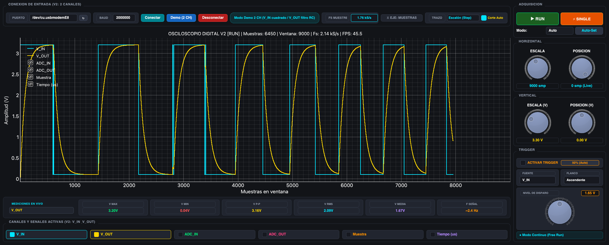

# ⚡ Serial Python Monitor & Digital Oscilloscope

[](https://www.python.org/downloads/)
[](https://www.riverbankcomputing.com/software/pyqt/)
[](https://opensource.org/licenses/MIT)

Un osciloscopio digital y monitor serial de alto rendimiento en tiempo real desarrollado en **Python**, **PyQt5** y **PyQtGraph**. Diseñado para adquirir, visualizar y analizar señales analógicas y digitales provenientes de microcontroladores (**Arduino, ESP32, STM32, Raspberry Pi Pico**) a velocidades de hasta **2.000.000+ baudios** sin pérdida de paquetes ni retraso de acumulación.

<p align="center">
  
</p>

---

## 🌟 Características Principales

- 🚀 **Adquisición Serial de Cero Latencia y Protocolo Binario**:
  - Lectura directa en bloques de alta velocidad desacoplada en un hilo de trabajo (`QThread`).
  - Soporte de protocolo binario empaquetado (`DATA` frame con timestamps en $\mu\text{s}$ y canales ADC de 10/12 bits) y compatibilidad con flujos de texto/CSV.

- 📈 **Control de Trazo y Anti-Diagonales Falsas**:
  - **Modo Escalón (`Step / ZOH`)**: Retención de orden cero para visualizar con fidelidad el muestreo digital sin generar pendientes diagonales artificiales.
  - **Modo Línea (`Linear`)**: Conexión lineal clásica punto a punto.
  - **Corte Automático por Silencios (`Corte Auto`)**: Interrumpe limpiamente el trazo si el microcontrolador entra en pausa o hay saltos temporales, evitando unir eventos desconectados.

- 🎛️ **Panel Frontal de Osciloscopio Digital**:
  - **Controles Rotativos (`QDial`)**:
    - **Horizontal**: Escala de tiempo / muestras visibles (50 a 20.000 muestras) y desplazamiento de posición ($H\text{-}Pos$).
    - **Vertical**: Escala de amplitud de tensión ($V/div$) y desplazamiento de offset ($V\text{-}Pos$).
    - **Trigger**: Nivel de disparo con perilla interactiva y arrastre directo en pantalla.
  - **Botón Auto-Set**: Restablece instantáneamente las escalas a los valores estándar de visualización.

- 🔒 **Motor de Trigger de Precisión**:
  - **Modos de Adquisición**: `Auto`, `Normal` y `⚡ SINGLE SHOT` (captura única con congelamiento automático `STOP`).
  - **Tipos de Flanco**: Ascendente (↑) y Descendente (↓) con histéresis anti-ruido (*Schmitt Trigger*).
  - **Fase Fija y Estable ($T=0$)**: La señal se ancla en el punto de disparo relativo para mantener la onda completamente estática y congelada en pantalla como un osciloscopio de laboratorio.
  - **Botón `50% (Auto)`**: Calcula en tiempo real el punto medio de la señal ($V_{mid} = \frac{V_{max} + V_{min}}{2}$) y sitúa el nivel de disparo con un solo clic.

- 📊 **Barra de Mediciones en Vivo**:
  - Cálculo automático en tiempo real sobre la ventana visible con selector de canal activo:
    - **$V_{\text{MAX}}$**: Tensión máxima observada.
    - **$V_{\text{MIN}}$**: Tensión mínima observada.
    - **$V_{\text{P-P}}$**: Tensión pico a pico ($V_{max} - V_{min}$).
    - **$V_{\text{RMS}}$**: Valor eficaz cuadrático medio real ($V_{rms} = \sqrt{\frac{1}{N} \sum V_i^2}$).
    - **$V_{\text{MEDIA}}$**: Valor medio / componente continua ($V_{avg} = \frac{1}{N} \sum V_i$).
    - **$F_{\text{SEÑAL}}$**: Frecuencia de la forma de onda en $\text{Hz}$ / $\text{kHz}$.

- ⏱️ **Monitor de Frecuencia de Muestreo ($F_s$) en Barra Superior**:
  - Medición instantánea en tarjeta fija con cálculo de período inter-muestras ($\Delta t$ en $\mu\text{s}$ o $\text{ms}$).
  - Conmutador de visualización del eje horizontal: **Muestras** $\leftrightarrow$ **Tiempo real ($\mu\text{s}$)**.

- 🔌 **Conectividad Inteligente**:
  - Detección y filtrado automático de puertos seriales USB (`Arduino Uno WiFi R4`, `CH340`, `FTDI`, `CP210x`, etc.).
  - Soporte de baudrates configurables hasta **2.000.000 baudios**.

- 🧪 **Modo Demo Integrado**:
  - Generador de señal de 2 canales ($V_{IN}$ cuadrada y $V_{OUT}$ respuesta transitoria de circuito $RC$) para probar todas las funciones sin hardware físico.

---

## 📁 Estructura del Repositorio

```text
.
├── SerialMonitorAppQt_V4.py  # Versión más avanzada con protocolo binario y control de trazo Step/Linear
├── SerialMonitorAppQt_V3.py  # Versión con parser CSV dinámico y detección de encabezados
├── SerialMonitorAppQt_V2.py  # Versión Dual-Channel (V_IN, V_OUT, ADC_IN, ADC_OUT)
├── SerialMonitorAppQt.py     # Versión base monocanal
├── SerialMonitorApp.py       # Versión liviana con Tkinter / Matplotlib
├── SerialMonitor.py          # Script en consola para captura y exportación a pandas
├── SerialMonitor.ipynb       # Jupyter Notebook interactivo para análisis de datos
├── assets/
│   └── demo_screenshot.png   # Captura de pantalla de la aplicación en modo demo
├── requirements.txt          # Dependencias de Python necesarias
└── README.md                 # Documentación del proyecto
```

---

## 🛠️ Instalación y Requisitos

### 1. Clonar el repositorio
```bash
git clone https://github.com/tu-usuario/SerialPythonMonitor.git
cd SerialPythonMonitor
```

### 2. Crear entorno virtual (Recomendado)
```bash
python3 -m venv venv
source venv/bin/activate  # En Linux/macOS
# venv\Scripts\activate   # En Windows
```

### 3. Instalar dependencias
```bash
pip install -r requirements.txt
```

---

## 🚀 Uso Rápido

Para iniciar la aplicación de osciloscopio:
```bash
python SerialMonitorAppQt.py
```

### Pasos dentro de la interfaz:
1. **Conexión**: Selecciona el puerto serial detectado y el baudrate (por defecto `921600`).
2. **Adquisición**: Haz clic en **"Conectar"** (o en **"Demo"** para simulación).
3. **Escala**: Gira las perillas **ESCALA H** y **ESCALA V** para ajustar la ventana visible.
4. **Trigger**:
   - Marca la casilla **"ACTIVAR TRIGGER"**.
   - Haz clic en **"50% (Auto)"** para anclar la señal de forma inmediata.
   - Utiliza **"⚡ SINGLE"** para capturar eventos transitorios únicos.
5. **Mediciones**: Observa las tarjetas inferiores para verificar $V_{max}, V_{min}, V_{rms}$ y frecuencia instantánea.

---

## 📡 Formatos de Datos Serial Compatibles

El parser interpreta automáticamente flujos CSV con diferentes estructuras:

1. **7 Columnas (V2 - Dual Channel Entrada / Salida con Estado y Tiempos)**:
   ```text
   estado,muestra,tiempo_us,ADC_IN,V_IN,ADC_OUT,V_OUT
   ON,1,1024,1023,1.25,2048,2.50
   ON,2,1540,1030,1.26,2060,2.51
   OFF,3,2050,0,0.00,1024,1.25
   ```
   > 💡 *Soporta visualización simultánea de entrada y salida (`V_IN` y `V_OUT`), selección de fuente de trigger por cualquiera de los canales y selector de mediciones.*

2. **4 Columnas (V1 - Estándar Monocanal con Estado y Tiempo)**:
   ```text
   estado,muestra,tiempo_us,adc
   ON,1,1024,3100
   ON,2,1540,3250
   OFF,3,2050,1200
   ```
3. **3 Columnas (Muestra, Tiempo, ADC)**:
   ```text
   100,50200,2048
   101,50700,2080
   ```
4. **1 Columna (Valor directo de ADC o Tensión)**:
   ```text
   2048
   2100
   1950
   ```
5. **N Columnas (Multi-canal)**:
   Cualquier cantidad de columnas numéricas separadas por coma son asignadas dinámicamente como canales activables en la interfaz.

---

## 💻 Ejemplo de Código para Arduino (921600 Baudios)

```cpp
// Ejemplo de transmisión serial ultrarrápida para Arduino / ESP32
void setup() {
  Serial.begin(921600);
  analogReadResolution(12); // Para placas de 12 bits (ADC 0-4095)
}

unsigned long sample = 0;

void loop() {
  sample++;
  unsigned long t_us = micros();
  int adc_val = analogRead(A0);
  
  // Enviar en formato: muestra,tiempo_us,adc
  Serial.print(sample);
  Serial.print(",");
  Serial.print(t_us);
  Serial.print(",");
  Serial.println(adc_val);
  
  delayMicroseconds(400); // Tasa ~2.5 kHz
}
```

---

## 📄 Licencia

Este proyecto está bajo la Licencia **MIT**. Consulta el archivo `LICENSE` para más detalles.

