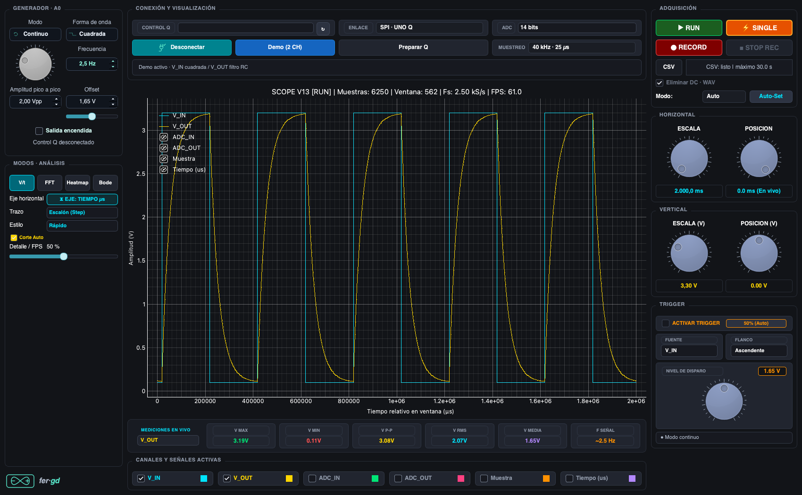
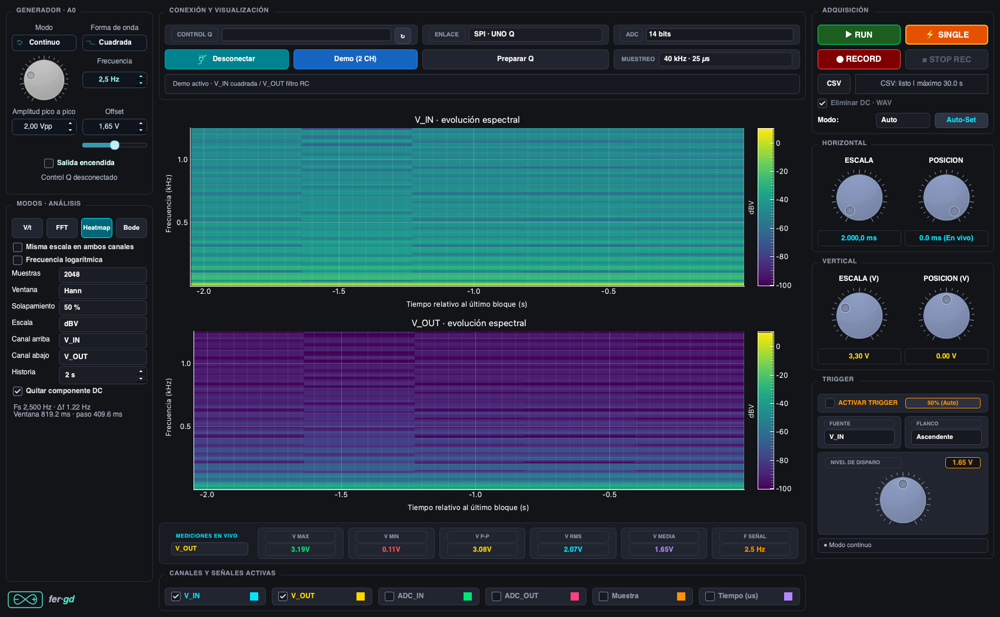
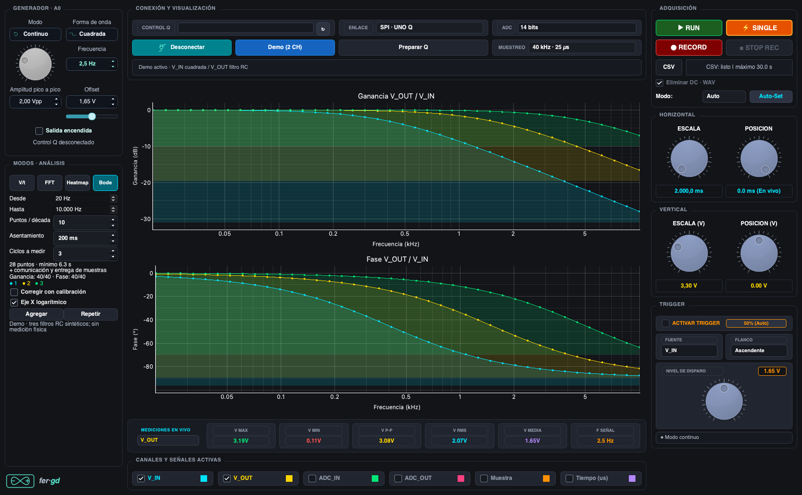

# fergd · Osciloscopio y generador Arduino UNO Q

[](https://github.com/fmgarciadiaz/SerialPythonMonitor)
[](https://github.com/fmgarciadiaz/SerialPythonMonitor/commits)
[](https://github.com/fmgarciadiaz/SerialPythonMonitor/stargazers)


Un instrumento para generar señales, observar circuitos y analizar su respuesta.
Combina adquisición y generación por hardware con un monitor Python de dos
canales, análisis espectral, respuesta en frecuencia, grabación de señales y un
sintetizador MIDI con FM y modelos físicos de instrumentos.

La tecnología combina Python/PyQt6 y pyqtgraph para la interfaz, NumPy/SciPy
para el análisis y audio, Numba para los cálculos recurrentes del sinte, C/C++ con Arduino/Zephyr en el STM32 y un relay C
sobre Linux. Los temporizadores fijan los tiempos de ADC/DAC y DMA mueve los
bloques; USB/ADB conecta el instrumento con la computadora.

## V(t) · osciloscopio



Muestra tensión frente al tiempo para comparar entrada y salida de un circuito.
Permite ajustar escalas y posición, estabilizar la señal con trigger, detener
la vista o capturar un evento con SINGLE. Incluye mediciones de tensión máxima,
mínima, pico a pico, RMS, media y frecuencia estimada.
La imagen muestra una cuadrada y la respuesta de un filtro RC simulado.

## Especificaciones y capacidades

| Área | Implementación y alcance |
|---|---|
| Entradas | Dos canales: A2/V_IN y A3/V_OUT, rango nominal 0–3,3 V |
| Resolución ADC | 8/10/12/14 bits; 16 bits por oversampling ×16, sin implicar 16 bits de precisión efectiva |
| Muestreo SPI | Hasta 125 mil pares/s en ADC nativo; hasta 62,5 mil pares/s con ADC16 (OS) |
| Salida DAC | A0, 12 bits, rango nominal 0–3,3 V; amplitud y offset ajustables dentro de esos límites |
| Generador | Seno, cuadrada, triángulo, rampa; modos Sweep, Chirp y Pulso; frecuencia configurada 0,1 Hz–20 kHz |
| Audio de salida | WAV mono por A0, L/R/Mix, tasas negociadas de 20/40/50 ksps; 40 ksps por defecto |
| Audio de entrada | WAV estéreo PCM16 de A2/A3; filtro DC continuo opcional a 5 Hz |
| Registro | CSV o WAV, muestras recibidas completas, hasta 30 s por grabación |
| Análisis | FFT, evolución espectral en heatmap y Bode de ganancia/fase; comparación de hasta cinco barridos |
| Transporte | SPI a 32 MHz, tramas SCP1 de 992 bytes, CRC y control de continuidad; USB/ADB al PC |
| Opción UART | Puente UNO R4, hasta 31,25 mil pares/s; el Q conserva el canal de control |
| Entorno | Python 3.13, PyQt6, pyqtgraph, NumPy, SciPy; Linux en MPU y Arduino/Zephyr en MCU |

Las tasas indicadas son tasas de muestras, no ancho de banda analógico ni
precisión garantizada. El DAC pierde linealidad cerca de sus extremos: el ajuste
inicial de 2 Vpp/1,65 V deja margen. WAV50 con ADC125 está bloqueado por los
fallos observados; WAV50 con ADC14/100 kHz pasó el ensayo sostenido.
[Perfiles ADC](docs/CONFIGURACION_ADQUISICION.md) · [Límites del generador](docs/GENERADOR_PASO4.md) ·
[Ensayos de audio](docs/WAV_TASAS.md).

## FFT · espectro de frecuencia


Descompone cada canal en sus componentes de frecuencia para observar tonos,
armónicos y atenuación. Permite elegir tamaño de FFT, ventana, solapamiento,
escala de amplitud, eje de frecuencia lineal/logarítmico y eliminación de DC.
El selector de análisis ofrece **Spectrum**, **Power**, **Distortion** y
**Transfer**. [Modos y unidades](docs/FFT_ANALISIS.md).
La resolución entre bins depende de Fs/N. En SINGLE conserva el bloque próximo
al trigger de mayor energía; RUN vuelve al espectro en vivo.

## Heatmap · evolución espectral



Acumula espectros para mostrar cómo cambian con el tiempo. Un eje representa
frecuencia, el otro tiempo y el color amplitud. Sirve para seguir un sweep o
chirp, ver tonos persistentes y ubicar transitorios; permite ajustar la historia
visible y comparar los dos canales.

## Bode · respuesta del circuito



Mide la relación V_OUT/V_IN por frecuencia: ganancia en dB y fase en grados.
Ofrece tres paneles: **Tonos**, con asentamiento y ciclos por frecuencia;
**Pulso**, con captura de la respuesta transitoria; y **Sweep/Chirp**, con
barrido lineal o exponencial. Pulso promedia espectros cruzados de varios
disparos (8 por defecto); Sweep/Chirp calcula FFT(V_OUT)/FFT(V_IN).
Ambos incluyen la cola de respuesta y descartan
frecuencias sin señal suficiente. Permite comparar hasta cinco curvas por
método. Elegir el modo prepara el panel; la medición empieza con Repetir
o Agregar. Los pulsos de 100 µs requieren el firmware experimental.

Estas capturas usan señales sintéticas; FFT muestra la nueva variante
y las otras vistas muestran la versión conservada;
Bode ilustra tres filtros RC, sin representar una medición física.
[Controles del monitor](monitor/v14/README.md) · [Análisis y Bode](docs/MONITOR_TECNICO.md).

## Wav · grabación y reproducción

Graba las entradas **A2 como L** y **A3 como R** en WAV estéreo PCM16,
con el mismo botón de registro que CSV. El selector permite elegir el formato;
los archivos se guardan junto a las capturas con fecha y hora, hasta 30 s.
**Eliminar DC** aplica un filtro continuo de 5 Hz, con estado entre bloques:
una señal centrada en 1 V no necesita estar centrada en 1,65 V para escucharse.

En el generador, **Wav** permite elegir un archivo, seleccionar **L, R o Mix**
y reproducirlo por **A0 en mono**. Python remuestrea con antialias, convierte
el audio a 12 bits y ajusta amplitud y offset al rango del DAC. La salida usa
**40 kHz por defecto**, con 20/40/50 kHz según el firmware. Incluye Play/Stop,
avance y retroceso de 10 s y amplitud ajustable durante reproducción. Al
terminar queda en silencio. Play activa la adquisición y bloquea cambios ADC.

La ruta es PC → USB/ADB → relay Linux → SPI → MCU → temporizador/DMA → A0.
Es reproducción de archivos; no crea una salida de audio del sistema operativo.
[Uso del monitor](monitor/v15/README.md#wav--archivos-y-grabación) ·
[Tasas y ensayos físicos](docs/WAV_TASAS.md).

## Synth · FM, ondas y modelos físicos

Mini sintetizador **mono de salida y polifónico de nueve voces**, controlado
por MIDI o Play. Ofrece **Osc 1, Osc 2 y Osc 3**, FM con feedback, seno,
cuadrada, triángulo y rampa; ADSR por oscilador, mezcla, detune y filtros
pasa bajos, pasa altos, pasa banda y notch.

**DX Piano** es el instrumento inicial; **DX Brillo** agrega ataque metálico.
También incluye flauta, órgano, campana, Bass Punch, Lead, Brass, Warm Pad
y Pluck. Son presets editables, no emulaciones exactas de instrumentos comerciales.

**Virtual** agrega dos instrumentos físicos: **Guitarra**, con cuerda pulsada,
dos planos de vibración, puente y caja; y **Piano Virtual**, con martillo no
lineal, cuerdas rígidas, unísonos acoplados y resonancias simpáticas con pedal.
Permite ajustar posición, brillo, vibración, caja, puente y rigidez del piano.
Sus parámetros y resonancias son sintéticos, pendientes de ajuste por escucha.

La salida A0 es de 12 bits, **20 kHz por defecto** o 40 kHz. Velocidad MIDI,
pedal CC64 y volumen CC7 funcionan durante reproducción. Numba compila feedback,
envolventes y los modelos físicos; la preparación ocurre antes de Play.
El buffer aporta al menos 120 ms a 20 kHz y 192 ms a 40 kHz y puede crecer.
40 kHz sigue siendo experimental: las pruebas locales de cálculo no garantizan
continuidad física con adquisición y transporte activos.
[Guía y controles](monitor/v15/README.md#generador-synth) ·
[Motor, modelos físicos y límites](docs/SYNTH.md).

## Qué hace

FFT incorpora Spectrum, Power, Distortion y Transfer: espectro, potencia,
distorsión y respuesta entre entradas. [Definiciones y límites](docs/FFT_ANALISIS.md).

- Osciloscopio V(t) con trigger, RUN/STOP y captura SINGLE.
- FFT, heatmap y Bode de ganancia y fase.
- Generador de seno, cuadrada, triángulo y rampa; modos Sweep, Chirp y Pulso.
- Grabación CSV o WAV estéreo de A2/A3, con eliminación de DC opcional.
- Reproducción de archivos WAV por A0: selección L/R/Mix, remuestreo,
  conversión a 12 bits y ajuste de amplitud/offset entre 0 y 3,3 V.
- Synth con MIDI, nueve voces, FM, ondas clásicas y guitarra/piano físicos.
- Adquisición configurable: 8/10/12/14 bits o 16 bits por oversampling.
  SPI hasta 125 kHz por canal; 16 bits hasta 62,5 kHz.

## Empezar

Desde la raíz del repositorio:

```sh
conda env create -f monitor/v15/environment.yml
conda activate Python_3_13_DataScience
python monitor/v15/app.py
```

Si el entorno ya existe, omitir su creación. Demo permite probar la interfaz
sin placa. Conectar intenta usar el enlace existente y, si no responde,
comprueba la app instalada y el relay e inicia lo que falte.
Preparar Q instala o actualiza la app MCU y el relay desde las fuentes del
proyecto; requiere un UNO Q con Linux, ADB y las herramientas Arduino operativas.

Valores iniciales: ADC 14 bits/40 kHz, amplitud 2 Vpp, offset 1,65 V y salida
apagada. Sweep y Chirp: 20 Hz→2 kHz en 2 s; se lanzan con Disparar.
Wav usa 40 mil muestras/s por defecto si el firmware lo admite.
Durante Play se activa la adquisición y se bloquea el cambio de perfil ADC;
la amplitud se puede ajustar durante la reproducción. Desconectar apaga la salida.

[Guía del monitor](monitor/v15/README.md) · [Instalación del Q](arduino/v12_audio/README.md)

## Cómo se conectan los componentes

| Componente | Función |
|---|---|
| PC / Python | Interfaz, análisis, archivos CSV/WAV y preparación del audio |
| MPU / Linux del UNO Q | App de App Lab y relay nativo USB/ADB ↔ SPI |
| MCU / STM32 del UNO Q | ADC A2/A3 y DAC A0, temporizadores y DMA |
| UNO R4 opcional | Puente UART de adquisición; el Q conserva el control |

El MCU adquiere A2/A3 y entrega los bloques por SPI al relay del MPU.
El relay los lleva por USB/ADB al receptor Python. Los comandos y los códigos
WAV viajan en sentido inverso: PC→relay→SPI→MCU; TIM6 y DMA alimentan el DAC A0.
El pequeño Python de App Lab mantiene la app; el relay es un proceso separado.

| Pin | Uso |
|---|---|
| A0 / DAC0 | Salida de 12 bits, 0–3,3 V |
| A2 / V_IN | Primera entrada / canal izquierdo de grabación |
| A3 / V_OUT | Segunda entrada / canal derecho de grabación |
| GND | Masa común |

[MCU y cableado](docs/UNO_Q_TECNICO.md) · [Relay y protocolos](docs/TRANSPORTE_TECNICO.md)

## Monitor Python · interfaz y procesamiento

El monitor recibe muestras en un worker y actualiza la interfaz Qt desde el
hilo gráfico. Conserva los datos para análisis y grabación, mientras adapta
la cantidad de puntos dibujados a la pantalla. Python prepara WAV, remuestrea
con filtro antialias y ajusta códigos de salida; el hardware mantiene su ritmo.

[Arquitectura, historial, FFT y Bode](docs/MONITOR_TECNICO.md) ·
[Receptor y comandos del PC](monitor/v13/receiver/README.md).

## Relay C · Linux del MPU

El relay nativo une USB/ADB con SPI: espera READY del MCU, intercambia tramas,
valida CRC y continuidad y lleva muestras al PC. También transporta órdenes
ADC/generador y bloques WAV en sentido inverso. Corre en Linux y es distinto
del pequeño Python que mantiene viva la app de App Lab.

[Detalles: GPIO READY, SPI, tramas, créditos y recuperación](docs/TRANSPORTE_TECNICO.md) ·
[Fuentes del relay](arduino/v12_audio/relay/unoq_config_stream.c).

## C/C++ Arduino · firmware del MCU

El sketch configura ADC, DAC, temporizadores y GPDMA del STM32. TIM2 dispara
las conversiones; TIM5 captura timestamps; TIM6 marca los pasos del DAC.
Los DMA 0/1 alimentan buffers de timestamps/ADC, 2/3 atienden SPI y 4 alimenta
A0. Las IRQ del DMA SPI notifican fin/error mediante el driver Zephyr; la
adquisición comprueba flags y buffers sin una ISR por muestra.

[Detalles: relojes, timers, DMA, IRQ y propiedad de buffers](docs/UNO_Q_TECNICO.md) ·
[Sketch Arduino](arduino/v12_audio/oscilloscope/sketch/sketch.ino) ·
[Instalación y compilación](arduino/v12_audio/README.md).

## Carpetas

| Carpeta | Contenido |
|---|---|
| [monitor](monitor/README.md) | Aplicación Python y receptor del PC |
| [arduino](arduino/README.md) | Sketch MCU, app MPU y relay de cada pareja |
| [transport](transport/README.md) | Herramientas y contratos de transporte compartidos |
| tools | Instalación, compilación y administración del Q |
| [docs](docs/README.md) | Guías técnicas e historia |
| [diagnosticos](diagnosticos/README.md) | Ensayos, informes y resultados físicos |
| [capturas](capturas/README.md) | Grabaciones e inventario de limpieza |
| audios | Archivos de audio para reproducción |
| [respaldos](respaldos/README.md) | Copias de fuentes y aplicaciones del Q |
| experimentos | Variantes aisladas y evidencia de desarrollo |

Las fuentes históricas se conservan en las carpetas `historico` de cada módulo.
Los entornos locales y cachés no forman parte de las fuentes.

## Documentación y validación

[Índice técnico](docs/README.md) · [Plan de trabajo](Plan%20de%20trabajo.md) ·
[Continuación](%23%20Continuar%20desde%20donde%20quedaste.md)

WAV a 40/50 ksps pasó ensayos de 120 s; 50 ksps también con ADC14/100 kHz.
La combinación WAV50/ADC125 está bloqueada por fallos observados.
[Resultados y límites](docs/WAV_TASAS.md).
La referencia Bode histórica corresponde al reloj ADC anterior y requiere
comprobación con el perfil actual. Los ensayos locales y los físicos se
identifican por separado en los informes.

## Versiones y enlaces

| Conjunto | Estado y documentación |
|---|---|
| [Monitor V15 · Synth](monitor/v15/README.md) | Synth: tres osciladores, feedback, FM/ondas/Virtual, guitarra y piano físicos, nueve voces y MIDI; estabilidad de cada perfil pendiente de validación física |
| [Monitor V14 · PyQt6](monitor/v14/README.md) | Nueva variante con cuatro modos FFT; firmware existente |
| [Monitor V13 · PyQt6](monitor/v13/README.md) + [Q V12 Audio](arduino/v12_audio/README.md) | Pareja principal conservada, con grabación y reproducción WAV |
| [Q V13 Pulse experimental](arduino/v13_pulse/README.md) + [Monitor V13](monitor/v13/README.md) | Variante actualmente en prueba: pulso desde 100 µs |
| [Monitor V12 · PyQt5](monitor/v12/README.md) + [Q V11 P992](arduino/v11_p992/README.md) | Pareja anterior conservada, sin reproducción WAV |
| [Monitores históricos](monitor/historico/README.md) | Versiones anteriores archivadas |
| [Firmware histórico](arduino/historico/README.md) | Sketches y puentes anteriores |
| [Historia completa](docs/HISTORIA.md) | Evolución y catálogo del proyecto |

Las herramientas de consola conservan V11 P992 como valor predeterminado.
Para el conjunto de audio usar explícitamente `--version v12_audio` o
`--firmware v12_audio`. El monitor detecta la app instalada al conectar.

[Pulsos de microsegundos: variante experimental](arduino/v13_pulse/README.md).
