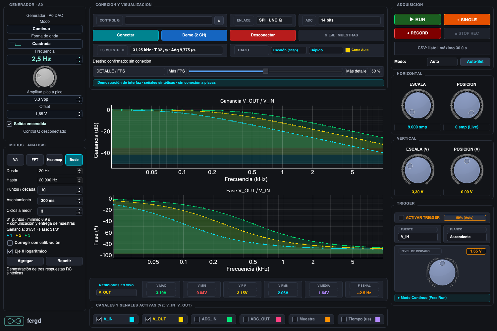

# 🔬 fergd · Osciloscopio y generador UNO Q

**Dos canales, generación de señales y análisis de frecuencia en un mismo instrumento.**
Arduino UNO Q adquiere y genera por hardware; el monitor Python permite observar,
medir, registrar y comparar la respuesta de tus circuitos.


## Qué podés hacer

- **Osciloscopio:** dos entradas, RUN/STOP, SINGLE, trigger, escalas editables,
  colores por canal y detalle de dibujo ajustable.
- **Adquisición configurable:** 8/10/12/14 bits nativos o 16 bits con oversampling
  ×16. SPI hasta 62,5 kHz; 16 bits hasta 50 kHz; UART hasta 31,25 kHz.
- **Generador en A0:** seno, cuadrada, triángulo, rampa, pulso, sweep y chirp;
  amplitud pico a pico, frecuencia, rango y duración. Rango 0,1 Hz–20 kHz.
- **FFT y heatmap:** hasta dos canales apilados, ventanas, tamaño de bloque,
  escalas de amplitud y frecuencia logarítmica.
- **Bode:** barrido senoidal por pasos, ganancia y fase V_OUT/V_IN, puntos por
  década, comparación de hasta cinco curvas y referencia instrumental.
- **Registro CSV:** muestras y timestamps originales; la reducción visual no
  reduce los datos guardados.

## Empezar

La combinación actual es **monitor V10 + firmware UNO Q V8 config**. Los números
versionan componentes distintos. Con el firmware y relay ya instalados:

```sh
python -m pip install -r requirements.txt
python3 tools/usb_stream.py start
python monitor/v10/app.py
```

Elegí el **CONTROL Q** y el **ENLACE** en la franja superior, luego Conectar.
Para explorar sin placas, usá **Demo (2 CH)**. Los cambios de configuración se
aplican al seleccionar; el estado indica la confirmación del Q.

## 🐍 Monitor Python

La columna izquierda reúne generador y modos de análisis. En el centro están
conexión, adquisición, gráfica y canales; a la derecha, RUN/SINGLE/CSV, escalas
horizontal/vertical y trigger. FFT, heatmap y Bode reemplazan la gráfica temporal.

[Guía del monitor](monitor/v10/README.md) ·
[Funcionamiento interno y diagramas](docs/MONITOR_TECNICO.md) ·
[FFT, heatmap y Bode](docs/FFT_V10.md)



Las capturas de presentación son demostraciones de interfaz; la evidencia
física está enlazada en los documentos de validación.

## ∞ Arduino UNO Q

El MCU controla temporizadores, ADC, DAC y DMA. El Linux del Q ejecuta el relay
que lleva muestras y comandos al PC por USB/ADB. El Q de control permanece
conectado tanto en SPI directo como al elegir UART mediante el puente UNO R4.

| Pin | Función |
|---|---|
| **A0 / DAC0** | Salida del generador, DAC de 12 bits |
| **A2** | V_IN, entrada de referencia |
| **A3** | V_OUT, salida del circuito bajo prueba |
| **GND** | Masa común |

[Instalación y firmware](arduino/v8_config/README.md) ·
[Temporizadores, DMA y cableado](docs/UNO_Q_TECNICO.md) ·
[Relay y protocolos](docs/TRANSPORTE_TECNICO.md)

## Validación y límites

La referencia Bode vigente cubre **20 Hz–20 kHz, ADC 16 bits / 50 kHz**,
con 31 puntos válidos y CSV continuo. Sólo se aplica al perfil y rango calibrados.
La referencia anterior fue invalidada por cableado incorrecto.

La tasa nominal no garantiza precisión analógica: ventanas ADC cortas necesitan
menor impedancia de fuente. Los 16 bits son salida de oversampling; el DAC sigue
siendo de 12 bits. A frecuencias altas el generador dispone de menos puntos por
período. [Adquisición](docs/CONFIGURACION_ADQUISICION.md) ·
[Generador](docs/GENERADOR_PASO4.md) · [Bode y calibración](diagnosticos/BODE_V10.md).

## Historia, documentación y próximos pasos

[**📚 Historial completo de versiones**](docs/HISTORIA.md) ·
[Índice de documentación](docs/README.md) ·
[Plan de trabajo](Plan%20de%20trabajo.md) ·
[Monitores archivados](monitor/historico/README.md) ·
[Firmware archivado](arduino/historico/README.md)

El siguiente paso del plan es grabar y reproducir audio WAV; todavía no está
implementado. Las capturas, diagnósticos y respaldos se mantienen separados de
las versiones activas.
