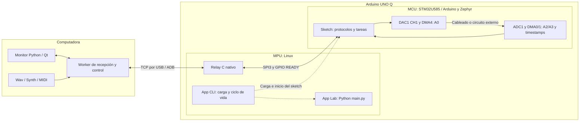
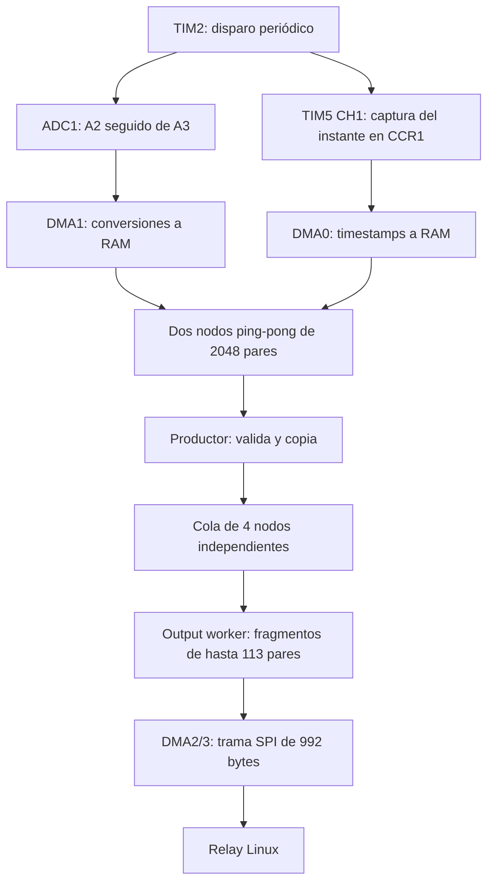

# Arquitectura completa del instrumento

[Proyecto](../README.md) · [Organización de carpetas](ORGANIZACION.md)

El instrumento tiene tres lugares de ejecución: la computadora del usuario,
el procesador Linux (MPU) del Arduino UNO Q y el microcontrolador STM32U585
(MCU) del mismo Q. El monitor es la interfaz y realiza los análisis; el relay
es el puente de comunicación; el sketch ejecuta la adquisición y generación
con temporizadores y DMA. Cada uno tiene su propio proceso, memoria y tareas.

Esta guía describe el monitor V15 y el firmware V13 Pulse. V12 Audio conserva
la misma arquitectura de adquisición y audio; V13 Pulse añade el pulso corto
por hardware. Los nombres de las versiones de monitor y firmware no tienen
que coincidir. Las rutas enlazadas permiten pasar de esta explicación al código.

## 1. Mapa del sistema



| Parte | Dónde corre | Responsabilidad | Fuente principal |
|---|---|---|---|
| Monitor | PC, Python/PyQt6 | Controles, visualización, FFT/Bode, registro, preparación de audio y MIDI | [app.py](../monitor/v15/app.py) |
| Receptor y worker | PC, hilo separado de Qt | Mantener conexión, decodificar tramas, enviar órdenes y esperar confirmaciones | [receiver](../monitor/v15/receiver/README.md) |
| Relay | MPU Linux, proceso C en contenedor | Intercambiar tramas SPI con el MCU, validarlas y entregarlas por TCP; enviar órdenes/audio del PC | [unoq_config_stream.c](../arduino/v13_pulse/relay/unoq_config_stream.c) |
| Python de App Lab | MPU Linux, aplicación administrada por App CLI | Mantener viva la app que contiene el sketch | [main.py](../arduino/v13_pulse/oscilloscope/python/main.py) |
| Sketch | MCU, C/C++ sobre Arduino/Zephyr | ADC/DAC, relojes, DMA, colas, protocolos y estados de hardware | [sketch.ino](../arduino/v13_pulse/oscilloscope/sketch/sketch.ino) |
| Herramientas de instalación | PC; ejecutan comandos en Linux del Q mediante ADB | Compilar, respaldar, importar/actualizar app e iniciar MCU y relay | [prepare_q.py](../tools/prepare_q.py), [unoq.py](../tools/unoq.py), [usb_stream.py](../tools/usb_stream.py) |

El audio no usa una clase USB Audio ni crea un dispositivo de sonido del sistema.
USB/ADB transporta una conexión TCP. El monitor convierte Wav o Synth a códigos
DAC y los manda mediante el protocolo del instrumento.

## 2. Monitor: interfaz, órdenes y análisis

Qt atiende botones, diales, selección de modos y dibujo en el hilo de interfaz.
`OutputWorker` corre en otro hilo; recibe lotes y emite señales Qt para que la
interfaz actualice su historial. Las solicitudes de adquisición, generador,
audio y niveles pasan por colas `queue.Queue` acotadas. Así, un botón no escribe
simultáneamente en el socket que está usando el receptor.

El worker mantiene la conexión y coordina peticiones y respuestas. Los protocolos
incluyen identificadores de solicitud y confirman aceptación, aplicación o
rechazo según la operación. Un comando enviado no se considera automáticamente
aplicado. Cambiar bits/tasa requiere confirmar el perfil real; Bode espera el
estado adecuado del generador antes de medir. Una nueva época de adquisición
permite distinguir datos anteriores de los obtenidos tras reconfigurar.

Las muestras recibidas contienen timestamp y dos códigos ADC. El PC convierte
los códigos a tensión según el perfil confirmado, conserva el historial y
calcula V(t), FFT, heatmap y Bode. La reducción de puntos para dibujar no cambia
las muestras registradas. FPS es la frecuencia de actualización gráfica;
Fs es la frecuencia de adquisición del MCU.

Wav se lee, selecciona L/R/Mix y remuestrea con antialias. Synth produce audio
por bloques a partir de notas MIDI, osciladores y modelos físicos. Ambos usan
la misma ruta de transmisión de audio al MCU; sus cálculos corren en el PC.
El MCU recibe códigos de 12 bits, no mensajes MIDI ni un archivo WAV completo.

[Detalle del monitor](MONITOR_TECNICO.md) · [FFT](FFT_ANALISIS.md) · [Synth](SYNTH.md)

## 3. Relay: puente entre PC, MPU y MCU

El relay abre el dispositivo SPI de Linux con `flock` exclusivo. Linux es el
master y SPI3 del MCU es el slave. Se registra en los eventos de GPIO READY
mediante la API GPIO v2; cuando el MCU anuncia que preparó sus buffers, el
relay hace una transferencia `SPI_IOC_MESSAGE` de 992 bytes a 32 MHz.

La transferencia es simultánea en ambas direcciones: el MPU recibe una trama
de muestras o respuesta y envía una orden pendiente o una consulta de mantenimiento.
READY es un permiso para una nueva transferencia, no un reloj de muestreo.
El relay controla el nivel inicial y la antigüedad de los eventos para no
reutilizar una notificación anterior.

El relay valida trama, CRC, secuencia y continuidad con los validadores C.
Escucha TCP en el puerto 8766; ADB reenvía el puerto por el USB del Q hacia
la computadora. Sólo admite un cliente activo. TCP es un flujo: una lectura
puede traer parte de una orden; el relay acumula bytes hasta completar sus
992 bytes y cierra la sesión si la orden es inválida o queda incompleta.

El envío al PC es no bloqueante. Si no puede entregar una trama completa,
cierra esa sesión y continúa drenando la adquisición. Así evita frenar el MCU
por un cliente lento y evita concatenar fragmentos de distintas tramas. Una
trama SPI inválida, en cambio, termina el relay con diagnóstico.

El relay no configura ADC/DAC directamente y no lee buffers DMA del MCU.
No hay una ISR del relay C en espacio de usuario: el kernel Linux gestiona
el dispositivo SPI y los eventos GPIO. Los DMA descritos abajo pertenecen al
STM32; la implementación interna del controlador Linux queda fuera del sketch.

[Detalle de transporte y protocolos](TRANSPORTE_TECNICO.md) ·
[Validación de tramas](../arduino/v13_pulse/relay/config_relay_protocol.h)

## 4. MCU: adquisición desde A2 y A3



TIM2 genera un TRGO por período. ADC1 ejecuta una secuencia A2/A3; son dos
conversiones sucesivas por disparo, no dos ADC simultáneos. TIM5 funciona como
contador de 1 MHz y captura ese disparo en CCR1. DMA0 guarda la captura temporal
y DMA1 los resultados ADC. Capturar CCR1 evita estimar el instante leyendo
un contador en el momento, variable, en que la CPU atiende el bloque.

Cada DMA recorre dos nodos enlazados de 2048 pares. Mientras llena uno, el
productor puede leer el otro. El productor consulta flags y direcciones DMA
cada 1 ms; no existe una interrupción por cada conversión ni una ISR propia
de adquisición. Comprueba que ambos DMA avanzaron al nodo esperado, invalida
caché y verifica timestamps, rango de códigos y errores de hardware.

La CPU copia el nodo terminado a una cola distinta de cuatro nodos. Comprueba
que el DMA no volvió al nodo durante la copia. El consumidor transmite esa
copia y libera su slot después de enviar todos los fragmentos. Esto distingue
la RAM ping-pong, que el hardware reutiliza, de la RAM de cola, que mantiene
propiedad hasta que termina el transporte.

Si falta un slot se contabiliza un nodo perdido; si hay sobreescritura ambigua,
overrun ADC, captura temporal perdida o error DMA, se detiene el disparo y se
marca fallo. La aplicación no publica silenciosamente RAM de origen incierto.

Un nodo dura `2048/Fs`: 51,2 ms a 40 kHz y 16,384 ms a 125 kHz. Sus 2048 pares
requieren 19 fragmentos SPI de hasta 113 pares. El tiempo nominal de los bytes
SPI es sólo una parte del presupuesto: también cuentan GPIO, preparación,
copias, validación y planificación Linux/Zephyr.

[Adquisición](../arduino/v13_pulse/oscilloscope/sketch/acquisition.h) ·
[Recursos y tamaños](../arduino/v13_pulse/oscilloscope/sketch/scope_config.h) ·
[Perfiles ADC](CONFIGURACION_ADQUISICION.md)

## 5. MCU: generación por A0

| Recurso STM32 | Uso |
|---|---|
| TIM2 | Ritmo de disparo ADC |
| TIM5 CH1 | Captura temporal; base de 1 µs |
| GPDMA1 canal 0 | CCR1 de TIM5 → timestamps en RAM |
| GPDMA1 canal 1 | ADC1 → códigos A2/A3 en RAM |
| GPDMA1 canal 2 | RAM de transmisión → SPI3 |
| GPDMA1 canal 3 | SPI3 → RAM de recepción |
| TIM6 | Ritmo de actualización DAC y pulso corto |
| GPDMA1 canal 4 | Tabla de onda o bloques de audio → DAC1 CH1/A0 |

El generador periódico prepara una tabla en RAM. TIM6 solicita cada muestra
y DMA4 la escribe en el DAC; la CPU no ejecuta una escritura por muestra.
Sweep/Chirp actualizan el timing mediante una tabla de ajustes previamente
calculada. El `k_timer` de 2 kHz supervisa progresión, duración y errores;
no es el reloj de audio. En V13 Pulse, el pulso corto usa TIM6 en modo one-shot
con retorno de nivel por hardware; no depende de esperar 100 µs en Python.

Las órdenes se procesan fuera del callback del timer cuando requieren cálculos
como `pow` o preparación de tablas. Se detiene DMA antes de sobrescribir su
memoria fuente. ADC y DAC comparten el kernel de reloj ADCDAC: PLL2 se prepara
antes del generador y las reconfiguraciones verifican el reloj sin conmutarlo
mientras la salida está activa. La supervisión detecta underrun DAC y errores DMA.

### Audio Wav y Synth

El PC envía bloques de hasta 480 muestras. El MCU tiene 16 slots y responde
con sesión, muestras aceptadas/reproducidas y créditos libres. `BEGIN` abre
la sesión, los bloques llenan la cola y `PLAY` inicia cuando hay prerrelleno:
al menos cuatro bloques, o un archivo corto completo. El monitor puede llenar
más bloques para dejar margen de transporte.

Los créditos expresan slots disponibles, no tiempo reproducido. Cada bloque
dura 12 ms a 40 kHz; 16 bloques completos representan 192 ms de capacidad,
no una latencia fija de todo el sistema. El monitor negocia la tasa y regula
el envío a partir del estado confirmado.

DMA4 recorre descriptores de audio; la supervisión observa la dirección fuente
y los bytes restantes para liberar bloques que el hardware ya dejó atrás.
Los descriptores vacíos o posteriores a EOF apuntan a una guarda neutral finita:
no permiten que DMA vuelva a tocar audio viejo. EOF, falta de muestras y fallo
son estados distintos. Al terminar se libera la propiedad de la salida con
el generador anterior deshabilitado, de modo que no reaparece un seno continuo.

ADC continúa adquiriendo de forma independiente. A0 vuelve a A2/A3 únicamente
por un cable o circuito externo; no hay una conexión analógica interna creada
por el software. Para referencia instrumental se conecta A0 a ambas entradas,
con masa común; para medir un circuito A2 observa su entrada y A3 su salida.

[Generador](../arduino/v13_pulse/oscilloscope/sketch/generator.h) ·
[Motor DAC](../arduino/v13_pulse/oscilloscope/sketch/generator_dma.h) ·
[Supervisión WAV](../arduino/v13_pulse/oscilloscope/sketch/wav.h) ·
[Cola](../arduino/v13_pulse/oscilloscope/sketch/wav_queue.h) ·
[Descriptores DMA WAV](../arduino/v13_pulse/oscilloscope/sketch/wav_dma.h)

## 6. IRQ, mutex, semáforos y coherencia de memoria

Son mecanismos diferentes y protegen recursos diferentes:

| Mecanismo | Qué coordina en este proyecto |
|---|---|
| IRQ y callback DMA SPI | El driver Zephyr atiende fin/error de DMA2/3; `dma_done` registra cada dirección y despierta el hilo cuando terminaron ambas o hubo error |
| `transfer_done` | Semáforo entre callback DMA y hilo que espera el intercambio SPI; incluye supervisión de timeout |
| `frame_available` / `frame_sent` | Entrega de una trama entre output worker y bucle SPI; el productor de la trama espera que termine su envío antes de reutilizarla |
| `empty_slots` / `full_slots` | Propiedad de slots de la cola de adquisición entre productor y consumidor |
| `output_lock` | Mutex entre hilos para estado/configuración de adquisición y selección de transporte SPI/UART |
| `k_msgq` de respuestas | Colas acotadas de confirmaciones de adquisición, generador, WAV y cambio de transporte |
| `irq_lock` / `irq_unlock` | Secciones críticas en el MCU para estado compartido con el callback de timer y mantenimiento de caché |
| Limpieza/invalidez de caché y barreras | Coherencia entre lo que ve CPU y lo que lee/escribe DMA |
| `flock` del relay | Exclusión entre procesos Linux que intentan usar el dispositivo SPI |
| `queue.Queue` y señales Qt | Transferencia de solicitudes/datos entre hilos del monitor |

Un mutex sirve para exclusión entre hilos y puede hacer dormir al que espera.
Un semáforo señala disponibilidad o finalización; aquí también cuenta slots.
Una sección con IRQ deshabilitadas impide que el callback interrumpa una
actualización crítica de la CPU. No detiene por sí sola el DMA: por eso detener
el canal antes de reutilizar su RAM sigue siendo necesario.

Los buffers/descriptores DMA están alineados a líneas de caché. La CPU limpia
la caché antes de que DMA lea tablas/tramas y la invalida antes de leer datos
que DMA escribió. Las barreras ordenan accesos. `volatile` en flags compartidos
no reemplaza esa coherencia ni un protocolo de propiedad.

El sketch usa callbacks del driver Zephyr para SPI porque el core tiene
interrupciones compartidas. Registrar otra ISR suponiendo que sustituirá al
driver puede perder la condición TC que éste limpia. ADC y DAC emplean
supervisión de registros; no todos los canales DMA usan la misma estrategia.

## 7. App Lab y carga del Arduino

La aplicación contiene [app.yaml](../arduino/v13_pulse/oscilloscope/app.yaml),
`python/main.py`, `sketch/sketch.ino` y sus headers. El
[sketch.yaml](../arduino/v13_pulse/oscilloscope/sketch/sketch.yaml) declara
plataforma y librerías; [unoq.json](../arduino/v13_pulse/unoq.json) identifica
app remota, FQBN, puerto y GPIO de arranque.

El pequeño Python importa `arduino.app_utils.App` y ejecuta `App.run` con un
bucle de espera. No recibe ADC, no sintetiza audio y no ejecuta el relay. Forma
parte del ciclo de vida de la app administrada por App CLI. El relay corre en
un contenedor separado, preparado por `usb_stream.py`.

**Preparar Q** ejecuta el trabajo en un hilo del monitor y muestra las etapas:

1. Comprueba ADB y apps presentes; evita sustituir una app ajena activa.
2. Sube fuentes a una carpeta temporal del Q, valida Python y compila el
   sketch con `arduino-cli`, FQBN `arduino:zephyr:unoq` y perfil `default`.
   Esta etapa valida; no carga todavía el MCU.
3. Respalda la app existente si la hay y detiene la variante anterior compatible.
4. Comprueba el relay por huella de sus fuentes. Reutiliza el binario si existe;
   en caso contrario lo compila con GCC en Linux del Q.
5. Detiene el relay anterior, actualiza fuentes de la app existente o importa
   una app nueva a través de un ZIP y `arduino-app-cli`.
6. Inicia la app con App CLI, que gestiona carga/inicio del sketch y su Python;
   inicia el relay y deja disponible el enlace TCP/ADB.

Las configuraciones incluyen GPIO READY/boot y reset. Las herramientas mantienen
al MCU en reset al preparar el nivel del GPIO para el loader, liberan reset y
arrancan la app. Después ese GPIO se usa como READY para el transporte SPI.
Se coordina esta secuencia para no confundir el arranque con una trama disponible.

**Conectar** intenta usar lo instalado y comprobar muestras. Si el enlace falta,
comprueba/inicia app y relay cuando corresponde. **Preparar Q** es la acción
explícita para instalar o actualizar fuentes/firmware; compilar y cargar puede
tardar varios minutos. El monitor del PC no se copia al Q.

Ejemplos de consola, con el monitor desconectado para liberar el enlace:

```sh
# Instalar/actualizar y arrancar la variante de pulsos.
python tools/prepare_q.py --serial SERIAL_DEL_Q --firmware v13_pulse

# Sólo validar y compilar MCU, sin cargar.
python tools/unoq.py compile --version v13_pulse

# Inspeccionar app y relay.
python tools/unoq.py status --version v13_pulse
python tools/usb_stream.py status --firmware v13_pulse
python tools/usb_stream.py logs --firmware v13_pulse
```

Para V12 Audio usar `v12_audio`. Las herramientas de consola conservan
V11 P992 como predeterminado histórico; especificar la variante evita preparar
el conjunto equivocado. [Guía de firmware](../arduino/v13_pulse/README.md) ·
[Apps y ciclo de vida](../arduino/APPS_APPLAB.md)

## 8. Opción R4 y límites de la arquitectura

Al elegir UART, el output worker envía muestras por Serial1 al puente R4,
que las entrega al PC por USB serial. El Q sigue conectado para control por
SPI/ADB. El cambio se aplica en un límite de nodo y se confirma; no mueve
los comandos del generador al R4. [Puente y selección](CONTROL_TRANSPORTE.md).

DMA fija el ritmo local, pero las colas sólo absorben retrasos finitos. Dibujar
más lento, enviar audio y adquirir a tasas altas compiten por CPU, transporte
y tiempos de planificación. Una conexión abierta no demuestra continuidad;
se revisan timestamps, épocas, secuencias, nodos perdidos y errores/underruns.
Las capacidades de un perfil y su aceptación física se documentan en los
[ensayos de audio](WAV_TASAS.md) y las [especificaciones ADC](CONFIGURACION_ADQUISICION.md).
EOF de audio, desconexión del PC y fallo de adquisición son eventos distintos.

## 9. Detalles ampliados por componente

- [Monitor, historial, trigger y Bode](MONITOR_TECNICO.md).
- [Análisis FFT y unidades](FFT_ANALISIS.md).
- [Synth, modelos físicos y rendimiento](SYNTH.md).
- [MCU, circuito, relojes y perfiles](UNO_Q_TECNICO.md).
- [Relay y protocolos](TRANSPORTE_TECNICO.md).
- [Firmware V13 Pulse](../arduino/v13_pulse/README.md) y [V12 Audio](../arduino/v12_audio/README.md).
- [Versiones activas e históricas](ORGANIZACION.md).
