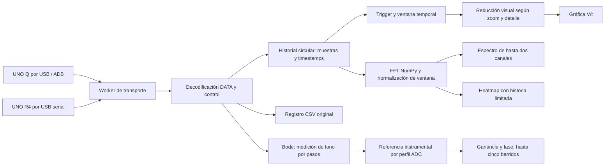
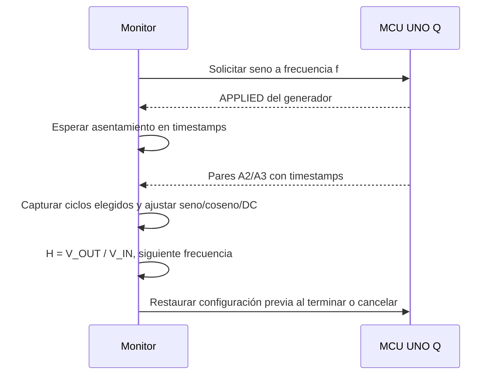

# Monitor Python · funcionamiento técnico

[Proyecto](../README.md) · [Uso de V10](../monitor/v10/README.md)

## Flujo de datos

La interfaz y sus temporizadores pertenecen a Qt; la recepción se realiza en el
worker. Los registros incluyen índice, timestamp, ADC_IN y ADC_OUT, convertidos
a V_IN/V_OUT según el perfil confirmado. El CSV conserva muestras originales.
La frecuencia real se deriva de timestamps; FPS describe dibujo, no adquisición.

## Componentes del monitor

| Archivo | Responsabilidad |
|---|---|
| [app.py](../monitor/v10/app.py) | Ventana, recepción, historial, trigger, controles, CSV y generador |
| [spectrum.py](../monitor/v10/spectrum.py) | FFT, heatmap, ejes y escalas estables |
| [bode.py](../monitor/v10/bode.py) | Barrido, asentamiento, ajuste de tono, comparación y restauración |
| [bode_calibration.py](../monitor/v10/bode_calibration.py) | Lectura de referencia y corrección sin extrapolar |
| [transport](../transport/) | Protocolos, decodificadores y conexión |

## Bode y calibración

El ajuste usa las dos entradas adquiridas y sus tiempos. La salida nula es
válida: ganancia −∞ dB y fase indeterminada. Una referencia A2 inválida impide
formar el cociente. La fase también puede quedar indeterminada por incertidumbre.
Las curvas tienen marcadores y relleno translúcido, sin modificar resultados.

La calibración resta ganancia en dB y fase de la referencia medida conectando
A0 a ambas entradas. Interpola en log(f), sólo dentro de su rango y con los
mismos bits/tasa. Los datos internos permanecen originales; la corrección es
visual. Cada curva añadida conserva el perfil con el que fue adquirida.

## FFT, heatmap y dibujo

FFT unilateral con amplitud pico normalizada por ganancia coherente de la
ventana; DC y Nyquist no se duplican. Se puede mostrar dBV o voltios pico.
El heatmap limita historia y trabajo por cuadro; las discontinuidades dejan
huecos. FFT puede enlazar escalas y usa margen e histéresis para evitar saltos.
El relleno llega al límite inferior de amplitud en dBV o a cero en voltios.

[Opciones y criterios completos](FFT_V10.md) ·
[Pruebas](../tests/) · [Evidencia de Bode](../diagnosticos/BODE_V10.md)
