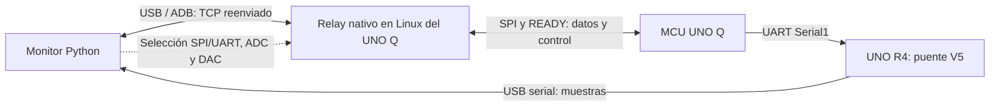

# Transporte · relay Linux y protocolos

[Arquitectura completa del sistema](ARQUITECTURA.md)

[Proyecto](../README.md) · [Monitor](MONITOR_TECNICO.md) · [MCU](UNO_Q_TECNICO.md)



En SPI, el relay recibe muestras del MCU y las transmite al monitor. En UART,
las muestras llegan por R4; el Q continúa conectado para controlar adquisición,
generador y destino. El relay admite un solo cliente PC: desconectar el monitor
antes de ejecutar diagnósticos que necesitan el mismo enlace.

El pequeño [main.py de App Lab](../arduino/v12_audio/oscilloscope/python/main.py)
mantiene viva la aplicación; el relay de datos es un proceso nativo separado.
[tools/usb_stream.py](../tools/usb_stream.py) administra su compilación y estado;
[tools/unoq.py](../tools/unoq.py) administra las apps y firmware.

## Implementación de adquisición y control

El relay del MPU está en `arduino/v12_audio/relay/unoq_config_stream.c`;
se compila para Linux ARM y corre en un contenedor independiente. No es
el sketch MCU ni el pequeño Python de App Lab. Valida CRC, secuencias y
estado de adquisición; transmite muestras y canaliza comandos ADC/DAC.
El PC usa el receptor propio de `monitor/v15/receiver/`.

SPI funciona a 32 MHz con SCP1 V3: 992 bytes por trama, 113 pares de
muestras por fragmento y 19 fragmentos por nodo de 2048 pares. TCP escucha
en 8766; USB/ADB reenvía esa conexión, sin depender de Wi-Fi. UART conserva
su formato DATA de 512 pares y su máximo de 31,25 kHz; la validación física
del puente R4 sigue pendiente para esta pareja.

La sección siguiente conserva detalles del formato UART y del contrato
anterior V2/512; no usar sus offsets CRC para las tramas SPI V3/992.

## Contrato binario

Cada paquete DATA tiene cabecera de siete bytes y `count` registros de ocho
bytes: timestamp uint32 y dos ADC uint16. Bajar resolución no estrecha el
registro. El receptor acumula lecturas parciales; un read USB no equivale a un
paquete. Índices y timestamps permiten comprobar continuidad y cambios de época.

Los comandos de transporte, adquisición y generador tienen identificadores y
respuestas ACCEPTED/APPLIED/REJECTED. El monitor refleja el estado aplicado y
espera la confirmación correspondiente antes de iniciar la medición de Bode.

[Selección de salida](CONTROL_TRANSPORTE.md) ·
[Contrato de cambio](PROTOCOLO_CAMBIO_TRANSPORTE.md) ·
[Adquisición configurable](CONFIGURACION_ADQUISICION.md) ·
[Relay actual](../arduino/v12_audio/relay) · [Puente R4](../arduino/historico/v5/r4_bridge_v5/README.md)

## Linux: GPIO READY y transferencia SPI

El relay abre el dispositivo SPI con acceso exclusivo y registra eventos GPIO
READY mediante la API GPIO v2. Para la primera trama admite READY ya alto,
espera el asentamiento inicial y verifica el nivel; después requiere un evento
nuevo posterior a la transferencia anterior. Esto evita consumir eventos viejos
como autorización de una nueva lectura.

Cada crédito READY habilita un `SPI_IOC_MESSAGE` de 992 bytes: Linux actúa como
master y SPI3 del MCU como slave. La misma transferencia recibe muestras/respuestas
y envía un comando pendiente o una consulta de mantenimiento. No hay una ISR C
del relay en espacio de usuario: el kernel entrega eventos GPIO y realiza SPI;
las IRQ de los DMA del MCU pertenecen al sketch/driver Zephyr.

El TCP reenviado por ADB es un flujo de bytes, por eso los receptores acumulan
lecturas parciales hasta completar tramas. La validación comprueba CRC, secuencia,
perfil y continuidad; una conexión abierta por sí sola no confirma que haya
muestras. El monitor prueba recepción y puede recuperar app/relay cuando recibe
EOF o no hay respuesta. El relay admite un único cliente; otros ensayos deben
liberar primero la conexión del monitor.

[Relay C y bucle de intercambio](../arduino/v12_audio/relay/unoq_config_stream.c) ·
[Validadores](../arduino/v12_audio/relay/config_relay_protocol.h) ·
[Conexión y recuperación Python](../monitor/v15/receiver/unoq_autoload.py).

## Operación

```sh
python3 tools/unoq.py status --version v12_audio
python3 tools/usb_stream.py status --firmware v12_audio
python3 tools/usb_stream.py logs --firmware v12_audio
python3 tools/usb_stream.py start --firmware v12_audio
```

Para actualizar, cerrar el monitor y detener el relay antes de cargar firmware.
Usar la [guía del firmware de audio](../arduino/v12_audio/README.md) para compilar, importar
la app y desplegarla. No confundir la app de App Lab con el proceso relay.

## Audio por el mismo enlace

Python lee WAV, selecciona L/R/Mix y remuestrea con filtro antialias a la tasa
negociada. Convierte a códigos de 12 bits ajustados a amplitud y offset; envía
bloques por USB/ADB al relay MPU, que valida CRC y los pasa por SPI al MCU.
El MCU mantiene una cola de bloques y TIM6/GPDMA4 alimentan A0. Los créditos
confirmados limitan el envío. A2/A3 siguen adquiriendo con sus DMA independientes.
El audio vuelve a las entradas mediante el cableado o circuito externo.

## Versiones y enlaces

- [Relay V12 Audio](../arduino/v12_audio/README.md): incluye control y bloques WAV.
- [Relay V11 P992](../arduino/historico/v11_p992/README.md): adquisición y generador sin WAV.
