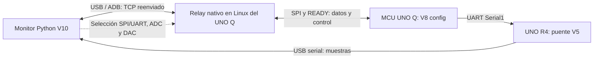

# Transporte · relay Linux y protocolos

[Proyecto](../README.md) · [Monitor](MONITOR_TECNICO.md) · [MCU](UNO_Q_TECNICO.md)



En SPI, el relay recibe muestras del MCU y las transmite al monitor. En UART,
las muestras llegan por R4; el Q continúa conectado para controlar adquisición,
generador y destino. El relay admite un solo cliente PC: desconectar el monitor
antes de ejecutar diagnósticos que necesitan el mismo enlace.

El pequeño [main.py de App Lab](../arduino/v8_config/oscilloscope/python/main.py)
mantiene viva la aplicación; el relay de datos es un proceso nativo separado.
[tools/usb_stream.py](../tools/usb_stream.py) administra su compilación y estado;
[tools/unoq.py](../tools/unoq.py) administra las apps y firmware.

## Contrato binario

Cada paquete DATA tiene cabecera de siete bytes y `count` registros de ocho
bytes: timestamp uint32 y dos ADC uint16. Bajar resolución no estrecha el
registro. El receptor acumula lecturas parciales; un read USB no equivale a un
paquete. Índices y timestamps permiten comprobar continuidad y cambios de época.

Los comandos de transporte, adquisición y generador tienen identificadores y
respuestas ACCEPTED/APPLIED/REJECTED. El monitor refleja el estado aplicado y
espera la confirmación correspondiente antes de iniciar la medición de Bode.

[Selección de salida](CONTROL_TRANSPORTE.md) ·
[Contrato de cambio](PROTOCOLO_CAMBIO_TRANSPORTE.md) ·
[Adquisición configurable](CONFIGURACION_ADQUISICION.md) ·
[Fuentes de transporte](../transport/) · [Puente R4](../arduino/historico/v5/r4_bridge_v5/README.md)

## Operación

```sh
python3 tools/unoq.py status
python3 tools/usb_stream.py status
python3 tools/usb_stream.py logs
python3 tools/usb_stream.py start
```

Para actualizar, cerrar el monitor y detener el relay antes de cargar firmware.
Usar la [guía V8 config](../arduino/v8_config/README.md) para compilar, importar
la app y desplegarla. No confundir la app de App Lab con el proceso relay.
