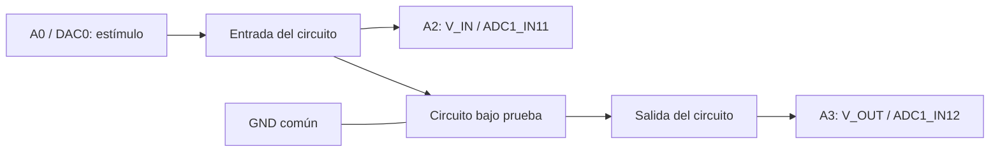
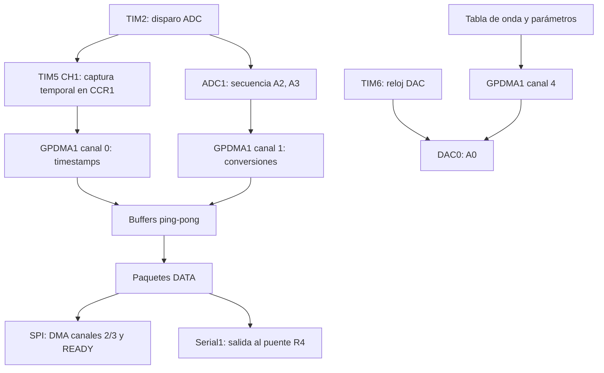

# Arduino UNO Q · MCU, DMA y circuito

[Proyecto](../README.md) · [Firmware V11 P992](../arduino/v11_p992/README.md)

## MCU y MPU en la pareja actual

El UNO Q contiene dos procesadores. El MCU STM32U585 ejecuta el sketch
Zephyr: adquiere A2/A3, captura timestamps por hardware, controla DMA y
genera la salida DAC de A0. El MPU ejecuta Linux y App Lab; aloja el
relay nativo que intercambia tramas SPI con el MCU y las entrega al PC
por TCP reenviado mediante USB/ADB. El monitor Python se ejecuta en el PC.

La pareja V11 P992/V12 usa SCP1 V3 de 992 bytes. El ADC pasó de 40 a
50 MHz mediante PLL2 para todos los perfiles; admite 16 bits por
oversampling ×16 hasta 62,5 kHz. El kernel de reloj es compartido con DAC: el
cambio requiere verificar también su configuración y generación de señal.
HFSEL del DAC se mantiene en01 porque HCLK permanece160MHz. PLL2 se
prepara antes del generador; al cambiar resolución/tasa se verifica el
reloj compartido y no se conmuta mientras el DAC funciona.
Los ensayos anteriores a este cambio describen el reloj anterior.

## Cableado de medición

Para calibrar, quitar el circuito de la medición y conectar **A0 directamente
a A2 y A3**. La masa es común. La referencia compara ambos canales, no mide
exactitud absoluta del DAC. Pines MCU: A0=PA4, A2=PA6, A3=PA7.

## Adquisición y generación por hardware

TIM2/TIM5 conservan una base de 1 MHz; tasas válidas corresponden a períodos
enteros en microsegundos. El timestamp procede de captura CCR1, evitando el
jitter de leer CNT por DMA. ADC y timestamps usan dos nodos de 2048 pares.
El motor DAC tiene temporizador y DMA independientes de adquisición.

## Fuentes y responsabilidades

| Archivo | Función |
|---|---|
| [sketch.ino](../arduino/v11_p992/oscilloscope/sketch/sketch.ino) | Inicio, servicio de comandos y envío |
| [scope_config.h](../arduino/v11_p992/oscilloscope/sketch/scope_config.h) | Pines, relojes, recursos y tamaños |
| [acquisition.h](../arduino/v11_p992/oscilloscope/sketch/acquisition.h) | ADC, timers, DMA y continuidad |
| [generator.h](../arduino/v11_p992/oscilloscope/sketch/generator.h) | Formas de onda y cambios de generador |
| [generator_dma.h](../arduino/v11_p992/oscilloscope/sketch/generator_dma.h) | Motor DAC temporizado |
| [control_protocol.h](../arduino/v11_p992/oscilloscope/sketch/control_protocol.h) | Selección SPI/UART |
| [acquisition_protocol.h](../arduino/v11_p992/oscilloscope/sketch/acquisition_protocol.h) | Configuración ADC |
| [generator_protocol.h](../arduino/v11_p992/oscilloscope/sketch/generator_protocol.h) | Comandos del generador |

## Perfiles y transiciones

8/10/12/14 bits nativos; 16 bits mediante 16 conversiones de 14 bits y
desplazamiento de dos bits. SPI llega a 125 kHz, o 62,5 kHz con oversampling;
UART llega a 31,25 kHz. Ventanas más cortas cambian el tiempo de carga del ADC.

Cambiar bits/tasa reinicia adquisición con una época nueva; el monitor cierra
el CSV anterior. Cambiar transporte o generador conserva la época. El protocolo
confirma aceptación, aplicación o rechazo antes de dar el cambio por efectivo.

[Tabla ADC y ventanas](CONFIGURACION_ADQUISICION.md) ·
[Motor DAC y límites](GENERADOR_PASO4.md) ·
[Protocolos y relay](TRANSPORTE_TECNICO.md) ·
[Validación de generación](../diagnosticos/GENERADOR_AUDIO_V10.md)
