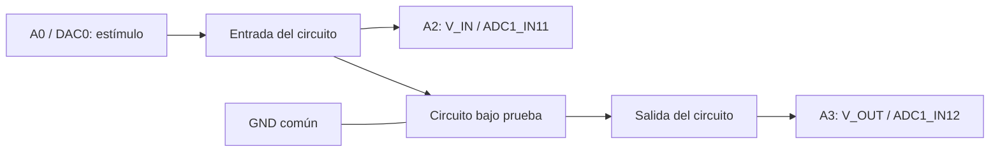
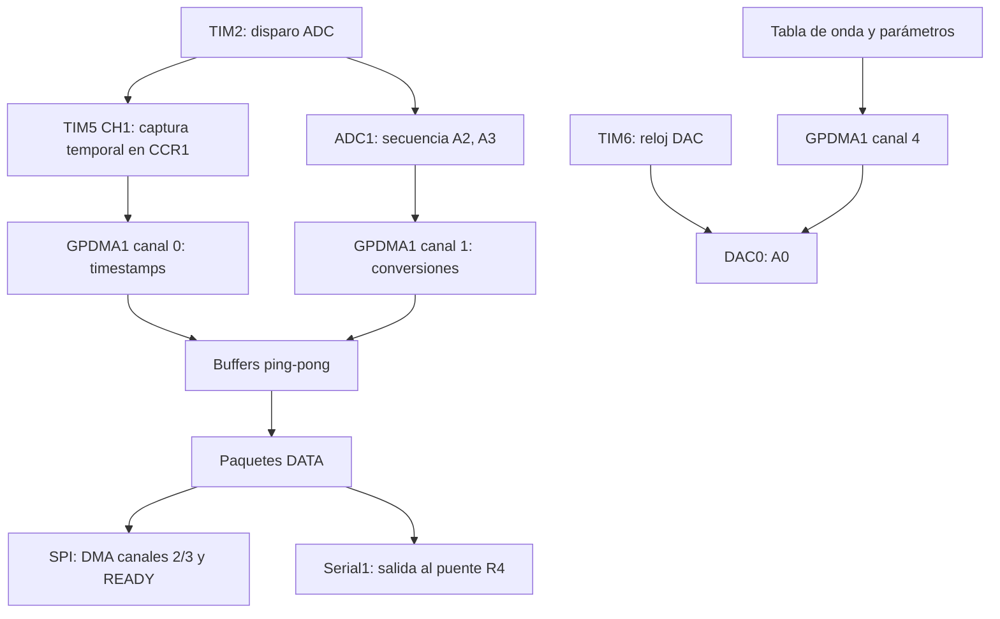

# Arduino UNO Q · MCU, DMA y circuito

[Proyecto](../README.md) · [Firmware de audio](../arduino/v12_audio/README.md)

## MCU y MPU en la pareja actual

El UNO Q contiene dos procesadores. El MCU STM32U585 ejecuta el sketch
Zephyr: adquiere A2/A3, captura timestamps por hardware, controla DMA y
genera la salida DAC de A0. El MPU ejecuta Linux y App Lab; aloja el
relay nativo que intercambia tramas SPI con el MCU y las entrega al PC
por TCP reenviado mediante USB/ADB. El monitor Python se ejecuta en el PC.

El conjunto V13/V12 Audio y la pareja anterior V12/V11 P992 usan SCP1 V3 de 992 bytes. El ADC pasó de 40 a
50 MHz mediante PLL2 para todos los perfiles; admite 16 bits por
oversampling ×16 hasta 62,5 kHz. El kernel de reloj es compartido con DAC: el
cambio requiere verificar también su configuración y generación de señal.
HFSEL del DAC se mantiene en01 porque HCLK permanece160MHz. PLL2 se
prepara antes del generador; al cambiar resolución/tasa se verifica el
reloj compartido y no se conmuta mientras el DAC funciona.
Los ensayos anteriores a este cambio describen el reloj anterior.

## Cableado de medición

Para calibrar, quitar el circuito de la medición y conectar **A0 directamente
a A2 y A3**. La masa es común. La referencia compara ambos canales, no mide
exactitud absoluta del DAC. Pines MCU: A0=PA4, A2=PA6, A3=PA7.

## Adquisición y generación por hardware

TIM2/TIM5 conservan una base de 1 MHz; tasas válidas corresponden a períodos
enteros en microsegundos. El timestamp procede de captura CCR1, evitando el
jitter de leer CNT por DMA. ADC y timestamps usan dos nodos de 2048 pares.
El motor DAC tiene temporizador y DMA independientes de adquisición.

## Temporizadores, DMA e interrupciones

| Recurso | Trabajo concreto |
|---|---|
| TIM2 | TRGO inicia una secuencia ADC A2/A3 por período de muestreo |
| TIM5 CH1 | Captura el instante del disparo en CCR1, con contador de 1 MHz |
| TIM6 | TRGO alimenta el DAC al ritmo de tabla de onda o audio |
| GPDMA1 canal 0 | Lleva CCR1 a la memoria de timestamps |
| GPDMA1 canal 1 | Lleva conversiones ADC a la memoria de ambos canales |
| GPDMA1 canal 2 | Transmisión SPI3 del MCU al MPU |
| GPDMA1 canal 3 | Recepción SPI3 de comandos y bloques enviados por el MPU |
| GPDMA1 canal 4 | Lleva tabla de onda o bloques WAV al registro del DAC |

### ADC: sincronización y propiedad de memoria

Los DMA de ADC y timestamps recorren dos nodos enlazados en ping-pong.
El hilo comprueba flags de fin de transferencia y que ambos DMA hayan avanzado
al nodo esperado antes de publicar los datos. No hay una interrupción de
aplicación por conversión ni una ISR propia de adquisición. Un flag TC aislado
no demuestra que el bloque siga disponible: se verifica también la posición
del DMA y se detiene ante sobreescritura, overrun ADC o captura temporal perdida.
Los nodos publicados se encolan para el transporte sin insertar texto de debug
en el flujo binario. [Implementación](../arduino/v12_audio/oscilloscope/sketch/acquisition.h).

### SPI: IRQ de fin/error y semáforo

El driver DMA de Zephyr atiende los canales 2/3 y llama a `dma_done` por bloque.
El callback registra fin/error de cada dirección y libera `transfer_done` cuando
ambas terminaron o hubo un fallo. El hilo espera ese semáforo y controla plazos;
DMA mueve los bytes. El sketch evita reemplazar las ISR compartidas del core.
READY indica al MPU que la siguiente transferencia está preparada; se retira
al completar la operación. [Servicio SPI](../arduino/v12_audio/oscilloscope/sketch/sketch.ino).

### DAC: tabla periódica y bloques WAV

El generador usa una tabla en RAM, DMA4 circular y TIM6; cambiar frecuencia
ajusta prescaler/recarga del timer. Un `k_timer` de supervisión a 2 kHz controla
la progresión de Sweep/Chirp, duración de Pulso y errores; no genera cada
muestra del DAC. Los cambios de memoria/parámetros se protegen con secciones
críticas, y DMA se detiene antes de reutilizar la tabla.

WAV reutiliza TIM6/DMA4 con 16 bloques de hasta 480 muestras. La supervisión
comprueba dirección fuente y bytes restantes para reconocer el bloque actual
y liberar créditos; no deduce avance únicamente de TC. Descriptores neutrales
impiden volver a reproducir datos antiguos si faltan muestras. Al finalizar o
fallar se detiene el DAC y se informa el estado al PC.
[Motor de ondas](../arduino/v12_audio/oscilloscope/sketch/generator_dma.h) ·
[Motor WAV](../arduino/v12_audio/oscilloscope/sketch/wav_dma.h) ·
[Cola y supervisión](../arduino/v12_audio/oscilloscope/sketch/wav.h).

## Fuentes y responsabilidades

| Archivo | Función |
|---|---|
| [sketch.ino](../arduino/v12_audio/oscilloscope/sketch/sketch.ino) | Inicio, servicio de comandos y envío |
| [scope_config.h](../arduino/v12_audio/oscilloscope/sketch/scope_config.h) | Pines, relojes, recursos y tamaños |
| [acquisition.h](../arduino/v12_audio/oscilloscope/sketch/acquisition.h) | ADC, timers, DMA y continuidad |
| [generator.h](../arduino/v12_audio/oscilloscope/sketch/generator.h) | Formas de onda y cambios de generador |
| [generator_dma.h](../arduino/v12_audio/oscilloscope/sketch/generator_dma.h) | Motor DAC temporizado |
| [control_protocol.h](../arduino/v12_audio/oscilloscope/sketch/control_protocol.h) | Selección SPI/UART |
| [acquisition_protocol.h](../arduino/v12_audio/oscilloscope/sketch/acquisition_protocol.h) | Configuración ADC |
| [generator_protocol.h](../arduino/v12_audio/oscilloscope/sketch/generator_protocol.h) | Comandos del generador |

## Perfiles y transiciones

8/10/12/14 bits nativos; 16 bits mediante 16 conversiones de 14 bits y
desplazamiento de dos bits. SPI llega a 125 kHz, o 62,5 kHz con oversampling;
UART llega a 31,25 kHz. Ventanas más cortas cambian el tiempo de carga del ADC.

Cambiar bits/tasa reinicia adquisición con una época nueva; el monitor cierra
el CSV anterior. Cambiar transporte o generador conserva la época. El protocolo
confirma aceptación, aplicación o rechazo antes de dar el cambio por efectivo.

[Tabla ADC y ventanas](CONFIGURACION_ADQUISICION.md) ·
[Motor DAC y límites](GENERADOR_PASO4.md) ·
[Protocolos y relay](TRANSPORTE_TECNICO.md) ·
[Validación de generación](../diagnosticos/GENERADOR_AUDIO_V10.md)
