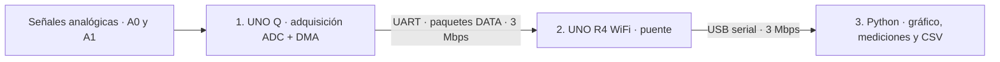
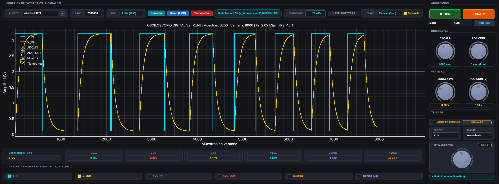

# Osciloscopio UNO Q + R4 · Serial Python Monitor

**V10: adquisición configurable.** El [panel desplegable](../../monitor/historico/v10/README.md) permite elegir Q de control, ADC de 8/10/12/14 bits, tasas de 1 a 31,25 kHz en UART y hasta 62,5 kHz en SPI, y salida SPI o UART con selección del R4. La vista principal muestra la configuración confirmada. Abrir con `python monitor/historico/v10/app.py`; requiere la app independiente [V8 config](../../arduino/historico/v8_config/README.md). [Pruebas físicas](../../diagnosticos/ADQUISICION_V10.md).

La descripción siguiente conserva la arquitectura UART de V5/V7 como referencia.


Sistema de adquisición y visualización de señales de **dos canales**, formado
por un **Arduino UNO Q que toma las muestras**, un **UNO R4 WiFi que las
transporta** y un **receptor Python que las dibuja, mide y guarda**.

El conjunto V5/V7 fue probado a **31,25 kHz por canal**, con ADC de **14 bits**
y una muestra de cada canal cada **32 µs**. Los enlaces Q–R4 y R4–PC trabajan
a **3.000.000 baudios**.



## 1. Emisor: Arduino UNO Q

El UNO Q se encarga de la adquisición. Su microcontrolador STM32U585 toma las
señales de **A0 (V_IN)** y **A1 (V_OUT)** con resolución de 14 bits. Cada disparo
del temporizador inicia una secuencia de conversión de los dos canales; las
conversiones se realizan una después de la otra.

- **Muestreo por hardware:** TIM2 dispara la adquisición cada 32 µs en V5.
- **DMA y doble buffer:** las conversiones se guardan en memoria mientras el
  programa transmite el bloque anterior.
- **Timestamps de hardware:** otro canal DMA captura el contador TIM5 en
  microsegundos en cada disparo, para conservar el tiempo de adquisición.
- **Paquetes binarios:** cada paquete DATA contiene 512 pares de muestras.
- **Transmisión separada:** un hilo envía los paquetes al R4. En V5 utiliza
  polling directo de UART a 3 Mbps; la adquisición continúa por hardware.

El sketch también conmuta **A2 cada 200 ms** como salida digital de prueba.
La app del Q contiene el sketch y un programa Python auxiliar de App Lab;
**el muestreo lo realiza el microcontrolador**, no ese programa Python.

Código: [emisor Q V5](../../arduino/historico/v5/oscilloscope/sketch/sketch.ino) ·
[configuración de muestreo y enlace](../../arduino/historico/v5/oscilloscope/sketch/scope_config.h) ·
[guía de firmware y despliegue](../../arduino/README.md).

## 2. Puente: Arduino UNO R4 WiFi

El R4 une el emisor con la computadora. Recibe por **Serial1 (RX en D0)** los
bytes enviados por el Q y los reenvía hacia el enlace USB del R4 WiFi.
Conserva los paquetes tal como llegan, incluidos los timestamps y valores ADC.

- Recepción UART a **3 Mbps** mediante una rutina de interrupción propia.
- Cola de **8 KiB** para absorber diferencias momentáneas entre recepción y envío.
- Transmisión hacia el ESP32/USB consultando la disponibilidad del registro TX,
  evitando una interrupción adicional por cada byte enviado.
- LED de diagnóstico ante desborde de la cola o fallo al instalar la ruta RX.

La computadora debe abrir **el puerto USB del R4** para recibir las muestras.
El USB del Q se utiliza para trabajar con App Lab, compilar y cargar su aplicación.

Código: [puente R4 V5](../../arduino/historico/v5/r4_bridge_v5/r4_bridge_v5.ino) ·
[configuración y compilación del puente](../../arduino/historico/v5/r4_bridge_v5/README.md).

## 3. Receptor: Python / SerialMonitor

La aplicación de escritorio está desarrollada con **Python, PyQt5, PyQtGraph
y NumPy**. Un hilo recibe y decodifica los paquetes binarios; la interfaz
presenta los canales como un osciloscopio y permite guardar las muestras.



*Imagen de referencia del proyecto; la apariencia puede variar entre versiones.*

### Visualización y controles

- Dos trazas, selección de canales y escalas horizontal y vertical.
- Ventana de **50 a 50.000 muestras** y eje en muestras o microsegundos.
- Desplazamiento continuo, consulta del historial y controles **RUN/STOP**.
- Representación **Escalón (Step/ZOH)** o **Línea (Linear)**, con corte de huecos.
- En V7, estilos **Rápido**, **Intenso** y **Suave** para ajustar la visibilidad.
- Trigger **Auto/Normal**, flancos ascendente/descendente, nivel al **50 %**
  y captura única **SINGLE**.

### Mediciones y capturas

El canal seleccionado muestra **máximo, mínimo, pico a pico, RMS, media y
estimación de frecuencia**. La frecuencia de muestreo y el período entre muestras
se calculan a partir de los timestamps recibidos.

**RECORD / STOP REC** guarda CSV con parada automática a los 30 segundos:

```text
Muestra,Tiempo_us,ADC_IN,V_IN,ADC_OUT,V_OUT
```

V7 guarda en `capturas/experimental_v7/`. La reducción de puntos para dibujar
conserva extremos y cortes; las mediciones y el CSV usan las muestras completas.
El **modo Demo** permite explorar los controles sin conectar las placas.

Código: [receptor V7](../../monitor/historico/v7/app.py) ·
[guía completa del monitor](../../monitor/README.md).

## Puesta en marcha

Con los firmwares **Q V5 y R4 V5** cargados, desde la raíz del repositorio:

```sh
python -m pip install -r requirements.txt
python monitor/v7/app.py
```

1. Seleccionar el puerto del **UNO R4 WiFi** y **3.000.000 baudios**.
2. Pulsar **Conectar**; la indicación de muestreo debe quedar cerca de **31,25 kS/s**.
3. Ajustar escalas y trigger, o usar RUN/STOP y SINGLE para observar una captura.
4. Pulsar RECORD para guardar los datos. Sin hardware, usar **Demo (2 CH)**.

Abrir el monitor no carga firmware en las placas. Para compilar, respaldar o
cambiar de conjunto, seguir la [guía Arduino](../../arduino/README.md).

`python monitor/v6/app.py` abre **V6**, que corresponde al
conjunto estable **V4 a 20 kHz** y usa **2.000.000 baudios** hacia el PC.
Para el conjunto V5 descrito arriba, ejecutar `python monitor/v7/app.py`.

## Versión experimental sin R4

El [monitor V8](../../monitor/historico/v8/README.md) recibe directamente del UNO Q por el
cable USB, con su propia implementación de la interfaz. La recepción, el CSV y la reconexión
fueron probados con datos reales. Usa ADC → SPI → Linux → USB/ADB,
con CRC y continuidad verificados en el PC. Corresponde al **paso uno** del
[Plan de trabajo](../../Plan%20de%20trabajo.md).

```sh
python3 tools/usb_stream.py start  # requiere relay compilado; ver guía V8
python monitor/v8/app.py
```

V4/V5 y los monitores V6/V7 siguen disponibles. La configuración de adquisición
y el generador continúan fijos en esta etapa.
[Pruebas y límites de V8](../../diagnosticos/USB_Q_V8.md).
El [monitor V9](../../monitor/historico/v9/README.md) implementa el **paso dos**: elegir el Q
de control y el destino SPI directo o UART a un R4 seleccionable. El Q conserva
el control en ambos modos. Permite cambiar durante la captura y el CSV.

```sh
python3 tools/usb_stream.py start --firmware v7_dual
python monitor/v9/app.py
```

V9 requiere la app **Scope Output Select V7** y su relay dual. Si estaba
funcionando V8, seguir la transición indicada en la [guía de V9](../../monitor/historico/v9/README.md).
[Validación del monitor y los cambios de salida](../../diagnosticos/MONITOR_V9.md).

## Historia, versiones y validación

Está en desarrollo una [V6 experimental por SPI interno](../../arduino/historico/v6/README.md)
para eliminar el puente R4 y permitir comandos desde Python. El primer paso
es un benchmark bidireccional con datos sintéticos; todavía no reemplaza la
adquisición descrita arriba. Ver [resultados de V6](../../diagnosticos/VALIDACION_V6.md).
La [variante con DMA TX/RX](../../diagnosticos/DMA_SPI_V6.md) alcanzó 814 kB/s
útiles durante dos minutos sin errores en el ensayo sintético.
El [ensayo con IRQ y READY](../../diagnosticos/IRQ_READY_SPI_V6.md) mantuvo 824 kB/s
durante dos minutos sin errores, reemplazando la pausa fija por eventos de bloque listo.

La [etapa ADC + SPI](../../arduino/historico/v6_adc/README.md) incorpora muestras reales y
buffers alternados: 3.745.898 pares en dos minutos sin pérdidas ni errores. Corresponde al **paso uno** de tu [Plan de trabajo](../../Plan%20de%20trabajo.md):
conservar el osciloscopio y conectar Python directamente al Q. La continuación USB y monitor está en [V8](../../monitor/historico/v8/README.md). Ver el
[avance y las pruebas de esta etapa](../../diagnosticos/ADC_SPI_V6.md).

La **[historia del proyecto](../HISTORIA.md)** reúne la evolución desde los
primeros monitores, las versiones de firmware y receptor, el mapa del repositorio,
los comandos de desarrollo y todos los detalles del README principal anterior.
También enlaza el README original y los documentos históricos conservados.

La configuración V5/V7 pasó una prueba física de 30 s sin saltos de timestamp
ni pérdidas de sincronización, además de una grabación de 608.768 muestras en V7.
El [informe de validación](../../diagnosticos/VALIDACION_V5.md) detalla las condiciones,
el rendimiento observado y los límites: todavía falta una prueba prolongada y
una comparación de precisión analógica con una señal conocida.

## Organización de versiones

Cada monitor se ejecuta desde su archivo: `monitor/v6/app.py`,
`monitor/v7/app.py`, `monitor/v8/app.py` o `monitor/v9/app.py`. V8 contiene su propia interfaz;
no depende de V7. El lanzador general fue retirado.

El firmware de V9 está en `arduino/v7_dual/`; V8 conserva `arduino/v6_adc/`; las versiones anteriores están
en [arduino/historico](../../arduino/historico/README.md), incluido el respaldo UART V5.
La [guía de apps de App Lab](../../arduino/APPS_APPLAB.md) explica cuál usar y para qué
sirve cada ensayo. Sus descripciones fueron actualizadas en el Q conservando
los nombres originales.

La [versión experimental V7 dual](../../arduino/historico/v7_dual/README.md) avanza el paso dos:
control permanente del Q y salida seleccionable SPI/UART al R4. Se usa con
[monitor V9](../../monitor/historico/v9/README.md) o con su verificador independiente.
