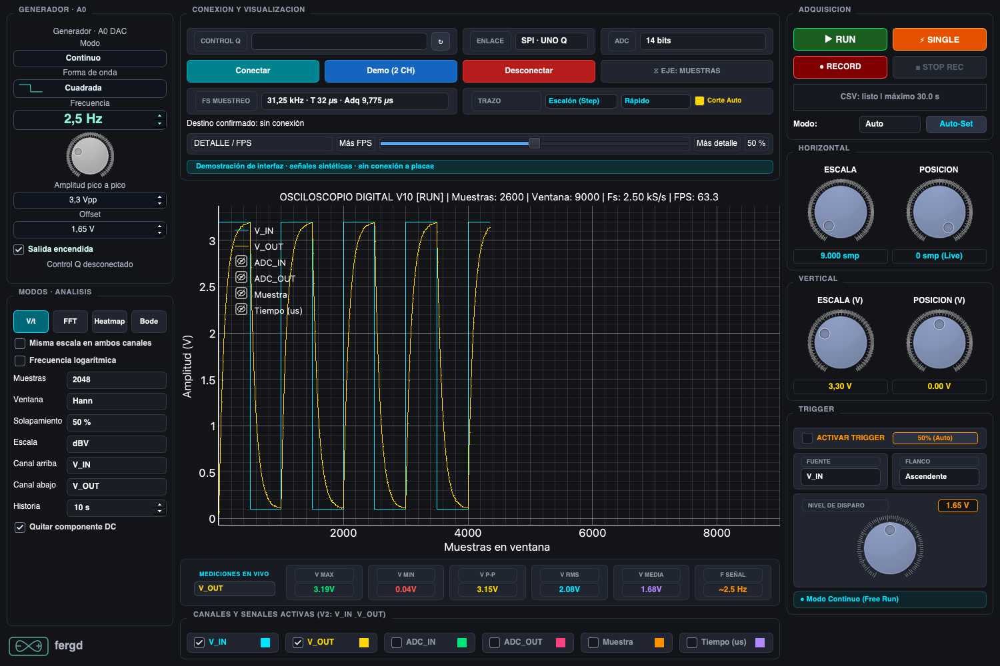

# Monitor V10 · osciloscopio, generador y análisis

Interfaz actual del proyecto: adquisición configurable, generador DAC, FFT,
heatmap y comparación Bode. [Proyecto](../../README.md) ·
[Arquitectura y diagramas](../../docs/MONITOR_TECNICO.md) ·
[Historia completa](../../docs/HISTORIA.md).



## Uso

El Q quedó con **Scope Acquisition Config V8** y el relay configurable activos.
Abrir desde la raíz, o usar **Monitor V10 — adquisición configurable** en VS Code:

```bash
python monitor/v10/app.py
```

Usar los selectores de la pantalla principal para elegir:

- **CONTROL Q:** UNO Q conectado por USB, siempre necesario.
- **BITS ADC:** 8, 10, 12 o 14 bits nativos; 16 bits mediante oversampling ×16.
- **TASA:** una de las frecuencias con período entero de la tabla siguiente.
- **DESTINO:** SPI directo del Q o UART hacia el R4.
- **PUERTO R4:** USB del R4 con puente V5, para salida UART a 3 Mbps.

Elegir y pulsar **Conectar**. Una vez conectado, cambiar bits, tasa, salida
o puerto R4 aplica automáticamente la elección y espera confirmación del Q.
UART espera a que se seleccione un R4 válido.
El resumen muestra la configuración confirmada; los selectores permanecen visibles en la pantalla principal. La resolución ajusta la escala
ADC, voltios y trigger. La frecuencia se sigue calculando de los timestamps.

Los controles de adquisición están en la franja superior; la imagen principal
es una demostración de la interfaz actual.

Cambiar **bits o tasa** termina el CSV actual y empieza una captura nueva:
ADC, DMA y timestamps se reinician de forma controlada. No se unen muestras
anteriores a las de la configuración nueva. Se conserva el estado RUN/STOP;
en STOP se limpia el trazo anterior hasta volver a RUN.
Cambiar **sólo salida** conserva la captura y el CSV, como en V9.

## Tasas habilitadas

TIM2 y TIM5 mantienen la base de 1 MHz y el formato de muestra de 8 bytes.
No se utilizan períodos fraccionarios ni dithering temporal.

| Tasa por canal | Período |
|---|---:|
| 1 kHz | 1000 µs |
| 2 kHz | 500 µs |
| 4 kHz | 250 µs |
| 5 kHz | 200 µs |
| 8 kHz | 125 µs |
| 10 kHz | 100 µs |
| 12,5 kHz | 80 µs |
| 15,625 kHz | 64 µs |
| 20 kHz | 50 µs |
| 25 kHz | 40 µs |
| 31,25 kHz | 32 µs |
| 40 kHz · sólo SPI | 25 µs |
| 50 kHz · sólo SPI | 20 µs |
| 62,5 kHz · sólo SPI | 16 µs |

**UART conserva el máximo de 31,25 kHz**. SPI incorpora perfiles más rápidos,
indicados en el selector como exclusivos de SPI; ver [ensayo de tasas](../../diagnosticos/TASAS_SPI_V10.md).
Elegir UART deshabilita esas tasas y propone 31,25 kHz; el cambio se aplica automáticamente cuando hay un R4 seleccionado. Si estaba activa una tasa SPI alta, esa reducción inicia una captura nueva y cierra el CSV. Cada par sigue ocupando 8 bytes,
incluso con menos bits; bajar resolución no reduce por sí solo el caudal.
UART a 3 Mbps admite el caudal máximo habilitado de 2.504.273 bits/s.
Hasta 40 kHz se conserva la ventana ADC de 391 ciclos (9,775 µs por canal).
50 y 62,5 kHz usan 68 ciclos (1,7 µs): necesitan menor impedancia de fuente
para alcanzar la misma precisión de asentamiento. No cambian DMA ni el formato.
100 kHz falló el ensayo de integridad y no está habilitado.
El modo **16 bits · oversampling ×16** usa el ADC nativo de 14 bits: suma
16 conversiones y desplaza el resultado 2 bits. Permite las tasas ofrecidas hasta
50 kHz en SPI y 31,25 kHz en UART; al seleccionarlo se limita automáticamente
la tasa al máximo del destino. A 1–2 kHz cada subconversión usa 391 ciclos;
4–12,5 kHz usan 68; 15,625–20 kHz, 36; 25–31,25 kHz, 20; 40 kHz, 12;
50 kHz, 5. Las ventanas más cortas requieren menor impedancia de fuente. El rango almacenado sigue siendo uint16 (máximo físico 65532).
El promedio reduce ruido y filtra señales rápidas; no garantiza 16 bits de
precisión analógica. Ver [validación del oversampling](../../diagnosticos/OVERSAMPLING_V10.md).

Los nodos siguen teniendo 2.048 pares. A 1 kHz tardan 2,048 s: la recepción
ajusta su timeout a la duración de los nodos sin confundirse con un corte.

## Inicio del Q después de reiniciarlo

```bash
python3 tools/usb_stream.py start --firmware v8_config
python monitor/v10/app.py
```

Primera instalación en otra placa:

```bash
python3 tools/unoq.py compile --version v8_config
python3 tools/unoq.py create --version v8_config
python3 tools/usb_stream.py build --firmware v8_config
```

Detener el relay y la app anteriores antes de cambiar de firmware. V9 utiliza
**Scope Output Select V7** con `--firmware v7_dual`; V8 utiliza V6 ADC.
Para actualizar una app configurable ya importada: con el relay detenido,
`python3 tools/unoq.py deploy --version v8_config` y después iniciar su relay.
Para otra placa, las herramientas aceptan `UNOQ_SERIAL=IDENTIFICADOR_USB`.

## CSV y validación

Capturas en `capturas/experimental_v10/`. Los nombres incluyen bits y tasa:
`log_FECHA_HORA_8bit_10000Hz_001.csv`. Se conservan las seis columnas de V9.
Una captura no mezcla resoluciones/tasas; puede contener cambios de salida.

[Validación física, Qt y CSV](../../diagnosticos/ADQUISICION_V10.md).
[Contrato de adquisición](../../docs/CONFIGURACION_ADQUISICION.md).

La columna izquierda **GENERADOR · A0**, con selector de ondas dibujadas y dial logarítmico de 0,1 Hz–20 kHz, permite cuadrada, seno, triángulo, rampa, sweep, chirp y pulso. [Uso y límites](../../docs/GENERADOR_PASO4.md).

## Zoom horizontal y render

El rango horizontal va de 50 a **250.000 muestras**: hasta 4 segundos a
62,5 kHz. POSICIÓN permite retroceder hasta 250.000 muestras; el historial
conserva 510.000. La apertura sigue siendo 9.000 muestras.

El dibujo adapta el detalle al ancho del gráfico y al zoom, conserva extremos
y cortes, y recupera las muestras individuales al acercarse. Sólo los vértices
visuales se reducen; mediciones y CSV mantienen las muestras completas.
Las mediciones se actualizan a 10 Hz; el gráfico mantiene su objetivo de 60 FPS.
[Comparación de render y pruebas físicas](../../diagnosticos/RENDER_V10.md).

### Detalle frente a FPS

En **DETALLE / FPS** de la pantalla principal, mover el slider a la izquierda prioriza
fluidez y a la derecha conserva más detalle del trazo. Arranca al 50 %, con
más detalle que la reducción anterior. En **Completo** dibuja todas las muestras
visibles, sin reducción. El ajuste se aplica inmediatamente, también en STOP,
sin mover la captura; no reinicia el ADC.
Mediciones y CSV siguen usando todas las muestras, cualquiera sea el nivel.

### Color de canales

Clic en el cuadradito de cada canal para elegir cian, amarillo, verde, rosa,
naranja o púrpura. Actualiza la traza, su leyenda y el indicador de medición
en vivo o en STOP. La casilla junto al nombre muestra u oculta el canal (también se puede hacer clic en el nombre); el texto queda
atenuado cuando está oculto. Los colores elegidos se mantienen durante la
sesión, incluso al cambiar el estilo del trazo.

Los selectores de Q, bits, tasa, salida SPI/UART y R4 están siempre visibles.
El columna a la izquierda y el botón Aplicar se retiraron. Las elecciones se aplican
automáticamente con confirmación del Q; el slider de detalle es inmediato.

Los controles están integrados en las tarjetas superiores: **CONTROL Q** elige
la placa, **ENLACE** elige SPI/UART y muestra el R4 cuando se usa UART, **ADC**
elige bits y **FS MUESTREO** elige la tasa. No hay otra fila de salida/tasa
duplicada. La tasa medida puede consultarse en el tooltip de FS MUESTREO.

El selector **FS MUESTREO** indica `T` (período entre pares) y `Adq` (ventana
de adquisición por canal y subconversión), para todas las tasas. Los valores
se actualizan según los bits seleccionados. Al pasar sobre una opción aparece
el detalle en ciclos ADC y la relación entre ventana e impedancia de fuente.
En 16 bits la ventana indicada se repite 16 veces por canal; no representa
el tiempo total del par.

## Pines actuales del UNO Q

- **A0 / DAC0 / PA4:** salida DAC de 12 bits. Generador temporizado en MCU
  con TIM6 + GPDMA1 canal 4, rango 0,1 Hz–20 kHz; arranca con cuadrada de 2,5 Hz entre códigos 0 y 4095.
- **A2 / PA6 / ADC1_IN11:** V_IN / ADC_IN, primer canal adquirido.
- **A3 / PA7 / ADC1_IN12:** V_OUT / ADC_OUT, segundo canal adquirido.

Trasladar las señales de medida a A2/A3. Para medir el generador, conectar A0
con A2; la salida del circuito bajo prueba se conecta a A3, con masa común.
La resolución del DAC (12 bits) es independiente de la resolución/oversampling
seleccionados para el ADC. [Uso y límites del generador](../../docs/GENERADOR_PASO4.md).

El generador permite ajustar la frecuencia con el dial: el número cambia al
girarlo y la configuración se aplica al soltarlo. La lectura usa Hz hasta 1000 Hz y luego kHz, sin ceros decimales de relleno.
Las frecuencias fraccionarias conservan su precisión. Al escribir
se aceptan Hz, kHz o un número en Hz; Enter confirma el valor.
Las lecturas de escala horizontal (muestras) y vertical (V) también son
editables y se sincronizan con sus diales.

Modos **V / t**, **FFT** y **Heatmap** disponibles debajo del generador, con
uno o dos canales apilados y opciones de análisis. [Uso y validación](../../docs/FFT_V10.md).

**Bode** inicia un barrido senoidal por pasos con el Q en RUN y grafica
ganancia/fase V_OUT/V_IN. **Frecuencia logarítmica** cambia X en FFT e Y en
Heatmap. [Operación y límites](../../docs/FFT_V10.md#frecuencias-logarítmicas-y-bode).

Bode permite separar **Asentamiento** (ms) y **Ciclos a medir**, y muestra el
tiempo mínimo estimado del barrido más comunicación. Valores iniciales: 200 ms
y tres ciclos; ya no se esperan tres períodos adicionales por punto.

## Bode, relleno y referencia vigente

Agregar conserva hasta cinco barridos; Repetir limpia la comparación. Ganancia
y fase de cada barrido comparten color y relleno tenue bajo la curva. FFT usa
también relleno de área con el color elegido para cada canal.
La referencia vigente se carga al abrir el monitor: ADC 16 bits / 50 kHz,
20 Hz–20 kHz. Corregir con calibración sólo actúa dentro de ese perfil/rango.
[Uso del análisis](../../docs/FFT_V10.md) · [Calibración](../../diagnosticos/BODE_V10.md).
