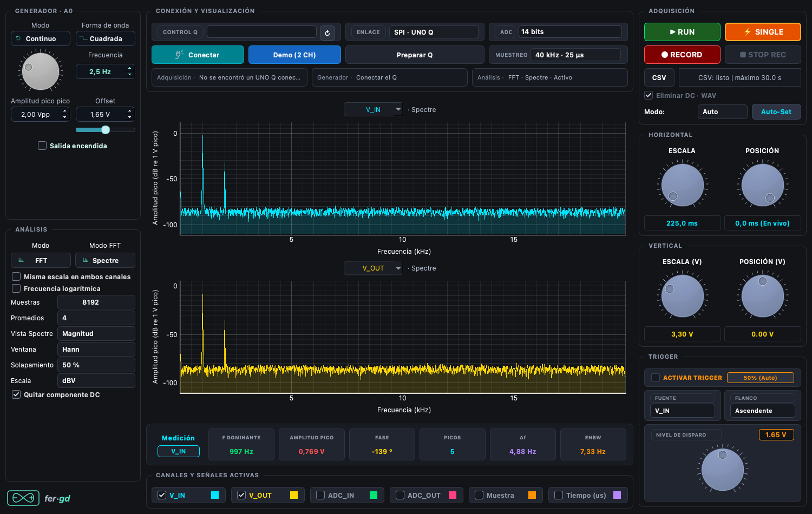

# Monitor de osciloscopio y análisis espectral

Interfaz PyQt6 para dos entradas A2/V_IN y A3/V_OUT, generador A0,
trigger/SINGLE, FFT, heatmap, Bode, grabación/reproducción CSV/WAV y mini sintetizador Synth
polifónico de nueve voces y salida mono, con controles en vivo y entrada MIDI opcional.
Esta variante conserva los protocolos, perfiles ADC y firmware del monitor anterior.

## Inicio

```sh
conda activate Python_3_13_DataScience
python monitor/v15/app.py
```

Para instalar el entorno en otra computadora:

```sh
conda env create -f monitor/v15/environment.yml
```

VS Code incluye tareas y configuraciones de depuración para este monitor.
Conectar utiliza el enlace disponible y comprueba/inicia app y relay cuando hace falta.
Preparar Q instala o actualiza V13 Pulse, con audio y pulsos desde 100 µs,
incluyendo app, firmware MCU y relay. Al iniciar aplicaciones detenidas se prioriza
V13 Pulse; Conectar reutiliza una conexión activa sin cambiar su firmware.
Antes de preparar aparece un aviso: puede tardar varios minutos. El relay se
reutiliza si ya existe el binario correspondiente a las mismas fuentes; solo se
compila cuando falta. La validación y carga del MCU y el respaldo siguen activos.
La variable `MONITOR_V13_WAV_FIRMWARE=v12_audio`
se mantiene por compatibilidad con las herramientas de audio.

## Wav · archivos y grabación

En el generador, Wav reproduce L/R/Mix del archivo por A0, con salida de
40 kHz inicial y opciones 20/40/50 kHz según firmware. Incluye Play/Stop,
flechas para saltar 10 s y amplitud ajustable. Play inicia adquisición y
bloquea cambios ADC; al finalizar queda en silencio.

El selector CSV/WAV del registro graba A2/A3 como WAV estéreo PCM16.
Eliminar DC usa un pasa altos continuo de 5 Hz, independiente por canal.
No resta la media por ventanas ni requiere una entrada centrada en 1,65 V.
Archivos con fecha/hora, duración máxima 30 s; esta implementación guarda
las capturas en `capturas/v14/`. El nombre en pantalla omite bits y tasa,
pero el archivo conserva esos datos.

[Tasas y evidencia física](../../docs/WAV_TASAS.md) ·
[Presentación de Wav y Synth](../../README.md#wav--grabación-y-reproducción).

## Generador Synth

Elegir **Synth** en el generador. En Osc 1, Sonido permite FM, ondas clásicas
y Virtual; Preset carga el instrumento. **DX Piano** es inicial; el nivel de
Synth comienza en 2,5 Vpp y el offset en 1,65 V. Play activa también la
adquisición. El editor ofrece **Osc 1, Osc 2, Osc 3, ADSR, Timbre, Filtros
y Virtual**. ADSR reúne las tres envolventes.

FM tiene parcial, amount y feedback por pareja; mezcla, detune y octava permiten
capas y batimientos. Las ondas clásicas conservan ADSR, MIDI y filtros. Virtual
ofrece **Guitarra** y **Piano Virtual**, con vibración, posición, brillo, caja,
puente y rigidez (solo piano). Brillo del piano y posición afectan el próximo
golpe/pellizco; caja, puente y pérdidas mantienen estado entre bloques.

La salida es mono PCM de 12 bits a **20 kHz por defecto**, o 40 kHz antes
de Play. MIDI admite nueve voces. El protocolo usa bloques de 480 muestras,
créditos y dos envíos Synth en tránsito. La cola mínima es 120 ms a 20 kHz
(y puede crecer) o 192 ms a 40 kHz; no incluye latencia MIDI/USB. A 40 kHz
se observaron cortes físicos: el margen de cálculo local no los descarta.
Numba 0.62.1 prepara y compila feedback, ADSR y modelos físicos antes de Play.
Sin Numba se conservan las ondas/FM sin feedback; Virtual requiere instalarlo.

[Arquitectura actual, modelos, rendimiento y límites](../../docs/SYNTH.md).
Los apartados de evolución más abajo conservan mediciones y ajustes históricos;
la guía actual y la última revisión reemplazan esos valores anteriores.

### MIDI opcional

Las dependencias son `mido==1.3.3` y `python-rtmidi==1.5.8`, incluidas en
`environment.yml`. [API de puertos Mido](https://mido.github.io/mido/ports/index.html).
Pulsar **Actualizar MIDI** y elegir un teclado/puerto IAC o **UNO Q Synth · virtual**;
en este último caso la aplicación musical puede seleccionar la salida MIDI
**UNO Q Synth**. En modo MIDI la salida permanece en silencio hasta recibir notas.
La búsqueda y apertura MIDI se hacen en un proceso Python aislado, iniciado y
cerrado por el monitor; no requieren Swift ni instalación de un driver adicional.
El acceso nativo a CoreMIDI tiene un límite de ocho segundos y no bloquea la
ventana. Los errores se muestran en el estado y el tooltip del selector; pulsar
Actualizar MIDI permite intentar otra vez. Al actualizar se conserva la entrada
seleccionada si continúa disponible. El procesamiento de mensajes tiene límites
por turno y una cola acotada; una saturación cierra la entrada y libera las notas.
La síntesis MIDI admite **nueve voces** con envolventes independientes. Si llegan
más notas, se conservan las nueve últimas; se roba primero una voz liberada,
o la más antigua. Note Off inicia la liberación de cada voz; velocidad controla nivel, CC1 el índice,
CC7 la amplitud y CC120/123 liberan las notas. El indicador «Velocidad» muestra
el valor MIDI (1–127); también cambia el brillo de los presets. Manual
también sigue la relación M/C elegida; los instrumentos mantienen una relación de frecuencia
con la nota y reducen la modulación en registros altos para limitar el ancho de banda.
La suma usa ganancia fija y compresión gradual antes del limitador final;
no se divide el volumen por la cantidad de teclas pulsadas.

### Timbres

El selector incluye Manual, Flauta, Órgano, **DX Piano**, **DX Brillo** y **Campana**. Son aproximaciones sintéticas:
una pareja FM principal (portadora/moduladora), una segunda pareja opcional para
el brillo, envolvente de amplitud y evolución del índice. Flauta tiene ataque suave y sostenido; Órgano añade armónicos sostenidos;
DX Brillo tiene ataque breve y decaimiento de amplitud/brillo incluso con la tecla
mantenida. Note Off inicia la liberación, evitando cortar la onda de golpe.
Se basan en el esquema de [operadores y envolventes explicado por Yamaha](https://usa.yamaha.com/products/contents/music_production/synth_50th/anecdotes/004.html);
los parámetros de estos presets son propios y no reproducen un instrumento comercial.

Los presets usan iconos vectoriales propios: piano acústico y eléctrico, tubos
de órgano, flauta, campana, bajo, brass y símbolos distintos para lead, pad y pluck.
La mezcla utiliza compresión gradual para moderar los acordes fuertes.
Medición histórica (motor anterior): 12 s de DX Piano con seis notas a 20 kHz tomaron aproximadamente
1,29 s de CPU. La estabilidad MIDI→A0 y la cola nueva requieren prueba física.

### Presets sustractivos

| Preset | Sonido inicial |
|---|---|
| Bass Punch | Rampa a 110 Hz, ataque rápido, caída corta y pasa bajos a 650 Hz con drive |
| Lead | Cuadrada sostenida, pasa bajos a 3,2 kHz y liberación breve |
| Brass | Rampa, ataque de 40 ms y pasa bajos a 2,2 kHz |
| Warm Pad | Rampa, ataque y liberación suaves, pasa bajos a 1,5 kHz |
| Pluck | Triángulo, ataque rápido, caída a silencio y pasa bajos a 3,2 kHz |

Son patches propios y editables. La frecuencia inicial se usa sin MIDI; con MIDI
manda la nota tocada. Estos presets cargan pasa bajos; se puede cambiar el tipo
y los diales durante Play. Elegir otro preset vuelve a cargar todos sus valores.

### Segundo oscilador

En **Editar → Osc 2**, elegir Seno, Cuadrada, Triángulo o Rampa, octava −1/0/+1,
**Detune** (−20 a +20 cents) y **Mezcla** (0–100 %). El porcentaje mezcla las dos
señales con suma de pesos igual a uno; 50 % combina ambas por igual, y 0 %
desactiva el cálculo del segundo oscilador. Son nueve notas con dos osciladores
por voz, no dieciséis notas independientes. La fase del segundo es independiente
y el cambio de afinación/mezcla se suaviza durante un bloque. Su frecuencia se
limita al margen de banda del perfil de salida.

Warm Pad combina dos rampas con 10 cents de diferencia; Brass usa 7 cents y
Lead suma rampa a cuadrada con 5 cents. Bass Punch añade cuadrada una octava
abajo (25 %), Pluck añade triángulo con 4 cents (20 %) y Órgano suma seno una
octava abajo. Estos valores se pueden editar mientras suena; los demás presets
arrancan con el segundo oscilador desactivado.

### Filtros digitales

La página **Filtros** ofrece Sin filtro, Pasa bajos, Pasa altos, Pasa banda y
Notch, con icono. Sus cuatro diales son **Corte** (20 Hz–9 kHz), **Resonancia**
(Q 0,5–8), **Drive** (1–8) y **Mezcla** (0–100 %). Funcionan con FM y ondas
simples. Sin filtro deshabilita esos diales y evita procesar la señal.

Es un biquad de segundo orden después de sumar las voces, independiente del
filtro antialias compartido de la mezcla. Los coeficientes se recalculan solo cuando
cambia tipo, corte o Q; los cambios se funden durante 5 ms. Drive aplica una
saturación suave antes del filtro. La mezcla combina la salida filtrada y la
señal original; con resonancia alta puede alcanzar el límite de salida del DAC.
El corte se limita a 0,45 de la tasa de salida. No tiene todavía envolvente de
filtro por voz ni modulación de corte con LFO.

Prueba local a 20 kHz: 12 s de cuatro voces Bass Punch tomaron aproximadamente
0,64 s de CPU sin filtro y 0,67 s con pasa bajos. Este resultado mide costo de
síntesis, no estabilidad física ni retardo MIDI→A0.

### Diales y envolvente

Osc 1 permite ajustar portadora, relación M/C (0,1–8), nivel modulador
(índice 0–20) y amplitud de salida. Envolvente ofrece ataque, caída, sostenido y
liberación (ADSR); los presets cargan estos valores, que luego pueden editarse.
Los diales y sus campos numéricos se sincronizan y actúan durante Play. Las notas
MIDI conservan la relación M/C elegida. Cambiar una envolvente en curso conserva
el nivel actual y reinicia el tiempo de la etapa para evitar índices fuera del bloque.

Es una adaptación básica de relación de frecuencias, nivel y envolvente de los
[operadores Yamaha](https://usa.yamaha.com/files/download/other_assets/9/322009/DX200E.pdf).
A 20 kHz la banda útil es menor que a 40 kHz; el motor limita modulación y
notas muy altas para respetar su margen de banda. Cada voz usa hasta dos parejas FM y ADSR de amplitud; no implementa los
seis operadores, algoritmos ni envolventes por operador de un DX7 completo.
La página **Timbre** permite editar relación y mezcla del brillo, caída de brillo
y sensibilidad a velocidad. DX Piano usa una segunda pareja FM de ataque metálico
combinada con un cuerpo de decaimiento más lento; es un preset propio inspirado
en piano eléctrico FM, sin cargar ni reproducir patches originales Yamaha.

### Latencia Synth

Synth ahora permite **dos bloques en tránsito**: envía el segundo sin esperar
el ACK del primero, reserva sus créditos y valida cada identificador. BEGIN,
PLAY, QUERY y STOP siguen serializados; STOP invalida confirmaciones anteriores.
Los offsets enviados avanzan independientemente del último ACK para evitar
repetir muestras. El WAV de archivo conserva un bloque pendiente como antes.
No requiere un nuevo firmware ni cambiar los bloques de 480 muestras.

A 20 kHz inicia con cinco bloques: **120 ms** de cola frente a los 192 ms del
perfil estable anterior. Recupera margen si el ACK informa cuatro bloques o
menos, hasta 16, y no vuelve a bajar durante esa sesión. A 40 kHz mantiene 16
bloques. La nueva ventana de transporte pasó pruebas locales de créditos,
offsets y STOP; la estabilidad y latencia MIDI→A0 requieren prueba física.

El motor suma las voces a la tasa interna y aplica un único filtro antialias
con estado continuo; evita validar parámetros idénticos en cada bloque. Mezcla voces
en coma flotante y convierte una sola vez a 12 bits, en lugar de convertir cada
voz a códigos DAC y reconvertirla. El filtro desactivado evita asignaciones y
procesamiento extra. MIDI publica una actualización al terminar cada lote de
mensajes, conservando la prioridad y el límite de notas.
MIDI y consultas de crédito Synth siguen cada 4 ms; el socket usa TCP_NODELAY.
El diagnóstico registra objetivo de bloques y audio pendiente en ms; las pausas
tras Stop no cuentan como demoras del transporte activo. Al pasar el mouse por
el selector de tasa se muestra la cola de audio actual del DAC. Ese valor no
es una medición de la latencia total MIDI→A0.
El selector del editor Synth ocupa la columna derecha, al lado de Modo.

### Registro del flujo

Las confirmaciones FM se muestran como máximo a 5 Hz, conservando cambios de
estado inmediatos; el receptor repone audio justo después del ACK, antes de
procesar los lotes ADC. Cada sesión escribe un registro pequeño cada cinco
segundos en `diagnosticos/resultados_fm`, con estado, muestras aceptadas/reproducidas,
créditos libres y máximo intervalo entre confirmaciones. Underrun/falla se registra
inmediatamente. Estas mejoras requieren comprobarse físicamente; no se considera
resuelto un corte intermitente solo por pasar las pruebas locales.

Validado con pruebas numéricas y de interfaz; la estabilidad y latencia del flujo
FM en el Q y la recepción desde un teclado real todavía requieren prueba física.
V14 permanece independiente.

## Selección FFT

Elegir **FFT** en «Modo» y seleccionar a su derecha:

| Análisis | Qué muestra |
|---|---|
| Spectre | Magnitud, fase, picos y frecuencia dominante |
| Power | PSD, piso de ruido, potencia por bandas y SNR |
| Distort | Armónicos, THD, THD+N y SINAD |
| Transfer | Relación V_OUT/V_IN, ganancia y fase, coherencia y retardo de grupo |

El panel inferior «Medición» muestra las estadísticas del análisis elegido.
Su selector permite elegir V_IN o V_OUT, incluso si ese canal no está dibujado.
En Transfer indica OUT / IN y analiza ambas entradas juntas. Los detalles de
picos, armónicos y unidades están en los tooltips; las curvas quedan libres de
textos estadísticos. V(t) recupera sus mediciones y su selección de entrada.

La entrada de cada gráfico se elige en su encabezado, con V_IN, V_OUT o
Ninguno. Estos selectores también están en Heatmap; Transfer y Bode mantienen
la relación fija entre las entradas.

La cantidad de muestras se elige en los ajustes FFT. Heatmap mantiene su
selector de muestras. El análisis completo se conserva aunque el dibujo reduzca
los puntos para ajustarse al ancho de pantalla.



Capturas con datos sintéticos, sin placa:
[Power](../../assets/monitor_fft_power.png) ·
[Distort](../../assets/monitor_fft_distortion.png) ·
[Transfer](../../assets/monitor_fft_transfer.png).

[Definiciones, algoritmos y límites](../../docs/FFT_ANALISIS.md) ·
[Resultados de pruebas y tiempos de FFT conservados](../../diagnosticos/FFT_V14.md).

## Funciones conservadas

ADC 14 bits/40 kHz al iniciar; 16 bits por oversampling hasta 62,5 kHz.
SPI hasta 125 kHz por canal según perfil. Generador inicialmente apagado,
amplitud 2 Vpp y offset 1,65 V. Wav reproduce a 40 kHz por defecto cuando el
firmware instalado lo admite; cambiar el análisis no cambia el perfil del ADC.

Las capturas se guardan en `capturas/v14/`. Assets, receptor y referencias Bode
están en esta carpeta. Las referencias copiadas conservan identidad instrumental,
perfil y método originales; no son una nueva calibración física ni se aplican
automáticamente al modo FFT Transfer.

[Uso de los controles conservados](../v13/README.md) ·
[Arquitectura del monitor](../../docs/MONITOR_TECNICO.md) ·
[Relay y MCU](../../arduino/README.md).

## Verificación

```sh
QT_QPA_PLATFORM=offscreen python -m unittest discover -s tests/v15 -v
```

Las pruebas sintéticas comprueban cálculos y controles; no sustituyen la
validación del instrumento y de su ruido/distorsión con hardware.

## Versiones

- [Monitor V15](app.py): cuatro modos de análisis FFT.
- [Monitor V13](../v13/README.md): referencia conservada.
- [Histórico](../historico/README.md).

El generador usa columnas de igual ancho para Modo/Editar y Sonido/Preset,
con campos numéricos de 28 px de alto y controles que no alteran el ancho por su texto.

Medición histórica del motor anterior con ocho voces DX Piano: 12 s de audio
tomaron 1,43 s de CPU a 20 kHz y 2,88 s a 40 kHz. No mide latencia ni
estabilidad del enlace con el Q.

### Piano eléctrico y organización de osciladores

**Osc 1** permite FM o formas de onda simples; **Osc 2** agrega una forma de
onda independiente con mezcla, octava y desafinación. La segunda pareja FM
del timbre metálico pertenece a Osc 1 y se ajusta en **Timbre**.

DX Piano tiene ahora una caída independiente del ataque metálico: las notas
agudas decaen más rápido y la velocidad MIDI modifica su presencia. El cuerpo
conserva su ADSR. MIDI CC64 sostiene las notas hasta soltar el pedal; CC120/123
y desconectar MIDI limpian las notas y el pedal. Se mantienen nueve voces.

Es un preset propio inspirado en piano FM, no una emulación completa del DX7.
Para acercarlo aún más serían útiles envolventes independientes por operador
y realimentación FM; quedan fuera de esta mejora para mantener el motor ligero.

### ADSR por oscilador

La página **ADSR** reúne Osc 1 y Osc 2 con una curva de referencia para cada
envolvente y cuatro sliders verticales: A (ataque), D (caída), S (sostenido) y
R (liberación). A/D/R se editan en milisegundos; S en porcentaje. Los tiempos
usan una escala logarítmica en el slider para ajustar ataques cortos con precisión.
Los valores debajo permiten edición numérica. La curva muestra las etapas;
su ancho está comprimido para comparar tiempos, no es un eje temporal lineal.

Cada oscilador tiene su propia envolvente de volumen, editable durante Play.
Los presets cargan ambas iguales; Osc 2 solo se escucha si su mezcla es mayor
que cero. El cuerpo FM y el ataque metálico interno de Osc 1 siguen perteneciendo
a ese oscilador; esta página no expone todavía ADSR individuales por operador FM.

### Ajuste de DX Piano

El preset usa cuerpo FM 1:1 con índice 1,6, ataque de 3 ms, caída de 2,8 s,
sostenido cero y liberación de 220 ms. El ataque metálico usa una portadora
a la octava del cuerpo, mezcla del 28 %, caída de brillo de 450 ms y sensibilidad
a velocidad del 80 %. Los golpes suaves tienen menos brillo; las notas graves
conservan más cuerpo. El componente metálico se atenúa en el registro alto
para respetar el margen de banda a 20 kHz. Osc 2 queda apagado para no añadir
un tono sostenido al piano. Todos los controles siguen editables.

La mejora se verifica por espectro, continuidad de bloques y costo de CPU;
el parecido musical requiere escucha física, no está validado como emulación DX7.

El nivel inicial de Synth es **2,5 Vpp** (antes 2 Vpp), compartido por todos
los presets. Se conserva el nivel común a todos los presets; el dial Amplitud
permite ajustar el nivel y MIDI CC7 sigue controlándolo.

La mezcla MIDI de Synth usa ganancia fija de 0,9 sobre la suma de voces,
en lugar de dividirla por ocho. El volumen se aplica antes del limitador, conservando linealmente la señal
entre 0,35 y 2,95 V. Solo en los extremos se suaviza hacia los límites
**0,30 y 3,00 V**, independientemente del dial de volumen. Los acordes fuertes se comprimen;
las notas suaves y las colas siguen siendo más bajas. No se normaliza cada
bloque ni se agregan buffers. Los valores son nominales; requieren medición
física para confirmar tensión real del DAC.

### Nueve voces, pedal y margen de tiempo

La compresión de mezcla opera después del volumen, con umbral de 0,95 V
de excursión, relación 6:1, ataque de 3 ms y recuperación de 150 ms. No usa
lookahead ni agrega buffers. El limitador final conserva los extremos de
0,3–3 V. Los acordes muy fuertes todavía pueden alcanzar ese limitador.

El pedal conserva hasta nueve notas; se reciclan primero notas sostenidas
por pedal y se priorizan las teclas pulsadas. Las voces que terminan su caída
a sostenido cero dejan de calcularse aunque siga pisado CC64; no se recrean
hasta un nuevo disparo. Un timbre con sostenido distinto de cero sigue sonando
con pedal, como corresponde, pero no acumula más de nueve voces.

A 40 kHz se sintetiza con sobremuestreo 2× en lugar de 4×, conservando el
filtro antialias y el límite de banda de 0,4 Fs. A 20 kHz se mantiene 4×.
Se conservan las colas de 5 bloques a 20 kHz y 16 a 40 kHz, con crecimiento
adaptativo; bajarlas necesita ensayo físico porque antes hubo underruns.
El diagnóstico registra ahora `max_render_ms` y `slow_render_blocks`, para
distinguir síntesis lenta de demoras de transporte. La estabilidad a 40 kHz
y la latencia MIDI→DAC siguen requiriendo prueba en el Q.

Prueba local con nueve voces DX Piano sostenidas durante 3 s (envolvente
forzada a sostenido 100 %): 0,54 s de CPU a 20 kHz y 0,85 s a 40 kHz.
El máximo bloque a 40 kHz fue 4,14 ms frente a sus 12 ms de audio; a 20 kHz
hubo un bloque de 30,62 ms, por encima de 24 ms, por lo que el ensayo no
garantiza ausencia de pausas. Estos resultados no incluyen USB, relay ni DAC.

Diagnósticos físicos posteriores registraron underruns a 40 kHz, con bloques
de render de hasta 22 ms frente a 12 ms disponibles. Se optimizaron las rampas
constantes, las fases estacionarias y los factores de registro; Osc 2 apagado
no calcula su envolvente. Prueba local equivalente de nueve voces sostenidas:
3 s de audio a 40 kHz pasaron de 0,85 a 0,59 s de CPU (aproximadamente 31 %
menos), con máximo de bloque de 3,04 ms. No demuestra estabilidad del flujo
real: requiere una nueva sesión física y revisar los diagnósticos.

DX Piano es el preset inicial de Synth. Su ADSR toma La4 (440 Hz) como
referencia: las notas graves decaen y se liberan más despacio y las agudas
más rápido, con una pequeña respuesta de caída a velocidad. El componente
metálico tiene entrada exponencial de 3 ms para suavizar el inicio. Los tiempos
del editor son los valores de referencia; no cambian al tocar otra nota.

### DX Piano con tres operadores

El preset del panel usa una portadora y dos moduladores paralelos: cuerpo
 y brillo metálico. La página **ADSR** controla sus envolventes desde Osc 1;
**Timbre** conserva relación, mezcla, velocidad y caída adicional del brillo.
Otros presets mantienen su arquitectura anterior. Es un preset propio,
no una emulación exacta del Yamaha DX7.

### Panel único de envolventes

Se elimina la página FM ADSR. **ADSR** contiene solo Osc 1 y Osc 2,
independientemente de su forma de onda. En el piano FM de tres operadores,
la envolvente de Osc 1 controla volumen y evolución de ambos moduladores;
Timbre conserva los ajustes de brillo y su caída adicional. En ondas
sustractivas controla el volumen. Osc 2 conserva su propia envolvente.

### Dos pianos eléctricos

Se retira el preset Piano anterior. **DX Piano** sigue como instrumento inicial,
con cuerpo cálido (índice 1,6), caída larga y mezcla de brillo 28 %.
**DX Brillo** usa índice 3, caída de 1,2 s, relación de brillo 7, mezcla
45 %, caída de brillo 200 ms y sensibilidad de velocidad 90 %. Ambas variantes
usan los tres operadores del panel y el ADSR común de Osc 1. Son diseños propios
inspirados en piano eléctrico FM; la semejanza al Yamaha requiere escucha.
El escaneo MIDI queda en un botón pequeño a la izquierda del selector.

El selector ordena Manual, **DX Piano**, **DX Brillo** y los demás instrumentos.
La síntesis reutiliza el ADSR común entre volumen y ambos moduladores cuando
sus valores coinciden, y evita calcular una senoide descartada en el piano de
tres operadores. Las envolventes diferentes conservan estados independientes.
Los registros físicos previos a esta optimización mostraron bloques tardíos y
pausas del transporte a 40 kHz; la mejora no confirma por sí sola estabilidad.

### Revisión del motor y del piano con Astra

- La mezcla baja de 1,2 a 0,9 (−2,5 dB) para dejar más margen a los acordes.
  Compresión 6:1 desde 0,95 V de excursión, antes del limitador de extremos.
- Relación M/C e índice musical MIDI se conservan y se limitan por voz: una
  nota aguda ya no modifica el timbre de las notas graves del acorde.
- La cola crece una vez por episodio de nivel bajo, y se rearma al recuperar
  seis bloques confirmados. Evita crecimientos repetidos por el mismo bache;
  no garantiza 120 ms constantes, porque la alarma sigue reservando cuatro bloques.
- El cuerpo del piano conserva más modulación en la cola y el componente
  metálico decae más rápido, reutilizando la misma curva exponencial. No se
  agregan operadores ni exponenciales por muestra.

La optimización propuesta por Astra está implementada: suma a la frecuencia
interna y filtra/decima una sola vez, conservando las colas del filtro incluso
cuando se libera o roba una voz.
El parecido al Yamaha sigue pendiente de escucha; el motor de tres operadores
es una aproximación, mientras [el DX7 original usa seis operadores y 32 algoritmos](https://jp.yamaha.com/products/music_production/synthesizers/dx7/specs.html).

### Filtro compartido y revisión de instrumentos

El filtro antialias único conserva la linealidad de la suma; una prueba compara
la salida con filtros por voz, incluyendo Note Off y las colas al retirar voces.
Comparación local con nueve voces sostenidas, 3 s de audio: CPU de 0,319 a
0,231 s en 20 kHz y de 0,548 a 0,374 s en 40 kHz (28–32 % menos). La
diferencia máxima entre salidas fue menor que 6×10⁻¹⁵ antes de cuantizar.
No se cambia el tamaño de la cola; no demuestra latencia ni estabilidad física.

Se revisaron todos los presets: Manual y los dos DX mantienen sus ajustes;
Flauta suaviza el índice y acelera ligeramente el ataque, Órgano reduce
modulación, Campana usa relación no entera 2,71 para brillo inarmónico.
Bass Punch y Lead bajan drive/resonancia; Brass tiene ataque más corto y
cola más larga, Warm Pad abre el filtro y alarga liberación, Pluck abre
el filtro y extiende caída. Son ajustes iniciales pendientes de escucha.
El botón de escaneo MIDI usa fondo gris, con estados hover y pressed.

### FM en ambos osciladores

Osc 2 permite **FM** además de Seno, Cuadrada, Triángulo y Rampa. Al elegir
FM aparecen **Parcial FM** (relación modulador/portadora) y **Amount FM**
(índice de modulación). Detune en cents, octava y mezcla siguen disponibles
y afectan conjuntamente portadora y modulador para conservar la relación.
El ADSR de Osc 2 regula volumen y evolución del índice; el filtro antialias
compartido se mantiene. El índice se limita por voz y registro para respetar
el margen de banda. Cuando Osc 2 tiene mezcla cero no se sintetiza.

Osc 1 conserva su estructura FM y controles; los pianos DX mantienen tres
operadores en Osc 1. Activar FM en Osc 2 agrega una pareja independiente:
no se debe interpretar como una emulación DX7 de seis operadores. El costo
aumenta al activarlo; la estabilidad a 40 kHz necesita prueba física.

### Pianos DX: referencia E.PIANO 1

El ajuste actual toma como referencia los [datos SysEx de E.PIANO 1](https://github.com/itsjoesullivan/dx7-patches/blob/master/readme.md) y la [estructura del algoritmo 5 en Dexed](https://github.com/asb2m10/dexed/blob/master/Source/msfa/fm_core.cc): tres parejas en paralelo, dos cuerpos 1:1 y una pareja metálica con modulador 14:1. Sustituye los ajustes históricos descritos arriba.

Osc 1 aporta el cuerpo y una pareja 1:1 adicional, levemente desafinada, controlada por Mezcla brillo. Osc 2 aporta la pareja 14:1 a la misma octava de la nota. El detune sigue editable: afecta Osc 2 y, con signo opuesto y factor dos, la pareja adicional del cuerpo. Parcial FM de Osc 2 admite relaciones hasta 31.

| Preset | Índice cuerpo | Caída cuerpo | Amount metal / mezcla | ADSR metal (ms, %) | Detune metal / cuerpo |
|---|---|---|---|---|---|
| DX Piano | 2 | 3400 ms | 0,55 / 25 % | 3 / 1800 / 0 / 160 | +3,5 / −7 cents |
| DX Brillo | 2,4 | 2800 ms | 0,85 / 32 % | 2 / 1400 / 0 / 140 | +4 / −8 cents |

La mezcla del segundo cuerpo es 35 % dentro de Osc 1. Relación brillo en 1 mantiene esa pareja de cuerpo; cambiarla recupera la capa metálica interna editable del motor anterior. La velocidad modifica el brillo y el registro modifica la caída. Los tiempos, índices, mezclas y cents son una adaptación pendiente de escucha en el Q: los niveles y rates Yamaha son escalas diferentes y sus códigos de detune no equivalen directamente a cents.

Se sintetizan seis operadores senoidales con el filtro antialias compartido. No se emula exactamente el feedback 6 del original, sus envolventes de cuatro niveles ni su escalado de teclado; el tercer par comparte la envolvente del cuerpo. El límite del modulador metálico se calcula a la tasa interna sobremuestreada para no borrar el ataque 14:1; la salida se filtra a la banda del DAC. Esta aproximación conserva edición, polifonía y el transporte existentes; la estabilidad y el parecido sonoro requieren prueba física, especialmente a 40 kHz.

Verificación local: 89 pruebas pasan. Con nueve notas durante 3 s de audio,
el cuerpo adicional llevó el tiempo de cálculo de 0,317 a 0,354 s a 20 kHz
y de 0,526 a 0,569 s a 40 kHz (una ejecución en el host, sin transporte ni
adquisición real). Estos tiempos no miden latencia ni estabilidad en el Q.

### Osc 3 y feedback compilado

Osc 3 es ahora una pareja FM independiente, con parcial, amount, detune,
mezcla y ADSR propios. El menú ordena Osc 1, Osc 2, Osc 3, ADSR, Timbre y
Filtros. ADSR muestra las tres curvas; la capa de cuerpo antes implícita
se desactiva en los presets DX para no duplicarla.

Cada pareja tiene Feedback de 0 a 7. Se realimenta el promedio de las dos
muestras anteriores del modulador, con ganancia exponencial; esta escala
es propia del motor y no reproduce exactamente los niveles Yamaha.
DX Piano y DX Brillo usan feedback 4 en Osc 3 como punto de partida editable.

El bucle recurrente se compila con Numba (`njit`, cache y liberación del GIL).
La compilación se prepara al construir el panel, antes de reproducir.
Se instaló Numba 0.62.1 y llvmlite 0.45.1 en Python_3_13_DataScience;
la versión más reciente no tenía binarios compatibles para este Mac Intel.
Sin Numba el monitor permite síntesis sin feedback y deshabilita esos
controles, evitando un bucle Python lento durante la reproducción.

Los tres osciladores conservan fases, feedback y envolventes entre bloques;
una voz se libera cuando terminaron las tres envolventes. No se modificó
el firmware ni el transporte. La latencia y estabilidad física a 40 kHz
siguen pendientes de prueba en el Q.

### Más brillo y envolventes compiladas

DX Brillo aumenta el índice del cuerpo de 2,4 a 2,8 y el amount de
Osc 2 de 0,85 a 1,35; la mezcla metálica pasa de 32 % a 42 %.
DX Piano mantiene sus ajustes.

Numba también compila el avance de las tres envolventes ADSR y de las
envolventes FM adicionales, conservando estado y cambios en vivo. Se
eliminan copias de parámetros por envolvente. Sin Numba se conserva
el camino NumPy. Compilar las senoides juntas dio peor resultado local
que NumPy, por lo que esa prueba no se incorporó.

Con nueve notas y 3 s de audio, medianas de tres ejecuciones locales:

| Salida | Antes | Después | Menor tiempo de cálculo |
|---|---|---|---|
| 20 kHz | 0,477 s | 0,397 s | 17 % |
| 40 kHz | 0,764 s | 0,614 s | 20 % |

La medición excluye adquisición, interfaz y transporte físico. El buffer
sigue en cinco bloques de 480 muestras a 20 kHz (120 ms) y dieciséis a
40 kHz (192 ms); puede crecer a 20 kHz ante escasez. Son tiempos de
cola, no una medición de latencia MIDI total. No se redujo el buffer:
las pruebas físicas anteriores tuvieron cortes con menos margen.

### Refuerzo del registro grave DX y margen a 40 kHz

Por debajo de La3 (220 Hz), ambos pianos DX añaden progresivamente hasta
80 % de índice metálico adicional al inicio, con caída exponencial de
120 ms, y hasta 25 % de índice adicional al cuerpo de Osc 3. La transición
es gradual en dos octavas; desde La3 hacia arriba no se aplica el refuerzo.
No se aumenta la ganancia de salida ni se modifica el limitador.

El motor evita sumas acumuladas de fase cuando la afinación es constante
(y conserva el camino anterior durante cambios) y reutiliza los parámetros
de cada voz mientras el estado musical no cambia. Notas, pedal, liberación
y cambios de controles invalidan esa reutilización.

Nueva prueba local, nueve voces y 3 s de audio, mediana de tres ejecuciones:
0,353 s a 20 kHz y 0,509 s a 40 kHz, frente a 0,397 y 0,614 s de la revisión
anterior. No incluye interfaz ni transporte físico. Los registros guardados
fm_20261008_005100_105203 y fm_20261008_005111_579981 muestran underrun a
40 kHz, con render máximo de 19,774 y 64,603 ms, por encima de los 12 ms
por bloque. El cambio agrega margen de cálculo; no demuestra que los cortes
físicos estén resueltos. El buffer se conserva.

### Virtual · cuerda pulsada (prototipo)

En Sonido, junto a FM y las formas de onda, aparece **Virtual**. Elegir el
preset **Cuerda** configura una cuerda pulsada sin capas FM. En Editar →
Virtual se ajustan Vibración (0,1–10 s), Pellizco (5–95 % de la longitud)
y Brillo (pérdidas de agudos). Conserva afinación, amplitud, MIDI, velocidad,
polifonía, ADSR y el filtro compartido del motor. DX Piano sigue por defecto.

Referencia: [Digital Waveguide Plucked-String Model, Julius O. Smith](https://www.dsprelated.com/freebooks/pasp/Digital_Waveguide_Plucked_String_Model.html),
[teoría de guías de onda digitales](https://www.dsprelated.com/freebooks/pasp/Digital_Waveguide_Theory.html).
La ecuación ideal es ∂²u/∂t² = c² ∂²u/∂x²; sus soluciones son ondas
viajeras en ambos sentidos. Una guía de onda representa sus recorridos y
reflexiones con retardos. Otra alternativa es discretizar espacio y tiempo
(FDTD); la síntesis modal representa modos resonantes. Este prototipo usa
una guía de onda en la familia Karplus–Strong, económica para tiempo real.

El pellizco inicializa una deformación triangular con extremos fijos.
Un retardo fraccionario por interpolación permite notas afinadas; se
compensa la fase del filtro de pérdidas en la fundamental. Un filtro
suavizante dentro del lazo amortigua los agudos y una ganancia menor que
uno disipa energía. Vibración indica una caída nominal de 60 dB del lazo:
la interpolación y las pérdidas hacen que algunos parciales duren menos.
El bucle se compila con Numba, se prepara antes de reproducir y mantiene
estado entre bloques. Se sintetiza a la tasa interna sobremuestreada y
se usa el filtro antialias existente.

Es una cuerda idealizada: no incluye caja resonante, rigidez, acoplamiento
entre cuerdas ni excitación continua. Cambiar la frecuencia vuelve a
pulsarla; posición de pellizco se aplica al siguiente disparo. Brillo y
duración actualizan las pérdidas durante la vibración. Sin Numba Virtual
requiere instalar las dependencias; los modos anteriores siguen disponibles.
La calidad sonora y estabilidad en el Q necesitan prueba física.

### Virtual: Guitarra y Piano Virtual

El preset Cuerda se reemplaza por **Guitarra**; se agrega **Piano Virtual**.
En Editar → Virtual se elige instrumento y se ajustan Vibración, Posición,
Brillo, Caja, Puente y Rigidez (esta última se habilita para piano). Los
pianos DX mantienen su motor FM y siguen siendo presets diferentes.

**Guitarra:** dos guías de onda representan planos de vibración ligeramente
separados (0,8 cents). El pellizco configura la deformación inicial triangular.
Puente aumenta las pérdidas de la cuerda y regula una transmisión mecánica
suavizante; un banco compartido de resonancias representa aire, tapa y caja.
Las frecuencias ilustrativas son 102, 195, 285, 430, 680 y 1100 Hz, con Q
entre 9 y 25. Caja mezcla radiación resonante y componente directa. El banco
mantiene sus colas después de terminar las voces y se procesa una sola vez
para toda la polifonía.

**Piano Virtual:** usa modos de vibración de cuerdas rígidas, hasta 32 por
cuerda dentro del margen de salida. El modelo normaliza la fundamental:
`f_n = n f_1 sqrt((1+B n²)/(1+B))`. Rigidez recorre B de 0 a 0,002;
el preset usa 0,0003. Se usan una cuerda en graves, dos en el registro
intermedio y tres desde La3, con pequeñas diferencias de afinación. La
excitación aproxima el espectro de un golpe de fieltro: posición y velocidad
cambian los parciales excitados; mayor dureza/brillo conserva más agudos.
Cada modo pierde energía a su propia velocidad. Puente y un banco común
representan transmisión, tabla armónica y recinto (92–2300 Hz). ADSR y
pedal MIDI siguen controlando amortiguación/liberación en el motor existente.

Referencias primarias del libro de Julius O. Smith:
[puente](https://www.dsprelated.com/freebooks/pasp/Bridge_Modeling.html),
[guitarra acústica](https://www.dsprelated.com/freebooks/pasp/Acoustic_Guitars.html),
[piano](https://www.dsprelated.com/freebooks/pasp/Piano_Synthesis.html),
[cuerdas rígidas](https://www.dsprelated.com/freebooks/pasp/Stiff_Piano_Strings.html),
[martillo](https://www.dsprelated.com/freebooks/pasp/Piano_Hammer_Modeling.html).

Son modelos reducidos, no una réplica completa de un instrumento concreto.
El puente combina pérdidas y transmisión hacia delante: no resuelve la
admitancia matricial del puente ni devuelve la vibración de la caja a las
cuerdas. Las resonancias son sintéticas, sin respuesta medida de madera o
micrófono. El martillo es una aproximación de excitación, sin resolver masa,
contacto no lineal e histéresis. Tampoco se modelan todas las cuerdas
simpáticas de un piano ni radiación espacial. Estas simplificaciones conservan
costo bajo y estabilidad; los lazos de cuerda son disipativos y los resonadores
estables. La rigidez se representa por modos, no por una malla FDTD ni un
filtro allpass de dispersión.

Verificación local: 99 pruebas pasan, incluyendo afinación inarmónica,
continuidad, respuesta a velocidad, colas de caja y liberación polifónica.
Una ejecución con nueve voces y 3 s de audio tomó:

| Modelo | 20 kHz | 40 kHz |
|---|---|---|
| Guitarra | 0,137 s | 0,202 s |
| Piano Virtual | 0,188 s | 0,280 s |

Estos tiempos excluyen transporte, adquisición e interfaz. La escucha y
estabilidad física en el Q están pendientes. No cambia el firmware ni el
buffer de reproducción.

### Revisión de realismo: martillo, radiación, doble caída y simpatía

Esta revisión sustituye las simplificaciones de excitación y resonancia
indicadas en la sección anterior.

**Piano Virtual** ahora integra un martillo contra la impedancia característica
de la cuerda. El contacto del fieltro usa fuerza proporcional a la compresión
positiva elevada a 2,4, masa y rigidez efectivas, y un término limitado de
pérdida dependiente de velocidad. La integración calcula el pulso de fuerza
a 80 kHz antes de excitar los modos: estos arrancan en reposo, ya no con una
senoide precargada. La velocidad MIDI cambia duración y forma del golpe;
Brillo controla la dureza del siguiente martillazo.

Se conservan hasta 64 parciales por cuerda dentro de la banda de salida.
Las dos polarizaciones tienen pérdidas diferentes: una caída inicial más
rápida y una cola lenta. La duración depende del registro y del parcial.
Las cuerdas del unísono intercambian energía mediante una mezcla simétrica
contractiva que aproxima el acoplamiento a través del puente. Se integra
por pasos de ocho muestras con ganancia compensada; esta parte es pasiva.
No equivale a resolver la admitancia real del puente o el retorno de toda
la tabla armónica.

**Guitarra** conserva sus dos guías de onda. Cada plano tiene una duración
distinta; la velocidad cambia las pérdidas de agudos y el transitorio de
púa. La salida combina desplazamiento y una aproximación de velocidad del
puente. Una excitación breve, filtrada y reproducible añade el roce de púa;
no se agrega ruido continuo. Posición se aplica al siguiente pellizco.

**Caja y tabla:** se amplió el banco con modos inspirados en una placa,
además de las resonancias bajas de tapa/aire. Un filtro de radiación elimina
movimientos estáticos. Guitarra añade una débil respuesta simpática de las
seis afinaciones abiertas; piano usa un banco de 49 resonadores de notas.
El pedal MIDI aumenta duración y mezcla de la simpatía del piano; al soltarlo
se amortigua. Estos bancos se procesan una vez después de sumar las voces.

Los modos del piano se evalúan a 20 o 40 kHz porque están limitados en banda.
El pulso de martillo calculado a 80 kHz se integra por intervalos de salida;
la señal modal se mantiene entre muestras en la tasa interna y pasa por el
filtro antialias compartido antes del DAC. Se conserva continuidad en cada
etapa. Guitarra mantiene la evaluación de la cuerda a la tasa interna.

Referencias: [síntesis conmutada de piano](https://www.dsprelated.com/freebooks/pasp/Commuted_Piano_Synthesis.html),
[modelado de caja](https://www.dsprelated.com/freebooks/pasp/Body_Modeling.html),
[martillo](https://www.dsprelated.com/freebooks/pasp/Piano_Hammer_Modeling.html).
Los parámetros mecánicos y modos de placa son sintéticos, sin calibración
con mediciones. El martillo ve una impedancia efectiva, no toda la velocidad
de contacto del banco modal. La simpatía es un banco de resonadores, no el
modelo de las 88 notas completas; el roce de púa es un modelo de señal.
No hay respuesta impulsional medida de un piano o guitarra reales. Estas
limitaciones siguen siendo decisivas para el parecido final por escucha.

Medición local de una ejecución, nueve notas y 3 s de audio:

| Modelo | 20 kHz | 40 kHz |
|---|---|---|
| Guitarra | 0,311 s | 0,462 s |
| Piano Virtual | 0,204 s | 0,529 s |

La primera implementación del piano ampliado a tasa interna tomó 2,184 s
para 3 s de audio a 40 kHz; se descartó esa configuración. Las cifras finales
excluyen adquisición, interfaz y transporte. No demuestran ausencia de cortes
en el Q y no cambian el buffer ni la latencia de cola.
